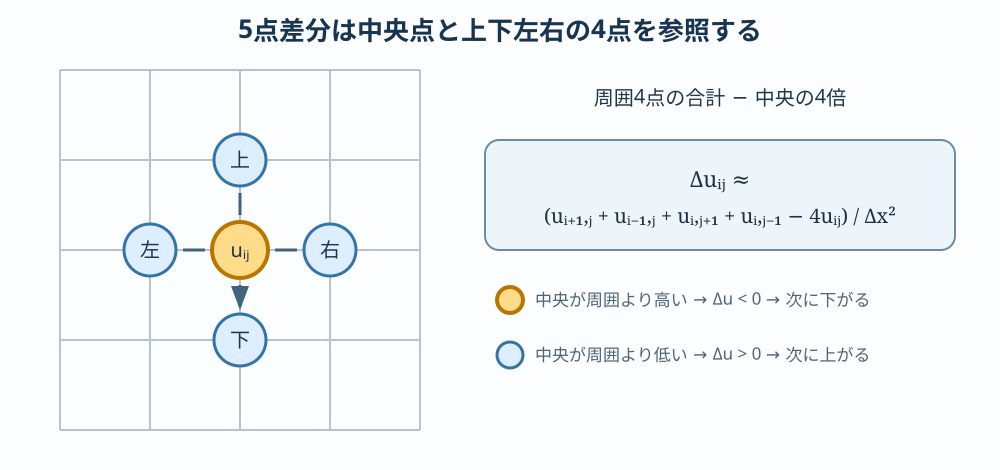

# 放熱研究の準備：ODEからPDEへ――拡散方程式入門

:::{important} この資料の位置づけ
偏微分方程式を初めて学ぶ人のための事前学習であり、主にステゴサウルス背板と放熱テーマへ接続する。ここで学ぶ場・ラプラシアン・差分法は模様テーマでも再利用する。本文を読み、対応Notebookを一度実行してから基礎章へ進むこと。
:::

:::{tip} 対応 Notebook
[00_pde_diffusion_basics.ipynb](../notebooks/00_pde_diffusion_basics.ipynb)
:::

## この章の目的

Strogatzで学んだ常微分方程式（ODE）から偏微分方程式（PDE）へ、次の小さな段差を順に上る。

1. 未知関数に空間変数を加える。
2. 偏微分とラプラシアンを、グラフの傾き・曲がり方として読む。
3. 方程式だけでなく、初期条件と境界条件を指定する。
4. 拡散方程式を有限差分法で計算する。
5. 数値解の発散と現象の不安定性を区別する。

この章の到達点は、PDEの一般論を網羅することではない。放熱基礎章の熱方程式と模様基礎章の反応拡散方程式を、式の意味と計算手順の両方から読めるようになることである。

## 50分の学習ガイド

| 時間 | 学習内容 | 到達確認 |
| ---: | --- | --- |
| 0～8分 | ODEとPDEの未知量を比較する | $x(t)$ と $u(x,t)$ の違いを説明する |
| 8～16分 | 偏微分とラプラシアンを計算する | 例題の3つの偏微分を手で求める |
| 16～25分 | 保存則から拡散方程式を読む | 右辺の符号から「ならす」働きを説明する |
| 25～33分 | 初期条件と4種類の境界条件 | 現象に適切な境界条件を選ぶ |
| 33～42分 | 有限差分法と更新式 | 式 {eq}`eq-ftcs` を配列更新と対応づける |
| 42～47分 | Notebookの2図を読む | 安定な拡散と数値発散を区別する |
| 47～50分 | 確認問題 | 安定条件を数値で計算する |

数式を追うときは、記号の操作だけでなく「ある格子点が左右より高いと次時刻にどうなるか」を毎回言葉にする。

## ODEとPDEは何が違うか

Strogatzで扱った人口 $x(t)$ や2人の感情 $(R(t),J(t))$ は、時刻 $t$ を決めれば有限個の数で状態が決まる。たとえば

```{math}
\frac{dx}{dt}=f(x)
```

は「現在の状態 $x$ から時間方向の変化率が決まる」というODEである。

一方、棒の温度は場所によって異なる。時刻 $t$ の状態を表すには、1個の数ではなく、すべての位置 $x$ における温度

```{math}
T(x,t)
```

が必要である。時間だけを変えた変化率は $\partial T/\partial t$、位置だけを変えた変化率は $\partial T/\partial x$ と書く。変数が複数あるので、通常の微分 $d$ と区別して偏微分記号 $\partial$ を使う。

| モデル | 未知量 | 状態のイメージ |
| --- | --- | --- |
| ODE | $x(t)$ または $\mathbf{x}(t)$ | 時刻ごとの点 |
| 1次元PDE | $u(x,t)$ | 時刻ごとの曲線 |
| 2次元PDE | $u(x,y,t)$ | 時刻ごとの画像・面 |

PDEも力学系である。空間を格子点 $x_0,\ldots,x_N$ に区切れば、$u_i(t)\approx u(x_i,t)$ を成分とする大きな連立ODEになる。この見方が数値計算と既習内容を結ぶ。

## 偏微分を「固定して見る」

$u(x,t)$ に対して、$\partial u/\partial t$ は位置 $x$ を固定して時間変化を見る。$\partial u/\partial x$ は時刻 $t$ を固定して空間方向の傾きを見る。

例として

```{math}
u(x,t)=e^{-t}\sin x
```

なら

```{math}
\frac{\partial u}{\partial t}=-e^{-t}\sin x,
\qquad
\frac{\partial u}{\partial x}=e^{-t}\cos x,
\qquad
\frac{\partial^2u}{\partial x^2}=-e^{-t}\sin x
```

である。$\partial^2u/\partial x^2$ は空間的な曲がり方を表す。1次元では、ある点の値が左右の平均より低ければ曲率は正、高ければ負になる。

2次元で各方向の2階偏微分を足した

```{math}
\Delta u=\frac{\partial^2u}{\partial x^2}+\frac{\partial^2u}{\partial y^2}
```

を**ラプラシアン**という。周囲より低い場所では $\Delta u>0$、周囲より高い場所では $\Delta u<0$ となるため、「周囲との差」を測る演算子と読める。

## 保存則から拡散方程式を作る

温度や物質濃度が、外から突然現れず、流入・流出によって変化すると考える。1次元の短い区間 $[x,x+\Delta x]$ について

```text
区間内の量の増加率 = 左からの流入 - 右への流出
```

が保存則である。流束 $J$ が勾配の反対向きに流れるというFick/Fourier型の法則

```{math}
J=-D\frac{\partial u}{\partial x}
```

を使うと、$\Delta x\to0$ の極限で

```{math}
:label: eq-diffusion-basic
\frac{\partial u}{\partial t}=D\frac{\partial^2u}{\partial x^2}
```

を得る。$D>0$ は拡散係数である。

式 {eq}`eq-diffusion-basic` は、周囲より高い点では右辺が負になって値が下がり、低い点では右辺が正になって値が上がる、と読める。したがって拡散は凹凸をならす。特徴的な距離はおよそ

```{math}
\ell\sim\sqrt{Dt}
```

で広がる。距離を2倍進むには、およそ4倍の時間が必要である。

## PDEは方程式だけでは解けない

時間発展を決めるには、全位置での開始時の値

```{math}
u(x,0)=u_0(x)
```

という**初期条件**が必要である。さらに空間の端で何が起きるかを表す**境界条件**も必要である。

| 境界条件 | 1次元での例 | 意味 |
| --- | --- | --- |
| Dirichlet条件 | $u(0,t)=a$ | 端の値を固定する |
| Neumann条件 | $\partial_xu(0,t)=0$ | 端を通る流束を0にする（断熱・反射） |
| Robin条件 | $-k\partial_xu=h(u-u_\mathrm{out})$ | 内部の流束と外部への移動を釣り合わせる |
| 周期境界条件 | $u(0,t)=u(L,t)$ | 左端と右端をつなぐ |

同じPDEと初期条件でも、境界条件が違えば解は違う。したがってモデルを説明するときは、**方程式・初期条件・境界条件を1組**として示す。

## 定常解と時間発展

時間変化が止まった状態を定常状態といい、$\partial u/\partial t=0$ と置く。拡散方程式なら

```{math}
D\frac{d^2u}{dx^2}=0
```

となる。これは時間を含まない境界値問題で、両端の値を固定すれば定常解は直線になる。

ここでPDEが突然ODEに変わったように見えるが、空間だけの未知関数を求める常微分方程式になったのである。放熱基礎章の1次元フィン方程式は、この定常化と細長い形状の仮定によって得られる。

## 有限差分法：空間を格子に置き換える

区間 $0\le x\le L$ を間隔 $\Delta x$ で区切り、$u_i^n\approx u(i\Delta x,n\Delta t)$ とする。Taylor展開から

```{math}
\frac{\partial^2u}{\partial x^2}(x_i,t_n)
\approx
\frac{u_{i-1}^n-2u_i^n+u_{i+1}^n}{\Delta x^2}
```

を得る。時間微分を前進差分にすると

```{math}
:label: eq-ftcs
u_i^{n+1}
=u_i^n+r\left(u_{i-1}^n-2u_i^n+u_{i+1}^n\right),
\qquad
r=\frac{D\Delta t}{\Delta x^2}
```

となる。これは「現在の左右との差から次時刻を決める」という局所更新則である。全格子点を状態ベクトルと見れば、陽的Euler法で大きな連立ODEを解いている。

2次元では、中央セルと上下左右の4セルを使う5点差分へ拡張する。



橙色の中央点が周囲4点より高ければラプラシアンは負になり、拡散更新によって中央の値は下がる。低ければ逆に上がる。この符号を先に予想してから差分式を計算する。

### 計算の最小手順

1. $D,L,\Delta x,\Delta t$ と終了時刻を決める。
2. 初期条件を配列 `u` に入れる。
3. 内点を式 {eq}`eq-ftcs` で更新する。
4. 境界条件を適用する。
5. 新旧の配列を入れ替えて繰り返す。
6. 複数時刻の分布、最大値、総量などを図にする。

更新前の値だけから新しい全点を計算することが重要である。左から配列を上書きすると、同じ時刻の値と次時刻の値が混ざる。

## 数値安定性

1次元拡散方程式を式 {eq}`eq-ftcs` で解く場合、基本的な安定条件は

```{math}
:label: eq-diffusion-stability
r=\frac{D\Delta t}{\Delta x^2}\le\frac12
```

である。$\Delta x$ を半分にすると、$\Delta t$ は4分の1以下にする必要がある。条件を破ると、拡散なら本来なめらかになるはずなのに、格子ごとの振動が増幅して巨大な正負の値になる。

これは現象の不安定性ではなく、計算法が作った**数値不安定性**である。結果が派手だからといって現象だと思わず、次を確認する。

- $\Delta t$ を半分にしても結論が変わらないか。
- $\Delta x$ を細かくし、安定条件も保ったときに解が近づくか。
- 保存されるはずの総量や、非負であるべき濃度が壊れていないか。

2次元の正方格子と5点差分では、対応する条件は概ね $D\Delta t/\Delta x^2\le1/4$ になる。反応拡散基礎章で再利用する。

## Notebookの図を読む

### 安定な拡散


横軸は位置 $x$、縦軸は場の値 $u(x,t)$、色の異なる曲線は時刻を表す。最初の青線は中央に集中した鋭い分布である。時間が進むと、中央の最大値は下がり、左右の裾は広がる。

ここで「値が消えた」と読んではいけない。Neumann境界条件では外へ流出しないため、曲線下の面積に相当する総量はほぼ保存される。ピークの高さだけでなく、幅と面積を同時に見る。これが拡散の「局所的な高低差をならしながら総量を運ぶ」という意味である。

図から確認する順序は次の通りである。

1. 分布が左右対称か。非対称なら初期条件か更新式を疑う。
2. 最大値が単調に下がるか。途中で増えるなら刻みまたは境界処理を疑う。
3. 負の値が現れていないか。濃度を想定する場合、負値は非物理的である。
4. 数値積分した総量が時刻で大きく変わらないか。

### 安定条件を破った場合


左図は $r=0.45\le1/2$、右図は $r=0.70>1/2$ である。右では格子点ごとに正負が交互に現れ、振幅が本来の初期値より何十倍にも成長している。拡散方程式は凹凸をならすはずなので、この振動増幅は現象と矛盾する。

右図を「不安定な物質が振動した」と解釈してはいけない。時間刻みだけを小さくすると消えるため、これは**数値不安定性**である。現象の不安定性なら、刻みを十分小さくしても同じ成長率や空間構造が再現される必要がある。この見分け方は、後の反応拡散パターンで特に重要になる。

## この後の4テーマへの地図

| テーマ | 状態 | 時間発展 | 空間 | この章から持っていくもの |
| --- | --- | --- | --- | --- |
| 放熱 | 温度場 $T$ | 熱伝導・定常化 | 連続 | 保存則、境界条件、定常解 |
| 反応拡散 | 濃度場 $u,v$ | 拡散＋反応 | 連続 | ラプラシアン、陽解法、安定条件 |
| 電車乗降 | 各人の位置・行動 | 離散更新 | 格子 | 局所更新、境界、同期更新 |
| 恋愛ネットワーク | 感情ベクトル・行列 | ODE | 明示的な物理空間なし | 高次元力学系、安定性 |

PDEだけが空間モデルではない。どの表現を選ぶかは、「連続量を見たいのか、個体差を見たいのか、関係構造を見たいのか」で決まる。

## 確認問題

1. $u(x,t)=x^2e^{-t}$ の $\partial_tu$, $\partial_xu$, $\partial_{xx}u$ を求めよ。
2. 棒の両端を氷水で一定温度に保つ場合と、両端を断熱する場合に適切な境界条件を書け。
3. $D=0.1$, $\Delta x=0.05$ のとき、式 {eq}`eq-diffusion-stability` を満たす $\Delta t$ の上限を求めよ。
4. Notebookで安定条件を満たす場合と破る場合を比較し、物理解と数値誤差を見分ける根拠を3つ挙げよ。
5. PDEの空間差分が「大きな連立ODE」になる理由を、自分の言葉で説明せよ。

## 次に読む

[熱方程式と1次元フィン](./01_stegosaurus_heat_basic.md)では、温度場、定常化、Dirichlet条件、Neumann条件、Robin条件を具体的な放熱問題で使う。[反応拡散とパターン生成](./03_reaction_diffusion_basic.md)では、2次元ラプラシアンと数値安定性を再利用する。

## 参考文献・キーワード

- Incropera & DeWitt, *Fundamentals of Heat and Mass Transfer* {cite}`incropera2007heat`
- キーワード：偏微分、場、拡散方程式、初期条件、境界条件、ラプラシアン、有限差分法、陽的Euler法、数値安定性
