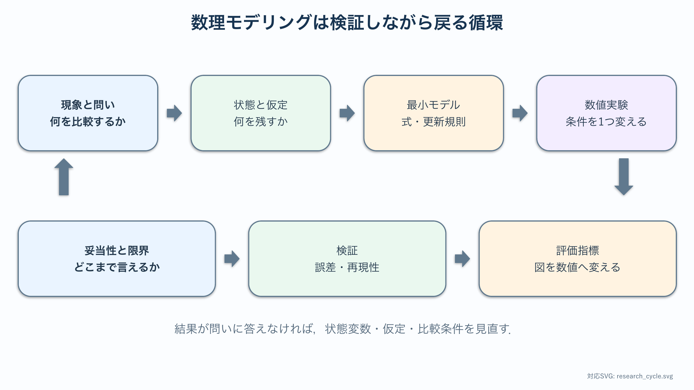

# 共通読書資料：研究設計と数理モデリングの作法

:::{note} この資料の位置づけ
この資料は **全員が読む共通資料** である．各テーマへ進む前に一度通読し，基礎章・研究技能章・卒研ロードマップを読みながら何度か戻ってくることを想定している．
:::

## この資料の目的

卒業研究では，与えられた問題を解くのではなく，**自分で問いを立て，自分でモデルを作り，自分で検証する**．本資料は，そのための共通言語と手順をまとめる．4テーマ（放熱・反応拡散・乗降・関係モデル）は，すべてこの手順に沿って構成されている．

## 学習ガイド

| 学習内容 | 自分で残すもの |
| --- | --- |
| 現象・観測量・状態変数・パラメータを区別する | 自分のテーマの4項目 |
| 研究テーマを数理化する9手順を読む | 変数Aの変更に対する指標Bの変化として問いを1文にする |
| 仮定と無視した要因を整理する | 仮定3つ，無視した要因3つ |
| {abbr}`無次元化(単位を持たない変数や式へ書き換える操作)`の例を式変形する | $mL$ が無次元であることの単位確認 |
| 4テーマの比較表を読む | 他テーマから借りたい方法1つ |
| まとめと自己点検 | 最初に作る図のラフスケッチ |

読むだけで終わらせず，右列をノートへ実際に書く．学習後に残すものは，完成した研究計画ではなく，**次に何を決めるべきかが見える1ページ**である．

## 現象からモデルへ

{abbr}`数理モデリング(現象を数式や計算規則で扱える形へ翻訳する作業)`とは，目の前の現象を **数学的に扱える対象** に翻訳する作業である．翻訳のとき，必ず次を区別する．

- **{abbr}`現象（phenomenon）(研究対象で実際に起きている出来事や変化)`**：実際に起きていること．言葉で説明できるが，そのままでは計算できない．
- **{abbr}`観測量（observable）(実験や資料から測定または記録できる量)`**：測れる量．温度，模様の斑点数，停車時間など．
- **{abbr}`状態変数（state variable）(モデルの状態を表し，時間や空間とともに変化する量)`**：モデルの中で時間や空間とともに変化する量．$T(x,t)$，$u(x,y,t)$，感情 $R(t)$ など．
- **{abbr}`パラメータ（parameter）(計算中は固定し，条件比較のために値を設定する量)`**：モデルの中で固定して扱う量．熱伝導率 $k$，拡散係数 $D$，結合係数 $a$ など．比較実験では，これを変える．

たとえば，ドア付近の混雑が乗降時間へ与える影響を調べる場合を考える．現象は乗客が互いに進路を譲ったり塞いだりすることであり，観測量は動画から測った乗降完了時間やドア前人数である．モデル内の状態変数は各乗客の位置と行動状態であり，パラメータはドア幅，乗客数，移動確率などになる．同じ対象でも，現実から測る観測量と，計算機内で更新する状態変数は同じとは限らない．

| 区別するもの | 乗降問題での例 | 決めるときの質問 |
| --- | --- | --- |
| 現象 | ドア前で流れが滞る | 何が起きているのか |
| 観測量 | 完了時間，ドア前人数 | 実際に何を測れるか |
| 状態変数 | 各乗客の格子位置 | 計算中に何を更新するか |
| パラメータ | 人数，ドア幅，移動確率 | 何を固定し，何を比較するか |

この表を作ると，観測できない概念を状態変数へ置いていないか，研究の問いに不要なパラメータを増やしていないかを確認できる．

翻訳の鉄則は **{abbr}`最小モデル(研究の問いに答えるために必要な要素だけを残したモデル)`から始める** ことである．最初から精密なモデルを作ろうとすると，動かす前に時間切れになる．まず，知りたいことに答えられる最も単純なモデルを作り，動作を確認してから複雑さを足す．

:::{tip} 最小モデルの目安
1か月以内に動き，最初の図がすぐ作れ，パラメータを1つ変えるだけで比較ができる．これが最小モデルの目安である．
:::

## 研究テーマを数理化する9手順

どのテーマでも，次の順で考えると詰まりにくい．

1. **対象現象を決める．** 何を説明したいのか．
2. **比較したい条件を決める．** 条件Aと条件Bの差を明確にする．比較がない研究は図にならない．
3. **状態変数を決める．** 何が時間・空間で変化するか．
4. **パラメータを決める．** 何を固定し，何を動かすか．
5. **時間発展または更新規則を決める．** 微分方程式か，離散更新か．
6. **初期条件と境界条件を決める．** これを決めないと数値計算は始まらない．
7. **{abbr}`評価指標(条件間の違いやモデルの性能を数値で比較するための量)`を決める．** 図の外観ではなく数値によって結果を説明するための量を選ぶ．
8. **図にする．** 1枚で主張が伝わる図を1つ作る．
9. **先行研究との差分を書く．** 既存と何が違うかを1文で言う．

この9手順のうち，卒研で最も軽視されがちなのが **2（比較条件）** と **7（評価指標）** である．以降の各章でも，この2つを必ず確認する．



図の下側から問いへ戻る矢印が重要である．計算が動いても評価指標が問いに答えていなければ，状態変数や仮定を見直す．

### 9手順を使うときの読み方

9項目を一度に完全に決める必要はない．まず1～3で問いと状態を仮決めし，5～6で計算可能かを確認し，7～8で本当に比較できるかを確かめる．計算後に，選んだ状態変数では問いに答えられないと分かることもある．その場合は失敗ではなく，手順3へ戻る．

たとえば放熱テーマで板の良さだけを問うと，良さの基準が定まらない．同じ体積の2形状について，根元温度を固定したときの総放熱量を比較する問いへ書き換えれば，比較条件，境界条件，評価指標が明確になる．このように，曖昧な形容詞を測定できる量へ置き換える．

## モデルの仮定と無視した要因

良いモデルは，何を仮定し何を無視したかを正直に書く．例として，放熱基礎章のフィンモデルは次を仮定する．

- 断面内の温度は一様（1次元化）．
- 物性値（$k, h$）は温度によらず一定．
- 定常状態（時間変化を無視）．

仮定を書くことには2つの意味がある．第一に，結果の妥当範囲がわかる．第二に，**卒研で次に外すべき仮定** が見える．仮定を1つ外すことが，そのまま研究の発展課題になる．

仮定は，計算を可能にする仮定，比較を公平にする仮定，現象解釈を限定する仮定に分けると整理しやすい．1次元化は計算を簡単にする仮定，同じ体積で形状を比較することは公平な比較の仮定，放射を無視した結果を対流が支配的な条件に限って解釈することは妥当範囲の仮定である．仮定を外すときは一度に1つだけ変更し，基準モデルとの差を記録する．

仮定の影響を調べる最小手順は，基準値を決める，仮定に関係する量を1つ変える，評価指標の変化を図にする，結論が変わる範囲を記録する，の4段階である．仮定を文章で列挙するだけでなく，どの結果へ影響するかまで対応づける．

## 無次元化という共通技術

物理的なモデルには次元（単位）を持つパラメータが多い．これらを組み合わせて **無次元数** を作ると，本質的なパラメータの個数が減る．たとえば，対流熱伝達率を $h$，周長を $P$，熱伝導率を $k$，断面積を $A_c$ とする細長いフィンでは，軸方向の熱伝導と側面からの対流放熱のつり合いから

```{math}
kA_c\frac{d^2\theta}{dx^2}-hP\theta=0
```

を得る．ここで $\theta=T-T_\mathrm{air}$ は外気温からの過剰温度である．フィン長を $L$ とし，$\xi=x/L$ と置くと，

```{math}
\frac{d^2\theta}{dx^2}
=
\frac{1}{L^2}\frac{d^2\theta}{d\xi^2}
```

なので，

```{math}
\frac{d^2\theta}{d\xi^2}
-
\frac{hPL^2}{kA_c}\theta
=0
```

となる．係数は

```{math}
\frac{hPL^2}{kA_c}
=
\left(L\sqrt{\frac{hP}{kA_c}}\right)^2
```

と書ける．ここで $m=\sqrt{hP/(kA_c)}$ とおけば，温度分布の形は無次元数

```{math}
mL=L\sqrt{\frac{hP}{kA_c}}
```

で整理できる．$h, P, k, A_c, L$ という次元を持つパラメータの組合せが，1つの無次元数として現れるのである．無次元化は，パラメータスイープの軸を減らし，結果を一般化するための共通技術である．各章で繰り返し登場する．

無次元化では，まず代表的な長さ・時間・状態量を選び，元の変数をそれらで割る．次に式へ代入し，共通因子を消して，最後に残った係数の単位がすべて消えていることを確認する．$m$ の単位が $\mathrm{m}^{-1}$ なら，$mL$ の単位は $\mathrm{m}^{-1}\mathrm{m}=1$ であり，確かに無次元である．単位が残る場合は，代表量の選び方か式変形のどこかに誤りがある．

## よい卒研テーマの条件

- 最小モデルが1か月以内に動く．
- 最初の図がすぐ作れる．
- パラメータを変えた比較ができる．
- 先行研究または実データとの比較ができる．
- **結果が予想と違っても卒論になる．**

最後の条件が重要である．条件Aの効率が高いという予想が外れても，同一条件では条件Bの効率が高く，その原因をモデルから説明できれば，研究結果として成立する．仮説が外れることを恐れて比較を避けると，研究にならない．

## 各テーマへの接続

ここで扱う4テーマは，それぞれ異なるモデルの型を代表している．

| テーマ | モデルの型 | 主な状態変数 | 比較の軸 | 評価指標の例 |
| --- | --- | --- | --- | --- |
| ステゴサウルス背板 | 偏微分方程式（拡散） | 温度 $T(x)$ | 形状（トゲ↔板） | 体積あたり放熱量 $E_V$ |
| ヘビ模様 | 反応拡散系 | 濃度 $u,v$ | パラメータ $(F,k)$ | 面積比・斑点数・FFT |
| 電車乗降 | セルオートマトン | 各エージェント位置 | 行動ルール | 停車時間 $T_\mathrm{dwell}$ |
| 関係モデル | 連立ODE／ネットワーク | 感情 $x_{ij}(t)$ | 結合構造 | 予測誤差・安定性 |

自分の卒研テーマがこの4つのどれに近いかを意識すると，使うべき道具（PDE か，CA か，ODE か，ネットワークか）が見えてくる．

## この資料のまとめ

- 現象を状態変数・パラメータ・規則に翻訳する．
- 最小モデルから始め，仮定と無視を明示する．
- 比較条件と評価指標を必ず決める．
- 無次元化で本質的なパラメータを減らす．
- 予想が外れても語れる比較を設計する．

次に，4テーマへ対応する準備章を順に読む．

1. 放熱：[ODEからPDEへ：拡散方程式入門](./10_pde_foundations.md)
2. 模様：[反応・拡散・空間パターン](./20_pattern_foundations.md)
3. 乗降：[離散状態・更新規則・乱数](./30_agent_foundations.md)
4. 関係：[行列・有向グラフ・線形力学系](./40_network_foundations.md)

自分の担当以外も読み，他テーマの検証方法を自分の卒研へ持ち帰る．各章では，状態変数，比較の軸，評価指標を特定しながら読むこと．

## 参考文献・キーワード

- Strogatz, *Nonlinear Dynamics and Chaos* {cite}`strogatz2015nonlinear`
- キーワード：最小モデル，無次元化，比較条件，評価指標，仮定の明示
