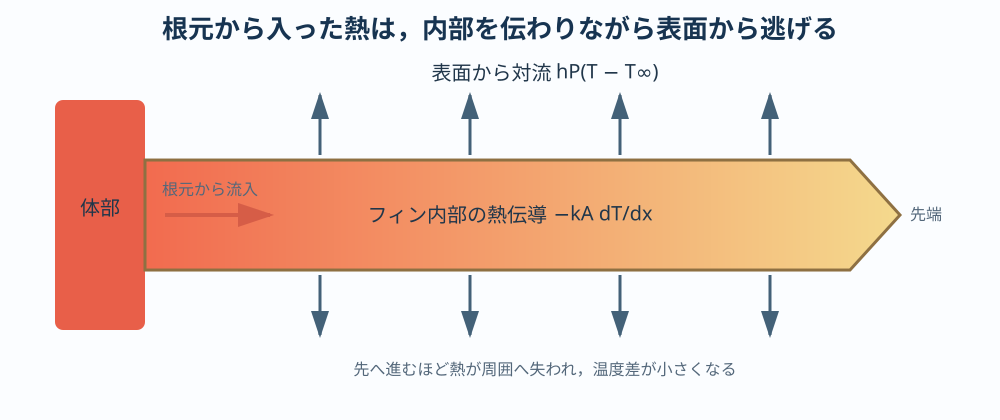
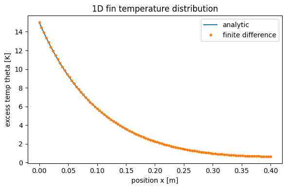
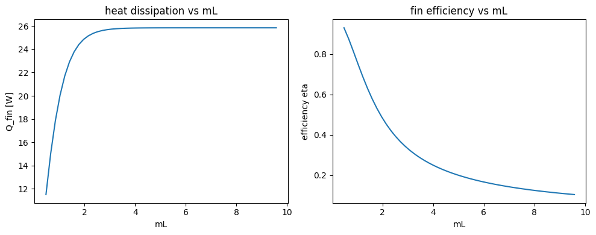

# 放熱の基礎 I：熱方程式と1次元フィン

:::{tip} 対応 Notebook
[01_stegosaurus_heat_1d_fin.ipynb](../notebooks/01_stegosaurus_heat_1d_fin.ipynb)
:::

:::{note} 学習経路での位置づけ
本章は放熱テーマの「基礎モデル」である。[共通準備：ODEからPDEへ](./00_pde_foundations.md)の後に、1次元フィンの解析解と差分解を照合する。複数形状の比較へ直接進まず、次の[単一薄板の2次元温度場](./02_stegosaurus_heat_shape.md)で数値計算の検証を学ぶ。
:::

## この章の目的

ステゴサウルスの背板を「放熱フィン」として単純化し、**熱方程式・境界条件・フィン効率** を学ぶ。最終的に、1次元フィンの温度分布を数値計算し、フィン長を変えたときに放熱量がどう変わるかを評価指標として説明できるようになることを目指す。

## 50分の学習ガイド

| 時間 | 学習内容 | 到達確認 |
| ---: | --- | --- |
| 0～7分 | 放熱仮説とモデル化の注意 | 仮説と断定の違いを説明する |
| 7～15分 | 最小モデルの仮定 | 1次元化・定常化で無視したものを挙げる |
| 15～27分 | 熱方程式からフィン方程式へ | $m^2=hP/(kA_c)$ の各量を説明する |
| 27～35分 | 解析解、放熱量、フィン効率 | $mL$ の大小で温度分布を予想する |
| 35～44分 | Notebookの2図を読む | 解析解と差分解、放熱量と効率を区別する |
| 44～48分 | 演習を1問解く | 図を式の極限と結びつける |
| 48～50分 | チェックポイント | 次章へ進めるか自己判定する |

先にNotebookを実行して図だけを見るのではなく、$mL$ が小さい場合と大きい場合を紙に予想してから図を確認する。

## 現象の説明

ステゴサウルスの背中には、板状の構造（皮骨板, osteoderm）が並んでいた。この板の機能については複数の仮説があり、その1つに **放熱（体温調節）** がある。背板の表面には血管の溝が走っていたことが知られ、血流によって運ばれた熱を空気中へ逃がす「フィン」として働いた可能性が議論されてきた {cite}`farlow1976thermoregulation`。

:::{warning} 科学的な注意
背板の機能を **放熱と断定しない**。本章の主張は「**放熱効率という観点から見ると** 板状構造はどう振る舞うか」を調べることにある。ディスプレイ（誇示）や防御など他の仮説を否定するものではない。
:::

工学では、表面積を増やして放熱を促す突起を **フィン（fin）** と呼ぶ。CPU のヒートシンクが典型例である。背板をフィンとみなすと、共通準備で学んだ熱のPDEを、定常化と1次元化によって既習の常微分方程式へ落とせる。

## 最小モデル

最小モデルとして、根元（体側）で温度が高く、先端へ向かうほど冷えていく **1本の細長いフィン** を考える。次を仮定する。

- フィンは細長く、**断面内の温度は一様**（位置 $x$ だけの関数 $T(x)$）。
- 物性値（熱伝導率 $k$、対流熱伝達率 $h$）は一定。
- **定常状態**（時間変化を無視、$\partial T/\partial t = 0$）。
- 根元温度 $T(0)=T_b$ は血流により一定に保たれる。



赤い根元から入った熱は先端へ伝わるが、その途中で上下の表面から周囲へ逃げる。そのため先端へ向かうほど温度差と伝導熱流は小さくなる。

無視したもの：放射、フィン内の血流分布、3次元的な温度むら、外気の流れの非一様性。これらは次章以降や卒研の発展課題で扱う。

## 数式による定式化

### 熱方程式

熱の輸送を表す基礎式は熱方程式である。

```{math}
\rho c \frac{\partial T}{\partial t} = \nabla \cdot (k \nabla T) + Q
```

ここで $\rho$ は密度、$c$ は比熱、$k$ は熱伝導率、$Q$ は内部発熱である。各項は

- $\rho c\,\partial T/\partial t$：各点に蓄えられる熱の時間変化
- $\nabla\cdot(k\nabla T)$：周囲との温度差による熱の流入・流出
- $Q$：組織内で生まれる熱

と読める。PDEは式だけでは決まらず、初期条件と境界条件が必要である。本章では定常状態を扱うため初期条件への依存を消し、根元と先端の境界条件を指定する。定常状態では左辺が $0$ になり、

```{math}
\nabla \cdot (k \nabla T) + Q = 0
```

となる。

### 対流境界条件

フィン表面から空気へ逃げる熱は、対流境界条件で表す。

```{math}
-k \frac{\partial T}{\partial n} = h\,(T - T_\mathrm{air})
```

左辺はフィン内部から表面へ伝わる熱流束、右辺は表面から空気へ逃げる熱流束で、両者が釣り合う。$T_\mathrm{air}$ は外気温、$n$ は外向き法線方向である。

### 1次元フィン方程式

細長いフィンでは、側面からの放熱を断面あたりの「吸い出し」項として扱える。過剰温度 $\theta(x) = T(x) - T_\mathrm{air}$ を導入すると、定常フィン方程式は

```{math}
:label: eq-fin
\frac{d^2 \theta}{dx^2} - m^2 \theta = 0,
\qquad
m^2 = \frac{hP}{kA_c}
```

となる。$P$ は断面の周長、$A_c$ は断面積である。$m$ は「どれだけ速く先端へ向かって冷えるか」を表す逆長さスケールである。

先端を断熱（$d\theta/dx=0$ at $x=L$）とすると、解析解は

```{math}
:label: eq-fin-sol
\theta(x) = \theta_b \, \frac{\cosh\!\big(m(L-x)\big)}{\cosh(mL)},
\qquad \theta_b = T_b - T_\mathrm{air}
```

となる。根元から逃げる総放熱量は

```{math}
:label: eq-fin-q
Q_\mathrm{fin} = \sqrt{hP k A_c}\;\theta_b \tanh(mL)
```

である。

## パラメータの意味と無次元化

| 記号 | 意味 | 単位 |
| --- | --- | --- |
| $k$ | 熱伝導率（熱の伝わりやすさ） | W/(m·K) |
| $h$ | 対流熱伝達率（表面の逃がしやすさ） | W/(m²·K) |
| $L$ | フィン長 | m |
| $P, A_c$ | 断面の周長・断面積 | m, m² |
| $\theta_b$ | 根元の過剰温度 | K |

式 {eq}`eq-fin` を $\xi = x/L$ で無次元化すると、振る舞いは **無次元数 $mL$ だけ** で決まる。

```{math}
\frac{d^2\theta}{d\xi^2} - (mL)^2\,\theta = 0
```

- $mL \ll 1$：先端までほぼ同じ温度。フィン全体が熱い＝表面積を活かせている。
- $mL \gg 1$：先端が早く冷える。長くしても先端は外気温と同じで、**長さを足しても放熱は増えない**。

つまり「表面積を増やせば放熱が増える」とは限らず、**内部まで熱が届くか** が効率を決める。これが本章の核心である。

## フィン効率

長くした分だけ放熱に寄与しているかを測る指標が **フィン効率** である。

```{math}
:label: eq-eta
\eta = \frac{Q_\mathrm{fin}}{Q_\mathrm{ideal}} = \frac{\tanh(mL)}{mL}
```

$Q_\mathrm{ideal}$ は「フィン全体が根元温度 $T_b$ のまま」だった場合の理想放熱量である。$mL$ が小さいほど $\eta \to 1$ に近づき、大きいほど効率は落ちる。式 {eq}`eq-eta` は単調減少で、無次元数1つで効率が決まる好例である。

## 数値シミュレーション

Notebook では2つの方法で温度分布を求める。

1. **解析解**（式 {eq}`eq-fin-sol`）。
2. **差分法**：$\theta_{i-1} - 2\theta_i + \theta_{i+1} = (m\Delta x)^2 \theta_i$ を線形方程式 $A\theta = b$ として解く。

両者が一致することを確認したうえで、フィン長 $L$ を変えて温度分布と放熱量 {eq}`eq-fin-q`、効率 {eq}`eq-eta` を比較する。期待される図は次の2枚である。

- 温度分布 $\theta(x)$：$L$ が大きいほど先端が外気温に漸近する。
- 放熱量 $Q_\mathrm{fin}$ と効率 $\eta$ の $mL$ 依存：$Q$ は飽和し、$\eta$ は減少する。

### 図1：解析解と差分解



横軸 $x=0$ は根元、$x=L$ は先端である。縦軸は絶対温度ではなく、外気温との差 $\theta=T-T_\mathrm{air}$ である。したがって縦軸が0へ近づくことは、先端温度が外気温へ近づくことを意味する。

青線が解析解、橙色の点が差分解である。両者が図の解像度では区別できないほど重なることは、差分方程式・根元条件・先端条件の実装が整合している証拠になる。ただし、図で重なって見えるだけでは十分ではない。Notebookに表示される最大絶対誤差も確認し、格子を細かくすると誤差が減るか調べる。

曲線が先端へ向かって単調に下がるのは、側面から継続的に熱が逃げるためである。先端断熱条件を置いていても、側面からは放熱している。「先端断熱だから温度が一定」と誤解しないこと。

### 図2：総放熱量とフィン効率



左図では $mL$ の増加とともに総放熱量が増えるが、やがて約一定値へ飽和する。長さを増やしても、遠い先端がほぼ外気温なら追加部分から逃がせる熱は小さいからである。

右図のフィン効率は単調に低下する。これは左図と矛盾しない。総放熱量は増えても、「フィン全体が根元温度だった理想状態」と比べて表面を使い切る割合は下がる。**総量が大きいこと**と**材料を効率よく使うこと**は別の評価である。

$mL$ は長さ $L$ だけでなく、$h$, $P$, $k$, $A_c$ の組合せで変わる。同じ横軸位置でも、物理的に何を変えたかによって設計上の意味は異なる。図から「長い方が必ず良い」とだけ結論しない。

:::{note} 評価指標
この章の評価指標は **根元放熱量 $Q_\mathrm{fin}$** と **フィン効率 $\eta$** である。「温度分布の図」だけで終わらせず、必ずこの2つの数値に落として比較すること。
:::

## 卒業研究への接続

- 次の技能章では、1つの長方形薄板を2次元化し、温度場の計算と格子収束を確認する。
- 複数形状の定義と比較、血流項の導入は、基礎計算の検証後に[卒研ロードマップ](./02_stegosaurus_research_roadmap.md)から学生自身が進める。
- 「同じ材料・同じ根元温度で、どの形状が体積あたり最も放熱するか」という比較は、そのまま卒研の問いになる。
- 評価指標を $Q$ にするか $\eta$ にするか $E_V$（体積あたり）にするかで結論が変わる。**指標選びそのものが研究テーマ** になりうる。

## チェックポイント

- [ ] 熱方程式の蓄熱・伝導・発熱の各項を説明できる。
- [ ] 定常化と1次元化で何を無視したか説明できる。
- [ ] 根元条件と先端条件を書ける。
- [ ] 解析解と差分解の誤差を確認した。
- [ ] $mL$ とフィン効率の関係を説明できる。
- [ ] 複数形状へ進む前に、単一形状の計算検証が必要だと説明できる。

## 演習問題

1. **（解析）** 先端断熱条件の解 {eq}`eq-fin-sol` を式 {eq}`eq-fin` に代入し、確かに満たすことを示せ。また $mL \to 0$ と $mL \to \infty$ の極限で $\theta(x)$ がどうなるか述べよ。
2. **（数値）** Notebook で $mL$ を $0.1, 1, 3, 10$ と変え、放熱量 $Q_\mathrm{fin}$ と効率 $\eta$ を表にまとめよ。$Q$ が飽和し始めるのはおよそどの $mL$ か。
3. **（考察）** 「表面積が大きいほど放熱が大きい」という主張は、どんな条件下で成り立ち、どんな条件下で破綻するか。本章の結果を使って説明せよ。

## 発展課題

- 先端も対流で冷える境界条件（$-k\,d\theta/dx = h\theta$ at $x=L$）に変え、解と放熱量がどう変わるか調べよ。
- 物性値 $k$ を温度依存 $k(T)$ にすると方程式は非線形になる。差分法で解けるよう Notebook を改造せよ。

## 参考文献・キーワード

- Farlow, Thompson, Rosner, *Science* (1976) {cite}`farlow1976thermoregulation`
- Incropera & DeWitt, *Fundamentals of Heat and Mass Transfer* {cite}`incropera2007heat`
- キーワード：熱方程式、定常熱伝導、対流境界条件、フィン方程式、フィン効率、無次元数 $mL$
