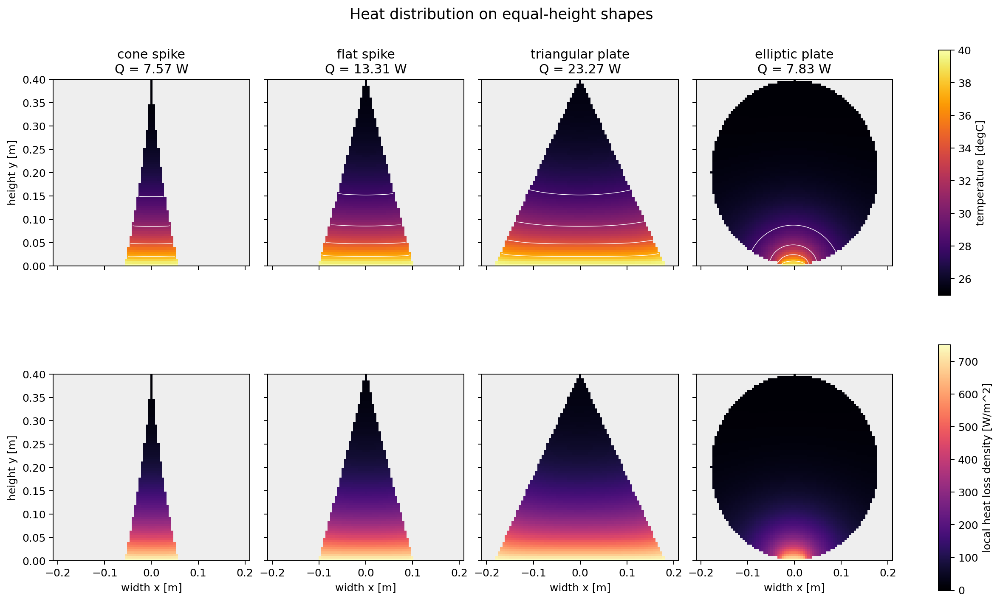

# 第2章　ステゴサウルス背板の放熱 II：トゲ状構造から板状構造への形態比較

:::{tip} 対応 Notebook
[02_stegosaurus_shape_comparison.ipynb](../notebooks/02_stegosaurus_shape_comparison.ipynb)
:::

:::{note} 第1回の後半
学生Aの50分発表のうち、主に27–44分で扱う。第1章の式をすべて再説明せず、**何を同じにして形状だけを比べるか**、結果がどの評価指標で変わるかに時間を使う。
:::

## この章の目的

第1章の1次元フィンを足がかりに、**トゲ状構造・偏平トゲ・板状構造を同条件で比較** し、放熱効率の観点から形態差を評価する。総放熱量の数値だけでなく、各形状上の**温度分布と局所放熱密度をヒートマップで可視化**し、根元から届いた熱がどこで空気へ逃げるかを読み取る。比較の鍵は「**何をそろえて比べるか**（同体積か、同高さか、同投影面積か）」と「**どの指標で測るか**（総放熱量か、体積あたりか、表面積あたりか）」である。

:::{warning} 科学的な注意
「進化の過程で必ずトゲから板へ一方向に変化した」とは **断定しない**。本章では、剣竜類の皮骨構造に見られる **トゲ状構造と板状構造を、放熱効率という観点から比較** する。あるいは、トゲ状から板状へ連続的に変形する **仮想形態系列** を作り、形状変化が放熱性能に与える影響を数値的に調べる、という立場をとる。
:::

## 現象の説明

剣竜類の皮骨構造には、細く尖ったトゲ状のものから、平たく広がった板状のものまで幅がある。これらは「同じ材料でできた、形だけが違う放熱体」とみなせる。すると自然な問いが立つ。

> 同じ条件のもとで、トゲと板ではどちらがよく熱を逃がすのか。そして、その答えは「何をそろえ、何で測るか」にどう依存するのか。

## 最小モデル

各形状を、第1章のフィンと同じ枠組みで扱える **簡略な幾何＋熱抵抗モデル** と、形状上の熱を見せる **2次元薄板モデル** の2段階で表す。3次元の有限要素法（FEM）は使わず、次のように単純化する。

- 各形状を「代表長さ $L$・断面積 $A_c$・周長 $P$・体積 $V$・表面積 $A$」を持つフィンとみなす。
- 放熱量は第1章の式 $Q = \sqrt{hPkA_c}\,\theta_b \tanh(mL)$、$m=\sqrt{hP/(kA_c)}$ で近似する。
- 形状の違いは $(A_c, P, L, V, A)$ の組として表現する。
- 温度分布の可視化では、各形状を厚さ一定の2次元領域 $\Omega$ とし、根元を体温に固定する。
- 形状の前面・背面と輪郭から外気へ対流放熱するとして、定常温度場 $T(x,y)$ を格子上で解く。

比較する形状（仮想形態系列）：

| 形状 | イメージ | 特徴 |
| --- | --- | --- |
| 円錐状トゲ | 細く尖る | 周長小、先端細い |
| 偏平トゲ | 平たく尖る | 周長中、断面扁平 |
| 三角板 | 広く平たい | 周長大、断面薄い |
| 楕円板 | 丸く平たい | 周長大、表面積大 |

## 数式による定式化

### 2次元形状上の定常温度場

厚さ $t$ が一定の薄い板では、前面・背面からの対流放熱を領域内の吸熱項として表し、温度場を

```{math}
:label: eq-thin-plate
k t\,\Delta T-2h\left(T-T_\mathrm{air}\right)=0
\qquad (x,y)\in\Omega
```

で近似する。根元 $\Gamma_b$ は体内から熱が供給されるとして

```{math}
:label: eq-shape-base
T=T_b \qquad \text{on }\Gamma_b
```

と固定する。外周 $\Gamma_\mathrm{air}$ では

```{math}
:label: eq-shape-robin
-kt\frac{\partial T}{\partial n}
=ht\left(T-T_\mathrm{air}\right)
\qquad \text{on }\Gamma_\mathrm{air}
```

という対流境界条件を置く。Notebookでは形状を正方格子で塗り分け、各セルについて

```{math}
:label: eq-cell-balance
\sum_{j\in N(i)}G_\mathrm{cond}(T_i-T_j)
+G_\mathrm{conv}(T_i-T_\mathrm{air})=0
```

という熱収支を連立一次方程式として解く。$N(i)$ は形状内で隣接するセル、$G_\mathrm{cond}$ と $G_\mathrm{conv}$ はそれぞれ伝導・対流の熱コンダクタンスである。

この2次元モデルで表示する局所放熱密度は

```{math}
:label: eq-local-flux
q''(x,y)=2h\left(T(x,y)-T_\mathrm{air}\right)
```

である。温度が高い場所ほど、その時点で前面・背面から多く放熱する。ただし、先端が冷えていることは「先端が悪い」のではなく、根元から先端までにすでに熱を逃がした結果でもある。温度図だけで優劣を決めず、総放熱量と一緒に読む必要がある。

### 放熱量と効率

総放熱量は、表面からの対流積分で定義される。

```{math}
:label: eq-qout
Q_\mathrm{out} = \int_{\partial\Omega} h\,(T - T_\mathrm{air})\, dS
```

簡略モデルでは、これを第1章のフィン式で近似する。比較指標は3つ用意する。

```{math}
:label: eq-ev
E_V = \frac{Q_\mathrm{out}}{V}
\qquad\text{(体積あたり放熱効率)}
```

```{math}
:label: eq-ea
E_A = \frac{Q_\mathrm{out}}{A}
\qquad\text{(表面積あたり放熱効率)}
```

総放熱量 $Q_\mathrm{out}$ は「全体でどれだけ逃がすか」、$E_V$ は「材料（体積）あたりの賢さ」、$E_A$ は「表面の使い方の効率」を表す。**指標が違えば順位が変わりうる** ことが本章最大の学びである。

### 血流を含む簡略モデル

背板には血管が走っていた。血流による熱の供給・除去を、組織温度 $T$ と血液温度 $T_b$ の差に比例する項（Pennes の生体熱方程式の簡略形）で加える。

```{math}
:label: eq-pennes
\rho c \frac{\partial T}{\partial t}
= \nabla\cdot(k\nabla T) + \omega_b c_b (T_b - T)
```

$\omega_b$ は血流率、$c_b$ は血液の比熱である。$\omega_b$ が大きいほど、内部温度は血液温度 $T_b$ に引き戻され、フィン全体が熱くなって放熱が増える。これは第1章で見た「内部まで熱が届くか」を血流が助ける効果に対応する。

## パラメータの意味

| 記号 | 意味 |
| --- | --- |
| $h$ | 対流熱伝達率（風速が上がると増える） |
| $T_\mathrm{air}$ | 外気温 |
| $\omega_b$ | 血流率（内部温度の維持しやすさ） |
| $V, A$ | 体積・表面積（形状で変わる） |

**同じ条件で比べる** とは、これらのうち何を固定するかを決めることである。本章では3通りを比較する。

- **同体積**：使える材料（骨）が同じという制約。
- **同高さ**：見た目の大きさ（誇示機能）をそろえる制約。
- **同投影面積**：日射を受ける面積をそろえる制約。

## 数値シミュレーション

Notebook では次を行う。

1. 各形状の幾何量 $(A_c, P, L, V, A)$ を計算する。
2. 同じ高さ・厚さ・材料・根元温度・外気条件のもとで、4形状の2次元定常温度場を解く。
3. 温度 $T(x,y)$ と局所放熱密度 $q''(x,y)$ を、全形状で同じカラースケールにより表示する。
4. 2次元モデルから総放熱量、平均温度、「外気温と根元温度の中間より高い領域」の割合を表にする。
5. フィン式で放熱量 $Q_\mathrm{out}$ を推定する。
6. 同体積・同高さ・同投影面積の各制約で正規化して比較する。
7. 風速（$h$）・外気温・血流率（$\omega_b$）を変えた **パラメータスイープ** を行い、$E_V$ の順位が入れ替わるかを見る。

下図では、上段が温度、下段が局所放熱密度である。細いトゲでは根元から離れると急速に冷え、根元の広い三角板では横方向にも温かい領域が広がる。一方、楕円板は面積が広くても付け根が細いため、熱が上部へ届きにくい。**表面積だけでなく、根元から熱を運ぶ経路の太さも重要**であることを、等温線とともに比較できる。格子状に見える輪郭は正方格子による近似であり、実際の表面の凹凸を表すものではない。



期待される結果の一例：総放熱量 $Q_\mathrm{out}$ では板状が有利でも、同体積で測った $E_V$ ではトゲが健闘する、といった「指標による逆転」が観察される。

:::{note} 評価指標
主要な評価指標は $Q_\mathrm{out}$、$E_V$、$E_A$ の **3つ** である。温度場の理解を助ける補助指標として、形状内平均温度と温かい領域の割合も用いる。1つのヒートマップの色だけで勝者を決めず、数値指標の表と組み合わせて「どの条件で何が勝つか」を述べること。
:::

## 卒業研究への接続

- 本章の温度場は正方格子による **教育用2次元薄板モデル** である。卒研では、同じ形状を境界に沿った2D/3DのFEM（`scikit-fem` など）で解き直し、格子近似と薄板近似がどこまで妥当かを検証できる。
- 風向（前から/横から）を変えると $h$ が場所ごとに変わる。場所依存 $h(\mathbf{x})$ を入れると、板の向きの効果が議論できる。
- 「形態系列に沿って $E_V$ がどう変化するか」を1枚の曲線にできれば、それが卒論の中心図になる。

## 演習問題

1. **（モデル化）** 円錐状トゲと三角板について、同じ高さ $L$・同じ体積 $V$ という制約のもとで断面積 $A_c$ と周長 $P$ を求める式を立てよ。どちらの $m=\sqrt{hP/(kA_c)}$ が大きいか。
2. **（数値）** Notebook で同体積制約のもとに4形状の $E_V$ を計算し、棒グラフで比較せよ。次に $h$ を2倍にすると順位は変わるか。
3. **（可視化）** 4形状の温度図について、$31\,{}^\circ\mathrm{C}$ と $34\,{}^\circ\mathrm{C}$ の等温線が届く高さを比較せよ。形状内平均温度、温かい領域の割合、総放熱量の関係を説明せよ。
4. **（考察）** 「板の方がトゲより放熱に有利」と言えるのは、どの指標・どの制約のときか。逆転が起きる条件を1つ挙げよ。

## 発展課題

- 式 {eq}`eq-pennes` の血流項を簡略モデルに組み込み、$\omega_b$ を変えたとき各形状の $E_V$ がどう変わるか調べよ。
- 2次元モデルの厚さ $t$、対流係数 $h$、熱伝導率 $k$ を変え、温度ヒートマップと局所放熱密度の変化を同一スケールで比較せよ。
- 4形状を「トゲ→板」へ連続変形する1パラメータ $s\in[0,1]$ を導入し、$E_V(s)$ の曲線を描け。最大値を与える $s$ は条件によって動くか。

## 参考文献・キーワード

- Farlow et al., *Science* (1976) {cite}`farlow1976thermoregulation`
- Incropera & DeWitt {cite}`incropera2007heat`
- キーワード：形態比較、2次元温度場、局所放熱密度、有限体積法、総放熱量、体積あたり効率 $E_V$、表面積あたり効率 $E_A$、生体熱方程式、パラメータスイープ、指標による逆転
