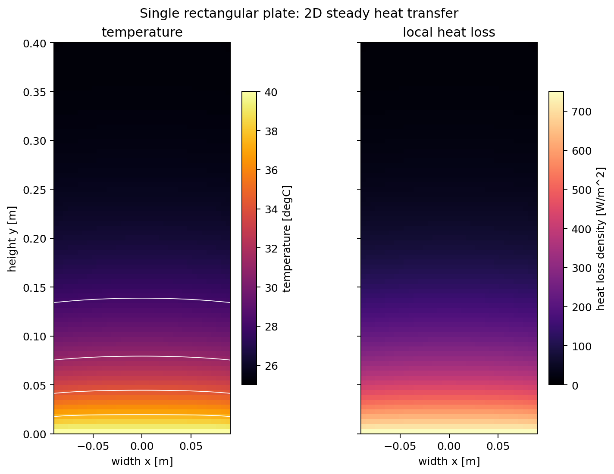

# 放熱の基礎 II：単一薄板の2次元温度場

:::{tip} 対応 Notebook
[02_stegosaurus_single_plate_2d.ipynb](../notebooks/02_stegosaurus_single_plate_2d.ipynb)
:::

:::{note} 学習経路での位置づけ
本章は「研究技能の練習」である。ステゴサウルスの複数形状はまだ比較せず、**1枚の長方形薄板**だけを使って、2次元温度場の計算・可視化・検証を学ぶ。形状比較は次の[卒研ロードマップ](./02_stegosaurus_research_roadmap.md)から学生自身が進める。
:::

## この章の目的

[放熱の基礎 I](./01_stegosaurus_heat_basic.md)では、細長いフィンを1次元化して温度 $T(x)$ を求めた。本章では状態変数を $T(x,y)$ へ広げ、次をできるようにする。

1. 長方形薄板を2次元格子で表す。
2. 定常熱伝導と対流放熱の熱収支を立てる。
3. 温度場と局所放熱密度をヒートマップで表示する。
4. 総放熱量だけでなく、エネルギー収支と格子幅依存性を確認する。
5. 「計算コードが動く」と「研究上の比較ができる」を区別する。

## 今回扱う単純な問題

高さ $L$、幅 $W$、厚さ $t$ の長方形薄板を考える。

- 材料の熱伝導率は一定 $k$。
- 根元全体を体温 $T_b$ に固定する。
- 前面・背面と外周から外気 $T_\mathrm{air}$ へ対流放熱する。
- 血流、放射、風向、厚さの変化はまだ入れない。
- 形は長方形1種類だけとする。

単純な形に限定する理由は、数値誤差、境界条件、形状差を一度に変えないためである。まず熱計算そのものを検証し、その後に形状を研究変数として加える。

## 2次元薄板モデル

厚さ方向の温度は一様と仮定する。板内部の定常温度場は

```{math}
:label: eq-single-plate
kt\Delta T-2h(T-T_\mathrm{air})=0
```

で近似する。$2h(T-T_\mathrm{air})$ は前面と背面の両方から逃げる熱を表す。

根元 $\Gamma_b$ では

```{math}
:label: eq-single-base
T=T_b \qquad \text{on }\Gamma_b
```

とし、空気に触れる外周 $\Gamma_a$ では

```{math}
:label: eq-single-robin
-kt\frac{\partial T}{\partial n}=ht(T-T_\mathrm{air})
\qquad \text{on }\Gamma_a
```

とする。方程式、根元条件、外周条件の3つをそろえて初めて問題が定まる。

## 格子セルごとの熱収支

板を一辺 $\Delta x$ の正方格子へ分割する。根元以外のセル $i$ について

```{math}
:label: eq-single-cell
\sum_{j\in N(i)}G_\mathrm{cond}(T_i-T_j)
+G_\mathrm{conv}(T_i-T_\mathrm{air})=0
```

を立てる。$N(i)$ は上下左右の隣接セルである。

- 隣接セルとの伝導：$G_\mathrm{cond}=kt$
- 前面・背面の対流：$G_\mathrm{face}=2h(\Delta x)^2$
- 外周辺の対流：$G_\mathrm{edge}=ht\Delta x$

全セルの式をまとめると連立一次方程式 $A\mathbf{T}=\mathbf{b}$ になる。Notebookでは疎行列として解く。

## 可視化で読むもの

Notebookでは2枚の図を並べる。

1. **温度場 $T(x,y)$**：根元からどこまで熱が届くかを見る。
2. **局所放熱密度**

```{math}
:label: eq-single-local-flux
q''(x,y)=2h(T(x,y)-T_\mathrm{air})
```

：板のどこから多く熱が逃げているかを見る。

温度が低い先端は、必ずしも「放熱に寄与しない」とは限らない。根元から先端へ届く途中ですでに熱が逃げた結果でもあるため、ヒートマップと総放熱量を組み合わせて読む。



## 数値計算を検証する

### 1. エネルギー収支

根元から流入する熱量 $Q_\mathrm{base}$ と、表面・外周から流出する熱量 $Q_\mathrm{out}$ を別々に計算する。定常状態なら

```{math}
Q_\mathrm{base}\approx Q_\mathrm{out}
```

となるはずである。差が大きい場合は、境界セルの数え方や単位を疑う。

### 2. 格子幅依存性

$\Delta x$ を小さくしたとき、総放熱量や代表点温度が一定値へ近づくか確認する。細かい格子の結果が正解とは限らないが、値が収束しなければ形状比較へ進めない。

### 3. パラメータを1つずつ変える

まず $h$ だけを変え、次に $k$、$t$ を変える。一度に複数を変えると、どの要因で図が変わったか説明できない。

## この章ではまだ行わないこと

- トゲ、偏平トゲ、三角板、楕円板の形状定義
- 同体積・同高さ・同投影面積での正規化
- 形状ごとの放熱量ランキング
- 最も放熱に有利な形状の探索
- 血流や化石形態データの導入

これらは教材の答えではなく、学生が段階的に進める卒業研究の内容である。

## チェックポイント

次の項目を満たしてから卒研ロードマップへ進む。

- [ ] 各項の単位を説明できる。
- [ ] 根元条件と対流境界条件をコードの該当箇所と対応づけられる。
- [ ] 温度場と局所放熱密度の違いを説明できる。
- [ ] $Q_\mathrm{base}$ と $Q_\mathrm{out}$ の相対誤差を確認した。
- [ ] 格子幅を変えて総放熱量の収束を確認した。
- [ ] $h$ を変えたときの温度場の変化を物理的に説明できる。

## 演習問題

1. $k$ を大きくすると先端温度はどう変わると予想するか。計算前に理由を書き、Notebookで確認せよ。
2. $h$ を2倍にした場合、局所放熱密度と板温度は同じ向きに変化するか。式 {eq}`eq-single-local-flux` を使って考察せよ。
3. 格子幅を $0.01$, $0.005$, $0.0025$ m と変え、$Q_\mathrm{out}$ の相対変化を表にせよ。
4. 根元の一部だけを $T_b$ に固定すると温度場はどう変わるか。これは形状比較を始める前に決めるべき条件か説明せよ。

## 次に進む

[卒研ロードマップ：形状比較を研究にする](./02_stegosaurus_research_roadmap.md)では、長方形コードを出発点として、学生自身が形状を1つずつ追加し、比較条件と評価指標を決める手順を示す。完成した形状比較結果や最適形状は示さない。

## 参考文献・キーワード

- Incropera & DeWitt {cite}`incropera2007heat`
- キーワード：2次元定常熱伝導、薄板近似、対流境界条件、有限体積法、温度場、局所放熱密度、エネルギー収支、格子収束
