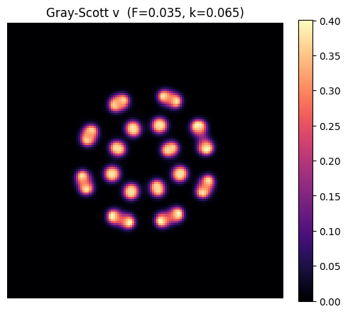
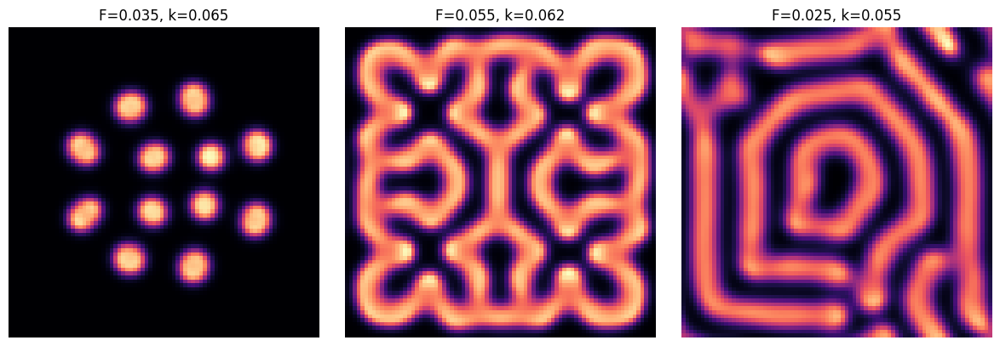

# 反応拡散の基礎：パターン生成

:::{tip} 対応 Notebook
[03_reaction_diffusion_gray_scott.ipynb](../notebooks/03_reaction_diffusion_gray_scott.ipynb)
:::

:::{note} 学習経路での位置づけ
本章は模様テーマの「基礎モデル」である。[模様研究の準備](./00_pattern_foundations.md)で分けて考えた反応と拡散を、具体的なGray--Scottモデルで組み合わせる。生成模様を実画像へ適合させず、次の[模様解析の基礎](./04_reaction_diffusion_snake.md)で特徴量を個別に検証する。
:::

## この章の目的

**反応拡散方程式** によって、一様な初期状態から空間パターンが自発的に生じる仕組み（**チューリング型不安定性**）を学ぶ。代表例である **Gray-Scott モデル** を2次元格子で数値計算し、斑点・縞・迷路模様を再現できるようになることを目指す。

## 50分の学習ガイド

| 時間 | 学習内容 | 到達確認 |
| ---: | --- | --- |
| 0～7分 | 拡散だけでは模様が消えることを復習 | 1成分拡散との違いを述べる |
| 7～17分 | 一般の反応拡散方程式 | 反応項と拡散項を分けて読む |
| 17～26分 | チューリング型不安定性の直観 | 局所活性化・長距離抑制を説明する |
| 26～34分 | Gray--Scott各項の意味 | $uv^2$, $F$, $k$ の役割を言葉にする |
| 34～39分 | 差分法と安定条件 | 時間刻みが適切か確認する |
| 39～46分 | Notebookの2図を比較 | 色・時刻・パラメータを確認して読む |
| 46～50分 | チェックポイント | 実画像解析へ進む準備を判定する |

図を見る前に「拡散だけならどうなるか」「反応だけならどうなるか」を別々に考える。両方を足した結果だけを暗記しない。

## 現象の説明

動物の体表には斑点や縞などの模様がある。Turing は1952年、化学物質（モルフォゲン）の **反応** と **拡散** だけで、一様な状態から空間パターンが自然に現れうることを示した {cite}`turing1952chemical`。直観に反するが、「拡散はならす働き」のはずなのに、2種類の物質が異なる速さで拡散し互いに反応すると、**拡散が不安定化を引き起こす** ことがある。これがチューリング型不安定性である。

:::{warning} 科学的な注意
反応拡散は模様生成の **1つのモデル** であり、実際の動物模様が反応拡散だけで決まると断定するものではない。遺伝・発生・成長・鱗構造・環境などの影響は、実画像へ接続する卒研ロードマップで改めて検討する。
:::

## 最小モデル

2種類の濃度場 $u(\mathbf{x},t)$ と $v(\mathbf{x},t)$ を考える。各点で「反応」し、空間的に「拡散」する。これを最小モデルとする。境界は周期境界（トーラス）とし、端の効果を無視する。

[PDE入門](./00_pde_foundations.md)の1成分拡散方程式は凹凸をならすだけだった。本章では、各格子点で進むODE $\dot u=f(u,v)$, $\dot v=g(u,v)$ と、隣の格子点と混ざる拡散を足す。つまり「既習の局所ODE＋準備章の空間結合」である。

## 数式による定式化

### 一般の反応拡散方程式

```{math}
:label: eq-rd-u
\frac{\partial u}{\partial t} = D_u \Delta u + f(u,v)
```

```{math}
:label: eq-rd-v
\frac{\partial v}{\partial t} = D_v \Delta v + g(u,v)
```

$\Delta = \partial_{xx} + \partial_{yy}$ はラプラシアン（拡散）、$f,g$ は反応項である。式を読むときは、まず反応を切った場合（$f=g=0$）、次に拡散を切った場合（$D_u=D_v=0$）を考える。2つの部品を別々に理解してから、同時に働く場合へ進む。

### チューリング不安定性の直観

空間一様な平衡点 $(u^*,v^*)$ のまわりを線形化すると、波数 $q$ の摂動の成長率 $\lambda(q)$ は、反応のヤコビ行列と拡散項から決まる。**反応だけ**（$q=0$）では安定でも、ある波数帯 $q\neq 0$ で $\lambda(q)>0$ になると、その波長の模様が成長する。典型的な活性化・抑制系では、活性化が局所に留まり、抑制の影響がより遠くへ速く及ぶ「局所活性化・長距離抑制」が鍵になる。どちらの変数が活性・抑制を担うかは反応式によるため、記号 $u,v$ だけから拡散係数の大小を決めてはいけない。

### Gray-Scott モデル

本章で使う具体形は Gray-Scott モデル {cite}`grayscott1984` である。

```{math}
:label: eq-gs-u
\frac{\partial u}{\partial t} = D_u \Delta u - u v^2 + F(1-u)
```

```{math}
:label: eq-gs-v
\frac{\partial v}{\partial t} = D_v \Delta v + u v^2 - (F+k)v
```

$u$ は供給される基質、$v$ は自己触媒的に増える生成物である。$u v^2$ は「$v$ が $u$ を食べて増える」反応、$F(1-u)$ は $u$ の供給、$-(F+k)v$ は $v$ の流出を表す。

本Notebookで用いる代表値は $D_u=0.16$, $D_v=0.08$ であり、基質 $u$ の方が速く拡散する。これは上の一般的な活性化・抑制の説明と矛盾しない。Gray--Scott系では反応と拡散の組全体が不安定性を決めるためである。

## パラメータの意味

| 記号 | 意味 | 効果 |
| --- | --- | --- |
| $D_u, D_v$ | $u,v$ の拡散係数 | 模様の太さ・滑らかさ |
| $F$ | 供給率（feed） | パターンの種類を支配 |
| $k$ | 除去率（kill） | パターンの種類を支配 |

Gray-Scott の魅力は、$(F,k)$ という **たった2つのパラメータ** の組み合わせで、斑点・縞・迷路・自己複製スポットなど多様なパターンが出ることである。$(F,k)$ 平面の「地図」を描くこと自体が研究になる。

### 数値安定性

差分法（陽解法）では、時間刻み $\Delta t$、空間刻み $\Delta x$ に対し拡散の安定条件

```{math}
:label: eq-cfl
D \frac{\Delta t}{\Delta x^2} \le \frac{1}{4}\quad(\text{2次元})
```

を守らないと数値が発散する。Notebook では $\Delta x=1$、$\Delta t \le 1$ 程度に設定する。発散したら $\Delta t$ を小さくする。

## 数値シミュレーション

Notebook では次を行う。

1. 5点ステンシルのラプラシアン関数（周期境界）を定義する。
2. $u=1, v=0$ の一様場に、中央の小領域だけ $v$ を与える初期条件を置く（seed 固定）。
3. 式 {eq}`eq-gs-u`{eq}`eq-gs-v` を陽的オイラー法で時間発展させる。
4. 一定ステップごとに $v$ の場を `imshow` で可視化する。
5. $(F,k)$ を変えて、斑点／縞／迷路の違いを比較する。

### 図1：1つのパラメータ設定から生じる斑点



この図は2次元空間上の $v(x,y,t)$ を色で表している。明るい場所ほど $v$ が高く、黒い場所ほど低い。色はヘビの実際の体色ではなく、数値変数 $v$ の値である。カラーバーの0～0.4を読み、画像の白黒を生物学的な色素量と直接同一視しない。

初期条件は中央の小領域に置かれているため、有限時間では模様も中央付近に集まっている。図の外側が黒いことを「境界で吸収された」と解釈してはいけない。Notebookは周期境界を使っており、単に擾乱がまだ外側へ十分広がっていない可能性がある。保存時刻を変え、時間発展を確認する必要がある。

斑点が完全な円でないのは、反応、拡散、近隣斑点との相互作用、格子近似が同時に働くためである。1枚の最終図だけで安定した定常模様と断定せず、複数時刻で位置や個数が変化していないかを見る。

### 図2：$(F,k)$ を変えた比較



左から、孤立した斑点、連結した迷路状構造、幅の大きい帯状構造が現れている。空間格子、計算時間、拡散係数などをそろえ、$F$ と $k$ だけを変えているため、パターン差をこの2パラメータの効果として比較できる。

ただし、3枚はパラメータ空間の3点にすぎない。「この値なら必ず斑点」という境界を示してはいない。初期条件、seed、計算終了時刻でも見え方は変わる。まず粗いパラメータ地図を作り、同じ分類が複数seedで現れるか確認する必要がある。

また、見た目の分類だけでは「斑点と迷路の中間」を再現可能に判定できない。次章では、面積比、連結成分、特徴波長へ変換し、図を数値で読む方法を学ぶ。

:::{note} 評価指標
見た目で「縞っぽい」と言うだけで終わらせず、次章で導入する **面積比・斑点数・FFT** につながる量を意識する。本章では標準設定を再現し、少数の設定でパターンが変わることを確認するところまでとする。
:::

## 卒業研究への接続

- $(F,k)$ 平面を粗く調べることは、卒研で探索範囲を決めるための予備実験になる。
- 拡散比 $D_v/D_u$ を変えると特徴長が変わる。実画像へ接続する前に、人工模様でこの関係を検証する。
- 反応項を別のモデル（FitzHugh-Nagumo, Brusselator など）に差し替えると、出る模様が変わる。モデル選択そのものが比較研究になる。
- 実画像との比較、損失関数、パラメータ探索は[卒研ロードマップ](./04_snake_research_roadmap.md)で段階的に設計する。

## チェックポイント

- [ ] 反応項と拡散項を別々に説明できる。
- [ ] 初期条件と周期境界条件をコード上で示せる。
- [ ] 2次元陽解法の安定条件を確認した。
- [ ] 同じseedとパラメータで結果を再現した。
- [ ] 少なくとも2設定の違いを、見た目だけでなく生成過程から説明した。
- [ ] 実画像との比較前に特徴量を単独で検証すべき理由を説明できる。

## 演習問題

1. **（理論）** 典型的な活性化・抑制系で、抑制の影響が活性化より速く遠くへ及ぶとパターン形成につながりうる理由を、「局所活性化・長距離抑制」という言葉を使って説明せよ。さらに、変数名だけでは拡散係数の大小を決められない理由を述べよ。
2. **（数値）** Notebook で $(F,k)=(0.035,0.065)$、$(0.055,0.062)$、$(0.025,0.055)$ を試し、それぞれどんなパターン（斑点／縞／迷路）になるか記録せよ。
3. **（数値）** 時間刻み $\Delta t$ を大きくしていくと、いくつ付近で数値が発散するか。式 {eq}`eq-cfl` と比較せよ。

## 発展課題

- ラプラシアンを9点ステンシル（対角を含む）に変えると、パターンの等方性がどう変わるか調べよ。
- $D_u, D_v$ を空間的に変化させ（例：左右で異なる）、模様の幅が場所で変わるか観察せよ。

## 参考文献・キーワード

- Turing, *Phil. Trans. R. Soc. B* (1952) {cite}`turing1952chemical`
- Gray & Scott (1984) {cite}`grayscott1984`
- キーワード：拡散方程式、反応項、反応拡散系、チューリング不安定性、Gray-Scott、CFL条件、周期境界
