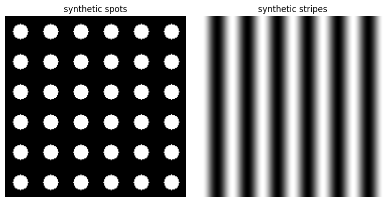
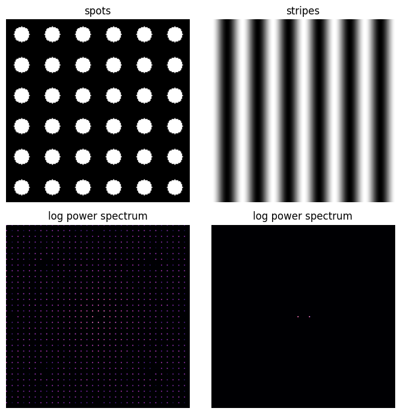

# 模様解析の基礎：画像を数値で測る

:::{tip} 対応 Notebook
[04_snake_pattern_features.ipynb](../notebooks/04_snake_pattern_features.ipynb)
:::

:::{note} 学習経路での位置づけ
本章は「研究技能の練習」である。ヘビ写真と反応拡散パターンの適合はまだ行わない。人工的な斑点・縞画像を使い、二値化、面積比、連結成分数、特徴波長を1つずつ測る。
:::

## この章の目的

[反応拡散の基礎](./03_reaction_diffusion_basic.md)では方程式から模様を生成した。しかし「斑点らしい」「ヘビに似ている」という見た目だけでは比較できない。本章では、模様を再現可能な数値へ変換する基礎を学ぶ。

1. 画像を配列として扱う。
2. 前景と背景を二値化する。
3. 面積比と連結成分数を測る。
4. Fourierスペクトルから代表的な空間スケールを読む。
5. 特徴量が平行移動、回転、閾値にどの程度影響されるか確認する。

## 50分の学習ガイド

| 時間 | 学習内容 | 到達確認 |
| ---: | --- | --- |
| 0～7分 | 人工画像を使う理由 | 実写真を最初に使う問題点を挙げる |
| 7～15分 | 画像配列と二値化 | 閾値を変えた影響を予想する |
| 15～23分 | 面積比と連結成分 | 同じ面積比で異なる模様を考える |
| 23～33分 | 2次元FFTと特徴波長 | 波数と波長の逆関係を説明する |
| 33～42分 | Notebookの原画像とスペクトル | 点の配置と周波数ピークを対応づける |
| 42～47分 | 平行移動・閾値感度 | 頑健な特徴量かを確認する |
| 47～50分 | チェックポイント | 実画像へ進めるか自己判定する |

各特徴量について「区別できる例」と「区別できない例」を1つずつ作ると、数式の役割を理解しやすい。

## 単純画像から始める理由

実際の写真には照明、影、曲面、鱗、背景、撮影角度が含まれる。最初から実写真を使うと、特徴量の実装ミスと写真固有の問題を区別できない。Notebookでは正解を目で確認できる人工画像だけを使う。



左は白い円が規則正しく並ぶ二値画像、右は明暗が連続的に変化する縞画像である。どちらも繰返し間隔を32画素に設定している。そのため形は大きく異なっても、代表波長はどちらも約32画素になる。

この例は、**1つの特徴量だけでは模様を一意に表せない**ことを示す。特徴波長だけなら斑点と縞が同じ値になりうる。一方、連結成分数や方向性を加えれば区別できる。複数特徴量を使う理由は、数を増やせばよいからではなく、1つの特徴量の死角を補うためである。

## 二値化

濃淡画像 $I(x,y)$ と閾値 $\tau$ から

```{math}
B(x,y)=
\begin{cases}
1 & I(x,y)\ge\tau,\\
0 & I(x,y)<\tau
\end{cases}
```

を作る。閾値を変えると面積比や斑点数も変わるため、閾値は隠れたパラメータである。

## 面積比

前景画素の割合を

```{math}
:label: eq-pattern-area
r_\mathrm{area}=\frac{1}{N}\sum_{x,y}B(x,y)
```

とする。実装と意味は単純だが、同じ面積比でも「大きな斑点が少数」と「小さな斑点が多数」を区別できない。

## 連結成分数

隣り合う前景画素を同じ塊として数える。4近傍と8近傍で結果が変わるため、どちらを用いたか明記する。画像端で切れた模様を数えるかどうかも決める。

## 特徴波長

2次元Fourier変換 $\mathcal{F}[I](k_x,k_y)$ のパワー

```{math}
P(k_x,k_y)=|\mathcal{F}[I](k_x,k_y)|^2
```

を調べる。中心から離れた位置に強い成分があれば、その波数の逆数が代表的な模様間隔の候補になる。

FFTの最大値を機械的に採るだけでは不十分である。

- 平均値に対応するゼロ周波数を除く。
- 画像サイズと画素間隔から単位を確認する。
- 縞の向きを残すか、動径平均するか決める。
- 窓関数や画像端の影響を確認する。

### 原画像とパワースペクトルの対応



上段が原画像、下段がFourierパワーの対数表示である。画像中心はゼロ周波数、中心からの距離は波数の大きさ、中心から見た方向は空間変化の方向に対応する。

斑点格子のスペクトルには縦横に多数の点が並ぶ。斑点が2方向に周期的に配置されているためである。縞画像では中心の左右に強い2点が現れる。縞は縦向きだが、明暗が変化するのは横方向なので、Fourierピークは横軸方向に現れる。**縞の向きと周波数ピークの方向は直交する**ことに注意する。

表示では強度差を見やすくするため対数を取っている。色の差を元画像の明るさと直接比較してはいけない。また、中心ピークは画像平均を表すので、模様間隔を求めるときは除外する。

## 特徴量の頑健性

良い特徴量は、研究上無関係な変化には大きく反応せず、区別したい変化には反応する。

| 操作 | 確認すること |
| --- | --- |
| 平行移動 | 面積比・斑点数・波長がほぼ不変か |
| 小さな回転 | 向きを無視する特徴量が安定か |
| 明るさ変更 | 二値化閾値への依存が強すぎないか |
| 解像度変更 | 物理単位へ換算した波長が保たれるか |
| ノイズ追加 | 連結成分が過剰に増えないか |

## この章ではまだ行わないこと

- ヘビ写真の収集・前処理
- 反応拡散パターンとの類似度計算
- 複数特徴量をまとめた損失関数
- $(F,k)$ のパラメータ探索
- 最も似た模様や最適パラメータの提示

これらは[卒研ロードマップ](./04_snake_research_roadmap.md)で学生が設計する。

## チェックポイント

- [ ] 人工画像の面積比を手計算可能な例で検証した。
- [ ] 4近傍と8近傍の違いを説明できる。
- [ ] FFTのゼロ周波数を除く理由を説明できる。
- [ ] 平行移動前後で特徴量を比較した。
- [ ] 閾値を変えた感度を表または図にした。
- [ ] 各特徴量が区別できない模様の例を挙げられる。

## 演習問題

1. 面積比が等しく斑点数が異なる人工画像を2枚作れ。
2. 斑点数が等しく特徴波長が異なる画像を作れ。
3. 同じ画像を3画素平行移動し、各特徴量の変化を確認せよ。
4. ノイズ除去の前後で連結成分数がどう変わるか調べ、処理条件を記録せよ。

## 次に進む

[卒研ロードマップ：生成模様と実画像を比較する](./04_snake_research_roadmap.md)では、対象画像の選定、前処理、特徴量選択、損失関数、パラメータ探索を小さな段階に分ける。完成した適合結果は示さない。

## 参考文献・キーワード

- Turing {cite}`turing1952chemical`
- キーワード：二値化、面積比、連結成分、特徴波長、2次元FFT、頑健性、感度分析
