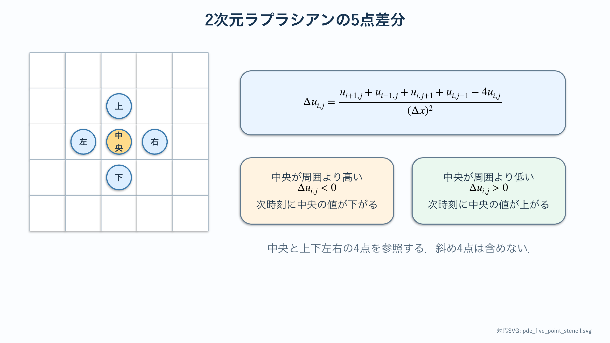
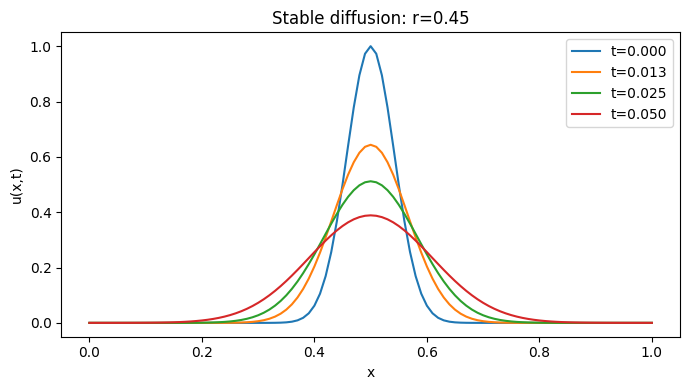
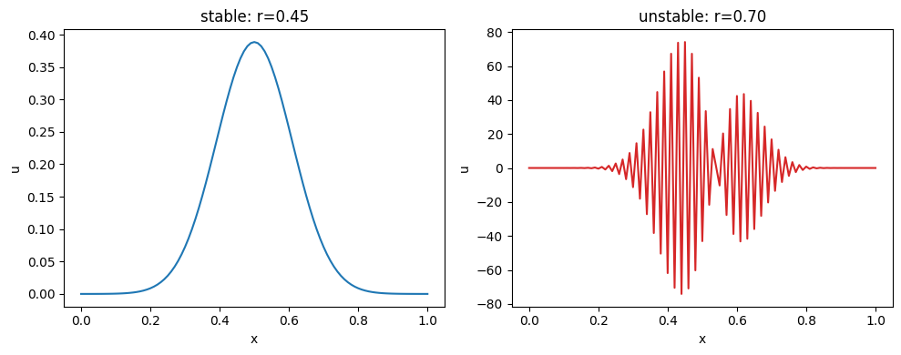

# 放熱研究の準備：拡散方程式入門

:::{important} この資料の位置づけ
{abbr}`偏微分方程式(時間と空間など，複数の独立変数を持つ未知量を扱う微分方程式)`を初めて学ぶ人のための事前学習であり，主にステゴサウルス背板と放熱テーマへ接続する．ここで学ぶ{abbr}`場(空間の各位置に値が対応する状態)`・{abbr}`ラプラシアン(各空間方向の2階偏微分を足した微分演算子)`・{abbr}`差分法(微分を格子点の値の差で近似する数値計算法)`は模様テーマでも再利用する．本文を読み，対応Notebookを一度実行してから基礎章へ進むこと．
:::

:::{tip} 対応 Notebook
[10_pde_diffusion_basics.ipynb](../notebooks/10_pde_diffusion_basics.ipynb)
:::

## この章の目的

Strogatzで学んだ{abbr}`常微分方程式（ODE）(時間だけを独立変数に持つ未知量を扱う微分方程式)`から偏微分方程式（PDE）へ，次の小さな段差を順に上る．

1. 未知関数に空間変数を加える．
2. 偏微分とラプラシアンを，曲線や面の傾き・曲がり方として読む．
3. 方程式だけでなく，{abbr}`初期条件(時間発展を始める時刻の状態を指定する条件)`と{abbr}`境界条件(計算領域の端で値や流れを指定する条件)`を指定する．
4. 拡散方程式を{abbr}`有限差分法(微分を格子点の値の差で近似する数値計算法)`で計算する．
5. {abbr}`数値解の発散(計算誤差が増幅して値が制御不能に大きくなること)`と現象の不安定性を区別する．

この章の到達点は，PDEの一般論を網羅することではない．放熱基礎章の熱方程式と模様基礎章の反応拡散方程式を，式の意味と計算手順の両方から読めるようになることである．

## 学習ガイド

| 学習内容 | 到達確認 |
| --- | --- |
| ODEとPDEの未知量を比較する | $x(t)$ と $u(x,t)$ の違いを説明する |
| 偏微分とラプラシアンを計算する | 例題の3つの偏微分を手で求める |
| {abbr}`保存則(領域内の量の変化を流入と流出の差で表す法則)`から拡散方程式を読む | 右辺の符号から空間差を小さくする働きを説明する |
| 初期条件と4種類の境界条件 | 現象に適切な境界条件を選ぶ |
| 有限差分法と更新式 | 式 {eq}`eq-ftcs` を配列更新と対応づける |
| Notebookの2図を読む | 安定な拡散と数値発散を区別する |
| 確認問題 | 安定条件を数値で計算する |

数式を追うときは，ある格子点が左右より高い場合に次時刻の値がどう変化するかを，記号の操作と対応させて説明する．

## ODEとPDEは何が違うか

Strogatzで扱った人口 $x(t)$ や2人の感情 $(R(t),J(t))$ は，時刻 $t$ を決めれば有限個の数で状態が決まる．たとえば

```{math}
\frac{dx}{dt}=f(x)
```

は，現在の状態 $x$ によって時間方向の変化率が決まるODEである．

一方，棒の温度は場所によって異なる．時刻 $t$ の状態を表すには，1個の数ではなく，すべての位置 $x$ における温度

```{math}
T(x,t)
```

が必要である．時間だけを変えた変化率は $\partial T/\partial t$，位置だけを変えた変化率は $\partial T/\partial x$ と書く．変数が複数あるので，通常の微分 $d$ と区別して偏微分記号 $\partial$ を使う．

| モデル | 未知量 | 状態のイメージ |
| --- | --- | --- |
| ODE | $x(t)$ または $\mathbf{x}(t)$ | 時刻ごとの点 |
| 1次元PDE | $u(x,t)$ | 時刻ごとの曲線 |
| 2次元PDE | $u(x,y,t)$ | 時刻ごとの画像・面 |

PDEも力学系である．空間を格子点 $x_0,\ldots,x_N$ に区切れば，$u_i(t)\approx u(x_i,t)$ を成分とする大きな連立ODEになる．この見方が数値計算と既習内容を結ぶ．

たとえば，1次元区間を101個の格子点で表せば，1時刻の温度状態は101成分のベクトルになる．2次元領域を $100\times100$ 格子で表せば1万成分である．PDEでは未知関数を扱うが，計算機上では各格子点の値を並べた有限次元ベクトルとして近似する．格子を細かくするほど元のPDEへ近づく一方，変数数と計算量は増える．

ODEとPDEを見分けるときは，微分記号だけを見るのではなく，未知量が何に依存しているかを見る．$T(t)$ は時間だけに依存するためODEの未知量であり，$T(x,t)$ は位置と時間に依存するためPDEの未知量である．定常化して $T(x)$ になれば，時間依存は消えるが，空間分布を求める境界値問題として残る．

## 偏微分の考え方

多変数関数の偏微分では，一つの独立変数だけを変化させ，ほかの独立変数を一定として変化率を求める．$u(x,t)$ に対して，$\partial u/\partial t$ は位置 $x$ を一定とした時間変化率であり，$\partial u/\partial x$ は時刻 $t$ を一定とした空間方向の変化率である．

例として

```{math}
u(x,t)=e^{-t}\sin x
```

なら

```{math}
\frac{\partial u}{\partial t}=-e^{-t}\sin x,
\qquad
\frac{\partial u}{\partial x}=e^{-t}\cos x,
\qquad
\frac{\partial^2u}{\partial x^2}=-e^{-t}\sin x
```

である．$\partial^2u/\partial x^2$ は空間的な曲がり方を表す．1次元では，ある点の値が左右の平均より低ければ曲率は正，高ければ負になる．

2次元で各方向の2階偏微分を足した

```{math}
\Delta u=\frac{\partial^2u}{\partial x^2}+\frac{\partial^2u}{\partial y^2}
```

を**ラプラシアン**という．周囲より低い場所では $\Delta u>0$，周囲より高い場所では $\Delta u<0$ となるため，近傍平均との差を表す演算子と理解できる．

ラプラシアンの符号は，あとで導入する有限差分の形を見ると直感的に分かる．1次元で格子間隔を $\Delta x$ とし，中央点 $x_i$ と左右の点 $x_{i-1},x_{i+1}$ の値だけを見ると，2階微分は

```{math}
\frac{\partial^2u}{\partial x^2}(x_i,t)
\approx
\frac{u_{i-1}-2u_i+u_{i+1}}{(\Delta x)^2}
```

で近似される．この分子 $u_{i-1}-2u_i+u_{i+1}$ は，中央点の値が左右の平均からどれだけずれているかを表す．中央が $u_i=10$，左右が $u_{i-1}=8$, $u_{i+1}=8$ なら，分子は $8-2\times10+8=-4$ となり，2階微分は負である．拡散方程式では次時刻の中央点の値が下がる．反対に中央が6，左右が8なら分子は4であり，中央点の値は上がる．この小例を頭に置くと，ラプラシアンの符号を式の暗記ではなく，周囲平均との差として判断できる．

1階微分が傾き，2階微分が傾きの変化，ラプラシアンが多方向の曲がり方の合計である．温度そのものが正でも，ラプラシアンは正にも負にもなる．状態量の符号と変化率の符号を混同しないことが重要である．

## 保存則から拡散方程式を作る

温度や物質濃度が，外から突然現れず，流入・流出によって変化すると考える．1次元の短い区間 $[x,x+\Delta x]$ について

```text
区間内の量の増加率 = 左からの流入 - 右への流出
```

が保存則である．{abbr}`流束(単位面積を単位時間に通過する量)` $J$ が勾配の反対向きに流れるというFick型・Fourier型の法則

```{math}
J=-D\frac{\partial u}{\partial x}
```

を使う．ここで，区間の長さ $\Delta x$ を明示して式に直す．単位断面積を考えると，区間内の量はおよそ $u(x,t)\Delta x$ である．左端 $x$ から入る流束を $J(x,t)$，右端 $x+\Delta x$ から出る流束を $J(x+\Delta x,t)$ とすると，

```{math}
\frac{\partial}{\partial t}\{u(x,t)\Delta x\}
\approx
J(x,t)-J(x+\Delta x,t)
```

である．両辺を $\Delta x$ で割ると

```{math}
\frac{\partial u}{\partial t}
\approx
-\frac{J(x+\Delta x,t)-J(x,t)}{\Delta x}
```

となる．右辺の分数は $J$ の空間微分の差分近似である．したがって，$\Delta x\to0$ の極限で

```{math}
\frac{\partial u}{\partial t}
=-\frac{\partial J}{\partial x}
```

を得る．さらに $J=-D\,\partial u/\partial x$ を代入し，$D$ が位置によらず一定とすると

```{math}
:label: eq-diffusion-basic
\frac{\partial u}{\partial t}=D\frac{\partial^2u}{\partial x^2}
```

を得る．$D>0$ は拡散係数である．この導出では，保存則から $\partial_tu=-\partial_xJ$ が出て，流束の法則から $J=-D\partial_xu$ が出る．この2つを組み合わせたものが拡散方程式である．

式 {eq}`eq-diffusion-basic` は，周囲より高い点では右辺が負になって値が下がり，低い点では右辺が正になって値が上がる，と読める．したがって拡散は凹凸をならす．

拡散がどれくらいの距離まで広がるかは，拡散係数 $D$ の単位からも見積もれる．$\partial u/\partial t$ の単位は「$u$ の単位 / 時間」，$\partial^2u/\partial x^2$ の単位は「$u$ の単位 / 長さ$^2$」である．したがって，式 {eq}`eq-diffusion-basic` の両辺の単位を合わせるには，$D$ の単位は長さ$^2$/時間でなければならない．時間 $t$ と $D$ から長さを作ると，

```{math}
\ell\sim\sqrt{Dt}
```

となる．これが拡散の特徴的な距離である．より具体的には，無限に長い1次元直線上で一点から拡散を始めると，解は概形として $\exp(-x^2/(4Dt))$ を含む．指数の中の $x^2/(4Dt)$ が1程度になる場所まで値が広がるので，係数を除けば $x\sim\sqrt{Dt}$ となる．距離を2倍進むには，およそ4倍の時間が必要である．

## PDEは方程式だけでは解けない

時間発展を決めるには，全位置での開始時の値

```{math}
u(x,0)=u_0(x)
```

という**初期条件**が必要である．さらに空間の端で何が起きるかを表す**境界条件**も必要である．

| 境界条件 | 1次元での例 | 意味 |
| --- | --- | --- |
| Dirichlet条件 | $u(0,t)=a$ | 端の値を固定する |
| Neumann条件 | $\partial_xu(0,t)=0$ | 端を通る流束を0にする（断熱・反射） |
| Robin条件 | $-k\partial_xu=h(u-u_\mathrm{out})$ | 内部の流束と外部への移動を釣り合わせる |
| 周期境界条件 | $u(0,t)=u(L,t)$ | 左端と右端をつなぐ |

同じPDEと初期条件でも，境界条件が違えば解は違う．したがってモデルを説明するときは，**方程式・初期条件・境界条件を1組**として示す．

境界条件は数学上の付属情報ではなく，領域の外側をどうモデル化するかという物理的な仮定である．端を氷水に接触させるなら温度を固定するDirichlet条件，断熱材で覆うなら流束を0にするNeumann条件，外気へ熱を逃がすならRobin条件が対応する．周期境界は，計算領域が同じ構造の繰返し単位であるとみなす場合に使う．

選択に迷ったときは，境界で値が決められているのか，境界を通る流れが決められているのか，外部との交換則が決められているのかを順に確認する．実験装置や対象形状の説明から境界条件を選び，式を書いた後にその物理的意味を1文で添える．

## 定常解と時間発展

時間変化が止まった状態を定常状態といい，$\partial u/\partial t=0$ と置く．拡散方程式なら

```{math}
D\frac{d^2u}{dx^2}=0
```

となる．これは時間を含まない境界値問題で，両端の値を固定すれば定常解は直線になる．

ここでPDEが突然ODEに変わったように見えるが，空間だけの未知関数を求める常微分方程式になったのである．放熱基礎章の1次元フィン方程式は，この定常化と細長い形状の仮定によって得られる．

## 有限差分法：空間を格子に置き換える

区間 $0\le x\le L$ を間隔 $\Delta x$ で区切り，$u_i^n\approx u(i\Delta x,n\Delta t)$ とする．Taylor展開から

```{math}
\frac{\partial^2u}{\partial x^2}(x_i,t_n)
\approx
\frac{u_{i-1}^n-2u_i^n+u_{i+1}^n}{\Delta x^2}
```

を得る．時間微分を前進差分にすると

```{math}
:label: eq-ftcs
u_i^{n+1}
=u_i^n+r\left(u_{i-1}^n-2u_i^n+u_{i+1}^n\right),
\qquad
r=\frac{D\Delta t}{\Delta x^2}
```

となる．この更新式は，現在の格子点と左右の格子点との差を用いて次時刻の値を計算する局所更新則である．全格子点を状態ベクトルとすれば，{abbr}`陽的Euler法(現在時刻の値だけを使って次時刻の値を計算する時間積分法)`によって大規模な連立ODEを解く計算に対応する．

2次元では，中央セルと上下左右の4セルを使う5点差分へ拡張する．



橙色の中央点が周囲4点より高ければラプラシアンは負になり，拡散更新によって中央の値は下がる．低ければ逆に上がる．この符号を先に予想してから差分式を計算する．

### 計算の最小手順

1. $D,L,\Delta x,\Delta t$ と終了時刻を決める．
2. 初期条件を配列 `u` に入れる．
3. 内点を式 {eq}`eq-ftcs` で更新する．
4. 境界条件を適用する．
5. 新旧の配列を入れ替えて繰り返す．
6. 複数時刻の分布，最大値，総量などを図にする．

この手順の中心部分は，Pythonでは次のように書ける．ここでは，端を通る流束が0であるNeumann境界条件を例にしている．

```python
# u は時刻 t_n の値を並べた配列である．
# u_new は時刻 t_{n+1} の値を入れるための別配列である．
r = D * dt / dx**2

u_new = u.copy()

# 内点だけを拡散方程式で更新する．
# u[:-2] は左隣，u[1:-1] は中央，u[2:] は右隣を表す．
u_new[1:-1] = u[1:-1] + r * (u[:-2] - 2 * u[1:-1] + u[2:])

# Neumann境界条件：端で傾きが0になるように端点を隣の値に合わせる．
u_new[0] = u_new[1]
u_new[-1] = u_new[-2]

# 次のステップでは，更新後の配列を現在の配列として使う．
u = u_new
```

重要なのは，右辺ではすべて更新前の `u` を使い，結果を `u_new` に入れることである．左から配列を直接上書きすると，同じ時刻の値と次時刻の値が混ざる．Dirichlet条件を使う場合は，最後の境界処理を `u_new[0] = a`, `u_new[-1] = b` のように端の値を固定する処理へ置き換える．周期境界を使う場合は，左端の左隣を右端，右端の右隣を左端として扱う．

## 数値安定性

1次元拡散方程式を式 {eq}`eq-ftcs` で解く場合，基本的な安定条件は

```{math}
:label: eq-diffusion-stability
r=\frac{D\Delta t}{\Delta x^2}\le\frac12
```

である．$\Delta x$ を半分にすると，$\Delta t$ は4分の1以下にする必要がある．条件を破ると，拡散なら本来なめらかになるはずなのに，格子ごとの振動が増幅して巨大な正負の値になる．

これは現象の不安定性ではなく，計算法が作った**数値不安定性**である．結果が派手だからといって現象だと思わず，次を確認する．

- $\Delta t$ を半分にしても結論が変わらないか．
- $\Delta x$ を細かくし，安定条件も保ったときに解が近づくか．
- 保存されるはずの総量や，非負であるべき濃度が壊れていないか．

2次元の正方格子と5点差分では，対応する条件は概ね $D\Delta t/\Delta x^2\le1/4$ になる．反応拡散基礎章で再利用する．

## Notebookの簡単な演習

[対応Notebook](../notebooks/10_pde_diffusion_basics.ipynb)では，中央に山形の初期分布を置き，1次元拡散方程式を陽的Euler法で計算する．最初に安定条件を満たす計算を実行し，分布の最大値，幅，総量がどう変化するか確認する．次に時間刻みだけを大きくして安定条件を破り，物理的な拡散と数値的な振動を比較する．

コードを読むときは，`u` が更新前の配列，`u_new` が更新後の配列であることを確認する．課題では，時間刻み，格子幅，境界条件，初期分布を1項目ずつ変える．複数項目を同時に変えると，図が変化した原因を特定できない．

### 安定な拡散



横軸は位置 $x$，縦軸は場の値 $u(x,t)$，色の異なる曲線は時刻を表す．最初の青線は中央に集中した鋭い分布である．時間が進むと，中央の最大値は下がり，左右の裾は広がる．

ここで，値そのものが消失したと解釈してはいけない．Neumann境界条件では外へ流出しないため，曲線下の面積に相当する総量はほぼ保存される．ピークの高さだけでなく，幅と面積を同時に確認する．拡散は，局所的な高低差を小さくしながら総量を空間内で移動させる．

図から確認する順序は次の通りである．

1. 分布が左右対称か．非対称なら初期条件か更新式を疑う．
2. 最大値が単調に下がるか．途中で増えるなら刻みまたは境界処理を疑う．
3. 負の値が現れていないか．濃度を想定する場合，負値は非物理的である．
4. 数値積分した総量が時刻で大きく変わらないか．

### 安定条件を破った場合



左図は $r=0.45\le1/2$，右図は $r=0.70>1/2$ である．右では格子点ごとに正負が交互に現れ，振幅が本来の初期値より何十倍にも成長している．拡散方程式は凹凸をならすはずなので，この振動増幅は現象と矛盾する．

右図を物質自体の不安定な振動と解釈してはいけない．時間刻みだけを小さくすると振動が消えるため，これは**数値不安定性**である．現象の不安定性なら，刻みを十分小さくしても同じ成長率や空間構造が再現される必要がある．この見分け方は，後の反応拡散パターンで特に重要になる．

## この後の4テーマへの地図

| テーマ | 状態 | 時間発展 | 空間 | この章から持っていくもの |
| --- | --- | --- | --- | --- |
| 放熱 | 温度場 $T$ | 熱伝導・定常化 | 連続 | 保存則，境界条件，定常解 |
| 反応拡散 | 濃度場 $u,v$ | 拡散＋反応 | 連続 | ラプラシアン，陽解法，安定条件 |
| 電車乗降 | 各人の位置・行動 | 離散更新 | 格子 | 局所更新，境界，同期更新 |
| 関係ネットワーク | 感情ベクトル・行列 | ODE | 明示的な物理空間なし | 高次元力学系，安定性 |

PDEだけが空間モデルではない．どの表現を選ぶかは，連続量，個体差，関係構造のうち，研究対象として保持すべき情報によって決まる．

## 確認問題

1. $u(x,t)=x^2e^{-t}$ の $\partial_tu$, $\partial_xu$, $\partial_{xx}u$ を求めよ．
2. 棒の両端を氷水で一定温度に保つ場合と，両端を断熱する場合に適切な境界条件を書け．
3. $D=0.1$, $\Delta x=0.05$ のとき，式 {eq}`eq-diffusion-stability` を満たす $\Delta t$ の上限を求めよ．
4. Notebookで安定条件を満たす場合と破る場合を比較し，物理解と数値誤差を見分ける根拠を3つ挙げよ．
5. PDEの空間差分が大規模な連立ODEになる理由を，自分の言葉で説明せよ．

<!-- 
````{dropdown} <span style="color:red">解答例</span>
1. $u(x,t)=x^2e^{-t}$ である．$x$ を一定として $t$ で偏微分すると，

   ```{math}
   \partial_tu=-x^2e^{-t}
   ```

   である．$t$ を一定として $x$ で偏微分すると，

   ```{math}
   \partial_xu=2xe^{-t},
   \qquad
   \partial_{xx}u=2e^{-t}
   ```

   となる．偏微分では，微分しない変数を定数として扱う．

2. 両端を氷水で一定温度に保つ場合は，端の値を固定するDirichlet条件を使う．たとえば棒の長さを $L$，氷水の温度を $T_\mathrm{ice}$ とすれば，

   ```{math}
   T(0,t)=T_\mathrm{ice},
   \qquad
   T(L,t)=T_\mathrm{ice}
   ```

   である．両端を断熱する場合は，端を通る熱流束が0なのでNeumann条件を使う．

   ```{math}
   \frac{\partial T}{\partial x}(0,t)=0,
   \qquad
   \frac{\partial T}{\partial x}(L,t)=0
   ```

3. 安定条件は

   ```{math}
   \frac{D\Delta t}{\Delta x^2}\le\frac12
   ```

   である．したがって

   ```{math}
   \Delta t
   \le
   \frac{\Delta x^2}{2D}
   =
   \frac{0.05^2}{2\times0.1}
   =
   0.0125
   ```

   となる．

4. 見分ける根拠の例は次の通りである．安定な拡散では，中央のピークが低くなり，分布がなめらかに広がる．Neumann境界条件なら，数値積分した総量はほぼ保存される．また，時間刻みを小さくしても主要な形が大きく変わらない．一方，安定条件を破った計算では，格子点ごとに正負が交互に現れる振動が増幅し，負の濃度や非常に大きな値が出る．時間刻みを小さくするとこの振動が消えるなら，物理現象ではなく数値不安定性と判断する．

5. 空間を格子点 $x_0,\ldots,x_N$ に分けると，未知関数 $u(x,t)$ は各格子点の値 $u_i(t)$ の集まりとして近似される．2階空間微分は

   ```{math}
   \frac{u_{i-1}(t)-2u_i(t)+u_{i+1}(t)}{\Delta x^2}
   ```

   のような近傍点との差に置き換わる．その結果，各格子点について

   ```{math}
   \frac{du_i}{dt}
   =
   D\frac{u_{i-1}-2u_i+u_{i+1}}{\Delta x^2}
   ```

   という時間だけの微分方程式ができる．格子点が多いほど，この式が多数並ぶので，大規模な連立ODEになる．
````
 -->

## チェックポイント

- [ ] ODEとPDEの未知量の違いを説明できる．
- [ ] ラプラシアンの符号を周囲平均との差で判断できる．
- [ ] 初期条件と境界条件を区別し，現象に合わせて選べる．
- [ ] 差分更新式と配列 `u`, `u_new` の対応を説明できる．
- [ ] 数値不安定性を物理的な不安定性と区別できる．

## 次に読む

[熱方程式と1次元フィン](./11_stegosaurus_heat_basic.md)では，温度場，定常化，Dirichlet条件，Neumann条件，Robin条件を具体的な放熱問題で使う．[反応拡散とパターン生成](./21_reaction_diffusion_basic.md)では，2次元ラプラシアンと数値安定性を再利用する．

## 参考文献・キーワード

- Incropera & DeWitt, *Fundamentals of Heat and Mass Transfer* {cite}`incropera2007heat`
- キーワード：偏微分，場，拡散方程式，初期条件，境界条件，ラプラシアン，有限差分法，陽的Euler法，数値安定性
