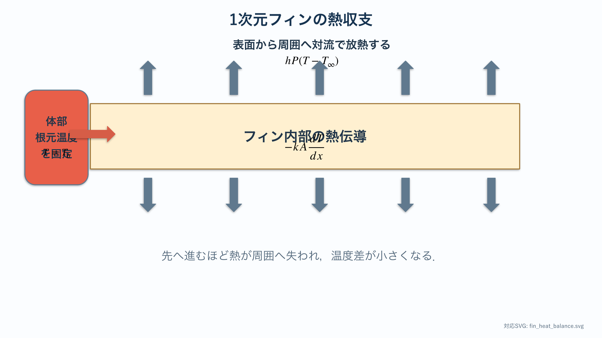
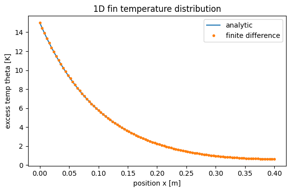
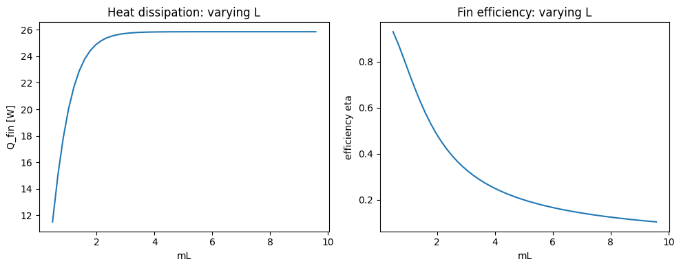
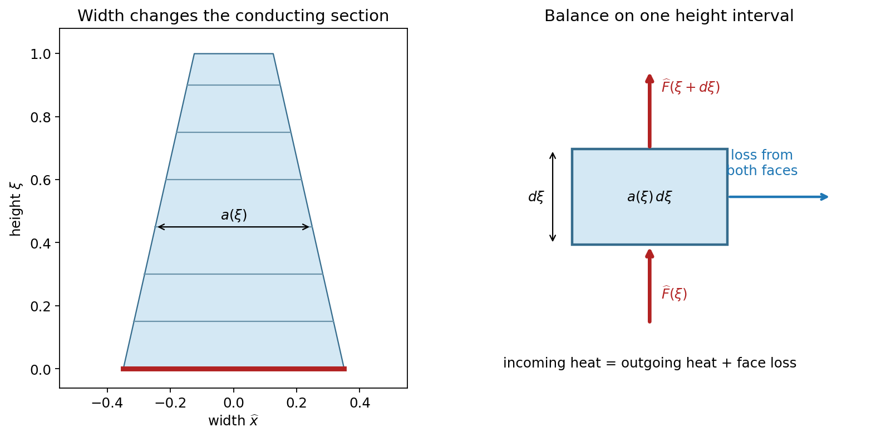

# 放熱の基礎 I：熱方程式と1次元フィン

:::{tip} 対応 Notebook
[11_stegosaurus_heat_1d_fin.ipynb](../notebooks/11_stegosaurus_heat_1d_fin.ipynb)
:::

:::{note} 学習経路での位置づけ
本章は放熱テーマの基礎モデルを扱う．[共通準備：ODEからPDEへ](./10_pde_foundations.md)の後に，1次元フィンの{abbr}`解析解(数式として厳密に表された解)`と{abbr}`差分解(微分を差分で近似して得る数値解)`を照合する．次の[単一薄板の2次元温度場](./12_stegosaurus_heat_shape.md)で数値計算を検証してから，複数形状の比較へ進む．
:::

## 基礎から形状研究までの学習順序

最初から完成した形状比較コードを読み解く必要はない．本章では，断面一定のフィンで式と数値解を検証し，その後に薄板の無次元数と幅が変化するフィンへ進む．12章で2次元の離散化を学び，13章で自分の形状と比較実験を組み立てる．

| 学習段階 | 自分で作るもの | 次へ進むための確認 |
| --- | --- | --- |
| 断面一定のフィン | 温度分布，熱流，誤差の表 | 解析解と数値解が一致する |
| 薄板への読み替え | $mL$ と $\lambda$，有次元量と無次元量の対応表 | 放熱する面を同じ条件にそろえられる |
| 幅が変化するフィン | 幅関数，微小区間の熱収支，1次元の数値解 | 一定幅に戻すと既知の解を再現する |
| 理論による考察 | 小さい $\lambda$ の展開，三角形の参照解 | 1次元近似と2次元の厳密解を区別する |

対応Notebookは断面一定の基準計算を収めている．後半の追加実装は研究用コピーに少しずつ加える．幅が変化するフィンと発展的な解析は，12章の基礎を終えてから戻って学んでもよい．

## この章の目的

ステゴサウルスの背板を工学的な{abbr}`放熱フィン(表面積を増やして周囲への熱移動を促す突起)`として単純化し，**熱方程式・境界条件・{abbr}`フィン効率(フィン全体が根元温度なら得られる放熱量に対する実際の放熱量の比)`** を学ぶ．最終的に，1次元フィンの温度分布を数値計算し，フィン長を変えたときに放熱量がどう変わるかを評価指標として説明できるようになることを目指す．

## 学習ガイド

| 学習内容 | 到達確認 |
| --- | --- |
| 放熱仮説とモデル化の注意 | 仮説と断定の違いを説明する |
| 最小モデルの仮定 | 1次元化・定常化で無視したものを挙げる |
| 熱方程式からフィンの熱伝導方程式へ | $m^2=hP/(kA_c)$ の各量を説明する |
| 解析解，放熱量，フィン効率 | $mL$ の大小で温度分布を予想する |
| Notebookの2図を読む | 解析解と差分解，放熱量と効率を区別する |
| 演習を1問解く | 図を式の極限と結びつける |
| チェックポイント | 次章へ進めるか自己判定する |

先にNotebookを実行して図だけを見るのではなく，$mL$ が小さい場合と大きい場合を紙に予想してから図を確認する．

## 現象の説明

ステゴサウルスの背中には，皮骨板と呼ばれる板状の構造が並んでいた．この板の機能については複数の仮説があり，その1つに放熱による体温調節がある．背板の形状と配置による対流放熱は，模型を用いた実験でも検討されてきた {cite}`farlow1976thermoregulation`．本章では，この仮説に関連する熱伝導の最小モデルを考える．

:::{warning} 科学的な注意
背板の機能を **放熱と断定しない**．本章では，放熱効率を評価軸とした場合に板状構造がどのように振る舞うかを調べる．誇示（ディスプレイ）や防御など他の仮説を否定するものではない．
:::

工学では，表面積を増やして放熱を促す突起を **フィン（fin）** と呼ぶ．CPUのヒートシンクが典型例である．背板をフィンとみなすと，共通準備で学んだ熱のPDEを，定常化と1次元化によって既習の常微分方程式へ落とせる．

## 最小モデル

最小モデルとして，根元（体側）で温度が高く，先端へ向かうほど冷えていく **1本の細長いフィン** を考える．次を仮定する．

- フィンは細長く，**断面内の温度は一様**（位置 $x$ だけの関数 $T(x)$）．
- 材料の{abbr}`熱伝導率(材料内部での熱の伝わりやすさを表す物性値)` $k$ と，空気との{abbr}`対流熱伝達率(表面と周囲の流体との熱交換の強さを表す係数)` $h$ は一定である．$h$ は材料固有の値ではなく，周囲の流れなどにも依存する．
- **{abbr}`定常状態(時間が経過しても各位置の状態が変化しない状態)`**（時間変化を無視，$\partial T/\partial t = 0$）．
- 断面積 $A_c$ と，空気に触れる断面の周長 $P$ は長さ方向に一定である．
- 根元には熱を供給する体部があり，境界条件として $T(0)=T_b>T_\mathrm{air}$ を与える．血流そのものは計算しない．
- 内部発熱はなく，先端面は断熱する．外気温は場所によらず一定である．

断面内を一様温度とみなせるかは，断面内伝導と表面対流の強さを比較して判断する．代表的な目安は，{abbr}`ビオ数(固体内の熱伝導抵抗と表面の対流熱抵抗の比を表す無次元数)` $\mathrm{Bi}_\perp=h(A_c/P)/k$ が1より十分小さいことである．これは断面平均モデルを使う目安であり，幅広い板の幅方向の温度差まで保証する条件ではない．その影響は12章の2次元モデルで調べる．Notebookの物性値と寸法は計算練習用の仮定値であり，背板の実測値ではない．



赤い根元から入った熱は先端へ伝わるが，その途中で上下の表面から周囲へ逃げる．そのため先端へ向かうほど温度差と伝導熱流は小さくなる．

無視したもの：放射，フィン内の血流分布，3次元的な温度むら，外気の流れの非一様性．これらは次章以降や卒研の発展課題で扱う．

## 数式による定式化

### 熱方程式

熱の輸送を表す基礎式は熱方程式である．

```{math}
\rho c \frac{\partial T}{\partial t} = \nabla \cdot (k \nabla T) + \dot q_v
```

ここで $\rho$ は密度，$c$ は比熱，$k$ は熱伝導率，$\dot q_v$ は単位体積・単位時間当たりの内部発熱量である．この式の各項の単位は $\mathrm{W/m^3}$ であり，後で使う総放熱量 $Q_\mathrm{fin}$ の単位 $\mathrm{W}$ と区別する．各項は

- $\rho c\,\partial T/\partial t$：各点に蓄えられる熱の時間変化
- $\nabla\cdot(k\nabla T)$：周囲との温度差による熱の流入・流出
- $\dot q_v$：単位体積・単位時間当たりに発生する熱量

と読める．PDEは式だけでは決まらず，初期条件と境界条件が必要である．本章では定常状態を扱うため初期条件への依存を消し，根元と先端の境界条件を指定する．定常状態では左辺が $0$ になり，

```{math}
\nabla \cdot (k \nabla T) + \dot q_v = 0
```

となる．

### 対流境界条件

フィン表面から空気へ逃げる熱は，対流境界条件で表す．

```{math}
-k \frac{\partial T}{\partial n} = h\,(T - T_\mathrm{air})
```

左辺はフィン内部から表面へ伝わる熱流束，右辺は表面から空気へ逃げる熱流束で，両者が釣り合う．$T_\mathrm{air}$ は外気温，$n$ は外向き法線方向である．

### 1次元フィンの熱伝導方程式

細長いフィンでは，側面からの放熱を断面あたりの熱損失項として扱える．過剰温度 $\theta(x) = T(x) - T_\mathrm{air}$ を導入すると，定常状態のフィンの熱伝導方程式は

```{math}
:label: eq-fin
\frac{d^2 \theta}{dx^2} - m^2 \theta = 0,
\qquad
m^2 = \frac{hP}{kA_c}
```

となる．$P$ は断面の周長，$A_c$ は断面積である．$m$ は，先端方向へ進むときの過剰温度の減衰率を表す逆長さスケールである．

この式は，長さ $dx$ の短い区間について熱収支を立てると得られる．左端から入る伝導熱，右端から出る伝導熱，側面から空気へ逃げる対流熱を考え，定常状態で

```text
左端から入る熱 - 右端から出る熱 - 側面から逃げる熱 = 0
```

と置く．伝導熱にはフーリエの法則 $-kA_c\,dT/dx$，側面放熱には $hP\,dx\,(T-T_\mathrm{air})$ を使う．$dx$ で割って極限を取ると，$kA_c\,d^2T/dx^2-hP(T-T_\mathrm{air})=0$ となり，過剰温度を使えば式 {eq}`eq-fin` になる．第1項は軸方向の伝導，第2項は側面への熱損失であり，両者の競合が温度分布を決める．

$m^2=hP/(kA_c)$ の単位は $\mathrm{m}^{-2}$ である．したがって $m$ は $\mathrm{m}^{-1}$，$1/m$ は温度差が大きく減衰する代表長さになる．フィン長 $L$ と $1/m$ を比較することが，無次元数 $mL$ を見る意味である．

### 境界条件から解析解を求める

根元の過剰温度を $\theta_b=T_b-T_\mathrm{air}$ とすると，境界条件は $\theta(0)=\theta_b$ と $\theta'(L)=0$ である．定数係数の2階線形ODEなので，一般解を

```{math}
\theta(x)=C\cosh\bigl(m(L-x)\bigr)+D\sinh\bigl(m(L-x)\bigr)
```

と書ける．ここで $\cosh z=(e^z+e^{-z})/2$，$\sinh z=(e^z-e^{-z})/2$ である．先端条件から $-mD=0$，根元条件から $C\cosh(mL)=\theta_b$ が得られる．したがって解析解は

```{math}
:label: eq-fin-sol
\theta(x) = \theta_b \, \frac{\cosh\!\big(m(L-x)\big)}{\cosh(mL)},
\qquad \theta_b = T_b - T_\mathrm{air}
```

となる．根元からフィンへ供給される熱流量は，フーリエの法則から $-kA_c\theta'(0)$ である．内部発熱も蓄熱もなく先端断熱なので，これは側面から逃げる総放熱量と等しい．実際に微分または積分すると

```{math}
Q_\mathrm{fin}=-kA_c\theta'(0)
=\int_0^L hP\theta(x)\,dx
=kA_c m\theta_b\tanh(mL)
```

を得る．$kA_cm=\sqrt{hPkA_c}$ を使えば

```{math}
:label: eq-fin-q
Q_\mathrm{fin} = \sqrt{hP k A_c}\;\theta_b \tanh(mL)
```

である．本教材で放熱量と呼ぶ $Q$ は，単位時間当たりの熱移動を表す量であり，単位は $\mathrm{W=J/s}$ である．

## パラメータの意味と無次元化

| 記号 | 意味 | 単位 |
| --- | --- | --- |
| $k$ | 熱伝導率（熱の伝わりやすさ） | W/(m·K) |
| $h$ | 対流熱伝達率（表面の逃がしやすさ） | W/(m²·K) |
| $L$ | フィン長 | m |
| $P, A_c$ | 断面の周長・断面積 | m, m² |
| $\theta_b$ | 根元の過剰温度 | K |

位置だけでなく温度も $\xi=x/L$，$U=\theta/\theta_b$ と無次元化する．$\theta_b>0$ のもとで式と境界条件は

```{math}
\frac{d^2U}{d\xi^2}-(mL)^2U=0,
\qquad U(0)=1,\quad U'(1)=0
```

となる．この同じ境界条件のもとでは，無次元温度分布 $U(\xi)$ と効率が $mL$ だけで決まる．温度そのものや単位 $\mathrm{W}$ の放熱量まで $mL$ だけで決まるわけではない．

- $mL\ll1$：$U(\xi)\approx1$ となり，先端までほぼ根元温度である．
- $mL\gg1$：根元から距離 $1/m$ 程度の領域に主な温度変化が集中する．固定した $0<\xi\le1$ では $U(\xi)\to0$ だが，根元では常に $U(0)=1$ である．

$m$ を固定して $L\to\infty$ とする場合には，根元からの実距離 $x$ を固定すると $\theta(x)\to\theta_b e^{-mx}$ となる．位置 $x$ を固定するか，無次元位置 $\xi$ を固定するかによって極限の意味が異なる．

長さだけを変える場合は，$k,h,P,A_c,\theta_b>0$ を固定すると

```{math}
\frac{dQ_\mathrm{fin}}{dL}
=\frac{hP\theta_b}{\cosh^2(mL)}>0,
\qquad
Q_\infty=\sqrt{hPkA_c}\,\theta_b
```

である．放熱量は有限の長さでは厳密に増え続けるが，増分は小さくなり $Q_\infty$ に近づく．$Q_\mathrm{fin}/Q_\infty=\tanh(mL)$ なので，$mL=3$ で極限値の約99.5%に達する．体積を固定して長さと断面積を同時に変える場合には，この単調増加の結論はそのまま使えない．

$mL$ を大きくする要因は，大きい $h$ や $P$，小さい $k$ や $A_c$，長い $L$ である．たとえば $h$ を大きくすると表面から熱は逃げやすくなるが，先端へ届く前に熱が失われるため温度分布は急に低下する．一方，$k$ を大きくすると先端へ熱を運びやすくなり，温度分布は平坦に近づく．同じ低い先端温度でも，原因が強い対流なのか低い熱伝導率なのかを区別する必要がある．

## フィン効率

長くした分だけ放熱に寄与しているかを測る指標が **フィン効率** である．

```{math}
:label: eq-eta
\eta = \frac{Q_\mathrm{fin}}{Q_\mathrm{ideal}} = \frac{\tanh(mL)}{mL}
```

$Q_\mathrm{ideal}=hPL\theta_b$ は，空気に触れる側面全体が根元温度 $T_b$ に保たれる理想条件での放熱量である．断熱した先端面と体部に接する根元面は，この放熱面積 $PL$ に含めない．$mL$ が小さいほど $\eta\to1$ に近づき，大きいほど効率は落ちる．$\tanh z=z-z^3/3+\cdots$ を使うと，小さい $mL$ では $Q_\mathrm{fin}\approx hPL\theta_b$，$\eta\approx1-(mL)^2/3$ となる．大きい $mL$ では $\eta\approx1/(mL)$ である．

効率が下がることと総放熱量が下がることは同じではない．ほかの条件を固定してフィンを長くすると，$Q_\mathrm{fin}$ は増えるが $\eta$ は下がる．また，$\eta$ は放熱面積の利用度であり，材料量当たりの指標 $Q_\mathrm{fin}/(A_cL)$ とは定義が異なる．設計を比較するときは，何を一定にするかと評価指標を先に決める．

## 数値シミュレーション

Notebookでは2つの方法で温度分布を求める．

1. **解析解**（式 {eq}`eq-fin-sol`）．
2. **差分法**：$\theta_{i-1} - 2\theta_i + \theta_{i+1} = (m\Delta x)^2 \theta_i$ を線形方程式 $A\theta = b$ として解く．

両者が一致することを確認したうえで，フィン長 $L$ を変えて温度分布と放熱量 {eq}`eq-fin-q`，効率 {eq}`eq-eta` を比較する．期待される図は次の2枚である．

- 温度分布 $\theta(x)$：$L$ が大きいほど先端が外気温に漸近する．
- 放熱量 $Q_\mathrm{fin}$ と効率 $\eta$ の $mL$ 依存：$Q$ は飽和し，$\eta$ は減少する．

### 先端条件と誤差の確かめ方

格子点を $x_i=i\Delta x$，$i=0,\ldots,N$，$\Delta x=L/N$ とする．根元は $\theta_0=\theta_b$ とする．先端では，領域外の補助値 $\theta_{N+1}$ を考え，中央差分で $\theta'(L)\approx(\theta_{N+1}-\theta_{N-1})/(2\Delta x)=0$ と置く．$\theta_{N+1}=\theta_{N-1}$ を先端の差分方程式へ代入すると

```{math}
2\theta_{N-1}-\bigl(2+(m\Delta x)^2\bigr)\theta_N=0
```

となる．Notebookの最後の行はこの式を実装する．単純に $\theta_N=\theta_{N-1}$ と置くと，先端微分を1次精度でしか近似しないため，内部の中央差分だけを見て全体が2次精度だと判断することはできない．

```python
# n は根元と先端を含む格子点数である．
A[-1, -2] = 2.0
A[-1, -1] = -2.0 - (m * dx)**2
```

温度の相対最大誤差を $E_T=\max_i|\theta_i-\theta(x_i)|/\theta_b$ と定める．$\Delta x$ を半分にしたときに $E_T$ が約1/4になるなら，その範囲で2次収束が観測されたといえる．{abbr}`観測された収束次数(格子を細かくしたときの誤差の減り方から計算する次数)`は $p=\log_2(E_T(\Delta x)/E_T(\Delta x/2))$ で計算する．十分に細かい格子では丸め誤差の影響にも注意する．

放熱量も，解析式だけでなく数値温度から独立に求める．

```python
from scipy.integrate import trapezoid
q_base = -k * A_c * (-3*theta_num[0] + 4*theta_num[1] - theta_num[2]) / (2*dx)
q_side = h * P * trapezoid(theta_num, x_fd)
```

前者は根元微分の2次片側差分，後者は側面放熱の台形積分である．温度，根元熱流，側面積分の3つを解析解と比較することで，温度を求める処理と放熱量を計算する処理を別々に検証できる．

### 図1：解析解と差分解



横軸 $x=0$ は根元，$x=L$ は先端である．縦軸は絶対温度ではなく，外気温との差 $\theta=T-T_\mathrm{air}$ である．したがって縦軸が0へ近づくことは，先端温度が外気温へ近づくことを意味する．

青線が解析解，橙色の点が差分解である．両者が図の解像度では区別できないほど重なることは，差分方程式・根元条件・先端条件の実装が整合している証拠になる．ただし，図で重なって見えるだけでは十分ではない．Notebookに表示される最大絶対誤差も確認し，格子を細かくすると誤差が減るか調べる．

曲線が先端へ向かって単調に下がるのは，側面から継続的に熱が逃げるためである．先端断熱条件は先端面の熱流束を0とする条件であり，フィン全体の温度を一定にする条件ではない．側面からは放熱が続いている．

### 図2：総放熱量とフィン効率



左図では $mL$ の増加とともに総放熱量が増えるが，やがて約一定値へ飽和する．長さを増やしても，遠い先端がほぼ外気温なら追加部分から逃がせる熱は小さいからである．

右図のフィン効率は単調に低下する．これは左図と矛盾しない．総放熱量は増えても，フィン全体が根元温度に保たれる理想状態と比べて，放熱面積を利用できる割合は下がる．この図では $L$ だけを変えており，材料体積も増えていることに注意する．

$mL$ は長さ $L$ だけでなく，$h$，$P$，$k$，$A_c$ の組合せで変わる．同じ横軸位置でも，物理的に何を変えたかによって設計上の意味は異なる．フィンが長いほど性能が高いとは一律に結論できない．

:::{note} 評価指標
この章の評価指標は **根元放熱量 $Q_\mathrm{fin}$** と **フィン効率 $\eta$** である．温度分布の図だけで評価を終えず，必ずこの2つの数値に変換して比較すること．
:::

## 薄板の無次元数と放熱量へ読み替える

ここからは12章以降との記号をそろえ，高さ方向を $y$，板の幅を $W$，厚さを $t$ とする．$t$ は時間ではない．まず左右の薄い縁と先端を断熱し，前面・背面だけを空気へ放熱させる．この場合は $A_c=Wt$，$P=2W$ なので

```{math}
m^2=\frac{h(2W)}{k(Wt)}=\frac{2h}{kt},\qquad
\lambda=mL=L\sqrt{\frac{2h}{kt}}
```

となる．Notebookの標準設定の $P=2(W+t)$ は左右の縁も放熱する設定であり，この検証へ移るときは変更が必要である．同じ式に見えても，含める放熱面が違えば比較している問題が違う．

$\xi=y/L$，$\bar w=W/L$，$U=\theta/\theta_b$ とすると，長方形の無次元面積は $\widehat A_p=\bar w$ である．放熱量は $kt\theta_b$ で割って無次元化する．

```{math}
:label: eq-fin-dimensionless-heat
\widehat Q=\frac{Q}{kt\theta_b}
=\bar w\lambda\tanh\lambda,
\qquad U(\xi)=\frac{\cosh[\lambda(1-\xi)]}{\cosh\lambda}
```

$kt\theta_b$ の単位は $\mathrm W$ なので，$\widehat Q$ は無次元である．同じ $\lambda$ と無次元形状なら $U$ と $\widehat Q$ は同じになるが，物理的な $Q$ は $kt\theta_b$ に比例する．物性値が異なる実験どうしを比べる際には，この倍率も戻して確認する．

外周断熱の場合，面からの放熱は $\widehat Q=\lambda^2\int U\,d\widehat A$ なので，$\lambda>0$ では

```{math}
\eta=\frac{\widehat Q}{\lambda^2\widehat A_p}=\overline U
```

となる．すなわちフィン効率は面積平均した無次元温度と同じ量である．同じ面積・厚さ・物性で比べるなら，$Q$，$Q/V$，$\eta$，$\overline U$ の順位は同じであり，4種類の独立な証拠が得られたわけではない．$h=0$ では $Q=0$ で効率の比は未定義となるので，$\eta\to1$ は $h\to0^+$ の極限として読む．

### 自分で行う小さな実装

1. `rect_reference(lam, width_ratio)` を作り，$U$，$\widehat Q$，$\eta$ を返す．
2. $\lambda=0.5,2,8$ で，式から求めた $\widehat Q$ と $\lambda^2\bar w\int_0^1U\,d\xi$ を照合する．
3. 次の式で異なる物性値から同じ $\lambda$ を作り，無次元温度が一致しても $Q$ は異なりうることを確かめる．

```python
# L, thickness, k_value, target_lam を正の値として指定する．
h_value = target_lam**2 * k_value * thickness / (2 * L**2)
Q = k_value * thickness * theta_b * Qhat
```

**残すもの**：物理量と無次元量を別列にした表，積分刻みを変えた一致の確認．

## 幅が変化するフィンの熱収支

形状を変えるため，幅を $w(y)$，断面積を $A_c(y)=tw(y)$ とする．前面・背面だけが放熱し，幅方向の温度を1つの代表値で近似する．高さ方向の伝導熱流を $F(y)=-ktw(y)\theta'(y)$ とすると，微小区間での収支は

```{math}
F(y)-F(y+dy)-2hw(y)\theta(y)\,dy=0
```

である．極限を取ると

```{math}
:label: eq-variable-width-fin
\frac{d}{dy}\left(ktw(y)\frac{d\theta}{dy}\right)-2hw(y)\theta=0
```

を得る．幅の変化は積の微分の中に入る．$ktw\theta''-2hw\theta=0$ として $w'\theta'$ を落としてはいけない．

下の図では $\xi=y/L$，$a(\xi)=w(L\xi)/L$，$\widehat F=F/(kt\theta_b)$ を使い，同じ熱収支を無次元の量で示す．



左図の水平な帯は，高さごとに断面積が異なることを示す．右図はその1区間の熱収支である．上端と下端の伝導熱流の差が，その区間の両面放熱を補う．幅の変化は，放熱する面積だけでなく，次の区間へ熱を運ぶ断面積も変える．

この記号で無次元式は

```{math}
(aU')'=\lambda^2aU,\qquad
U(0)=1,\quad \lim_{\xi\to1}a(\xi)U'(\xi)=0,
\qquad \widehat Q=-a(0)U'(0)
```

となる．この節のプライムは $\xi$ による微分である．先端幅が0の三角形でも意味を持つよう，先端条件は微分そのものではなく熱流を0にする．解の温度が有限であることも課す．

### 可変幅の式を実装する順序

区間幅を $d=1/N$ とし，未知値を $\xi_j=(j+1/2)d$ に置く．区間の面における伝導係数を $g_{j+1/2}=a((j+1)d)/d$，各区間の放熱係数を $s_j=\lambda^2a(\xi_j)d$ とする．内部の行は

```{math}
(g_{j-1/2}+g_{j+1/2}+s_j)U_j
-g_{j-1/2}U_{j-1}-g_{j+1/2}U_{j+1}=0
```

である．根元では $g_b=a(0)/(d/2)$ を対角と右辺へ加え，先端から出る熱流の項は置かない．$\widehat Q_b=g_b(1-U_0)$ と $\widehat Q_f=\sum_js_jU_j$ を別々に計算する．12章の有限体積法と同じ構造になる．

まず `solve_width_fin(a, lam, N)` を作り，$a=\bar w$ に戻して上の長方形の解を再現する．次に $a(\xi)=\bar w[1+s-2s\xi]$ を試す．$s=0$ は長方形，$s=1$ は先端幅0の三角形であり，いずれも $\int_0^1a\,d\xi=\bar w$ で面積が等しい．$N$ と $2N$ で結果が近づくかも調べる．

:::{warning} 可変幅1次元モデルの適用範囲
これは幅方向の温度差を無視した近似であり，斜めの外周を持つ2次元PDEの厳密解ではない．根元全幅を加熱し，幅方向の変化が小さい場合の比較基準にする．根元の中央だけを加熱した問題では，横方向への熱の広がりを表せない．1次元式と2次元式の差は，数値誤差だけでなくモデル近似の差も含む．
:::

## 形状差を考察するための近似理論

この節は，可変幅の数値解を作った後に読む．導いた式がそのまま適用できるのは，可変幅1次元モデルとその境界条件である．2次元の形状研究では適用範囲を比較してから使う．

````{dropdown} 小さい $\lambda$ の展開を段階的に導く
放熱が弱いと $U\approx1$ なので，$U=1-\lambda^2\psi+O(\lambda^4)$ と置く．$O(\lambda^4)$ は，$\lambda\to0$ で $\lambda^4$ と同程度以下になる残りの項である．方程式の $\lambda^2$ の係数をそろえると

```{math}
(a\psi')'=-a,\qquad \psi(0)=0,\quad a\psi'(1)=0
```

となる．$\xi$ より上の面積を $M(\xi)=\int_\xi^1a(v)\,dv$ と置けば，先端から積分して $a\psi'=M$，さらに根元から積分して $\psi(\xi)=\int_0^\xi M(v)/a(v)\,dv$ を得る．

放熱量は $\widehat Q=\lambda^2\int_0^1aU\,d\xi$ である．$\int a\psi$ に上の式を入れて積分順序を交換すると，

```{math}
\widehat Q=\lambda^2\widehat A_p-\lambda^4J+O(\lambda^6),
\qquad J=\int_0^1\frac{M(\xi)^2}{a(\xi)}\,d\xi
```

となる．$M/a$ は，上側にある放熱面積と，そこへ熱を運ぶ断面幅の比である．細い断面の先に多くの面積があると温度が下がりやすいことが，この係数に反映される．

一定幅なら $M=\bar w(1-\xi)$ より $J=\bar w/3$．三角形なら $a=2\bar w(1-\xi)$，$M=\bar w(1-\xi)^2$ より $J=\bar w/8$ である．先端での $0/0$ はこの極限で処理し，そのままコードで割り算しない．

同面積の形状の**無次元放熱量の差は $O(\lambda^4)$** であり，$\widehat Q$ 自身が $O(\lambda^2)$ なので**相対差は $O(\lambda^2)$** となる．差と相対差の次数を混同しない．この $J$ を部分加熱の2次元問題にそのまま用いることもできない．
````

````{dropdown} 三角形の1次元モデルと変形ベッセル関数
$a=2\bar w(1-\xi)$ を代入し，$z=1-\xi$ と置くと

```{math}
z^2U_{zz}+zU_z-\lambda^2z^2U=0
```

となる．これは0次の変形ベッセル方程式である．{abbr}`変形ベッセル関数(上のような変数係数の微分方程式を満たす特殊関数)` $I_0(\lambda z)$ と $K_0(\lambda z)$ が独立な解であり，$K_0$ は先端 $z=0$ で発散するため除く．根元条件と $I_0'=I_1$ から

```{math}
U(\xi)=\frac{I_0[\lambda(1-\xi)]}{I_0(\lambda)},\qquad
\widehat Q=2\bar w\lambda\frac{I_1(\lambda)}{I_0(\lambda)}
```

を得る．特殊関数の公式の確認には [NIST DLMFの定義](https://dlmf.nist.gov/10.25)と[微分公式](https://dlmf.nist.gov/10.29)を使える．新しい関数名を暗記するより，式へ代入して方程式と境界条件を確認し，数値解の参照に使うことを目指す．

```python
from scipy.special import ive

def triangle_reference_heat(lam, width_ratio=0.5):
    if not np.all(np.isfinite([lam, width_ratio])) or lam <= 0 or width_ratio <= 0:
        raise ValueError('lam and width_ratio must be positive')
    return 2 * width_ratio * lam * ive(1, lam) / ive(0, lam)
```

`ive` は指数的な増加分を除いた $I_\nu$ であり，同じ正の引数の比ではその倍率が相殺される．大きい $\lambda$ でのオーバーフローを避けられる．[SciPyのive文書](https://docs.scipy.org/doc/scipy/reference/generated/scipy.special.ive.html)

長方形との比は，$\lambda$ が小さいときは1へ，大きいときは根元幅の比へ近づく．これを数値で確かめる．この傾向を2次元計算の全条件へ一般化せず，13章で両モデルを比較する．
````

### 追加の確認問題

1. $\lambda$ と $mL$ が等しくなるには，どの放熱面をそろえる必要があるか．
2. 幅を変えたとき，なぜ一定断面の式の $m$ だけを場所ごとに変更する方法では不十分か．
3. 全幅加熱の可変幅1次元モデルから，部分加熱の2次元温度場を厳密に予測できるか．

```{dropdown} 解答例
1. 一定幅薄板の前面・背面だけを放熱させ，左右の縁と先端は断熱する．$A_c=Wt$，$P=2W$ とそろえる．
2. 伝導熱流が $-ktw\theta'$ なので，その微分には $w'\theta'$ が含まれるためである．区間ごとの熱収支から積の微分を保持する．
3. できない．部分加熱では幅方向へ熱が広がり，幅方向に一様な温度という仮定が崩れる．1次元近似の不一致を，2次元コードの誤りとは直ちに判断しない．
```

## 卒業研究への接続

- 次の技能章では，1つの長方形薄板を2次元化し，温度場の計算と格子収束を確認する．
- 基礎計算を検証した後，[卒研ロードマップ](./13_stegosaurus_research_roadmap.md)を使って形状を定義し，比較条件と数値誤差を明記した研究へ進む．血流項の導入は，基礎モデルで結論をまとめた後の発展課題である．
- 同じ材料と根元温度のもとで，形状によって体積あたり放熱量がどう変化するかという比較は，そのまま卒研の問いになる．
- 評価指標を選ぶときは，比較中に固定する量も記録する．同体積なら $Q$ と $E_V$ の順位は同じだが，体積や放熱面積を変える場合には $Q$，$\eta$，$E_V$ の順位が異なることがある．

## チェックポイント

- [ ] 熱方程式の蓄熱・伝導・発熱の各項を説明できる．
- [ ] 定常化と1次元化で何を無視したか説明できる．
- [ ] 根元条件と先端条件を書ける．
- [ ] 解析解と差分解の誤差を確認した．
- [ ] 少なくとも3段階の格子で温度誤差と放熱量誤差を調べた．
- [ ] $mL$ とフィン効率の関係を説明できる．
- [ ] 長さだけを変える比較と，体積を一定にする比較の違いを説明できる．
- [ ] 複数形状へ進む前に，単一形状の計算検証が必要だと説明できる．
- [ ] $\lambda$，$\widehat Q$ と，単位付きの物理量を相互に換算できる．
- [ ] 可変幅モデルでは伝導項が積の微分になる理由を説明できる．
- [ ] 1次元近似を使える境界条件と，2次元で調べる必要がある条件を区別できる．

## 演習問題

1. **解析**：先端断熱条件の解 {eq}`eq-fin-sol` を式 {eq}`eq-fin` に代入し，確かに満たすことを示せ．また $mL \to 0$ と $mL \to \infty$ の極限で $\theta(x)$ がどうなるか述べよ．
2. **数値実験**：Notebookで $mL$ を $0.1, 1, 3, 10$ と変え，放熱量 $Q_\mathrm{fin}$ と効率 $\eta$ を表にまとめよ．$Q$ が飽和し始めるのはおよそどの $mL$ か．
3. **考察**：ほかの条件を固定して長さを増す場合，放熱量が厳密には増え続けることを微分で確認せよ．体積一定で長さと断面積を変える比較には，この結果を直接使えない理由を述べよ．
4. **実装**：格子点数を $21,41,81,161$ と変え，$E_T$ と観測された収束次数を表にせよ．数値温度から計算した根元熱流と側面積分についても解析値との誤差を調べよ．

````{dropdown} 解答例
1. 解析解を2回微分すると $\theta''=m^2\theta$ となる．$x=0$ では $\theta=\theta_b$，$x=L$ では $\theta'=0$ である．$mL\to0$ では $U\to1$，$mL\to\infty$ では固定した $\xi>0$ に対して $U\to0$ となる．ただし根元は $U=1$ のままである．
2. $Q/Q_\infty$ は順に約 $0.0997,0.7616,0.9951,1.0000$，$\eta$ は約 $0.9967,0.7616,0.3317,0.1000$ である．ここでは $m$ を一定にして $L=(mL)/m$ を変える．単位付きの $Q$ は $Q_\infty$ を掛けて求める．
3. $dQ/dL=hP\theta_b/\cosh^2(mL)>0$ なので単調増加する．体積一定では $A_c$ が変わり，断面形状によっては $P$ も変わるため，$m$ と $Q_\infty$ をともに再計算する必要がある．
4. 各格子で `theta_fd` を呼び，同じ格子点で解析解と比較する．`np.log2(error_coarse / error_fine)` が約2へ近づくかを調べる．根元熱流と側面積分は異なる近似なので，有限格子での一致を強制せず，それぞれが解析値へ近づくことを確認する．
````

## 発展課題

- 先端も対流で冷える境界条件（$-k\,d\theta/dx = h\theta$ at $x=L$）に変え，解と放熱量がどう変わるか調べよ．
- 物性値 $k$ を温度依存 $k(T)$ にすると方程式は非線形になる．差分法で解けるようNotebookを改造せよ．

先端対流を入れると，放熱量には先端面からの寄与も含まれる．特に短いフィンでは先端面積を側面積に対して無視できない場合があるため，断熱先端の式を実物へ適用する前に条件を比較する．また，温度依存の熱伝導率では伝導項は $d[k(T)A_cT']/dx$ であり，単に $k(T)A_cT''$ としてはいけない．

## 参考文献・キーワード

- Farlow, Thompson, Rosner, *Science* (1976) {cite}`farlow1976thermoregulation`
- Incropera & DeWitt, *Fundamentals of Heat and Mass Transfer* {cite}`incropera2007heat`
- [MIT講義資料：Heat Transfer From a Fin](https://web.mit.edu/16.unified/www/FALL/thermodynamics/notes/node128.html)：微小区間の熱収支と断熱先端の解析解を確認できる．
- キーワード：熱方程式，定常熱伝導，対流境界条件，フィンの熱伝導方程式，フィン効率，無次元数 $mL$
