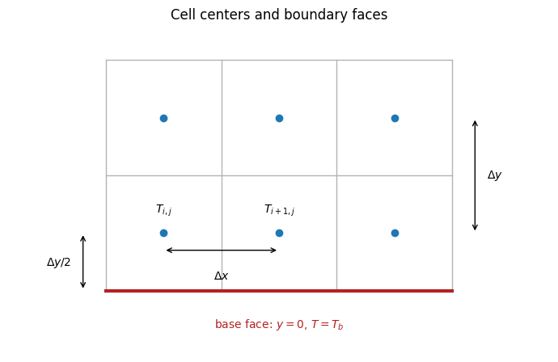

# 放熱の基礎 II：単一薄板の2次元温度場

:::{tip} 対応 Notebook
[12_stegosaurus_single_plate_2d.ipynb](../notebooks/12_stegosaurus_single_plate_2d.ipynb)
:::

:::{note} 学習経路での位置づけ
本章では，**1枚の長方形薄板**を使って，{abbr}`2次元温度場(平面上の各位置に温度が対応する分布)`の計算・可視化・検証を学ぶ．この検証を終えた後，[卒研ロードマップ](./13_stegosaurus_research_roadmap.md)で複数形状の比較へ進む．
:::

## この章の目的

[放熱の基礎 I](./11_stegosaurus_heat_basic.md)では，細長いフィンを1次元化して温度 $T(x)$ を求めた．本章では状態変数を $T(x,y)$ へ広げ，次をできるようにする．

1. 長方形薄板を2次元格子で表す．
2. 定常熱伝導と対流放熱の熱収支を立てる．
3. 温度場と{abbr}`局所放熱密度(表面の各位置から単位面積当たりに逃げる熱量)`を{abbr}`ヒートマップ(数値の大小を色で表した2次元図)`で表示する．
4. 総放熱量だけでなく，{abbr}`エネルギー収支(領域へ入る熱量と外へ出る熱量の釣合い)`と{abbr}`格子幅依存性(計算格子の細かさによって数値解が変化する性質)`を確認する．
5. コードがエラーなく動作することと，研究上妥当な比較ができることを区別する．

## 学習ガイド

| 学習内容 | 到達確認 |
| --- | --- |
| 1次元から2次元へ広げる理由 | $T(x)$ と $T(x,y)$ の違いを説明する |
| 単一長方形薄板の仮定 | 今回変えない条件を列挙する |
| 薄板方程式とセル熱収支 | 伝導・面対流・縁対流を区別する |
| 温度場と局所放熱密度の図 | 色，等温線，2つの図の違いを読む |
| 数値解の検証 | 解析解との誤差，熱収支，格子幅依存性を別々に確認する |
| $h$ 感度図を読む | 温度低下と放熱増加を同時に説明する |
| チェックポイント | 形状追加前の検証が十分か判断する |

本章では新しい形状を作らない．単一形状の計算を説明・検証できることが到達点である．

## 今回扱う単純な問題

高さ $L$，幅 $W$，厚さ $t$ の長方形薄板を考える．

- 材料の熱伝導率は一定 $k$．
- 根元全体を体温 $T_b$ に固定する．
- 前面・背面と外周から外気 $T_\mathrm{air}$ へ対流放熱する．
- 血流，放射，風向，厚さの変化はまだ入れない．
- 形は長方形1種類だけとする．

単純な形に限定する理由は，数値誤差，境界条件，形状差を一度に変えないためである．まず熱計算そのものを検証し，その後に形状を研究変数として加える．

座標は $-W/2<x<W/2$，$0<y<L$ とする．根元は $y=0$，先端は $y=L$ である．厚さ $t$ は長さの単位を持ち，この章では時間を表す記号ではない．また，根元を一定温度に保つ仮定は，必要な熱を体部が供給できるという境界条件である．血流量や体全体の熱収支を予測しているわけではない．

## 2次元薄板モデル

### 厚さ方向を平均する

厚さ方向の温度はほぼ一様と仮定する．前面と背面で同じ $h$ を使うとき，厚さの半分を代表距離とした $\mathrm{Bi}_t=h(t/2)/k\ll1$ がこの近似の目安になる．Notebookの基準値では $\mathrm{Bi}_t=0.0125$ である．厚さが小さいだけでなく，厚さ方向の温度差が小さいかを確認することが重要である．根元近傍や厚さが急変する形状では，この目安だけで3次元効果を無視できるとは限らない．

板面の微小面積 $dx\,dy$ を取り，厚さ全体で熱収支を考える．面内伝導による正味の流入は $kt\nabla_{xy}^2T\,dx\,dy$，前面・背面からの流出は $2h(T-T_\mathrm{air})dx\,dy$ である．定常状態で両者を等しくし，面積で割ると

```{math}
:label: eq-single-plate
kt\nabla_{xy}^2T-2h(T-T_\mathrm{air})=0,
\qquad
\nabla_{xy}^2T=\frac{\partial^2T}{\partial x^2}+\frac{\partial^2T}{\partial y^2}
```

を得る．$2h(T-T_\mathrm{air})$ は前面と背面の両方から逃げる熱を表す．前面・背面の対流は，厚さ平均を取った方程式では領域内部の熱損失項になる．外周の対流は次に述べる境界条件として別に与える．

両項の単位は $\mathrm{W/m^2}$ である．ここでの面積は板面上の面積であり，前面と背面を合わせた実表面積の半分に当たる．温度差は $\theta=T-T_\mathrm{air}$，ラプラシアンは $\nabla_{xy}^2T$ と書き分ける．

この定常解では，$T>T_\mathrm{air}$ の内部点で $\nabla_{xy}^2T=2h\theta/(kt)>0$ である．これは面内伝導の正味の流入が，前面・背面への放熱を補うことを意味する．内部に周囲より高い局所的な温度の山があれば，伝導と対流の両方で熱を失うので，内部発熱のない定常状態を保てない．10章で学んだ拡散による温度の平滑化と矛盾しない．

### 根元と外周の境界条件

根元 $\Gamma_b$ では

```{math}
:label: eq-single-base
T=T_b \qquad \text{on }\Gamma_b
```

とし，空気に触れる外周 $\Gamma_a$ では

```{math}
:label: eq-single-robin
-kt\frac{\partial T}{\partial n}=ht(T-T_\mathrm{air})
\qquad \text{on }\Gamma_a
```

とする．方程式，根元条件，外周条件の3つをそろえて初めて問題が定まる．

$n$ は板面内の外向き法線である．この境界式の両辺の単位は $\mathrm{W/m}$ であり，外周の単位長さ当たりの熱移動を表す．$t>0$ で割れば通常の対流境界式 $-k\partial_nT=h\theta$ になる．根元は体部との接触面なので，空気への外周放熱には数えない．


{abbr}`形状マスク(計算領域の内側と外側を格子ごとに区別する配列)`の内側だけに熱伝導方程式を置く．赤い根元は固定温度，空気に触れる側面と先端は対流境界であり，形状の外側は未知温度を解く領域ではない．

## 格子セルごとの熱収支

### セルの中心と物理境界を区別する

{abbr}`有限体積法(小領域ごとの保存則を離散化して未知量を求める数値計算法)`では，領域を重なりのないセルに分け，それぞれで熱収支を立てる．本章では温度の未知量をセル中心に置く．$n_x\times n_y$ 個のセルで長方形をちょうど覆い，$\Delta x=W/n_x$，$\Delta y=L/n_y$ とする．中心座標は

```{math}
x_i=-\frac W2+\left(i+\frac12\right)\Delta x,
\qquad
y_j=\left(j+\frac12\right)\Delta y
```

である．添字は $i=0,\ldots,n_x-1$，$j=0,\ldots,n_y-1$ とする．根元 $y=0$ は最下段セルの中心から $\Delta y/2$ 離れた面である．最下段のセル中心そのものを $T_b$ に固定すると，加熱境界の位置を板の内側へずらすことになる．

```python
dx_cell, dy_cell = width / nx, height / ny
x = -width / 2 + (np.arange(nx) + 0.5) * dx_cell
y = (np.arange(ny) + 0.5) * dy_cell
```

Notebookの引数 `dx` は希望する格子幅である．整数個のセルで幅と高さを覆うため，実際に使った `dx` と `dy` を計算結果に保存する．各セルの面積の和は，格子幅によらず $WL$ になる．



青い点が温度の未知量を置くセル中心，赤線が温度を固定する根元面である．根元への伝導を計算するときには，左側の矢印が示す $\Delta y/2$ を距離に使う．上段と下段の中心を結ぶ場合には，右側の矢印が示す $\Delta y$ を使う．

### 伝導と対流のコンダクタンス

熱移動を $G(T_i-T_j)$ と書いたとき，$G$ を{abbr}`熱コンダクタンス(温度差1 K当たりの熱移動率を表す係数)`と呼び，単位は $\mathrm{W/K}$ である．温度差を掛けると熱流率になる．隣接セル間では，Fourierの法則の伝熱面積を中心間距離で割って

```{math}
G_x=kt\frac{\Delta y}{\Delta x},\qquad
G_y=kt\frac{\Delta x}{\Delta y},\qquad
G_\mathrm{face}=2h\Delta x\Delta y
```

を得る．正方格子の場合だけ，隣接伝導は $G_x=G_y=kt$ に簡約される．根元面と最下段セル中心の距離は半格子幅なので，根元からの伝導は $G_b=2kt\Delta x/\Delta y$ である．

外周では，セル中心から境界面までの伝導と，境界面から外気への対流をつなぐ．境界辺の長さを $\ell$，中心から境界までの法線距離を $d$，境界温度を $T_s$ とすると

```{math}
\frac{kt\ell}{d}(T_i-T_s)=ht\ell(T_s-T_\mathrm{air})
```

である．$T_s$ を消去すると，セル中心から外気までの有効コンダクタンスは

```{math}
:label: eq-plate-edge-conductance
G_e=\frac{t\ell}{d/k+1/h}
=\frac{ht\ell}{1+hd/k},
\qquad
T_s-T_\mathrm{air}=\frac{T_i-T_\mathrm{air}}{1+hd/k}
```

となる．$h=0$ では $G_e=0$ とする．単純な $ht\ell$ は中心温度と境界温度の差を無視した近似であり，本章のコードでは半格子分の伝導抵抗も含める．左右の辺では $d=\Delta x/2$，先端では $d=\Delta y/2$ である．

### 連立方程式を組み立てる

過剰温度 $\theta_i=T_i-T_\mathrm{air}$ を未知量とする．セル $i$ の隣接セル集合を $N(i)$，空気に接する辺の集合を $E(i)$ とすると

```{math}
:label: eq-single-cell
\sum_{j\in N(i)}G_{ij}(\theta_i-\theta_j)
+G_\mathrm{face}\theta_i
+\sum_{e\in E(i)}G_e\theta_i
+G_{b,i}(\theta_i-\theta_b)=0
```

を立てる．根元に接するセルだけ $G_{b,i}=G_b$，それ以外は0とする．根元に接するセルにも前面・背面の放熱があるため，すべてのセルで熱収支を解く．

式をまとめると $A\boldsymbol\theta=\mathbf b$ になる．対角成分には熱コンダクタンスの合計，隣接セルの非対角成分には $-G_{ij}$，右辺には根元からの供給 $G_{b,i}\theta_b$ が入る．Notebookでは{abbr}`疎行列(成分の大部分が0である行列)`として保存して解く．

```python
# 下向きの辺が根元に接するときの処理である．
g_base = k_value * thickness_value * dx_cell / (dy_cell / 2)
diagonal += g_base
b[p] += g_base * (T_base - T_air)
# 隣接セルへは A[p, neighbor] = -g_cond を入れる．
```

各セルから外向きの熱流を正に取っているので，根元からの流入は左辺では負になる．この符号を確認すると，右辺が正になる理由も分かる．有限体積法の保存則とセル間流束の考え方は，[NISTのFiPy数値解説](https://pages.nist.gov/fipy/en/latest/numerical/discret.html)でも確認できる．

## 可視化で読むもの

Notebookでは2枚の図を並べる．

1. **温度場 $T(x,y)$**：根元からどこまで熱が届くかを見る．
2. **局所放熱密度**

```{math}
:label: eq-single-local-flux
q''(x,y)=2h(T(x,y)-T_\mathrm{air})
```

：板のどこから多く熱が逃げているかを見る．これは前面・背面を合わせた熱移動を，板面上の単位面積当たりで表した値である．片面の実表面積当たりの熱流束は $h\theta$ であり，外周の放熱はこのヒートマップには含まれない．

先端が低温でも，外気温より高ければ放熱に寄与する．先端まで熱が届く途中で周囲へ放熱した結果として温度が低くなるため，ヒートマップと総放熱量を組み合わせて読む．


### 図の読み方

左図の横軸は板の幅方向 $x$，縦軸は根元からの高さ $y$，色はセル中心の温度である．境界 $y=0$ は $T_b=40\,{}^\circ\mathrm{C}$ だが，最下段のセル中心は $y=\Delta y/2$ にあるため40度より少し低い．上へ進むほど外気温 $25\,{}^\circ\mathrm{C}$ に近づく．白線は同じ温度を結ぶ等温線である．等温線がほぼ水平であることから，この条件では高さ方向の変化が支配的だと読める．左右の縁にも対流があるので，幅方向に厳密に一様ではない．

右図は同じ温度場から計算した局所放熱密度 $q''$ である．根元付近は温度差 $T-T_\mathrm{air}$ が大きいため明るく，上部は暗い．右図は別のシミュレーションではなく，左図を式 {eq}`eq-single-local-flux` で変換したものである．

図の上部が暗いことだけを根拠に，その領域が不要であるとは結論できない．上部へ届く前に側面から熱が逃げた結果として冷えている．形状の有効性を判断するには，局所色だけでなく，全セルと外周を積分した $Q_\mathrm{out}$ が必要になる．

幅方向の変化が小さいことは，1次元近似を検討する手掛かりになる．ただし，図が1次元的に見えることと，1次元の解析解を再現したことは区別する．後述の検証では境界条件をそろえて解析解と比較する．

ヒートマップは，カラーバーの最小値と最大値，根元条件が正しく見えるか，等温線が境界で不自然に折れていないか，左右対称な条件で左右対称になっているか，の順に読む．形状間比較では必ず同じカラースケールを使う．各図が自動的に別の色範囲を使うと，小さな温度差も大きく見え，公平な比較にならない．

## 数値計算を検証する

### エネルギー収支

根元から流入する熱流率 $Q_\mathrm{base}$ と，表面・外周から流出する熱流率 $Q_\mathrm{out}$ を別々に計算する．連続モデルでは，板面領域を $\Omega$，面積要素を $dA$，境界に沿う長さ要素を $ds$ として

```{math}
Q_\mathrm{base}=\int_{\Gamma_b}kt\,\partial_nT\,ds,
\qquad
Q_\mathrm{out}=\int_\Omega2h\theta\,dA
+\int_{\Gamma_a}ht\theta\,ds
```

である．根元の法線も外向きに取るため，流入を正とする $Q_\mathrm{base}$ の符号は外向き流出 $-kt\partial_nT$ と逆になる．定常方程式を領域全体で積分すれば，両者が等しいと分かる．

離散モデルでは，組立てに使った同じコンダクタンスから

```{math}
Q_\mathrm{base}=\sum_{i\text{：根元に接するセル}}G_b(\theta_b-\theta_i),
\qquad
Q_\mathrm{out}=\sum_iG_\mathrm{face}\theta_i
+\sum_i\sum_{e\in E(i)}G_e\theta_i
```

と計算する．内部のセル間熱流は，隣り合う2つのセルを足すと相殺されるので

```{math}
Q_\mathrm{base}\approx Q_\mathrm{out}
```

となるはずである．差が大きい場合は，境界辺の数え方，符号，線形方程式の解法を確認する．

収支誤差は，たとえば

```{math}
\varepsilon_Q=
\frac{|Q_\mathrm{base}-Q_\mathrm{out}|}
{\max(|Q_\mathrm{base}|,|Q_\mathrm{out}|)}
```

と無次元化して記録する．両方の熱流が0となる場合にはこの比は定義できないので，絶対差を使う．

保存則に整合した離散化では，粗い格子でも収支誤差が丸め誤差程度になることがある．これは熱収支の実装が整合する証拠であり，連続問題の解に近いという保証ではない．格子を細かくしたときに収支誤差が単調に減ることを要求せず，次の解析解比較と格子幅依存性を別に確認する．

### 1次元の解析解を再現する

検証用に左右の縁と先端を断熱し，前面・背面の対流と根元固定温度だけを残す．この条件では幅方向に一様な解が成立し，

```{math}
\theta(y)=\theta_b\frac{\cosh(\mu(L-y))}{\cosh(\mu L)},
\qquad \mu^2=\frac{2h}{kt},
\qquad Q_\mathrm{exact}=ktW\mu\theta_b\tanh(\mu L)
```

となる．11章の式の $A_c=Wt$，$P=2W$ に相当する．ここで $P=2(W+t)$ を使うと，断熱した左右の縁からの放熱まで含めることになる．元の全外周対流の計算とは境界条件が異なるため，この検証を終えたら元に戻す．

Notebookでは `h_side=0.0, h_tip=0.0` を指定し，セル中心での温度誤差と $Q_\mathrm{out}$ の解析値に対する誤差を表にする．格子幅を半分にしたとき両方の誤差がおおむね1/4になるかを確認する．

### 温度の範囲と解の一意性

内部発熱がなく，$T_b>T_\mathrm{air}$，$k,t>0$，$h\ge0$ なら，温度は $T_\mathrm{air}\le T\le T_b$ の範囲にある．この範囲から大きく外れた解は，境界条件や符号の誤りを疑う．左右対称性，全対流を0にしたときの一様温度 $T=T_b$ も有効な確認になる．

````{dropdown} 同じ境界条件の定常解が一意になる理由
2つの解の差を $w$ とすると，根元では $w=0$，外周では $kt\partial_nw=-htw$ である．方程式に $w$ を掛けて領域全体で積分し，部分積分すると

```{math}
kt\int_\Omega|\nabla w|^2\,dA
+2h\int_\Omega w^2\,dA
+ht\int_{\Gamma_a}w^2\,ds=0
```

を得る．各項は非負なので，少なくとも $\nabla w=0$ であり，$w$ は一定である．領域が根元につながっていて根元で $w=0$ なので $w=0$ となり，解は一意である．この性質があるため，十分に細かくした数値解どうしを同じ定常解への近似として比較できる．
````

### 格子幅依存性

$\Delta x$ と $\Delta y$ を同時に小さくし，少なくとも3段階の格子で総放熱量や代表点温度が一定値へ近づくか確認する．最も細かい格子の値を $Q_\mathrm{ref}$ とすると，$|Q-Q_\mathrm{ref}|/|Q_\mathrm{ref}|$ は基準格子との差であり，厳密解に対する誤差ではない．表の列名もそのように区別する．

格子が細かくなると最上段セルの位置も先端へ近づく．同じ物理点の温度を比較するには，式 {eq}`eq-plate-edge-conductance` で先端境界温度を復元し，幅方向は $x=0$ に補間する．単に最上段セルを先端温度と呼ぶと，近似誤差と測定位置の移動を混同する．

格子幅を半分にすると，縦横のセル数はそれぞれ約2倍，総セル数は約4倍になる．計算時間とメモリも増えるため，最も細かい格子だけを採用するのではなく，結論が変わらない範囲で十分に細かい格子を選ぶ．代表点温度だけでなく，形状面積と総放熱量も同時に収束するか確認する．

### パラメータを1つずつ変える

まず $h$ だけを変え，次に $k$，$t$ を変える．一度に複数を変えると，どの要因で図が変わったか説明できない．


横軸は高さ，縦軸は板中央線の温度である．セル中心の温度に加えて根元境界値と復元した先端温度を描いているので，すべての曲線は根元の $40\,{}^\circ\mathrm{C}$ から始まる．$h$ が大きい曲線ほど板内の温度は低いが，凡例の総放熱量 $Q$ は $h=10,25,50$ の順に増えている．

板の温度が低いことは，総放熱量が小さいことを意味しない．根元温度を固定しているので，$h$ を大きくすると根元からの供給熱も変わる．ただし，局所値 $q''=2h\theta$ が板のすべての場所で増えるとは限らない．$h$ の増加と $\theta$ の低下が競合するため，位置ごとに積を計算して調べる必要がある．

曲線比較では一度に $h$ だけを変えている．もし $k$ や厚さも同時に変えれば，曲線差の原因を特定できない．凡例に変更パラメータと結果指標を併記する習慣をつける．

## 卒業研究で発展させる内容

- 三角板，台形板，楕円に基づく板などの平面輪郭の定義
- 厚さと板面積を固定した比較など，制約の明確化
- 形状による放熱量の差と数値誤差の比較
- 形状パラメータを変えたときの放熱量の傾向
- 基礎比較を完成させた後の血流や化石形態データの導入

厚みのあるトゲの3次元形状は，一定厚さの薄板とは近似が異なる．まず薄板モデルに共通して収まる形状を比較する．また，斜めの輪郭を格子で階段状に表すと，外周長の数え方に偏りが生じる．この問題への対処を13章で確認してから形状を増やす．

上の項目は，[卒研ロードマップ](./13_stegosaurus_research_roadmap.md)の順序に沿って1つずつ追加し，その都度，計算条件と検証結果を研究ノートへ残す．

## チェックポイント

次の項目を満たしてから卒研ロードマップへ進む．

- [ ] 各項の単位を説明できる．
- [ ] 根元条件と対流境界条件をコードの該当箇所と対応づけられる．
- [ ] セル中心，根元面，先端面の位置と半格子幅の距離を説明できる．
- [ ] 温度場と局所放熱密度の違いを説明できる．
- [ ] $Q_\mathrm{base}$ と $Q_\mathrm{out}$ の相対誤差を確認した．
- [ ] 縁と先端を断熱した条件で，1次元解析解と放熱量を再現した．
- [ ] 温度範囲と左右対称性を確認した．
- [ ] 格子幅を変えて総放熱量の収束を確認した．
- [ ] $h$ を変えたときの温度場の変化を物理的に説明できる．

## 演習問題

1. $k$ を大きくすると先端温度はどう変わると予想するか．計算前に理由を書き，Notebookで確認せよ．
2. $h$ を2倍にした場合，局所放熱密度と板温度は同じ向きに変化するか．式 {eq}`eq-single-local-flux` を使って考察せよ．
3. 格子幅を $0.01$, $0.005$, $0.0025$ m と変え，$Q_\mathrm{out}$ の相対変化を表にせよ．
4. 根元の一部だけを $T_b$ に固定すると温度場はどう変わるか．これは形状比較を始める前に決めるべき条件か説明せよ．
5. 収支誤差が $10^{-12}$ でも，格子を細かくすると $Q_\mathrm{out}$ が2%変わった．この計算をどのように評価するか．

````{dropdown} 解答例
1. 同じ根元温度なら熱が先端まで伝わりやすくなり，先端温度は上がると予想できる．$k$ 以外を固定し，先端境界での復元温度を比較する．
2. $h$ を増すと板内部の温度差は小さくなるが，$q''$ は $h$ と温度差の積である．根元面では温度が固定されるので局所密度は $h$ に比例する．根元から離れた点では温度低下が強く，局所密度が減る場合もある．総放熱量と局所密度の変化を分けて調べる．
3. 各格子で実際の $\Delta x,\Delta y$，面積，$Q_\mathrm{out}$ を記録する．最細格子との差を相対値で表示するが，それを真の誤差と呼ばない．解析解が使える断熱外周の条件では，解析値に対する誤差も別に計算できる．
4. 加熱部分へ熱の流れが集中し，幅方向の温度差が生じる．残りの根元部分を断熱するか空気に接する対流面とするかも指定する必要がある．根元幅は熱供給条件を変えるので，比較前に決めておく．Notebookの部分加熱では，固定しない部分を空気に接する面として扱う．
5. 離散系の熱収支は十分に合っているが，連続問題への近似には格子幅依存性が残っている．2%より小さい形状差を論じるには，さらに格子を細かくして変化量を確認する必要がある．
````

## 次に進む

[卒研ロードマップ：形状比較を研究にする](./13_stegosaurus_research_roadmap.md)へ進み，長方形コードを出発点として形状を1つずつ追加し，比較条件と評価指標を具体化する．

## 参考文献・キーワード

- Incropera & DeWitt {cite}`incropera2007heat`
- キーワード：2次元定常熱伝導，薄板近似，対流境界条件，有限体積法，温度場，局所放熱密度，エネルギー収支，格子収束
