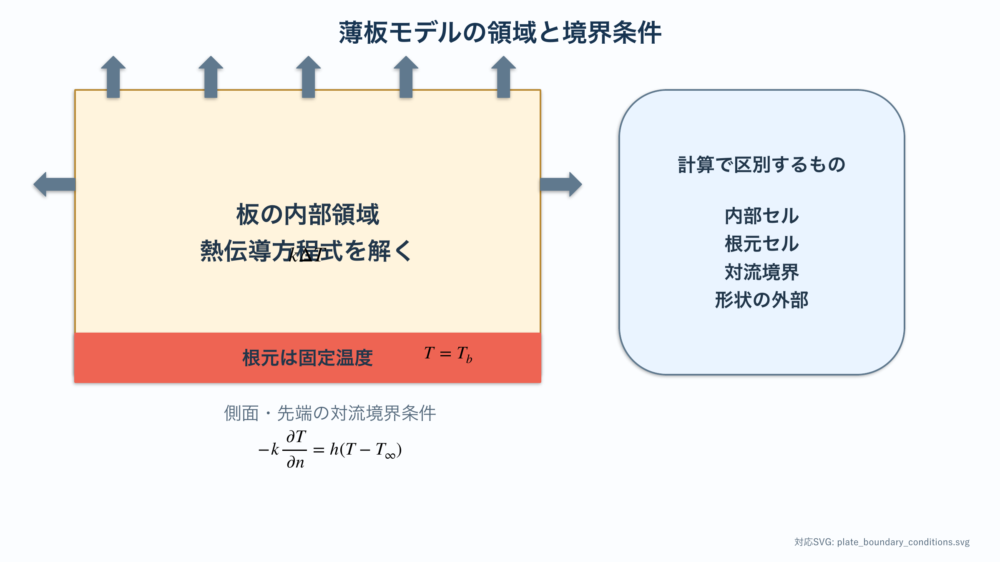
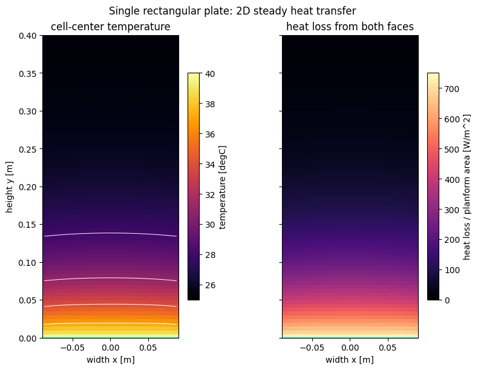
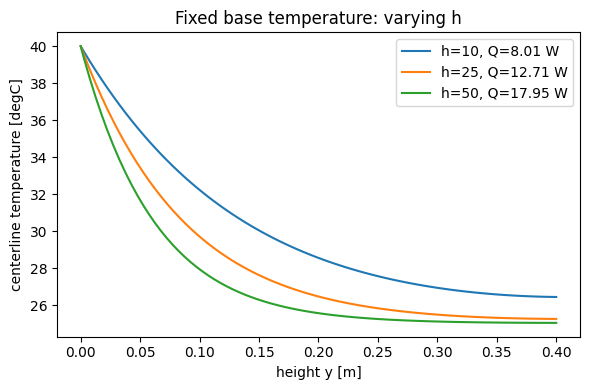

# 放熱の基礎 II：単一薄板の2次元温度場

:::{tip} 対応 Notebook
[12_stegosaurus_single_plate_2d.ipynb](../notebooks/12_stegosaurus_single_plate_2d.ipynb)
:::

:::{note} 学習経路での位置づけ
本章では，**1枚の長方形薄板**を使って，{abbr}`2次元温度場(平面上の各位置に温度が対応する分布)`の計算・可視化・検証を学ぶ．この検証を終えた後，[卒研ロードマップ](./13_stegosaurus_research_roadmap.md)で複数形状の比較へ進む．
:::

## この章の目的

[放熱の基礎 I](./11_stegosaurus_heat_basic.md)では，細長いフィンを1次元化して温度 $T(x)$ を求めた．本章では状態変数を $T(x,y)$ へ広げ，次をできるようにする．

1. 長方形薄板を2次元格子で表す．
2. 定常熱伝導と対流放熱の熱収支を立てる．
3. 温度場と{abbr}`局所放熱密度(表面の各位置から単位面積当たりに逃げる熱量)`を{abbr}`ヒートマップ(数値の大小を色で表した2次元図)`で表示する．
4. 総放熱量だけでなく，{abbr}`エネルギー収支(領域へ入る熱量と外へ出る熱量の釣合い)`と{abbr}`格子幅依存性(計算格子の細かさによって数値解が変化する性質)`を確認する．
5. コードがエラーなく動作することと，研究上妥当な比較ができることを区別する．

## 学習ガイド

| 学習内容 | 到達確認 |
| --- | --- |
| 1次元から2次元へ広げる理由 | $T(x)$ と $T(x,y)$ の違いを説明する |
| 単一長方形薄板の仮定 | 今回変えない条件を列挙する |
| 薄板方程式とセル熱収支 | 伝導・面対流・縁対流を区別する |
| 温度場と局所放熱密度の図 | 色，等温線，2つの図の違いを読む |
| エネルギー収支と格子収束 | $Q_\mathrm{base}$ と $Q_\mathrm{out}$ を照合する |
| $h$ 感度図を読む | 温度低下と放熱増加を同時に説明する |
| チェックポイント | 形状追加前の検証が十分か判断する |

本章では新しい形状を作らない．単一形状の計算を説明・検証できることが到達点である．

## 今回扱う単純な問題

高さ $L$，幅 $W$，厚さ $t$ の長方形薄板を考える．

- 材料の熱伝導率は一定 $k$．
- 根元全体を体温 $T_b$ に固定する．
- 前面・背面と外周から外気 $T_\mathrm{air}$ へ対流放熱する．
- 血流，放射，風向，厚さの変化はまだ入れない．
- 形は長方形1種類だけとする．

単純な形に限定する理由は，数値誤差，境界条件，形状差を一度に変えないためである．まず熱計算そのものを検証し，その後に形状を研究変数として加える．

## 2次元薄板モデル

厚さ方向の温度は一様と仮定する．板内部の定常温度場は

```{math}
:label: eq-single-plate
kt\Delta T-2h(T-T_\mathrm{air})=0
```

で近似する．$2h(T-T_\mathrm{air})$ は前面と背面の両方から逃げる熱を表す．

根元 $\Gamma_b$ では

```{math}
:label: eq-single-base
T=T_b \qquad \text{on }\Gamma_b
```

とし，空気に触れる外周 $\Gamma_a$ では

```{math}
:label: eq-single-robin
-kt\frac{\partial T}{\partial n}=ht(T-T_\mathrm{air})
\qquad \text{on }\Gamma_a
```

とする．方程式，根元条件，外周条件の3つをそろえて初めて問題が定まる．



{abbr}`形状マスク(計算領域の内側と外側を格子ごとに区別する配列)`の内側だけに熱伝導方程式を置く．赤い根元は固定温度，空気に触れる側面と先端は対流境界であり，形状の外側は未知温度を解く領域ではない．

## 格子セルごとの熱収支

板を一辺 $\Delta x$ の正方格子へ分割する．根元以外のセル $i$ について

```{math}
:label: eq-single-cell
\sum_{j\in N(i)}G_\mathrm{cond}(T_i-T_j)
+G_\mathrm{conv}(T_i-T_\mathrm{air})=0
```

を立てる．$N(i)$ は上下左右の隣接セルである．

- 隣接セルとの伝導：$G_\mathrm{cond}=kt$
- 前面・背面の対流：$G_\mathrm{face}=2h(\Delta x)^2$
- 外周辺の対流：$G_\mathrm{edge}=ht\Delta x$

全セルの式をまとめると連立一次方程式 $A\mathbf{T}=\mathbf{b}$ になる．Notebookでは{abbr}`疎行列(成分の大部分が0である行列)`として解く．

## 可視化で読むもの

Notebookでは2枚の図を並べる．

1. **温度場 $T(x,y)$**：根元からどこまで熱が届くかを見る．
2. **局所放熱密度**

```{math}
:label: eq-single-local-flux
q''(x,y)=2h(T(x,y)-T_\mathrm{air})
```

：板のどこから多く熱が逃げているかを見る．

温度が低い先端も放熱へ寄与している可能性がある．根元から先端へ届く途中ですでに熱が逃げた結果でもあるため，ヒートマップと総放熱量を組み合わせて読む．



### 図の読み方

左図の横軸は板の幅方向 $x$，縦軸は根元からの高さ $y$，色は温度である．最下部は $T_b=40\,{}^\circ\mathrm{C}$ に固定され，上へ進むほど外気温 $25\,{}^\circ\mathrm{C}$ に近づく．白線は同じ温度を結ぶ等温線である．等温線がほぼ水平であることから，この長方形・一様条件では幅方向より高さ方向の変化が支配的だと読める．

右図は同じ温度場から計算した局所放熱密度 $q''$ である．根元付近は温度差 $T-T_\mathrm{air}$ が大きいため明るく，上部は暗い．右図は別のシミュレーションではなく，左図を式 {eq}`eq-single-local-flux` で変換したものである．

図の上部が暗いことだけを根拠に，その領域が不要であるとは結論できない．上部へ届く前に側面から熱が逃げた結果として冷えている．形状の有効性を判断するには，局所色だけでなく，全セルと外周を積分した $Q_\mathrm{out}$ が必要になる．

また，幅方向に完全に一様に近い結果は，2次元計算が無意味ということではない．既知の1次元的な極限を再現できているため，今後形状を変えたときの基準になる．

## 数値計算を検証する

### エネルギー収支

根元から流入する熱量 $Q_\mathrm{base}$ と，表面・外周から流出する熱量 $Q_\mathrm{out}$ を別々に計算する．定常状態なら

```{math}
Q_\mathrm{base}\approx Q_\mathrm{out}
```

となるはずである．差が大きい場合は，境界セルの数え方や単位を疑う．

### 格子幅依存性

$\Delta x$ を小さくしたとき，総放熱量や代表点温度が一定値へ近づくか確認する．細かい格子の結果が正解とは限らないが，値が収束しなければ形状比較へ進めない．

### パラメータを1つずつ変える

まず $h$ だけを変え，次に $k$，$t$ を変える．一度に複数を変えると，どの要因で図が変わったか説明できない．



横軸は高さ，縦軸は板中央線の温度である．すべての曲線は根元の $40\,{}^\circ\mathrm{C}$ から始まる．$h$ が大きい緑線ほど急速に冷え，先端温度は外気温へ近づく．一方，凡例の総放熱量 $Q$ は $h=10,25,50$ の順に増えている．

板の温度が低いことは，放熱量が小さいことを意味しない．$h$ が大きいと熱を強く奪うため板温度は低くなるが，単位時間に外へ移る熱量は増える．この一見逆向きの変化を説明できることが，温度図と放熱量を併記する理由である．

曲線比較では一度に $h$ だけを変えている．もし $k$ や厚さも同時に変えれば，曲線差の原因を特定できない．凡例に変更パラメータと結果指標を併記する習慣をつける．

## 卒業研究で発展させる内容

- トゲ，偏平トゲ，三角板，楕円板の形状定義
- 同体積・同高さ・同投影面積での正規化
- 形状ごとの放熱量ランキング
- 最も放熱に有利な形状の探索
- 血流や化石形態データの導入

上の項目は，[卒研ロードマップ](./13_stegosaurus_research_roadmap.md)の順序に沿って1つずつ追加し，その都度，計算条件と検証結果を研究ノートへ残す．

## チェックポイント

次の項目を満たしてから卒研ロードマップへ進む．

- [ ] 各項の単位を説明できる．
- [ ] 根元条件と対流境界条件をコードの該当箇所と対応づけられる．
- [ ] 温度場と局所放熱密度の違いを説明できる．
- [ ] $Q_\mathrm{base}$ と $Q_\mathrm{out}$ の相対誤差を確認した．
- [ ] 格子幅を変えて総放熱量の収束を確認した．
- [ ] $h$ を変えたときの温度場の変化を物理的に説明できる．

## 演習問題

1. $k$ を大きくすると先端温度はどう変わると予想するか．計算前に理由を書き，Notebookで確認せよ．
2. $h$ を2倍にした場合，局所放熱密度と板温度は同じ向きに変化するか．式 {eq}`eq-single-local-flux` を使って考察せよ．
3. 格子幅を $0.01$, $0.005$, $0.0025$ m と変え，$Q_\mathrm{out}$ の相対変化を表にせよ．
4. 根元の一部だけを $T_b$ に固定すると温度場はどう変わるか．これは形状比較を始める前に決めるべき条件か説明せよ．

## 次に進む

[卒研ロードマップ：形状比較を研究にする](./13_stegosaurus_research_roadmap.md)へ進み，長方形コードを出発点として形状を1つずつ追加し，比較条件と評価指標を具体化する．

## 参考文献・キーワード

- Incropera & DeWitt {cite}`incropera2007heat`
- キーワード：2次元定常熱伝導，薄板近似，対流境界条件，有限体積法，温度場，局所放熱密度，エネルギー収支，格子収束
