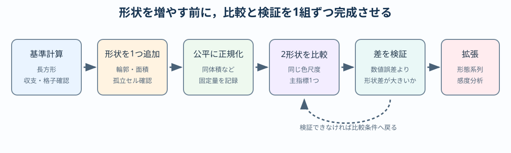

# 卒研ロードマップ：形状比較を研究にする

:::{important} この章の役割
ここから先は学生自身の研究である．本章は作業順序と確認点を示すが，各形状の完成コード，放熱量の順位，最適形状は示さない．
:::

## このロードマップの使い方

この章は順番どおり一度に終える課題ではない．研究の進み具合に応じて該当する段階を参照し，通過条件を満たしたら次へ進む．迷った場合は直前の段階へ戻り，次の記録を研究ノートに残す．

- 固定する量，変える量，測る量
- 基準版が正しく動くと判断した根拠
- 形状定義と公平な比較条件
- 主評価指標の式・単位・意味
- うまく進まない場合に縮小する範囲



## 研究の候補となる問い

最初に問いを1つへ絞る．例をそのまま採用せず，対象・比較条件・評価指標を自分で具体化する．

```text
剣竜類の皮骨構造に見られる形状差は，一定の比較条件のもとで
温度分布と放熱指標にどのような違いを生むか．
```

「どの形が最も優れているか」から始めると，比較条件が曖昧になる．まず「何を同じにして，何がどう変わるか」と書く．

## 段階1：基準計算を凍結する

[単一薄板のNotebook](../notebooks/12_stegosaurus_single_plate_2d.ipynb)を複製し，研究用Notebookを作る．

- 物理パラメータと単位を表にする．
- 基準格子幅を決める．
- エネルギー収支誤差を記録する．
- 代表点温度と総放熱量を保存する．
- この時点のコードを「基準版」として残す．

**通過条件**：形状を変えなくても，同じ設定で同じ結果を再現できる．

## 段階2：形状を1つだけ追加する

最初から4形状を作らない．候補から1つを選び，輪郭を数式または座標データで定義する．

確認すること：

- 高さ，幅，面積，厚さは意図した値か．
- 根元は体部と連結しているか．
- 格子を細かくしても輪郭の面積が収束するか．
- 形状マスクに穴や孤立セルがないか．
- 長方形との違いが形状以外の条件変更によるものではないか．

**研究ノートに残すもの**：輪郭だけの図，幾何量の表，形状定義の式．

## 段階3：比較条件を1つ決める

次の条件を同時には扱わず，最初の主解析を1つ選ぶ．

- 同じ高さ
- 同じ体積
- 同じ投影面積
- 同じ根元幅

選んだ条件について「なぜこの条件が研究上妥当か」を書く．別の条件は感度分析として後から追加する．

**通過条件**：形状を正規化する前後の幾何量を表にし，固定した量が数値的に一致している．

## 段階4：2形状だけを比較する

最初の比較は2形状，1つのパラメータ設定，1つの評価指標に限定する．

1. 両形状の温度場を同じカラースケールで描く．
2. エネルギー収支と格子収束を形状ごとに確認する．
3. 総放熱量を比較する．
4. 差が生じた場所を等温線と局所放熱密度から説明する．
5. 形状格子の粗さだけで順位が変わらないか調べる．

この段階で差が小さくても失敗ではない．「この条件では明瞭な差がない」という結果になりうる．

## 段階5：評価指標を増やす

総放熱量だけを確認した後，研究の問いに応じて指標を追加する．

```{math}
E_V=\frac{Q_\mathrm{out}}{V},
\qquad
E_A=\frac{Q_\mathrm{out}}{A}
```

候補：

- 体積あたり放熱量 $E_V$
- 表面積あたり放熱量 $E_A$
- 形状内平均温度
- 指定温度以上の領域割合
- 根元から特定等温線までの距離

指標を増やすたびに，何を意味し，なぜ必要かを書く．

## 段階6：形態系列へ広げる

2形状のコードが検証できてから，形状を追加する．離散的な名称だけでなく，連続パラメータ $s$ により輪郭を変形する方法も検討する．

```text
s = 0 ─────────────── s = 1
形状A                  形状B
```

この段階の研究課題は，輪郭関数，正規化方法，格子依存性を学生自身が決めることである．

## 段階7：感度分析

形状比較が1条件で完了してから，1回に1パラメータだけを変える．

- 熱伝導率 $k$
- 対流熱伝達率 $h$
- 厚さ $t$
- 根元温度 $T_b$
- 根元幅

順位だけでなく，結論が変わる境界や，ほとんど差がない領域を探す．

## 段階8：生物学的妥当性を検討する

- 実際の形態をどの資料から取得するか．
- 左右方向・前後方向の厚さを無視してよいか．
- 血管痕を熱供給の証拠としてどこまで解釈できるか．
- 放熱以外の機能仮説と両立するか．
- 現生動物や工学フィンの比較対象を使えるか．

モデルの計算結果と，背板の進化的機能の断定を分ける．

## 最小限の卒論図候補

完成図そのものではなく，必要な図の役割だけを決める．

1. 形状と比較条件を示す図
2. 同一スケールの温度場
3. 格子収束またはエネルギー収支
4. 主評価指標の形状比較
5. 主要パラメータの感度分析

## 研究メモのテンプレート

```text
問い：
基準形状：
追加する最初の形状：
固定する物理量：
固定する幾何量：
主評価指標（式・単位）：
数値検証：
最初に作る図：
最大のリスク：
縮小した場合の問い：
```

研究中に何度書き換えてもよい．空欄が計算条件へ影響する場合は，コードを書く前に仮の方針と未決定である理由を記録する．
