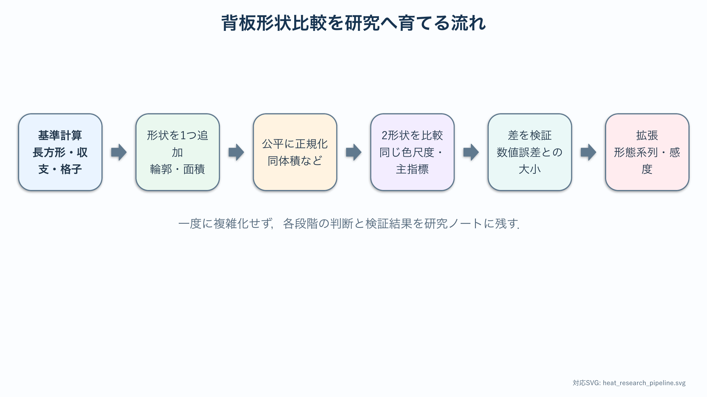

# 卒研ロードマップ：形状比較を研究にする

:::{important} この章の役割
単一薄板モデルを出発点として，形状の定義，公平な比較条件，評価指標を順に具体化する．各段階の通過条件を確認しながら，形状比較を再現可能な研究へ発展させる．
:::

## このロードマップの使い方

この章は順番どおり一度に終える課題ではない．研究の進み具合に応じて該当する段階を参照し，通過条件を満たしたら次へ進む．迷った場合は直前の段階へ戻り，次の記録を研究ノートに残す．

- 固定する量，変える量，測る量
- {abbr}`基準版(比較の出発点として設定を固定したモデルやコード)`が正しく動くと判断した根拠
- 形状定義と公平な比較条件
- 主評価指標の式・単位・意味
- うまく進まない場合に縮小する範囲



各段階では，入力，処理，出力を1組として記録する．入力は形状と物理パラメータ，処理は格子化と境界条件，出力は温度場と評価指標である．結果が変わったとき，この3項目のどこを変更したかが分かれば，原因を追跡できる．Notebookのファイル名だけでなく，設定表と図の作成日も残す．

研究を進める基準は，図がきれいに見えることではない．同じ設定で再計算できること，数値誤差が形状差より十分小さいこと，選んだ評価指標が問いに対応することの3点を確認する．どれかが満たされなければ，次の形状を増やす前に直前の段階へ戻る．

## 研究の候補となる問い

最初に問いを1つへ絞る．例をそのまま採用せず，対象・比較条件・評価指標を自分で具体化する．

```text
剣竜類の皮骨構造に見られる形状差は，一定の比較条件のもとで
温度分布と放熱指標にどのような違いを生むか．
```

形状の優劣だけを問うと，比較条件が曖昧になる．まず，固定する量，変更する量，評価する量を明記する．

## 段階1：基準計算を凍結する

[単一薄板のNotebook](../notebooks/12_stegosaurus_single_plate_2d.ipynb)を複製し，研究用Notebookを作る．

- 物理パラメータと単位を表にする．
- 基準格子幅を決める．
- エネルギー収支誤差を記録する．
- 代表点温度と総放熱量を保存する．
- この時点のコードを基準版として残す．

**通過条件**：形状を変えなくても，同じ設定で同じ結果を再現できる．

## 段階2：形状を1つだけ追加する

最初から4形状を作らない．候補から1つを選び，輪郭を数式または座標データで定義する．

確認すること：

- 高さ，幅，面積，厚さは意図した値か．
- 根元は体部と連結しているか．
- 格子を細かくしても輪郭の面積が収束するか．
- 形状マスクに穴や孤立セルがないか．
- 長方形との違いが形状以外の条件変更によるものではないか．

**研究ノートに残すもの**：輪郭だけの図，幾何量の表，形状定義の式．

## 段階3：比較条件を1つ決める

次の条件を同時には扱わず，最初の主解析を1つ選ぶ．

- 同じ高さ
- 同じ体積
- 同じ投影面積
- 同じ根元幅

選んだ条件が研究上妥当である理由を書く．別の条件は{abbr}`感度分析(設定値を変えたとき結果がどの程度変化するか調べる分析)`として後から追加する．

同じ高さでそろえると背板が到達する距離を比較できるが，体積や表面積は異なる．同じ体積でそろえると材料量を公平にできるが，高さが変わる可能性がある．正規化条件は単なる計算上の都合ではなく，どの生物学的・工学的問いに答えるかを決める．主解析では1条件を選び，別条件で順位が変わるかを感度分析として調べる．

**通過条件**：形状を{abbr}`正規化(比較のために高さや体積など所定の基準へそろえる操作)`する前後の幾何量を表にし，固定した量が数値的に一致している．

## 段階4：2形状だけを比較する

最初の比較は2形状，1つのパラメータ設定，1つの評価指標に限定する．

1. 両形状の温度場を同じカラースケールで描く．
2. エネルギー収支と格子収束を形状ごとに確認する．
3. 総放熱量を比較する．
4. 差が生じた場所を等温線と局所放熱密度から説明する．
5. 形状格子の粗さだけで順位が変わらないか調べる．

この段階で差が小さくても失敗ではない．対象とした条件では明瞭な差を検出できなかったという結果になりうる．

差の大きさは，格子収束時の変化量やエネルギー収支誤差と比較する．形状間差が1%でも，格子幅を変えると3%動くなら順位を解釈できない．反対に，数値誤差が0.1%以下で形状差が5%なら，差を形状効果として検討しやすい．誤差と効果を同じ表に並べる．

## 段階5：評価指標を増やす

総放熱量だけを確認した後，研究の問いに応じて指標を追加する．

```{math}
E_V=\frac{Q_\mathrm{out}}{V},
\qquad
E_A=\frac{Q_\mathrm{out}}{A}
```

候補：

- 体積あたり放熱量 $E_V$
- 表面積あたり放熱量 $E_A$
- 形状内平均温度
- 指定温度以上の領域割合
- 根元から特定等温線までの距離

指標を増やすたびに，何を意味し，なぜ必要かを書く．

## 段階6：形態系列へ広げる

2形状のコードが検証できてから，形状を追加する．離散的な名称だけでなく，連続パラメータ $s$ により輪郭を変形する方法も検討する．

```text
s = 0 ─────────────── s = 1
形状A                  形状B
```

この段階では，研究の問いに合わせて輪郭関数と正規化方法を定め，格子依存性を検証する．

## 段階7：感度分析

形状比較が1条件で完了してから，1回に1パラメータだけを変える．

- 熱伝導率 $k$
- 対流熱伝達率 $h$
- 厚さ $t$
- 根元温度 $T_b$
- 根元幅

順位だけでなく，結論が変わる境界や，ほとんど差がない領域を探す．

## 段階8：生物学的妥当性を検討する

- 実際の形態をどの資料から取得するか．
- 左右方向・前後方向の厚さを無視してよいか．
- 血管痕を熱供給の証拠としてどこまで解釈できるか．
- 放熱以外の機能仮説と両立するか．
- 現生動物や工学フィンの比較対象を使えるか．

モデルの計算結果と，背板の進化的機能の断定を分ける．

## 最小限の卒論図候補

完成図そのものではなく，必要な図の役割だけを決める．

1. 形状と比較条件を示す図
2. 同一スケールの温度場
3. 格子収束またはエネルギー収支
4. 主評価指標の形状比較
5. 主要パラメータの感度分析

## 研究メモのテンプレート

```text
問い：
基準形状：
追加する最初の形状：
固定する物理量：
固定する幾何量：
主評価指標（式・単位）：
数値検証：
最初に作る図：
最大のリスク：
縮小した場合の問い：
```

研究中に何度書き換えてもよい．空欄が計算条件へ影響する場合は，コードを書く前に仮の方針と未決定である理由を記録する．

計算負荷や形状データの不足で進まない場合は，2形状，同じ高さ，総放熱量1指標まで縮小する．この最小構成でも，形状定義，数値検証，公平な比較，結果解釈がそろえば研究として検討できる．縮小した項目と，将来追加できる項目を分けて記録する．
