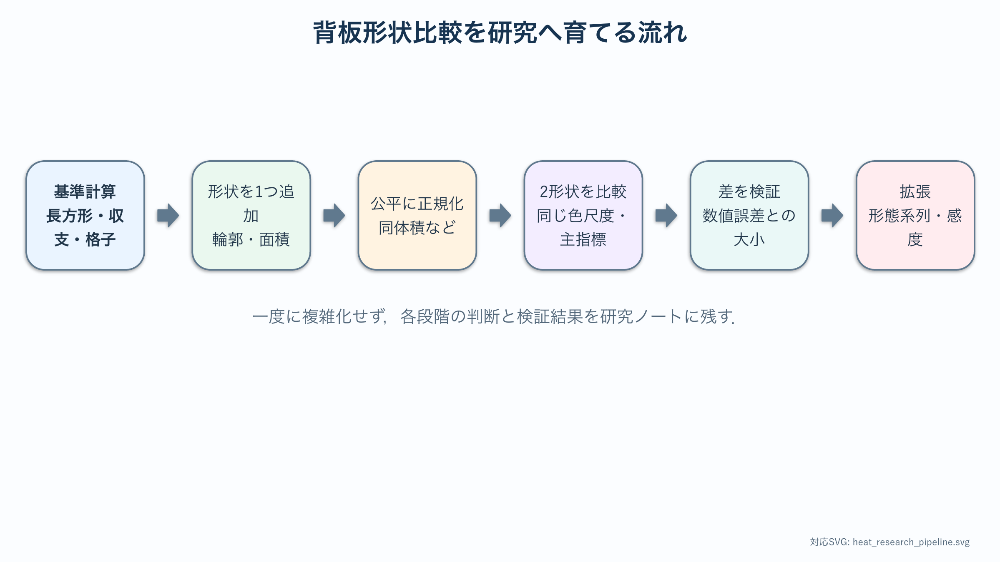
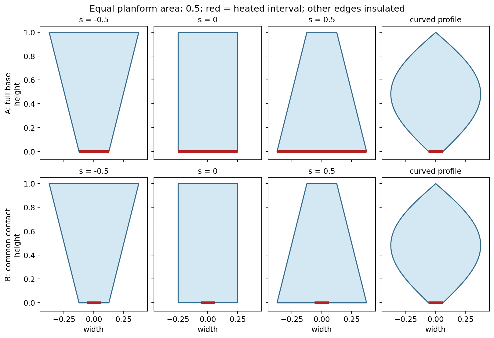

# 卒研ロードマップ：形状比較を研究にする

:::{important} この章の役割
[11章](./11_stegosaurus_heat_basic.md)の熱収支と近似理論，[12章](./12_stegosaurus_heat_shape.md)の数値解法を使い，形状比較を自分で設計・実装・検証する．問いを絞る，輪郭を作る，熱供給条件をそろえる，小さな計算を検証する，条件を広げる，理論で考察する，という順に進む．
:::

## 研究成果へ到達するための学習経路

`research/1_stegosaurus` には，形状比較の研究レポート，計算コード，CSV，図がある．これらを再現・検討するために必要な学習事項を，以下の順序に分ける．最初からすべての計算を走らせる必要はない．各段階で自分の成果を保存し，次の段階の入力にする．

| 段階 | 学ぶ内容 | 自分で作る成果 | 主な参照先 |
| --- | --- | --- | --- |
| 基準解 | 熱収支，境界条件，無次元化 | 長方形の解析解と誤差表 | 11章，12章前半 |
| 比較の設計 | 固定量と熱供給条件 | 問い・条件A/B・主指標の表 | 本章前半 |
| 幾何の実装 | 幅関数，面積，周長，カットセル | 輪郭図，幾何の収束表 | 12章後半 |
| 求解の検証 | 疎行列，解析解，保存則 | 温度場，熱収支，格子誤差 | 12章 |
| 最小の研究 | 2形状と複数の $\lambda$ | 生データと比較図 | 本章中盤 |
| 系統的な研究 | 形状系列，部分加熱，外周対流 | 条件を管理した一括計算 | 本章中盤 |
| 解釈 | 可変幅1次元モデル，漸近展開 | 理論で説明できる範囲と残る差 | 11章後半，本章後半 |
| 成果の整理 | 数値誤差とモデルの限界 | 根拠を追跡できるレポート | 本章末尾，50章 |



この図の各段階を，1枚の図や1つの表として残す．たとえば面積の検証を終えずに熱流の比較へ進むと，放熱量の差が形状によるのか，材料量の違いによるのか分からなくなる．前の段階を再計算できる状態で保存する．

## 問いと最低限の到達点を決める

最初の問いは，次のように比較条件まで含めて書く．

```text
高さ・板面積・厚さと物性を固定した薄板で，輪郭を変えると総放熱量はどう変わるか．
その差は，熱供給区間と無次元数 lambda によってどう変わるか．
```

11章の解析解や12章の長方形計算を再現することは準備である．卒業研究では，自分で比較条件を定め，追加した輪郭を検証し，誤差と適用範囲を明記して問いへ答える．まずは長方形と台形の2形状，熱供給条件1つ，$\lambda$ の3条件程度を対象にする．これに格子検証と理論による考察を加えれば，範囲を絞った研究になる．

研究開始時に，面積を根元近くへ置くと温度が高く保たれるのではないか，根元幅をそろえると形状差が小さくなるのではないか，などの予想と根拠を記録する．最終順位や差の大きさは計算で調べる対象であり，参考レポートと一致することだけを到達条件にしない．差が小さい場合にも，どの条件・精度で判断したかが成果になる．

## 比較条件と記号を固定する

高さ $L$，厚さ $t$，板面積 $A_p$，根元温度差 $\theta_b$，熱伝導率 $k$，両面の対流係数 $h$ を記録する．無次元長さを $\widehat x=x/L,\xi=y/L$，温度を $U=(T-T_\mathrm{air})/\theta_b$ とする．幅関数 $a(\xi)=w(L\xi)/L$ で輪郭を表し，

```{math}
\widehat\Omega=\{(\widehat x,\xi):0<\xi<1,\ |\widehat x|<a(\xi)/2\},
\quad \widehat A_p=\int_0^1a(\xi)\,d\xi,
\quad V=tL^2\widehat A_p
```

とする．一定厚さでは同面積と同体積は同じ制約になる．一定高さも課すため，幅関数の積分をそろえる必要がある．単に全形状の最大幅をそろえても同面積にはならない．

実際に対流する面積は，外周断熱なら $A_s=2A_p$，外周も同じ係数で対流するなら $A_s=2A_p+t\ell_a$ である．$\ell_a$ は空気に接する外周長で，体部に接する根元を含めない．板面積，実表面積，体積，接触幅を別の列にする．

| 比較中に固定する量 | 形状に伴って変わりうる量 |
| --- | --- |
| $L,\widehat A_p,t,k,h,\theta_b$ | 幅の分布，根元幅，先端幅，外周長 |
| 条件Bでは接触幅 $w_c$ も固定 | 接触部から板内部へ熱が広がる経路 |

ここで固定とは，**同じ $\lambda$ における形状間比較**の条件である．後で $\lambda$ を変えるときは，物理的に何を変えたことになるかを別に記録する．

## 幅関数から形状を作る

### 一定面積の台形族

最初の形状族を

```{math}
:label: eq-heat-trapezoid-family
a_s(\xi)=\bar w\{(1+s)-2s\xi\},\qquad -1<s\le1
```

とする．$s=0$ が長方形，$s=1$ が三角形，$s<0$ は先端側が広い台形である．根元幅 $\bar w(1+s)$，先端幅 $\bar w(1-s)$ なので，台形の面積公式または積分から $\widehat A_p=\bar w$ と分かる．$s=-1$ は根元幅が0になり有限幅の熱供給と両立しないため除く．

```python
import numpy as np

def trapezoid_width(xi, s, width_ratio=0.5):
    xi = np.asarray(xi, dtype=float)
    if not np.isfinite(s) or not -1 < s <= 1:
        raise ValueError('require -1 < s <= 1')
    if not np.isfinite(width_ratio) or width_ratio <= 0:
        raise ValueError('width_ratio must be positive')
    if not np.all(np.isfinite(xi)) or np.any((xi < 0) | (xi > 1)):
        raise ValueError('xi must lie in [0, 1]')
    return width_ratio * (1 + s - 2*s*xi)
```

幅の式を作ったら，熱計算の前に $s=-0.5,0,0.5,1$ の輪郭だけを描き，面積と根元幅を数式・数値積分の両方で確認する．正の幅のセルが根元へつながっていることも確認する．

### 曲線を持つ輪郭へ進む

台形の幾何と求解を検証した後に，たとえば

```{math}
a(\xi)=c(1-\xi)+b\sin(\pi\xi),\qquad
b=\frac\pi2\left(\bar w-\frac c2\right)
```

を用いる．$c>0$ は根元幅で，$b\ge0$ となる範囲をまず選ぶ．積分すると $c/2+2b/\pi=\bar w$ なので面積が一定になる．必要な導関数は $a'=-c+b\pi\cos(\pi\xi)$ である．正の幅，最大幅，先端で幅0になることを確認する．これは計算用に定義した輪郭であり，化石の実測輪郭ではない．



図の上段は根元全幅，下段は中央の同じ幅を加熱する．赤線の長さが熱供給幅である．青い領域の面積をそろえても，上段では熱の入口まで同じにはならない．この図は幾何と境界条件だけを示し，温度や放熱量の大小は表していない．

**通過条件**：幅関数と導関数を実装し，数値積分した面積を理論値へ近づけられる．輪郭・加熱区間・空気に接する部分を同じ図に示せる．

## 熱供給条件AとBを別の実験にする

条件Aは根元全幅を $U=1$ にする．条件Bは全形状に共通の幅 $c=w_c/L$ だけを $U=1$ とし，残りの根元を断熱する．条件Bでは，すべての形状について $0<c\le a(0)$ が必要である．台形族なら $c\le\bar w(1+s)$ なので，接触幅を選ぶと許される $s$ の範囲も制限される．

条件Aは輪郭と入口幅を同時に変える比較，条件Bは入口幅をそろえた比較であり，違う問いへ答える．どちらかだけが常に正しいわけではない．条件Bでも接触部周囲の広さやくびれは形状によって違うため，境界温度を固定したまま流入熱量を一定にしたことにはならない．

まず長方形について，12章の部分加熱の変更を実装する．加熱長さの合計が全格子で指定幅に一致することを検証してから台形へ適用する．12の既存Notebookは非加熱部を対流させるため，条件Bの断熱へ変更した箇所を研究ノートに記録する．

**残すもの**：条件A/Bの境界条件表，実際の加熱幅，長方形での温度図と熱収支．

## 幾何量と求解を別々に検証する

研究コードを，幅関数，幾何量の生成，熱収支行列，指標集計，実験条件，作図へ分ける．各関数は入力を受け取り結果を返すようにし，複数の条件をグローバル変数の上書きで管理しない．

| 関数の役割 | 入力 | 出力 |
| --- | --- | --- |
| 輪郭 | $s,\bar w,c$ | $a(\xi),a'(\xi)$，面積，根元幅 |
| 幾何 | 輪郭，格子数 $N$，幾何積分分割数 | $\phi_i,a_f,\ell_i,\ell_{h,i}$ |
| 求解 | 幾何，$\lambda,\mathrm{Bi}_L$ | 無次元温度 $U$，線形残差 |
| 指標 | 温度と同じ離散係数 | 根元・両面・外周熱流，平均温度 |
| 実験 | 条件表 | 1条件1行のCSV，代表条件の温度配列 |

### 幾何の検証

12章の面積率，面開口率，弧長の計算を実装し，長方形，直線斜辺，曲線の順に確かめる．面積と周長は別々に検証する．横に $a$，縦に $b$ 進む斜辺の実長は $\sqrt{a^2+b^2}$ であり，階段の合計 $a+b$ とは格子を細かくしても一致しない．

階段近似を使う段階では，まず外周断熱として両面放熱だけを計算する．外周対流へ進むときは実際の弧長と境界流束の近似を検証する．カットセルを導入しても，未知点の位置や法線距離の近似は残る．幾何の改善と熱流の精度向上を同じ意味にしない．

### 解の検証

次の表を小さな格子から埋める．

| 検証 | 計算するもの | 分かること |
| --- | --- | --- |
| 長方形・外周断熱・全幅加熱 | 1次元解析解との $U,\widehat Q$ の誤差 | 内部と根元・先端の実装 |
| 長方形・側辺Robin・先端断熱 | 項数を増やした級数解との誤差 | 外周対流の実装 |
| 全形状 | 根元流入と両面・外周流出の差 | 離散系の保存則 |
| 全形状 | $0\le U\le1$，左右対称性 | 符号や境界指定の不整合 |
| 部分加熱 | 実加熱幅，熱流の格子変化 | 熱供給条件と加熱端の解像度 |
| 切断セル | 幾何積分分割数と微小セル閾値の変更 | 幾何の近似に由来する変化 |

熱収支は

```{math}
\varepsilon_Q=\frac{|\widehat Q_b-\widehat Q_f-\widehat Q_e|}
{\max(|\widehat Q_b|,|\widehat Q_f+\widehat Q_e|)}
```

で記録し，分母が0なら絶対差を使う．この値が小さくても，外周長の系統的な偏りや粗い格子による誤差は検出できない．独立な検証を1つの指標へまとめない．

## 主指標と図の定義を先に決める

主指標はまず $\widehat Q$ とし，同じ $\lambda$，根元条件，外周条件の長方形を基準に

```{math}
R_Q=\frac{\widehat Q_{\mathrm{shape}}}{\widehat Q_{\mathrm{rect}}},\qquad
D_Q=\widehat Q_{\mathrm{shape}}-\widehat Q_{\mathrm{rect}}
```

を記録する．条件Aの分母で条件Bを割るなど，比較条件を混ぜない．元の $\widehat Q$ も残し，比だけで図を作らない．

外周断熱なら $\eta=\overline U$ である．同面積・同厚さ・同物性では $Q/V$ の順位も同じになる．これらを独立した複数の性能指標と数えない．一方，温かい面積の割合

```{math}
f_\gamma=\frac{\int_{\widehat\Omega}\mathbf1[U\ge\gamma]\,d\widehat A}{\widehat A_p},
\qquad 0<\gamma<1
```

は平均温度とは違う指標である．閾値を計算前に定め，面積率で重みを付けて集計する．閾値付近のセルが増減すると値が飛びやすいため，$\widehat Q$ と同じ収束次数を仮定しない．外周対流を含める場合の効率の分母は $\lambda^2\widehat A_p+\mathrm{Bi}_L\widehat\ell_a$ であり，一般には $\eta\ne\overline U$ である．

温度図は全形状で $0\le U\le1$ の共通カラースケールと同じ縦横比を使い，加熱区間を明示する．局所的に色が高い領域，等温線の曲がり，根元から横への広がりを読む．色が低いことだけからその領域が不要だと断定せず，面積積分した熱流と合わせて考察する．

## 小さな条件表から計算を始める

最初は全幅加熱，外周断熱，長方形と台形，$\lambda=0.5,2,8$ を例にする．$N=20,40,80$ 程度から開始し，解像度が十分であるとは仮定せず，変化量を見て増やす．大きい $\lambda$ では $1/\lambda$ の温度変化を，狭い接触幅ではその区間を複数セルで解像する必要がある．

条件の生成と計算を分ける．たとえば次は計算をまだ行わない条件表である．

```python
from itertools import product
import pandas as pd

cases = pd.DataFrame([
    dict(shape='trapezoid', s=s, cond='A', lam=lam, N=N, edge_bc='insulated')
    for s, lam, N in product([0.0, 0.5], [0.5, 2.0, 8.0], [20, 40, 80])
])
assert len(cases) == 18
assert not cases.duplicated().any()
```

次に，自分の `run_case(case)` で幅関数と幾何を作り，求解し，以下の列を含む辞書を返す．

```text
case_id, shape, s, cond, lam, edge_bc, Bi_L, thickness_ratio, N, dx, dy,
geometry_method, nsub, phi_min, area, heated_width, perimeter,
Q_base, Q_face, Q_edge, Q_total, balance_error, linear_residual,
U_min, U_max, U_mean, warm_fraction, status
```

失敗した条件を0として保存せず，`status` と原因を残す．比や格子差などの加工列は別の集計処理で作り，生データを上書きしない．温度場の配列と描画条件は，条件IDに対応するファイルへ保存する．

この18条件を説明できたら，部分加熱の条件Bを加える．その後，$s$ の点数，$\lambda$ の範囲，格子数を増やす．曲線輪郭，外周対流はさらに後の段階で追加する．

## 形状差を数値誤差と比べる

同じ連続問題を格子幅 $d,d/2,d/4$ で解き，形状ごとの $\widehat Q$ を比較する．図の順位が変わらないことだけではなく，値がどれだけ動くかを見る．

```{math}
\delta_S=|\widehat Q_S^{(d/4)}-\widehat Q_S^{(d/2)}|,
\quad \delta_R=|\widehat Q_R^{(d/4)}-\widehat Q_R^{(d/2)}|,
\quad D_f=\widehat Q_S^{(d/4)}-\widehat Q_R^{(d/4)}
```

$S$ は比較形状，$R$ は長方形である．$|D_f|$ が $\delta_S+\delta_R$ と同程度なら，その格子系列だけでは順位の判断が弱い．さらに細かくするか，差を分離できなかったと記す．これらの格子変化量は，厳密に保証された誤差上限ではない．

````{dropdown} 観測次数とRichardson外挿を使う条件
同じ問題の近似が $Q_d=Q_*+Cd^p+o(d^p)$ に従うと仮定できる範囲なら

```{math}
p_\mathrm{obs}=\log_2\left|\frac{Q_d-Q_{d/2}}{Q_{d/2}-Q_{d/4}}\right|,
\qquad e_f\approx\frac{|Q_{d/2}-Q_{d/4}|}{2^{p_\mathrm{obs}}-1}
```

を使える．差の符号と比が安定していること，$p_\mathrm{obs}>0$，丸め誤差の領域ではないことを確認する．加熱幅が格子ごとに変わる，輪郭の取り込みが不規則に変わる，差がほぼ0となる場合には，この式だけから精度を決めない．最細格子を厳密解と呼ぶことも避ける．
````

### 差の収束も直接調べる

共通の接触幅を使う場合，個々の熱流の誤差が似ていて，差を取ると小さくなる可能性がある．そこで $D_d=\widehat Q_S^{(d)}-\widehat Q_R^{(d)}$ を各格子で作り，

```{math}
\delta_D=|D_{d/4}-D_{d/2}|
```

も記録する．実装では形状ごとの表を，同じ $\lambda$，条件A/B，外周条件，格子数で結合してから差を作る．異なる条件の行を行番号だけで引き算しない．

```python
def grid_difference_summary(q_shape, q_reference):
    q_shape = np.asarray(q_shape, dtype=float)
    q_reference = np.asarray(q_reference, dtype=float)
    if q_shape.shape != (3,) or q_reference.shape != (3,):
        raise ValueError('supply coarse, medium, fine values for each shape')
    if not np.all(np.isfinite(np.r_[q_shape, q_reference])):
        raise ValueError('heat values must be finite')
    delta = q_shape - q_reference
    return dict(D_coarse=delta[0], D_medium=delta[1], D_fine=delta[2],
                change_shape=abs(q_shape[2]-q_shape[1]),
                change_reference=abs(q_reference[2]-q_reference[1]),
                change_difference=abs(delta[2]-delta[1]))
```

差が安定したことは有用な証拠だが，誤差が必ず相殺された証明ではない．追加の細分化，横方向の格子位置の変更，独立した離散化での照合などを行う．`差 > 3 × 最後の格子変化` のような規則は判断の目安として事前に宣言できるが，統計的信頼区間や数学的誤差保証ではない．

数値的に区別できる差と，物理的に意味のある差も区別する．0.1%を小さいと呼ぶなら，その閾値の目的と，物性・熱供給条件の不確かさとの比較を示す．小さい数値だけから物理的に同じと断定しない．

## 理論を使って結果を説明する

### まず長方形の極限を使う

外周断熱・全幅加熱の長方形では $\widehat Q=\bar w\lambda\tanh\lambda$ である．小さい $\lambda$ では板全体が温かく，$\widehat Q\approx\lambda^2\widehat A_p$ となる．大きい $\lambda$ では根元から距離 $L/\lambda$ 程度の領域が主に寄与する．この2つの範囲を選び，形状間の違いがどの場所に現れるかを温度図で確認する．

### 全幅加熱で可変幅1次元モデルと比較する

11章の $(aU')'=\lambda^2aU$ を同じ輪郭と $\lambda$ で解き，2次元結果と $\widehat Q$ を比較する．一定幅では厳密解の検証になるが，幅が変わる場合にはモデル近似の比較になる．三角形のベッセル関数解も，可変幅1次元モデルの厳密解であって，2次元三角形の厳密解ではない．

差が小さければ，高さ方向の断面分布で説明できる範囲を示せる．差が残る場合は，幅方向の温度差，側辺の傾き，根元付近の等温線を調べる．2次元格子の誤差が十分小さいことを確認してから，差を1次元近似の限界として論じる．

### 小さい $\lambda$ の形状差

11章の1次元展開は $\widehat Q=\lambda^2\widehat A_p-\lambda^4J+O(\lambda^6)$ である．同面積なら先頭項は同じで，絶対差は $O(\lambda^4)$，相対差は $O(\lambda^2)$ になる．数値結果の差を $\lambda^4$ で割り，十分小さい $\lambda$ で一定へ近づくかを調べると，単に曲線の形が似ている以上の検証になる．

部分加熱の2次元問題に，1次元の $J=\int M^2/a$ をそのまま当てはめてはいけない．熱が横へ広がる抵抗が別に入るためである．

````{dropdown} 部分加熱にも使える2次元の小パラメータ展開
外周と非加熱根元を断熱し，加熱区間を固定して $U=1-\lambda^2\psi+O(\lambda^4)$ と置く．方程式と境界条件の同じ次数をそろえると

```{math}
\widehat\nabla^2\psi=-1,\qquad
\psi=0\ \text{on }\widehat\Gamma_h,\qquad
\partial_n\psi=0\ \text{on the remaining boundary}
```

を得る．根元につながる固定領域と正の長さの加熱区間を考える．この補助問題を解けば

```{math}
\widehat Q=\lambda^2\widehat A_p-\lambda^4J_{2D}+O(\lambda^6),
\qquad J_{2D}=\int_{\widehat\Omega}\psi\,d\widehat A
```

となる．$\psi$ を掛けて部分積分すると，境界項は0なので $J_{2D}=\int|\widehat\nabla\psi|^2d\widehat A\ge0$ も確認できる．$J_{2D}$ は輪郭だけでなく加熱区間にも依存する．

実装では両面放熱を除いた拡散行列に，同次の固定値 $\psi=0$ を根元で与え，右辺へセル面積を入れる．$J_{2D}$ を求め，$\{\lambda^2\widehat A_p-\widehat Q\}/\lambda^4$ と比較する．非常に小さい $\lambda$ では近い数の引き算で桁落ちするため，格子誤差と丸め誤差も確認する．
````

### 大きい $\lambda$ の解釈を限定する

全幅加熱の1次元近似では，根元の幅が温度の減衰距離内でほぼ一定なら $\widehat Q\approx a(0)\lambda$ となる．条件Aで形状差が出たときは，輪郭の効果と根元幅の違いを分けて説明する．

条件Bでは接触幅が共通でも，接触部周辺のくびれや外周までの距離が異なる．まず $1/\lambda$ とそれらの長さを比べる．有限範囲の計算で差が残ったことから，$\lambda\to\infty$ でも同じ差が残るとは言えない．また，小さい $\lambda$ と大きい $\lambda$ の挙動だけでは，中間での単調性や最大差の位置は決まらない．それらは独立に計算して確認する．

## 外周対流と物理パラメータの感度を調べる

外周断熱の比較をまとめた後，外周対流を追加する．幾何と境界流束の検証は12章を参照する．両面と外周の対流係数を同じにする場合には

```{math}
\mathrm{Bi}_L=\frac{\lambda^2\tau}{2},\qquad
\mathrm{Bi}_t=\frac{\lambda^2\tau^2}{4},\qquad \tau=t/L
```

を各条件で計算する．外周を加えて $Q$ がどれだけ変わったかと，形状間の比や順位が変わったかを別に調べる．外周面積比 $t\ell_a/(2A_p)$ は目安だが，温度も違うので熱流比そのものではない．

厚さ方向の温度を一様とみなす目安は $\mathrm{Bi}_t\ll1$ である．たとえば $\lambda=16,\tau=0.1$ は $\mathrm{Bi}_t=0.64$ であり，物理的な解釈には注意が必要になる．その計算を方程式の感度実験として残すことと，薄板として妥当な物性条件だと主張することを分ける．

一定形状・一定物性の線形モデルでは，$Q=kt\theta_b\widehat Q$ なので，共通の $\theta_b$ を2倍にすると全形状の $Q$ は2倍になり順位は変わらない．これは実装検証に使える．一方，$k,h,t$ を変えると $\lambda$ や $\mathrm{Bi}_L$ も変わるため，何を固定した感度解析かを記録する．

```python
def dimensional_parameters(L, thickness, k, h):
    vals = np.array([L, thickness, k, h], dtype=float)
    if not np.all(np.isfinite(vals)) or np.any(vals <= 0):
        raise ValueError('all physical parameters must be finite and positive')
    lam = L * np.sqrt(2*h/(k*thickness))
    return dict(lam=lam, tau=thickness/L, Bi_L=h*L/k,
                Bi_t=h*thickness/(2*k), thermal_length=L/lam)
```

仮定した物性値と実測値を分ける．血管構造が存在しても，血流が単純な一様熱伝導率へ置き換えられるとは限らない．実効熱伝導率を使う場合は仮定とし，必要な値を逆算しただけで血流量や生物学的機能を推定したとはしない．

## 参照成果物を段階ごとに読み解く

各段階の自分の検証を行った後，次のファイルと照合できる．元の成果物は保存し，自分の実験用ファイルを別に作る．

| 参照ファイル | 読み解く内容 | 自分で再構成するもの |
| --- | --- | --- |
| `heatplate.py` の `Shape`，`trapezoid`，`plate_like` | 幅関数と幾何量 | 面積と根元幅の単体テスト |
| 同 `geometry` | `phi, ax, ay, ab, el` の役割 | 幾何積分と階段近似の比較表 |
| 同 `solve` | 内部面，両面放熱，根元，外周の係数 | 12章の式との対応表と検証関数 |
| 同 `exact_1d`，`exact_rect_robin` | 検証問題の境界条件 | 解析解・級数項数の誤差表 |
| `run_sweep.py` | 条件の直積，1条件の出力 | 小規模な条件表と自分の一括計算 |
| `verification_analytic.csv`，`verification_geometry.csv` | 真の解との誤差と幾何誤差 | 検証図を生成するスクリプト |
| `sweep_raw.csv` | 1条件1行の生データ | 条件IDに基づく整列と集計 |
| `main_results.csv`，`edge_convection.csv` | 比，格子差，外周対流の変化 | 生データからの加工手順 |
| `dimensional_mapping.csv` | 物理単位への換算 | $\lambda,\mathrm{Bi}_t$ の再計算 |
| `fig1`～`fig5`，研究レポート | 図と文章が支える主張 | 自分の条件での図と考察 |

参照コードは `phi` を面積率，`ax, ay` を面開口率，`ab` を加熱面開口率，`el` を実外周長として返す．`solve` の `lam` は $\lambda$，`Bi` は外周に使う $\mathrm{Bi}_L$，返り値の `Qout` は無次元の $\widehat Q$ であり，単位付きの $Q$ ではない．ファイル内の列名だけで単位を判断しない．

コードの制約も読む．幅関数による左右対称輪郭を対象にしており，穴や左右非対称の任意の輪郭をそのまま扱えるわけではない．`exact_rect_robin` の根探索は正の `Bi` を想定するので，`Bi=0` は1次元解析解で検証する．外周の距離は一律の半格子幅，幾何量は副標本化による近似である．これらは12章で検証する対象であり，参照コードを使えば確認不要になる項目ではない．

`run_sweep.py` は実行時の作業ディレクトリに `results/sweep_raw.csv` を出力する．同名ファイルを上書きしないよう，複製した研究用ディレクトリで出力先を明示する．参照CSVの `tau=0` は外周断熱を選ぶための実装上の印であり，物理的な板厚0を意味しない．自分の条件表では `edge_bc` と物理的な厚さ比を別々に保存する．

全954条件は，主解析の台形 $2\times19\times6\times3$ 条件，曲線輪郭 $6\times3$ 条件，外周対流 $3\times6\times2\times7$ 条件の合計である．条件数だけでなく，何を何点ずつ比較しているかを説明する．検証表・加工CSV・図を作る処理は，掲載されている2つのPythonファイルだけでは一式そろわないので，自分の実験では加工・作図コードも保存する．

## 図から結論までを組み立てる

卒論図は，幾何と熱供給条件，数値解法の検証，共通スケールの温度場，$\widehat Q$ と長方形比，格子差と感度解析の順にそろえる．各図について，固定した量，変えた量，観測された差，比較した誤差，熱流による説明を文章で書く．

台形族の有限個の候補で最大だった形状を，すべての形状の最適解とは呼ばない．血流，厚さ分布，放射，形状による周囲流れの変化を無視した結果であることを明示する．背板様の理想輪郭と実際の化石形態を区別し，放熱の数値比較だけから背板の進化的機能を断定しない．

成果の構成は [50章](./50_synthesis.md)に沿って，背景，問い，方法，結果，考察，結論へ分ける．参考レポートの主張も，数式の適用範囲，検証したパラメータ範囲，数値誤差の根拠へ戻って自分で確かめる．

## 確認問題

1. 同じ高さ・面積・厚さの比較で，根元全幅を加熱すると何が追加で変わるか．
2. 形状の周長と熱収支が正確なら，外周放熱の精度は保証されるか．
3. 個々の熱流は格子で動くが，形状差があまり動かない場合，何を追加確認するか．
4. 部分加熱の形状差を，1次元の係数 $J$ だけで説明してよいか．
5. $\lambda=8,\tau=0.1$ の薄板近似を，何の指標で検討するか．

```{dropdown} 解答例
1. 熱供給幅が根元幅とともに変わる．輪郭と入口幅の効果が含まれる比較として解釈し，共通幅の部分加熱とは別に扱う．
2. 保証されない．境界温度，法線方向の流束，未知点の位置，格子幅による近似も確認する必要がある．
3. 差の格子収束を記録し，追加細分化，格子配置や離散化の変更で誤差相殺が持続するかを調べる．差の最後の変化量だけを保証付き誤差にしない．
4. よくない．横方向の温度差を扱えない1次元近似だからである．部分加熱の2次元補助問題から $J_{2D}$ を求める方法なら境界条件を反映できる．
5. $\mathrm{Bi}_t=\lambda^2\tau^2/4=0.16$ であり，1より十分小さいという仮定を無条件には採用しない．物理寸法・物性を再検討し，計算モデルの感度と実物への適用を分ける．
```

## 研究記録と完了の確認

- [ ] 11章の解析解，無次元化，12章の長方形検証を説明できる．
- [ ] 問い，仮説，固定量，主指標を計算前に記録した．
- [ ] 輪郭と加熱区間を自分で実装し，幾何量を検証した．
- [ ] 非加熱部と外周の境界条件を式とコードで対応づけた．
- [ ] 熱収支，解析解誤差，幾何誤差，格子変化を別々に調べた．
- [ ] 複数の $\lambda$ で同じ条件の長方形と比較した．
- [ ] 形状差の数値的な確かさと，物理的な重要性を分けて論じた．
- [ ] 1次元近似や漸近展開の適用範囲を明記した．
- [ ] $\mathrm{Bi}_t$ を確認し，モデルの限界を残した．
- [ ] 生データ，加工処理，作図コード，環境情報を保存した．

```text
問いと事前の予想：
固定する寸法・物性・熱供給条件：
幅関数と面積の検証：
無次元数・物理単位への対応：
幾何と流束の近似，格子，副標本数：
解析解と保存則による検証：
形状差と格子変化，判定を保留した条件：
理論で説明できた範囲と残る差：
薄板近似と生物学的解釈の限界：
生データから図を再生成する手順：
```

計算負荷が大きければ，曲線輪郭，外周対流，級数解や2次元補助問題の追加検証を後の発展にし，外周断熱の2形状比較へ範囲を絞る．その場合も，熱供給条件，幾何の検証，解析解，格子検証，主要パラメータの比較は残す．未実施の項目と結論に必要だった確認を区別してまとめる．
