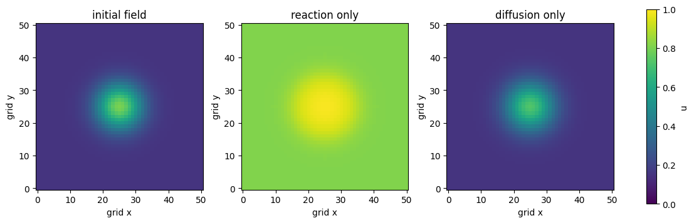

# 模様研究の準備：反応・拡散・空間パターン

:::{note} この資料の位置づけ
ヘビ模様と反応拡散を学ぶ前の準備章である．Strogatzで学んだ2変数ODEを，空間の各点に置くところから始める．[PDE入門](./10_pde_foundations.md)で扱う{abbr}`場(空間の各位置に値が対応する状態)`，ラプラシアン，差分法を先に学ぶと理解しやすい．
:::

:::{tip} 対応 Notebook
[20_pattern_foundations.ipynb](../notebooks/20_pattern_foundations.ipynb)
:::

## この章の目的

{abbr}`反応拡散方程式(局所的な反応と空間的な拡散を組み合わせた偏微分方程式)`を，突然現れる新しい公式としてではなく，**各点で進む反応ODE**と**隣接点との拡散**を足したモデルとして読めるようにする．また，生成された模様を美しさや主観的な類似性だけで評価せず，空間パターンとして観察するための語彙を準備する．

## 学習ガイド

| 学習内容 | 到達確認 |
| --- | --- |
| 2変数ODEの復習 | 反応だけの状態変化を書ける |
| 変数を場 $u(x,y,t),v(x,y,t)$ へ拡張 | 1時刻の状態が画像になると説明する |
| 反応項と拡散項を分けて読む | 片方を切った極限を説明する |
| 2次元ラプラシアンと境界条件 | {abbr}`5点差分(中央点と上下左右の4点でラプラシアンを近似する差分式)`を中央と近傍に分ける |
| {abbr}`初期擾乱(一様な初期状態へ加える小さな空間的ずれ)`・{abbr}`seed(疑似乱数列を再現するための初期値)`・対称性の破れ | 一様初期値だけでは模様が出にくい理由を述べる |
| 模様を記述する基本量 | 面積比・個数・波長・方向を区別する |
| Notebookの簡単な演習 | 反応だけと拡散だけの図を比較する |
| 確認問題 | 後続章へ進めるか自己判定する |

## 空間のない反応から始める

2種類の量 $u(t),v(t)$ が相互作用する最小モデルを

~~~{math}
:label: eq-prep-reaction-ode
\frac{du}{dt}=f(u,v),
\qquad
\frac{dv}{dt}=g(u,v)
~~~

とする．これはStrogatzで扱った2変数力学系である．状態は相平面上の1点 $(u,v)$ で表され，すべての場所が同じ値を持つと仮定している．

まず，反応項 $f,g$ が何をするかを調べる．

- 平衡点はどこか．
- 小さなずれは元へ戻るか，増えるか．
- 振動するか．
- 値が負や無限大にならないか．

空間モデルへ進む前に，各点で起きる反応だけを理解する．

反応項は，各場所に置かれた小さな反応容器の規則と考えられる．ある格子点で $f(u,v)>0$ ならその場所の $u$ は増え，$f(u,v)<0$ なら減る．同様に $g$ が $v$ の増減を決める．空間モデルを実行する前に，代表的な初期値を数個選び，反応だけで平衡点へ近づくか，振動するか，発散するかを時系列と相平面で確認する．

この確認を省くと，模様が現れなかった原因を反応式，拡散係数，初期条件，数値刻みのどこへ求めるべきか分からなくなる．部品ごとに動作を確認してから組み合わせることが，反応拡散モデルの基本的な検証順序である．

## 変数を場へ拡張する

場所によって値が異なるとき，未知量を場へ拡張して

~~~{math}
u(x,y,t),\qquad v(x,y,t)
~~~

となる．時刻 $t$ を固定すれば，$u$ と $v$ はそれぞれ2次元画像のような配列である．1個の状態点ではなく，全画素の値がその時刻の状態を作る．

格子を $N_x\times N_y$ に区切ると，状態変数は $2N_xN_y$ 個になる．たとえば $100\times100$ 格子なら2万変数である．PDEを差分化すると，大きな連立ODEとして計算できるという見方がここでも使える．

配列として考えると，`u[i, j]` は位置 $(x_i,y_j)$ における $u$ の値である．1枚の画像は1時刻の空間状態，画像を時刻順に並べたものが時間発展になる．したがって最終画像だけでは，模様が静止したのか，移動中なのか，分裂を繰り返しているのかを区別できない．複数時刻を保存して比較する必要がある．

## 反応と拡散を足す

一般の2成分反応拡散系は

~~~{math}
:label: eq-prep-reaction-diffusion
\frac{\partial u}{\partial t}=f(u,v)+D_u\Delta u,
\qquad
\frac{\partial v}{\partial t}=g(u,v)+D_v\Delta v
~~~

である．式を一度に読むのではなく，次の2つの極限へ分ける．

### 拡散を切る

$D_u=D_v=0$ とすると，各格子点は隣と通信せず，上の反応ODEを独立に解く．同じ初期値なら全点が同じ時間変化をするため，空間模様は生じない．

### 反応を切る

$f=g=0$ とすると，2つの量はそれぞれ拡散する．高い場所から低い場所へ広がり，空間的な凹凸は小さくなる．拡散だけでは一般に模様を消す方向に働く．

反応と拡散を同時に働かせると，反応が作る局所差と拡散が伝える影響が競合する．反応だけ・拡散だけでは安定でも，両者の組合せで特定の空間スケールが成長する場合がある．

左の反応は各場所の値を変え，中央の拡散は場所どうしを結ぶ．右の模様はどちらか片方だけの働きではなく，両者を同時に働かせた結果である．

## 2次元ラプラシアン

正方格子で格子幅を $\Delta x=\Delta y$ とすると，5点差分は

~~~{math}
:label: eq-prep-laplacian
\Delta u_{i,j}
\approx
\frac{u_{i+1,j}+u_{i-1,j}+u_{i,j+1}+u_{i,j-1}-4u_{i,j}}
{(\Delta x)^2}
~~~

である．中央点の値が周囲4点の平均より高ければ右辺は負，低ければ正になる．コードを読むときは，配列のシフトやスライスがこの4近傍を表しているか確認する．

### 境界条件

- **{abbr}`周期境界(領域の向かい合う端を接続する境界条件)`**：右端の隣を左端とする．端のない繰返し領域を表す．
- **Neumann境界**：境界を横切る流束を0にする．反射・遮断境界に対応する．
- **Dirichlet境界**：境界値を固定する．外部から濃度を保つ場合に使う．

境界近くの模様は境界条件の影響を受ける．画像端に現れた線や斑点を反応パラメータだけの効果と決めつけない．

同じ初期条件を使って周期境界とNeumann境界を比較すると，中央付近の模様が似ていても端付近のつながり方が変わることがある．境界の影響を調べるときは，領域全体の特徴量に加えて，端から一定幅を除いた内部領域の特徴量も計算する．内部でも差が残るなら，境界効果だけでは説明できない．

## 初期擾乱とseed

全点を平衡値と完全に同じにすると，理想的な数値計算では全点が同じまま進む場合がある．模様形成を調べるには，小領域への擾乱や小さな乱数を初期条件へ加える．

~~~text
一様平衡 + 小さな空間擾乱 → どの成分が成長するか観察
~~~

乱数seedは反応パラメータではない．パラメータを固定してseedだけを変え，斑点の位置が変わっても，個数・波長・面積比などの統計的特徴が保たれるかを確認する．

## 模様を見るための語彙

| 観察量 | 答える問い | 注意点 |
| --- | --- | --- |
| 面積比 | 明るい領域が全体の何割か | 二値化閾値に依存する |
| {abbr}`連結成分数(隣接してつながる前景領域の個数)` | 独立した斑点が何個か | 4近傍・8近傍で変わる |
| {abbr}`特徴波長(模様で支配的に繰り返される空間間隔)` | 模様間隔はどれくらいか | 画像サイズと単位が必要 |
| 方向 | 縞がどちらを向くか | 縞方向と変化方向を区別する |
| 時間変化 | 定常か，移動・分裂するか | 最終画像1枚では判断できない |

斑点，縞，迷路という分類語は便利だが，境界に位置する模様を人によって異なる型へ分類する可能性がある．卒研では，言葉による分類と数値特徴量を対応づける．

## Notebookの簡単な演習

[対応Notebook](../notebooks/20_pattern_foundations.ipynb)では，同じ初期場から反応だけを働かせた場合と，拡散だけを働かせた場合を計算する．ここで使う反応は{abbr}`ロジスティック型反応(現在値と上限との差の積に比例して状態量が増える反応)`であり，ヘビ模様を生成する完成モデルではない．反応項と拡散項の働きを切り分けるための例である．

左は中央が高い初期場である．中央は黄色，周辺は濃い青であり，位置によって値が異なる．中央は約0.8，周辺は約0.15である．

中央の反応だけの図では，各格子点が自分の値だけを使って変化する．すべての場所で $u(1-u)>0$ なので値は増えるが，隣接点間で量は移動しない．右の拡散だけの図では，中央の高い領域が広がり，最大値と{abbr}`空間分散(各格子点の値が空間平均からどれだけ散らばっているかを表す量)`が小さくなる．周期境界から外へ量が流出しないため，平均値はほぼ変わらない．

図の確認では，色だけでなくNotebookが表示する最小値，最大値，平均値，空間分散を読む．反応だけでは平均値が変化し，拡散だけでは平均値をほぼ保ちながら分散が低下する．この違いを説明できてから，両方を同時に働かせる課題へ進む．

## 計算前の健全性確認

1. 反応だけを実行し，ODEとして予想した平衡へ進むか．
2. 拡散だけを実行し，凹凸が滑らかになるか．
3. 時間刻みを半分にして，模様の主要特徴が保たれるか．
4. 同じseedで同じ模様が再現するか．
5. 境界条件を変えた影響がどこに現れるか．

この5つを確認せずに，生物模様を再現できたと結論してはいけない．

## 確認問題

1. $f=g=0$ のとき，反応拡散方程式は何をするか．
2. $D_u=D_v=0$ で全格子点の初期値が同じなら，空間模様が生じにくい理由を説明せよ．
3. 中央セルが1，上下左右が0のとき，5点ラプラシアンの符号を求めよ．
4. 周期境界をヘビ表面のモデルとして使うとき，何を無視しているか．
5. seedを変えても保持されるべき特徴と，変わってよい特徴を1つずつ挙げよ．

## チェックポイント

- [ ] 反応ODEと空間拡散を別々に説明できる．
- [ ] 5点ラプラシアンの符号を周囲平均との差で説明できる．
- [ ] 初期条件とパラメータの違いを説明できる．
- [ ] 周期・Neumann・Dirichlet境界を区別できる．
- [ ] 模様の見た目を最低2つの観察量へ変換できる．

## 次に読む

[反応拡散の基礎：パターン生成](./21_reaction_diffusion_basic.md)で具体的なGray--Scottモデルを実行し，その後[模様解析の基礎](./22_reaction_diffusion_snake.md)で画像特徴量を個別に検証する．

## 参考文献・キーワード

- Turing, The Chemical Basis of Morphogenesis, 1952.
- Strogatz, Nonlinear Dynamics and Chaos.
- キーワード：2成分ODE，場，反応項，拡散項，ラプラシアン，初期擾乱，周期境界，空間パターン
