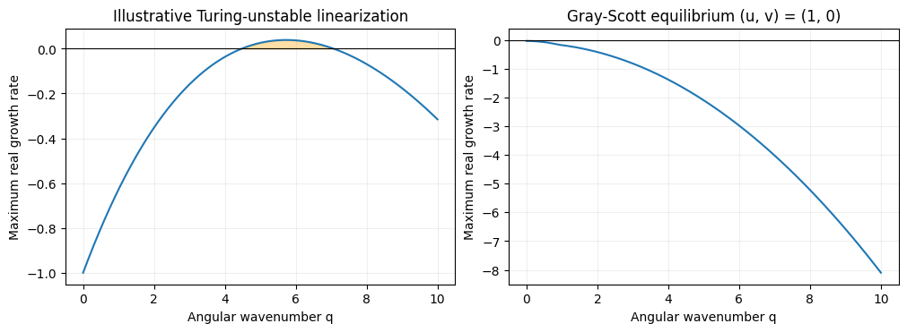

# 反応拡散の基礎：パターン生成

:::{tip} 対応 Notebook
[21_reaction_diffusion_gray_scott.ipynb](../notebooks/21_reaction_diffusion_gray_scott.ipynb)
:::

:::{note} 学習経路での位置づけ
[模様研究の準備](./20_pattern_foundations.md)で学んだ反応と拡散をGray--Scottモデルで組み合わせる．本章では生成過程と計算の正しさを確認する．次の[模様解析の基礎](./22_reaction_diffusion_snake.md)では生成された画像を測り，[卒研ロードマップ](./23_snake_research_roadmap.md)では実画像との比較を自分で設計する．
:::

## この章の目的

**{abbr}`反応拡散方程式(各位置での反応と位置間の拡散を組み合わせた偏微分方程式)`**を，既習のODEに空間的な結合を加えたものとして理解する．重要なのは，図を得ることに加え，どの状態にどの大きさの擾乱を与え，どの条件で計算した図なのかを説明できることである．

本章では，微小擾乱の線形不安定性と，有限の大きさの初期擾乱から生じる非線形な模様を区別する．Gray--Scottの模様が見えたという事実だけで，チューリング不安定性を確認したことにはならない．

## 学習ガイド

| 学習内容 | 到達確認 |
| --- | --- |
| 反応と拡散 | 各項の符号と役割を説明する |
| 平衡点と線形安定性 | ODEのヤコビ行列から空間モードの式へ進む |
| Gray--Scottモデル | 基準平衡点が線形安定であることを計算する |
| 差分法 | 空間刻みと時間刻みをコードに対応させる |
| 計算の検証 | 既知解との誤差と刻み依存性を測る |
| 生成結果の整理 | 条件をそろえた図と数値要約を残す |

## 反応と拡散を組み合わせる

位置 $\mathbf{x}=(x,y)$，時刻 $t$ における2成分の濃度を $u(\mathbf{x},t),v(\mathbf{x},t)$ とする．一般の2成分反応拡散系は

```{math}
:label: eq-rd-u
\frac{\partial u}{\partial t}=D_u\Delta u+f(u,v)
```

```{math}
:label: eq-rd-v
\frac{\partial v}{\partial t}=D_v\Delta v+g(u,v)
```

である．ここでは $D_u,D_v>0$ を定数，$\Delta=\partial_{xx}+\partial_{yy}$ とする．反応項 $f,g$ は同じ位置での濃度変化を，拡散項は周囲との濃度差による変化を表す．$D_u=D_v=0$ とすれば，各位置で独立した2変数ODEになる．$f=g=0$ とすれば，2つの濃度はそれぞれ拡散して空間差を小さくする．


図の反応部分には空間微分がなく，拡散部分には隣接点が現れる．右側は模様が生じる場合の模式図であり，反応と拡散を組み合わせれば必ず模様が成長するわけではない．反応が濃度差を増やす場合と拡散が濃度差を減らす場合が同時にあるため，両者を合わせた安定性は別途調べる必要がある．

計算領域は一辺 $L$ の正方形とし，**{abbr}`周期境界条件(向かい合う端の値と流れをつないで周期的な領域として扱う条件)`**を課す．右端の隣は左端，上端の隣は下端である．これは端の影響をなくす操作ではなく，反対側の端同士を結ぶモデル化である．領域が小さければ，自分自身を周期的に繰り返した模様と相互作用する．

## ODEの安定性から空間モードの安定性へ

### 平衡点のまわりで線形化する

$f(u^*,v^*)=g(u^*,v^*)=0$ を満たす空間一様な平衡点を考える．反応の**{abbr}`ヤコビ行列(反応項を各変数で偏微分して並べた行列)`**を

```{math}
J=\left.\begin{pmatrix}f_u&f_v\\g_u&g_v\end{pmatrix}\right|_{(u^*,v^*)}
=\begin{pmatrix}a&b\\c&d\end{pmatrix}
```

とする．ODEでは $J$ の固有値の実部がともに負なら，十分小さな擾乱は減衰する．2変数の場合，その条件は $\operatorname{tr}J=a+d<0$ と $\det J=ad-bc>0$ である．

空間依存する擾乱を $\mathbf{z}\exp(\lambda t+i\mathbf{q}\cdot\mathbf{x})$ と置く．ここで $i$ は虚数単位，$\mathbf{q}$ は**{abbr}`角波数ベクトル(空間に沿った位相変化をラジアン毎長さで表すベクトル)`**，$q=|\mathbf{q}|$ である．$\Delta e^{i\mathbf{q}\cdot\mathbf{x}}=-q^2e^{i\mathbf{q}\cdot\mathbf{x}}$ なので，線形化した式は

```{math}
\lambda\mathbf{z}=M(q)\mathbf{z},\qquad
M(q)=J-q^2\begin{pmatrix}D_u&0\\0&D_v\end{pmatrix}
```

になる．各 $q$ について $M(q)$ の固有値を求め，その実部の最大値 $\alpha(q)$ を調べる．$\alpha(q)>0$ ならそのモードは初期に増幅し，$\alpha(q)<0$ なら減衰する．波長は $\ell=2\pi/q$ であり，単に $1/q$ ではない．

### チューリング不安定性の条件

**{abbr}`チューリング不安定性(反応だけでは安定な一様平衡点が拡散を加えることで空間的な微小擾乱に対して不安定になる現象)`**とは，$q=0$ では安定だが，ある $q>0$ で $\alpha(q)>0$ になることである {cite}`turing1952chemical`．完全に一様な初期状態は，厳密な方程式では不安定でも一様なままであり，増幅されるきっかけとなる擾乱が必要である．

```{dropdown} 2成分系で条件を計算する
拡散を加えた行列のトレースと行列式は

$$
\operatorname{tr}M(q)=a+d-(D_u+D_v)q^2,
$$

$$
\det M(q)=\det J-(D_va+D_ud)q^2+D_uD_vq^4
$$

である．反応だけで安定ならトレースはどの $q$ でも負なので，不安定化には行列式が負になる必要がある．$S=D_va+D_ud$ と置くと，連続的に $q$ を選べる場合の条件は

$$
\operatorname{tr}J<0,\quad \det J>0,\quad S>0,\quad
S^2>4D_uD_v\det J
$$

となる．不安定な帯域は

$$
\frac{S-\sqrt{S^2-4D_uD_v\det J}}{2D_uD_v}
<q^2<
\frac{S+\sqrt{S^2-4D_uD_v\det J}}{2D_uD_v}
$$

である．一辺 $L$ の周期領域では $\mathbf{q}=2\pi(n_x,n_y)/L$，$n_x,n_y\in\mathbb{Z}$ に限られるため，実際に許されるモードがこの帯域に入るかも確かめる．さらに離散格子では，$q^2$ は差分ラプラシアンに対応する $4[\sin^2(q_x\Delta x/2)+\sin^2(q_y\Delta x/2)]/\Delta x^2$ に置き換わる．格子で表せない短波長を連続系の式だけから予測してはいけない．
```

$D_u=D_v=D$ なら $M(q)=J-Dq^2I$ であり，全固有値の実部は $Dq^2$ だけ小さくなる．したがって安定な一様平衡点をこの仕組みで不安定化することはできない．拡散係数が異なることは必要だが，それだけでは十分ではない．局所的な活性化と広域の抑制という説明も，実際の反応式の微分と照合して使う．

## Gray--Scottモデルを読む

本章では次の無次元化されたモデルを用いる {cite}`grayscott1984,pearson1993patterns`．

```{math}
:label: eq-gs-u
\frac{\partial u}{\partial t}=D_u\Delta u-uv^2+F(1-u)
```

```{math}
:label: eq-gs-v
\frac{\partial v}{\partial t}=D_v\Delta v+uv^2-(F+k)v
```

$u$ は供給される基質，$v$ は生成物である．反応 $U+2V\to3V$ に対応する $uv^2$ は，$u$ を減らして同量の $v$ を増やす**{abbr}`自己触媒反応(生成物が自身の生成を促進する反応)`**を表す．$F(1-u)$ は基質の供給と流出，$-Fv$ は供給に伴う $v$ の流出，$-kv$ は $v$ が別の物質へ変化して除去される効果である．$k$ だけでなく $F$ も $v$ の減少に寄与する．

この式の $u,v,t,x,y,D_u,D_v,F,k$ は無次元量である．Notebookの時刻4000を4000秒，1格子間隔を1 mmと読んではいけない．実長と比較するには，別途長さの対応を定める必要がある．

| 記号 | 役割 | 変更するときの注意 |
| --- | --- | --- |
| $D_u,D_v$ | 2成分の広がりやすさ | 比だけでなく絶対値と領域長も効く |
| $F$ | 基質の供給・流出と生成物の流出 | $u,v$ 両方の式が変わる |
| $k$ | 生成物の除去 | $F+k$ と自己触媒反応の競合を調べる |
| $L$ | 領域の一辺 | 許される波長と有限領域の影響を変える |

### 基準平衡点は線形安定である

$(u,v)=(1,0)$ は反応と拡散の両方を含めた平衡解である．一般の位置で反応のヤコビ行列を計算すると

```{math}
J(u,v)=\begin{pmatrix}-v^2-F&-2uv\\v^2&2uv-F-k\end{pmatrix},\qquad
J(1,0)=\begin{pmatrix}-F&0\\0&-(F+k)\end{pmatrix}
```

であり，この平衡点の空間モードの成長率は

```{math}
\lambda_1(q)=-F-D_uq^2,\qquad
\lambda_2(q)=-(F+k)-D_vq^2
```

となる．$F,k>0$ ならどちらも負であり，微小擾乱からのチューリング不安定性は起こらない．これは基準平衡点についての結論であり，Gray--Scott系の別の平衡点や別の条件すべてについて不安定性を否定したものではない．



左図は線形解析の練習用に $J=\begin{pmatrix}1&-2\\2&-3\end{pmatrix}$，$D_u=0.01,D_v=0.1$ とした例であり，Gray--Scottの計算結果ではない．横軸は角波数，縦軸は固有値の実部の最大値である．正の部分は微小擾乱が増幅する帯域を示すが，その後の非線形な最終模様までは決めない．右図はNotebookのGray--Scott基準平衡点で，全帯域が負である．

### 有限の大きさの初期擾乱を与える

そこでNotebookでは，背景 $u=1,v=0$ の中央に，$u\simeq0.5,v\simeq0.25$ の領域を置く．これは無限小ではない初期条件である．拡散を除いた $v$ の式を

```{math}
\dot v=v\{uv-(F+k)\}
```

と書くと，$v>0$ のときでも $uv>F+k$ でなければその瞬間に $v$ は増えない．たとえば $F=0.035,k=0.065$ では中央の $uv=0.125$ は $F+k=0.1$ より大きい．ただしその後は $u$ の消費と拡散も働くので，この不等式だけで模様の存続は保証されない．有限振幅の初期擾乱から多様な模様が生じることはPearsonの研究でも扱われている {cite}`pearson1993patterns`．

初期条件には小さな空間変動も加えるが，濃度が負にならない形にする．乱数seedはその変動を再現するための番号であり，モデルの物理パラメータではない．格子を細かくする検証では，同じ連続的な初期分布を別の格子で標本化する．格子ごとに独立な白色雑音を生成すると，初期条件まで変わってしまう．

## 差分法をコードへ対応させる

$N\times N$ 格子を $x_i=i\Delta x,y_j=j\Delta x$，$\Delta x=L/N$ に置く．周期境界では $x=L$ の点は $x=0$ と重複するため含めない．5点差分は

```{math}
\Delta_h Z_{j,i}=\frac{Z_{j+1,i}+Z_{j-1,i}+Z_{j,i+1}+Z_{j,i-1}-4Z_{j,i}}{\Delta x^2}
```

である．配列の第0軸を $y$，第1軸を $x$ とすると次のように書ける．

```python
def laplacian(Z, dx):
    return (np.roll(Z, 1, 0) + np.roll(Z, -1, 0)
            + np.roll(Z, 1, 1) + np.roll(Z, -1, 1) - 4*Z) / dx**2
```

`np.roll` は端を反対側へ回すので，ここで周期境界が実装されている．陽的オイラー法では，同じ時刻の $u,v$ から両方の右辺を求めてから更新する．

```python
uvv = u * v**2
du = Du * laplacian(u, dx) - uvv + F * (1-u)
dv = Dv * laplacian(v, dx) + uvv - (F+k) * v
u_new = u + dt * du
v_new = v + dt * dv
```

$u$ の更新後の値を $v$ の反応項へ代入すると，ここで説明した同時更新とは別の計算法になる．

### 安定条件と非負性を確認する

この正方格子の5点差分と陽的オイラー法について，反応を除いた拡散の安定条件は

```{math}
:label: eq-cfl
\max(D_u,D_v)\frac{\Delta t}{\Delta x^2}\le\frac14
```

である．これは反応拡散全体の安定性や精度を保証する条件ではない．初期値が非負のとき，1ステップ後の非負性を保証する十分条件として，各格子点で

```{math}
4D_u\frac{\Delta t}{\Delta x^2}+\Delta t(v_{j,i}^2+F)\le1,\qquad
4D_v\frac{\Delta t}{\Delta x^2}+\Delta t(F+k)\le1
```

も得られる．たとえば $u$ の更新式で自分自身の係数を $1-4D_u\Delta t/\Delta x^2-\Delta t(v^2+F)$ と整理すると，この条件の下で隣接点の項と供給項を含めてすべて非負になる．これは十分条件なので，満たさないことだけで直ちに発散すると断定はできない．

Notebookでは拡散の条件を計算前に検査し，途中で負の濃度や非有限値が出たら停止する．負値を0へ切り上げて計算を続けると，元の方程式と誤差を隠してしまう．正常に終了しても刻み依存性は別に検証する．

## 既知解から計算を検証する

卒研では次の検証を，パラメータ探索より先に実行する．

| 検証 | 正しい結果 | 確認する実装 |
| --- | --- | --- |
| $u=1,v=0$ から開始 | いつまでも同じ値 | 反応項の符号と平衡点 |
| $F=k=0,v=0$ で拡散のみ | 周期領域で $u$ の総和が保存 | ラプラシアンと境界 |
| 一様な $u(0)=u_0,v=0$ | $u(t)=1+(u_0-1)e^{-Ft}$ | 反応と時間積分 |
| 拡散する余弦波 | 振幅が既知の指数関数で減衰 | 空間差分と時間積分 |

最後の例では $F=k=0,v=0$ とし，$u(x,y,0)=1+\varepsilon\cos(2\pi x/L)$ を与えると

```{math}
u(x,y,t)=1+\varepsilon e^{-D_u(2\pi/L)^2t}\cos(2\pi x/L)
```

が厳密解になる．計算結果との最大絶対誤差を，時間刻みや格子ごとに測る．滑らかな解に対して本手法の誤差は一般に $O(\Delta t)+O(\Delta x^2)$ なので，時間誤差が支配的な条件で $\Delta t$ を半分にすれば誤差はおよそ半分になる．$\Delta t\propto\Delta x^2$ として両方を小さくすれば，全体として2次の収束を検証できる．

模様計算の格子依存性では $L$ と終了時刻 $t_{\rm end}$ を固定する．$N$ を2倍にすると $\Delta x$ は半分になり，拡散の条件を維持するには $\Delta t$ を少なくとも4分の1にする．$\Delta x=1$ のまま $N$ を変える操作は，格子収束の検証ではなく領域長の変更である．

非線形な長時間発展では，わずかな誤差が模様の位置や分裂時刻に影響する場合がある．まず短時間の場の誤差を確認し，長時間では次章の特徴量と複数seedでのばらつきを併用する．どの時刻・量について刻みの影響が小さいのかを限定して述べる．

## Notebookの図を読む

### 初期分布と有限時間後の濃度場


色は数値変数 $v$ の値を表し，実際のヘビの体色ではない．左から初期分布と保存時刻の分布を並べ，同じ色範囲で比較している．上段の $F=0.035,k=0.065$ では今回の滑らかな初期分布から濃度差が減衰する．下段の $F=0.055,k=0.062$ では模様が残る．有限振幅を与えても，すべての設定で模様が残るわけではないことを確認できる．初期分布の形や振幅を変えれば結果が変わる可能性もあるので，パラメータだけで再現条件を指定してはいけない．

中央の領域がどこまで広がったか，明るい領域の数や連結の仕方が変化したかを読む．外側が暗いことは，端で吸収されたことを意味しない．計算は周期境界であり，まだそこへ模様が到達していない場合もある．

図とともに最小値・最大値・平均・分散を記録する．分散は濃度の不均一さを測るが，模様の細かさを直接測る量ではない．同じ振幅で波長だけが異なる正弦波は，同じ分散を持ちうる．

### パラメータを変えた比較


3枚は $F,k$ の異なる設定であり，それ以外の条件をそろえている．左では $v$ がほぼ0へ減衰し，中央と右には連続した濃淡の構造が残る．濃度の高い領域の配置，つながり，広がりの差を観察する．各画像を別々に自動伸縮した色範囲で表示すると，ほぼ一様な場と大きな濃度差のある場が同様に見えるので，共通のカラーバーを用いる．

これらはパラメータ平面の3点であり，領域全体の分類でも実画像への最適適合でもない．また，保存時刻の模様であって定常解とは限らない．定常性を調べる場合は複数時刻の特徴量に加え，たとえば $\|(v(t+\delta t)-v(t))/\delta t\|_\infty$ が十分小さいか確認する．1ステップの変化だけなら $\Delta t$ を小さくするだけで小さくなるため，時間で割った変化率と区別する．

## 演習問題

1. Gray--Scottの $(1,0)$ におけるヤコビ行列と空間モードの成長率を求め，模様生成の実験に有限振幅の初期条件を用いる理由を説明せよ．
2. $D_u=0.16,D_v=0.08,L=80,N=80$ とする．拡散のみの条件から $\Delta t$ の上限を求めよ．同じ $L$ で $N=160$ にした場合も求めよ．
3. 一様な $u_0=0.7,v=0$ の既知解と比較し，時間刻みを半分にしたときの誤差の変化を表にせよ．
4. 3つの $(F,k)$ を共通条件で計算し，面積比 $\operatorname{mean}(v\ge0.2)$ と空間分散を記録せよ．何が測れて，何が測れないか述べよ．

```{dropdown} 解答例：平衡点と有限振幅
ヤコビ行列は対角成分が $-F,-(F+k)$，非対角成分が0である．拡散を加えた固有値は $-F-D_uq^2,-(F+k)-D_vq^2$ であり，正のパラメータの下で全モードが減衰する．したがって，この平衡点の微小擾乱の成長によってNotebookの模様を説明することはできない．中央に $u\simeq0.5,v\simeq0.25$ を置く計算は有限振幅の非線形応答を調べている．有限振幅を与えても，すべての条件で模様が残るわけではない．
```

```{dropdown} 解答例：刻みと誤差
最初は $\Delta x=1$ なので $\Delta t\le1/(4\times0.16)=1.5625$，格子を細かくした後は $\Delta x=0.5$ なので $\Delta t\le0.390625$ である．これは反応項を含む精度の保証ではない．

一様場ではラプラシアンが0なので，$u^{n+1}-1=(1-F\Delta t)(u^n-1)$ となる．$t=n\Delta t$ での離散解を $1+(u_0-1)e^{-Ft}$ と比べればよい．十分小さな刻みではオイラー法の誤差比は約2になる．Notebookでは終了時刻をそろえてこの比を計算する．
```

```{dropdown} 解答例：画像の数値要約
面積比は濃度0.2以上の領域の広さ，分散は濃度差の大きさである．前者には閾値依存性があり，後者は波長や斑点数を一意に決めない．面積比0なら閾値以上の領域がないのであって，直ちに濃度が全点で0とはいえない．図，濃度範囲，数値要約を一緒に読み，模様の細かさは次章の空間的な指標で調べる．実装例は対応する解答Notebookにある．
```

## チェックポイント

- [ ] 反応だけの安定性とチューリング不安定性を区別できる．
- [ ] Gray--Scott基準平衡点の線形安定性を自分で計算した．
- [ ] 初期濃度が非負であり，同じseedで再現できることを確認した．
- [ ] $L,N,\Delta x,\Delta t,t_{\rm end}$ の関係をコードで示せる．
- [ ] 既知解と照合し，誤差の刻み依存性を測った．
- [ ] 模様の存続，定常性，数値的な安定性を同一視しない．

## 卒業研究への接続と発展課題

本章の到達点は，検証済みの基準計算を自分で再実行できることである．卒研では，その計算を用いて特徴量地図を作り，初期条件や刻みへの感度を調べた上で実画像との比較へ進む．拡散比を変えれば必ず一定方向に模様が細かくなるとは限らないので，単調な関係を仮定せず測定する．

発展として別の反応系や差分法を比較してもよいが，基礎検証を優先する．9点差分を使うなら係数，$\Delta x^2$ による規格化，対応する安定条件を改めて導く．拡散係数を空間的に変える場合，保存則に基づく拡散項は $\nabla\cdot(D(\mathbf{x})\nabla u)$ であり，一般には $D(\mathbf{x})\Delta u$ と同じではない．

## 参考文献

- Turingによる線形不安定性の理論 {cite}`turing1952chemical`．
- Gray--Scottの反応系 {cite}`grayscott1984`．
- Pearsonによる有限振幅の初期擾乱からのパターン生成 {cite}`pearson1993patterns`．[原論文](https://arxiv.org/abs/patt-sol/9304003)の設定と本Notebookの例示用設定は同一ではない．
