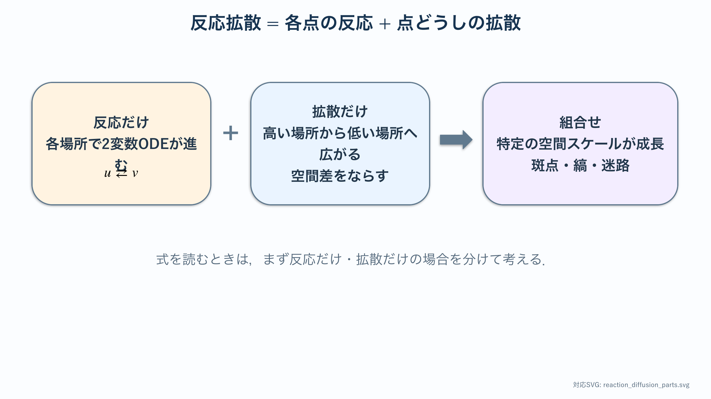
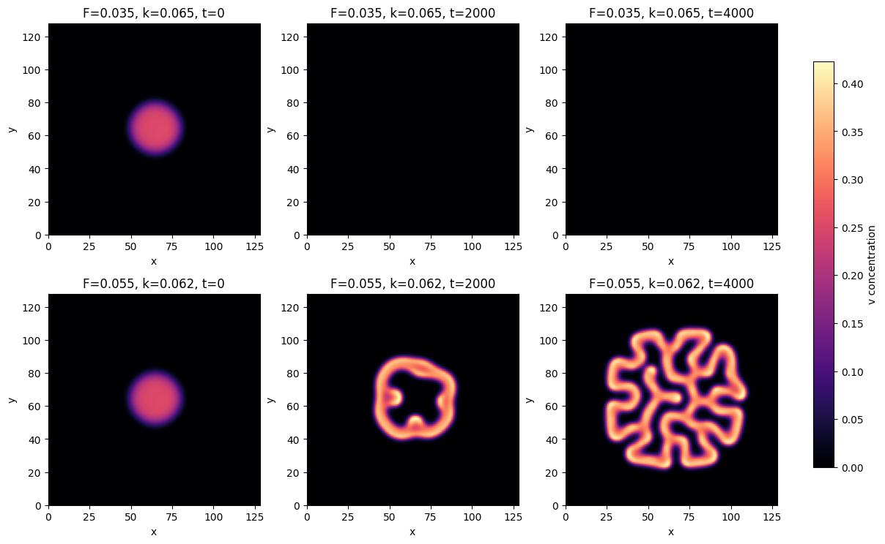
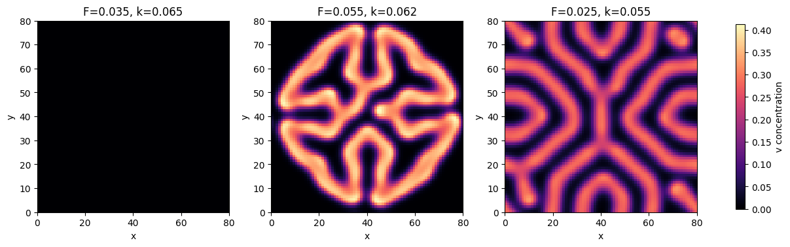

# 反応拡散の基礎：パターン生成

:::{tip} 対応 Notebook
[21_reaction_diffusion_gray_scott.ipynb](../notebooks/21_reaction_diffusion_gray_scott.ipynb)
:::

:::{note} 学習経路での位置づけ
本章は模様テーマの基礎モデルを扱う．[模様研究の準備](./20_pattern_foundations.md)で分けて考えた反応と拡散を，具体的なGray--Scottモデルで組み合わせる．次の[模様解析の基礎](./22_reaction_diffusion_snake.md)で特徴量を個別に検証してから，生成模様と実画像を比較する．
:::

## この章の目的

**{abbr}`反応拡散方程式(局所的な反応と空間的な拡散を組み合わせた偏微分方程式)`** によって，一様な初期状態から空間パターンが自発的に生じる仕組み（**{abbr}`チューリング型不安定性(反応だけでは安定な一様状態が拡散によって不安定になる現象)`**）を学ぶ．代表例である **{abbr}`Gray-Scottモデル(2成分の反応と拡散で多様な模様を生成する数理モデル)`** を2次元格子で数値計算し，斑点・縞・迷路模様を再現できるようになることを目指す．

## 学習ガイド

| 学習内容 | 到達確認 |
| --- | --- |
| 拡散だけでは模様が消えることを復習 | 1成分拡散との違いを述べる |
| 一般の反応拡散方程式 | 反応項と拡散項を分けて読む |
| チューリング型不安定性の直観 | 局所活性化・長距離抑制を説明する |
| Gray--Scott各項の意味 | $uv^2$, $F$, $k$ の役割を言葉にする |
| 差分法と安定条件 | 時間刻みが適切か確認する |
| Notebookの2図を比較 | 色・時刻・パラメータを確認して読む |
| チェックポイント | 実画像解析へ進む準備を判定する |

図を見る前に，拡散だけの場合と反応だけの場合の時間変化を別々に考える．両方を足した結果だけを暗記しない．

## 現象の説明

動物の体表には斑点や縞などの模様がある．Turing は1952年，化学物質（{abbr}`モルフォゲン(発生過程で濃度に応じて細胞へ位置情報を与える物質)`）の **反応** と **拡散** だけで，一様な状態から空間パターンが自然に現れうることを示した {cite}`turing1952chemical`．拡散は通常，空間的な濃度差を小さくするが，2種類の物質が異なる速さで拡散し互いに反応すると，**拡散が不安定化を引き起こす** 場合がある．これがチューリング型不安定性である．

:::{warning} 科学的な注意
反応拡散は模様生成の **1つのモデル** であり，実際の動物模様が反応拡散だけで決まると断定するものではない．遺伝・発生・成長・鱗構造・環境などの影響は，実画像へ接続する卒研ロードマップで改めて検討する．
:::

## 最小モデル

2種類の濃度場 $u(\mathbf{x},t)$ と $v(\mathbf{x},t)$ を考える．各格子点では反応が進み，格子点間では濃度が拡散する．これを最小モデルとする．境界は周期境界（トーラス）とし，端の効果を無視する．

[PDE入門](./10_pde_foundations.md)の1成分拡散方程式は空間差を小さくするだけだった．本章では，各格子点で進むODE $\dot u=f(u,v)$, $\dot v=g(u,v)$ と，隣の格子点との拡散を組み合わせる．既習の局所ODEへ空間結合を加えたモデルである．

## 数式による定式化

### 一般の反応拡散方程式

```{math}
:label: eq-rd-u
\frac{\partial u}{\partial t} = D_u \Delta u + f(u,v)
```

```{math}
:label: eq-rd-v
\frac{\partial v}{\partial t} = D_v \Delta v + g(u,v)
```

$\Delta = \partial_{xx} + \partial_{yy}$ はラプラシアン（拡散），$f,g$ は反応項である．式を読むときは，まず反応を切った場合（$f=g=0$），次に拡散を切った場合（$D_u=D_v=0$）を考える．2つの部品を別々に理解してから，同時に働く場合へ進む．



左の箱は1格子点内の反応，中央は近傍セルとの拡散を表す．Gray--Scottモデルの各項を，どちらの箱に属するか分類して読む．

### チューリング不安定性の直観

空間一様な平衡点 $(u^*,v^*)$ のまわりを線形化すると，{abbr}`波数(空間内で単位長さ当たりに繰り返す回数を表す量)` $q$ の摂動の成長率 $\lambda(q)$ は，反応の{abbr}`ヤコビ行列(各反応項を各状態変数で偏微分して並べた行列)`と拡散項から決まる．**反応だけ**（$q=0$）では安定でも，ある波数帯 $q\neq 0$ で $\lambda(q)>0$ になると，その波長の模様が成長する．典型的な活性化・抑制系では，局所に留まる活性化と，より遠くへ速く及ぶ抑制の組合せが重要になる．どちらの変数が活性・抑制を担うかは反応式によるため，記号 $u,v$ だけから拡散係数の大小を決めてはいけない．

### Gray-Scott モデル

本章で使う具体形は Gray-Scott モデル {cite}`grayscott1984` である．

```{math}
:label: eq-gs-u
\frac{\partial u}{\partial t} = D_u \Delta u - u v^2 + F(1-u)
```

```{math}
:label: eq-gs-v
\frac{\partial v}{\partial t} = D_v \Delta v + u v^2 - (F+k)v
```

$u$ は供給される基質，$v$ は{abbr}`自己触媒的(生成物自身が同じ生成反応を促進する性質)`に増える生成物である．$u v^2$ は，$u$ を消費して $v$ が増加する反応を表す．$F(1-u)$ は $u$ の供給，$-(F+k)v$ は $v$ の流出を表す．

各項の符号を対応させると反応を読みやすい．$uv^2$ は $u$ の式では負，$v$ の式では正なので，基質 $u$ を生成物 $v$ へ変換する反応である．$F(1-u)$ は $u<1$ なら正となって $u$ を1へ戻す．$-(F+k)v$ は $v>0$ なら負であり，$v$ を除去する．同じ項が2本の式へどの符号で現れるかを確認すると，物質の生成と消費を追跡できる．

たとえば $u=1$, $v=0$ では自己触媒項は0であり，反応だけならこの状態に留まる．小さな領域へ $v>0$ を与えると $uv^2$ が働き始め，$v$ の増加と $u$ の消費が局所的に進む．その局所差を拡散が周囲へ伝えることで，空間パターンが発達する．

本Notebookで用いる代表値は $D_u=0.16$, $D_v=0.08$ であり，基質 $u$ の方が速く拡散する．これは上の一般的な活性化・抑制の説明と矛盾しない．Gray--Scott系では反応と拡散の組全体が不安定性を決めるためである．

## パラメータの意味

| 記号 | 意味 | 効果 |
| --- | --- | --- |
| $D_u, D_v$ | $u,v$ の拡散係数 | 模様の太さ・滑らかさ |
| $F$ | 供給率（feed） | パターンの種類を支配 |
| $k$ | 除去率（kill） | パターンの種類を支配 |

Gray-Scottモデルでは，$(F,k)$ という **2つのパラメータ** の組合せによって，斑点，縞，迷路，自己複製スポットなど多様なパターンが生じる．$(F,k)$ 平面上でパターン分類図を作ること自体が研究になる．

$F$ または $k$ を単独で大きくすれば一定方向に模様が変わるとは限らない．2つの値の組合せで反応の平衡と安定性が変わるため，1本のパラメータ軸だけでは模様領域を見落とす．最初は粗い格子で $(F,k)$ 平面を調べ，変化が大きい境界付近だけ刻みを細かくする．

### 数値安定性

差分法（陽解法）では，時間刻み $\Delta t$，空間刻み $\Delta x$ に対し拡散の安定条件

```{math}
:label: eq-cfl
D \frac{\Delta t}{\Delta x^2} \le \frac{1}{4}\quad(\text{2次元})
```

を守らないと数値が発散する．Notebook では $\Delta x=1$，$\Delta t \le 1$ 程度に設定する．発散したら $\Delta t$ を小さくする．

この条件は拡散項から得られる目安であり，反応項が非常に速い場合にはさらに小さい時間刻みが必要になる．刻みを半分にしたとき，最終時刻をそろえて主要な斑点数や波長が保たれるか確認する．値が負になる，急に極端な値へ飛ぶ，格子状の縞が現れる場合は，現象として解釈する前に数値誤差を疑う．

## 数値シミュレーション

Notebook では次を行う．

1. 5点ステンシルのラプラシアン関数（周期境界）を定義する．
2. $u=1, v=0$ の一様場に，中央の小領域だけ $v$ を与える初期条件を置く（seed 固定）．
3. 式 {eq}`eq-gs-u`{eq}`eq-gs-v` を陽的オイラー法で時間発展させる．
4. 一定ステップごとに $v$ の場を `imshow` で可視化する．
5. $(F,k)$ を変えて，斑点／縞／迷路の違いを比較する．

各保存時刻では，$u$ と $v$ の最小値・最大値，空間平均，NaNや無限大の有無も記録する．画像だけを保存すると，色範囲の自動調整によって数値発散を見落とすことがある．同じカラースケールの画像と数値要約を組み合わせる．

### 図1：1つのパラメータ設定から生じる斑点



この図は2次元空間上の $v(x,y,t)$ を色で表している．明るい場所ほど $v$ が高く，黒い場所ほど低い．色はヘビの実際の体色ではなく，数値変数 $v$ の値である．カラーバーの0～0.4を読み，画像の白黒を生物学的な色素量と直接同一視しない．

初期条件は中央の小領域に置かれているため，有限時間では模様も中央付近に集まっている．図の外側が黒くても，境界で濃度が吸収されたことを意味しない．Notebookは周期境界を使っており，擾乱がまだ外側へ十分広がっていない可能性がある．保存時刻を変え，時間発展を確認する必要がある．

斑点が完全な円でないのは，反応，拡散，近隣斑点との相互作用，格子近似が同時に働くためである．1枚の最終図だけで安定した定常模様と断定せず，複数時刻で位置や個数が変化していないかを見る．

### 図2：$(F,k)$ を変えた比較



左から，孤立した斑点，連結した迷路状構造，幅の大きい帯状構造が現れている．空間格子，計算時間，拡散係数などをそろえ，$F$ と $k$ だけを変えているため，パターン差をこの2パラメータの効果として比較できる．

ただし，3枚はパラメータ空間の3点にすぎず，斑点が生じるパラメータ領域の境界を示してはいない．初期条件，seed，計算終了時刻でも見え方は変わる．まず粗いパラメータ分類図を作り，同じ分類が複数seedで現れるか確認する必要がある．

また，外観だけの分類では，斑点と迷路の中間にある模様を再現可能な基準で判定できない．次章では，面積比，連結成分，特徴波長へ変換し，図を数値で読む方法を学ぶ．

:::{note} 評価指標
縞に見えるという主観的な記述だけで終わらせず，次章で導入する **面積比・斑点数・FFT** につながる量を意識する．標準設定を再現し，少数の設定でパターンが変わることを確認してから，特徴量による比較へ進む．
:::

## 卒業研究への接続

- $(F,k)$ 平面を粗く調べることは，卒研で探索範囲を決めるための予備実験になる．
- 拡散比 $D_v/D_u$ を変えると特徴長が変わる．実画像へ接続する前に，人工模様でこの関係を検証する．
- 反応項を別のモデル（FitzHugh-Nagumo, Brusselator など）に差し替えると，出る模様が変わる．モデル選択そのものが比較研究になる．
- 実画像との比較，損失関数，パラメータ探索は[卒研ロードマップ](./23_snake_research_roadmap.md)で段階的に設計する．

## チェックポイント

- [ ] 反応項と拡散項を別々に説明できる．
- [ ] 初期条件と周期境界条件をコード上で示せる．
- [ ] 2次元陽解法の安定条件を確認した．
- [ ] 同じseedとパラメータで結果を再現した．
- [ ] 少なくとも2設定の違いを，見た目だけでなく生成過程から説明した．
- [ ] 実画像との比較前に特徴量を単独で検証すべき理由を説明できる．

## 演習問題

1. **理論**：典型的な活性化・抑制系で，抑制の影響が活性化より速く遠くへ及ぶとパターン形成につながりうる理由を，局所的な活性化と長距離に及ぶ抑制の役割から説明せよ．さらに，変数名だけでは拡散係数の大小を決められない理由を述べよ．
2. **数値実験**：Notebook で $(F,k)=(0.035,0.065)$，$(0.055,0.062)$，$(0.025,0.055)$ を試し，各条件で斑点，縞，迷路のどの特徴が現れるか記録せよ．
3. **数値実験**：時間刻み $\Delta t$ を大きくしていくと，いくつ付近で数値が発散するか．式 {eq}`eq-cfl` と比較せよ．

## 発展課題

- ラプラシアンを9点ステンシル（対角を含む）に変えると，パターンの等方性がどう変わるか調べよ．
- $D_u, D_v$ を空間的に変化させ（例：左右で異なる），模様の幅が場所で変わるか観察せよ．

## 参考文献・キーワード

- Turing, *Phil. Trans. R. Soc. B* (1952) {cite}`turing1952chemical`
- Gray & Scott (1984) {cite}`grayscott1984`
- キーワード：拡散方程式，反応項，反応拡散系，チューリング不安定性，Gray-Scott，CFL条件，周期境界
