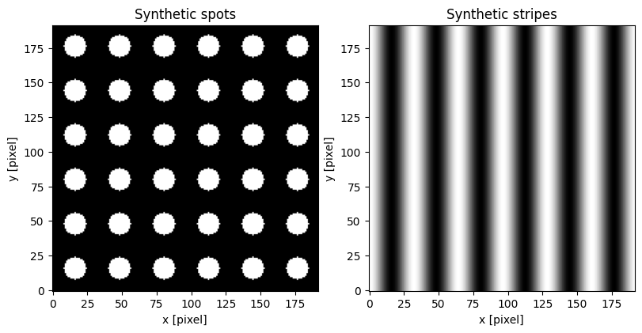
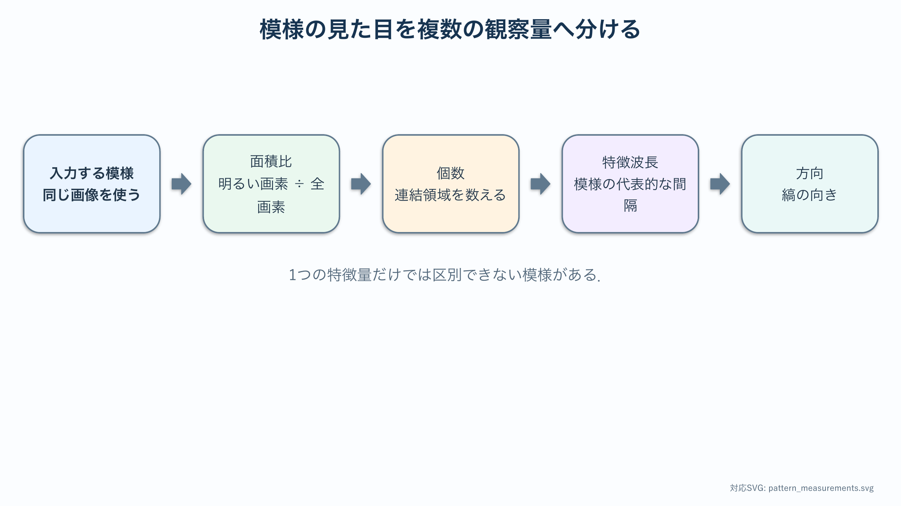
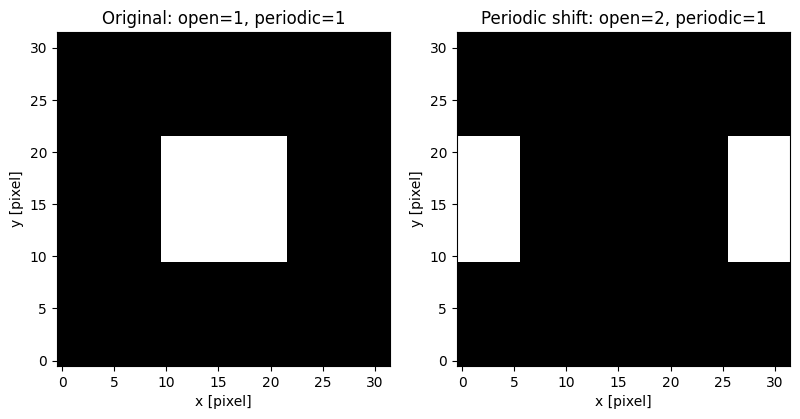
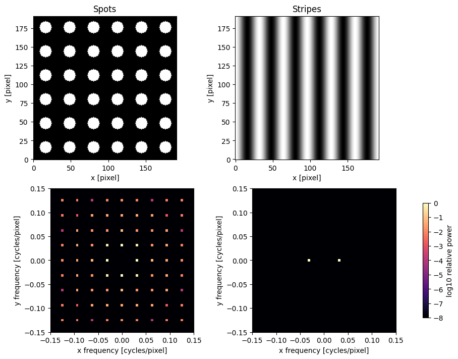

# 模様解析の基礎：画像を数値で測る

:::{tip} 対応 Notebook
[22_snake_pattern_features.ipynb](../notebooks/22_snake_pattern_features.ipynb)
:::

## この章の目的

[前章](./21_reaction_diffusion_basic.md)では方程式から模様を生成した．本章では，画像を**{abbr}`特徴量(対象の性質を比較可能な数値に要約した量)`**へ変換する．人工画像で実装を検証し，各特徴量で区別できる性質と区別できない性質を説明できるようになることが目的である．実画像への適合は，この検証を終えてから設計する．

## 学習ガイド

| 学習内容 | 到達確認 |
| --- | --- |
| 画像配列と二値化 | 前景，閾値，画素間隔を定義する |
| 面積比 | 面積は分かるが配置は分からないと説明する |
| 連結成分 | 4近傍・8近傍と画像端の扱いを指定する |
| Fourier解析 | 周波数，角波数，波長を単位付きで換算する |
| 人工画像での検証 | 既知の値と比較するコードを書く |
| 頑健性 | 不変であるべき操作と区別すべき変化を分ける |

## 正解が分かる人工画像から始める

実写真には曲面，影，鱗，背景，撮影角度が含まれる．最初から実写真だけを使うと，測定法の誤りと写真固有の影響を区別できない．まず面積や周期が既知の画像を作る．



左は円を縦横に32画素間隔で配置した二値画像，右は $I(x,y)=0.5+0.5\cos(2\pi x/32)$ を標本化した画像である．右の波長は式から32画素と分かる．左は斑点の間隔と直径という少なくとも2つの長さを持つので，FFTでどのピークを測っているか確認する．本例では格子の間隔に対応するピークが得られるが，任意の斑点画像でも最大ピークの逆数が斑点間隔になるとは限らない．



図の4つの測定は同じ画像を異なる観点から要約している．特徴量を増やす目的は，1つの量の不足を別の量で補うことであり，多ければ必ずよいわけではない．

## 配列と二値化の定義

濃淡画像を $I_{j,i}$ とし，配列の形を $N_y\times N_x$，画素間隔を $d_y,d_x$ とする．第0軸が縦，第1軸が横である．まず画像全体が解析対象の長方形であり，各画素の面積が同じ場合を扱う．

**{abbr}`二値化(閾値を境界として画素を前景と背景に分ける操作)`**では，閾値 $\tau$ に対し

```{math}
B_{j,i}=\begin{cases}1&I_{j,i}\ge\tau,\\0&I_{j,i}<\tau\end{cases}
```

と定める．本章は明るい画素を前景にする規約である．暗い斑点を測りたい場合は $I\le\tau$ を使うか，事前に明暗を反転するかを明記する．濃度の高い $v$ と写真の明るさが同じものだと自動的に仮定してはいけない．

```python
binary = image >= threshold
```

この1行にも，等号を含むか，どちらを前景とするかという測定の定義がある．たとえば値が $0.2,0.4,0.6,0.8$ の4画素で，$\tau=0.5$ なら前景は2画素，$\tau=0.7$ なら1画素である．固定閾値，自動閾値，手動で選んだ閾値のいずれも，選択規則と値を記録する．

## 面積比が測るもの

全画素数を $N_{\rm pix}=N_xN_y$ とすると，前景の**{abbr}`面積比(解析領域の面積に対する前景面積の割合)`**は

```{math}
:label: eq-pattern-area
r_{\rm area}=\frac{1}{N_{\rm pix}}\sum_{j,i}B_{j,i}
```

である．等面積の画素なら，画素数の比は面積の比に一致する．`np.mean(binary)` で計算でき，値の範囲は0から1である．不規則な関心領域 $R$ だけを測る場合は，分子も分母も $R$ 内の画素に限る．背景を0として画像全体を平均すると，模様ではなく背景面積にも依存してしまう．

面積比は配置に依存しない．$16\times16$ の白い正方形を1つ置いても，$8\times8$ の白い正方形を4つ離して置いても，前景は256画素である．同じ大きさの画像上なら面積比は等しいが，前景領域の数は1と4になる．これを課題の検証例にする．

## 連結成分と境界の規約

**{abbr}`連結成分(指定した近傍規則で前景画素をたどって到達できるひとまとまりの領域)`**を数えるには，隣接関係を決める必要がある．4近傍は上下左右，8近傍はそれに斜め4方向を加える．斜めに接する2画素は，4近傍では2成分，8近傍では1成分になる．

```python
structure = ndimage.generate_binary_structure(2, 1)  # 4近傍
labels, count = ndimage.label(binary, structure=structure)
```

8近傍では第2引数を2にする．SciPyの既定値は4近傍なので，研究では明示的に指定する．返されるラベル0は背景であり，成分数には含めない．[公式仕様](https://docs.scipy.org/doc/scipy/reference/generated/scipy.ndimage.label.html)も確認する．

連結成分数はいつでも斑点数を表すわけではない．1本の迷路状領域は大きく複雑でも1成分である．小さなノイズが孤立すると成分数が増える．成分面積の分布も見ると，大きな模様と小さなノイズを区別しやすい．大きさの違う画像を比較するなら，成分数そのものではなく共通面積の領域や単位面積当たりの数を用いる方法がある．

### 画像端で切れた成分をどう数えるか

写真の長方形領域をそのまま扱う開いた境界と，反対側の端をつなぐ周期境界では成分数が変わる．`ndimage.label` は反対側の端を自動ではつながない．Notebookの `component_count(..., periodic=True)` は，端同士で接するラベルを追加で併合する．



左図の1つの領域を `np.roll` で移すと，右図では両端へ分かれる．開いた画像として数えれば1成分から2成分へ変わるが，周期領域として数えればどちらも1成分である．面積比は変わらない．この図は，平行移動への不変性を議論する前に境界の規約が必要であることを示す．

写真と周期モデルを比べる際は，生成画像から写真と同じ大きさの領域を切り出して両方を開いた境界で測るなど，同じ観測手順を用いる．端に触れる成分を除く方法にも大きな成分を除きやすい偏りがあるため，無条件に優れた方法ではない．

## Fourier変換から繰り返し間隔を測る

### 空間周波数と角波数を区別する

**{abbr}`空間周波数(単位長さ当たりの繰り返し回数)`**を $\nu$，角波数を $q$ とすると，$q=2\pi\nu$ である．本章のFFT関数が返すのは空間周波数であり，前章の線形解析で用いた角波数とは $2\pi$ だけ異なる．

画像の平均を引いた $I'_{j,i}=I_{j,i}-\bar I$ に対する2次元離散Fourier変換を

```{math}
\widehat I_{m,n}=\sum_{j=0}^{N_y-1}\sum_{i=0}^{N_x-1}
I'_{j,i}\exp\left[-2\pi\mathrm{i}\left(\frac{mj}{N_y}+\frac{ni}{N_x}\right)\right]
```

とする．$\mathrm{i}$ は虚数単位で，添字 $i$ とは区別する．NumPyの既定のFFTはこの規約を使う．本章では**{abbr}`パワースペクトル(周波数ごとの振幅の2乗を並べた量)`**を

```{math}
P_{m,n}=\frac{|\widehat I_{m,n}|^2}{N_{\rm pix}^2}
```

と定める．窓関数を掛けない場合，$\sum_{m,n}P_{m,n}=\operatorname{Var}(I)$ になる．分散はすべての周波数のパワーの合計なので，パワーがどの周波数にあるかは分からない．これが分散を波長の代わりに使えない理由である．[NumPyの変換規約](https://numpy.org/doc/stable/reference/routines.fft.html)を参照できる．

横方向の周波数は `np.fft.fftfreq(Nx, d=dx)`，縦方向は `np.fft.fftfreq(Ny, d=dy)` で得る．負の周波数も含まれ，単位は `d` に指定した長さの逆数である．正方形でない画像でも各軸を別々に定義すればよい．[fftfreqの公式仕様](https://numpy.org/doc/stable/reference/generated/numpy.fft.fftfreq.html)では，この単位を繰り返し回数毎長さとして定義している．

### ピークから波長の候補を求める

本Notebookでは，平均成分を除いた2次元パワーの最大点を選ぶという，検証しやすい定義を使う．その周波数を $(\nu_x^*,\nu_y^*)$ とすると

```{math}
\ell_{\rm peak}=\frac{1}{\sqrt{(\nu_x^*)^2+(\nu_y^*)^2}}
=\frac{2\pi}{|\mathbf q^*|}
```

である．これは**{abbr}`特徴波長(指定した測定法で選ばれた代表的な繰り返し間隔)`**の候補であって，すべての模様を表す唯一の長さではない．方向を平均したスペクトルの最大点とは別の定義である．動径平均を採用する場合は，半径を画素添字ではなく周波数の大きさで定義し，区間幅と平均の仕方も記録する．

```python
centered = image - image.mean()
power = np.abs(np.fft.fft2(centered))**2 / image.size**2
power[0, 0] = 0  # 平均に対応するゼロ周波数だけを除く
iy, ix = np.unravel_index(np.argmax(power), power.shape)
frequency = np.hypot(fx[ix], fy[iy])
wavelength = 1 / frequency
```

この抜粋は非一様な画像用である．完全に一定の画像やコントラストが指定した許容値以下の画像には代表波長を割り当てず，完全な実装では `NaN` を返す．ゼロ周波数と，最初の非ゼロ周波数を混同してはいけない．後者は画像幅全体を1周期とする正当な成分である．

幅192画素で横方向の6番目の周波数にピークがあれば $\nu_x=6/192$，$\nu_y=0$ なので波長は32画素になる．1画素が0.5 mmなら波長は16 mmである．斜め波では $\sqrt{\nu_x^2+\nu_y^2}$ を使うので，横方向の添字だけで割ってはいけない．

### 原画像とスペクトルを読む



上段が原画像，下段がゼロ周波数を中央へ移して表示したスペクトルである．下段の軸は空間周波数であり，色はピークを基準にした相対パワーの対数である．平均を引いているため，中央に元画像の平均値のピークは残っていない．

縞は縦方向に延びるが，明暗は横方向に変化するので，スペクトルの強い2点は横軸上にある．実数画像では正負の周波数に対応する対が現れるため，2点あることが2種類の波長を意味するわけではない．円を格子状に並べた画像には縦横の周期と高調波が現れる．高調波，斑点径，複数の間隔が競合する場合，最も高い点だけでは不十分なのでスペクトル全体も保存する．

### 画像端と解像度に注意する

FFTは切り出した画像を周期的に繰り返すものとして分解する．左右端の明るさが不連続だと，その段差の周波数成分も測定される．平均を引いても端の段差は消えない．**{abbr}`窓関数(端へ向かって重みを小さくして切り出し境界の影響を抑える関数)`**を掛ける方法はあるが，振幅やピーク幅も変わる．Notebookでは既知の周期画像には窓を使わず，必要なら `window=True` でHann窓の影響を比較できる．

観測できる最小の周波数間隔は横方向で $1/(N_xd_x)$ であり，周波数は離散的に測られる．最大周波数の目安は $1/(2d_x)$ である．2画素程度の周期は解像度の限界に近く，模様の形を十分に表せない．実写真では十分な画素数で1周期を捉えているか確認する．画像の画素数を同じに縮小しただけでは，同じ実長を観測したことにはならない．

## 特徴量の検証と頑健性

| 検証画像・操作 | 期待する結果と注意 |
| --- | --- |
| 前景256画素を1塊と4塊に配置 | 面積比は等しく，成分数は異なる |
| 斜めに接する2画素 | 4近傍で2，8近傍で1 |
| 一定画像 | 波長は未定義で `NaN` |
| 画像幅を1周期とする余弦波 | 最初の非ゼロ周波数を残して正しい波長を得る |
| 同じ振幅で波長16と32の余弦波 | 分散は等しいが波長は異なる |
| `np.roll` による周期的平行移動 | 窓なしのFFTパワーと面積比は丸め誤差を除いて不変 |
| 開いた境界での成分数 | 周期的平行移動でも端で切れて変わりうる |
| 閾値を変える | 濃淡画像は変化しうるが，0と1だけの画像は $0<\tau\le1$ なら不変 |

平行移動ではFourier係数の位相だけが変わり，絶対値の2乗は変わらない．ただし，この厳密な性質は周期的な移動と窓なしの場合である．切り出し，外側への0埋め，補間を伴う移動，窓掛け後の移動にはそのまま適用できない．90度回転は等方的な画素の正方形画像なら周波数軸を交換するが，任意角度の回転には補間と切り出しの影響もある．

閾値感度は人工斑点だけでなく連続濃淡の縞でも調べる．0と1の二値画像で0.3，0.5，0.7を試して結果が変わらなくても，実写真で閾値に頑健だとはいえない．ノイズを加える場合は，強度，分布，seed，値域を切り詰めたかを記録する．同じ基礎乱数を強度倍して比較すると強度の影響を見やすく，別seedでも繰り返すとそのばらつきを評価できる．

ノイズ画像でもFFTには最大点が存在しうる．したがって，波長の値が返ったことは明瞭な周期の存在を保証しない．図，スペクトルの集中度，処理条件による変化を併せて読む．基準値が0や未定義の量には相対誤差を機械的に使わず，絶対差や未定義になった割合を報告する．

## 演習問題

1. 前景画素数が厳密に等しく，連結成分数が異なる2画像を作る関数を実装せよ．
2. 斜めに接する2画素と，端をまたぐ1領域を作り，近傍と境界の規約で成分数がどう変わるか表にせよ．
3. 波長16と32の余弦波，一定画像，画像幅が1周期の余弦波を作り，波長関数の結果を検証せよ．
4. 濃淡縞に複数強度のノイズを加え，閾値・ノイズ・平滑化に対する各特徴量の感度を測定せよ．

```{dropdown} 解答例：面積と連結
同じ64×64画像に16×16の前景を1個置く場合と，互いに離れた8×8の前景を4個置く場合を比べる．どちらも面積比は $256/4096=0.0625$ だが成分数は1と4である．円では境界の画素化によって面積が近似的にしか一致しないので，最初の実装検証には正方形が扱いやすい．

斜めの2画素は4近傍で2成分，8近傍で1成分となる．両端に分かれた領域は開いた境界では2成分だが，反対側をつなぐ周期境界では1成分になる．これらはアルゴリズムの誤差ではなく定義の違いである．
```

```{dropdown} 解答例：波長と分散
幅192画素の余弦波は，波長16なら12周期，波長32なら6周期を含むので，FFTの周波数格子と一致してそれぞれの波長が得られる．振幅がともに0.5なら分散は $0.5^2/2=0.125$ で等しい．一定画像では波長を定められず `NaN`，幅192画素を1周期とする画像では192画素が正しい．この最後の例は，最初の非ゼロ周波数を誤って削除する実装を検出できる．
```

```{dropdown} 解答例：感度の解釈
ノイズは孤立した前景を作ったり領域をつないだりするので，成分数が変わりやすい．平滑化は小さなノイズを減らす一方，細い縞や小さな斑点も失わせうる．同じ閾値と境界規約で処理前後の画像・数値を保存する．

面積比や波長が常に安定とは限らない．閾値付近に多くの画素がある画像では面積比が動き，周期性の弱い画像ではFFTの最大点が変わる．1つのseedや1枚の人工画像だけで一般的な頑健性を主張せず，複数条件で期待値からのずれを比較する．
```

## チェックポイント

- [ ] 前景，閾値，画素間隔，解析領域を定義した．
- [ ] 面積比と成分数を手計算可能な画像で検証した．
- [ ] 開いた境界と周期境界で数え方が異なることを確認した．
- [ ] 空間周波数と角波数の換算，波長の単位を説明できる．
- [ ] 一定画像，最初の非ゼロ周波数，長方形画像を検証した．
- [ ] 各特徴量が区別できない模様と，前処理への感度を示した．

## 卒業研究へ進む

本章の検証は，特徴量を使った結論を信頼するための準備である．[卒研ロードマップ](./23_snake_research_roadmap.md)では，観測領域と長さの対応を決め，互いに補完する特徴量を選び，探索に使わない画像で比較結果を検証する．最終的には，似た画像の提示に加えて，どの性質をどの精度で比較できたかを示す．
