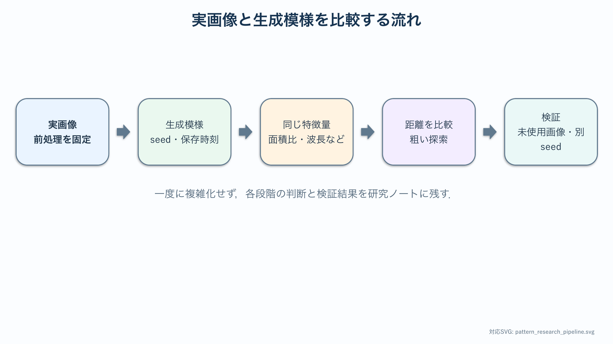

# 卒研ロードマップ：生成模様と実画像を比較する

:::{important} この章の役割
対象画像，{abbr}`前処理(解析前に画像の大きさや明るさなどを整える処理)`，{abbr}`特徴量(画像の性質を比較可能な数値として要約した量)`，{abbr}`損失関数(生成結果と観測データの違いを1つの数値で表す関数)`，{abbr}`探索範囲(パラメータを試す最小値と最大値の範囲)`を学生自身が決める．本章は順序と検証項目を示すが，最適パラメータや最も似た模様は示さない．
:::

## このロードマップの使い方

この章は研究期間を通して参照する．対象画像，前処理，特徴量，シミュレーション条件を一度に決める必要はない．各段階で小さな例を検証し，判断理由と失敗例を研究ノートへ残してから次へ進む．

- 対象画像の範囲と利用条件
- 前処理を再実行できる手順
- 最初に測る特徴量と人工画像での検証
- seed，刻み幅，終了条件などの固定項目
- 探索範囲を広げる根拠



## 段階1：研究対象を定義する

ヘビ模様全般を対象にすると研究範囲が広すぎる．次を1ページにまとめる．

- 対象種または模様タイプ
- 背側・腹側・体側などの部位
- 個体数と画像数
- 斑点，縞，網目のどれを主に測るか
- 反応拡散で説明したい範囲
- 画像の利用条件と出典

**通過条件**：1枚の画像ではなく，研究対象となる画像集合を説明できる．

## 段階2：画像取得と前処理を固定する

最初は少数画像で手順を確立する．

1. {abbr}`関心領域(画像のうち解析対象として選択した範囲)`を切り出す．
2. 大きさ・向き・解像度をそろえる．
3. 背景や強い影を除く．
4. グレースケール化する．
5. 二値化または濃淡のまま解析するか決める．
6. 処理前後を並べて保存する．

閾値を画像ごとに手調整すると再現性が失われる．自動法を使う場合も，そのアルゴリズムとパラメータを記録する．

## 段階3：特徴量を1つ選ぶ

最初から複合損失を作らない．研究の問いに最も近い特徴量を1つ選び，人工画像と実画像で挙動を確認する．

候補：

- 面積比
- 連結成分数と面積分布
- 特徴波長
- 縞の方向
- 空間自己相関
- 境界長や円形度

**通過条件**：その特徴量が区別できる模様と，区別できない模様を例示できる．

## 段階4：実画像側のばらつきを測る

個体間・部位間・前処理条件による特徴量の分布を描く．平均値だけでなく，範囲，標準偏差，外れ値を確認する．

同じ画像を日を変えて再処理し，手作業によるばらつきも見積もる．シミュレーションとの比較より先に，観測側の不確かさを知る．

## 段階5：反応拡散側の基準データを作る

[反応拡散基礎のNotebook](../notebooks/21_reaction_diffusion_gray_scott.ipynb)を複製し，次を固定する．

- 格子サイズと時間刻み
- 初期条件と乱数seed
- 境界条件
- 計算終了判定
- 保存する時刻
- 数値安定性の確認方法

まず1つのパラメータ設定を複数seedで実行し，生成模様自体のばらつきを測る．

## 段階6：1特徴量で粗い探索をする

探索範囲と刻みを先に宣言し，粗い格子で特徴量の地図を作る．実画像との距離は，最初は1特徴量の差だけにする．

```{math}
L_1(\theta)=|f_\mathrm{sim}(\theta)-f_\mathrm{obs}|
```

ここで $\theta$ は反応拡散パラメータ，$f$ は選んだ特徴量である．この式は探索の答えではなく，比較手順の最小形である．

## 段階7：特徴量を追加する

1特徴量では区別できないことを確認してから，2つ目を追加する．

```{math}
L(\theta)=\sum_j w_j d_j(\theta)
```

重み $w_j$ は教材から与えない．単位，観測ばらつき，研究上の重要度を根拠に学生が決める．重みを変えて結論が変わるかも調べる．

## 段階8：適合と検証を分ける

同じ画像でパラメータを選び，その画像への一致だけを報告すると{abbr}`過適合(使用したデータにはよく合うが未使用データには合わない状態)`になる．

- 一部画像でパラメータを選ぶ．
- 残りの画像で再現性を確認する．
- 別seedでも特徴量が保たれるか調べる．
- 近い損失を持つ複数パラメータを残す．

単一の最適値だけを示すより，同程度の説明力を持つパラメータ領域を示す方が妥当な場合がある．

## 段階9：モデルの限界を考察する

- 体の成長や曲面を無視している．
- 遺伝・発生過程を直接観測していない．
- 同じ見た目を複数モデルが生成しうる．
- 写真特徴が生成機構を一意に決めるとは限らない．

観測画像に類似する模様を生成できたことと，実際の模様形成機構を証明したことを区別する．

## 最小限の卒論図候補

1. 元画像と前処理結果
2. 実画像特徴量の分布
3. パラメータ空間の特徴量地図
4. 選択した候補パターンと実画像
5. 検証画像での誤差または特徴量比較

## 研究メモのテンプレート

```text
対象画像集合：
利用条件・出典：
関心領域：
前処理手順：
最初の特徴量（式・単位）：
人工画像による検証方法：
実画像側のばらつき評価：
反応拡散側で固定する条件：
粗探索の範囲：
データが得られない場合の代替案：
```
