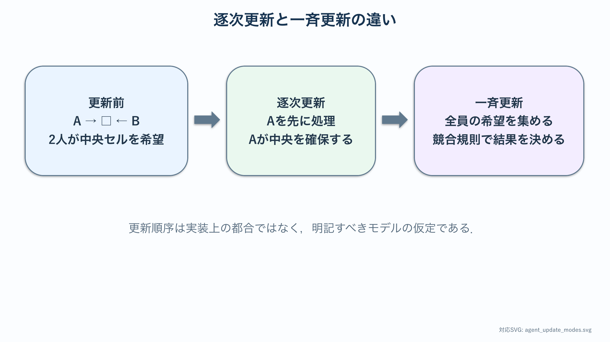
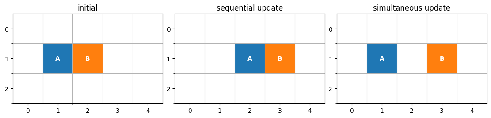
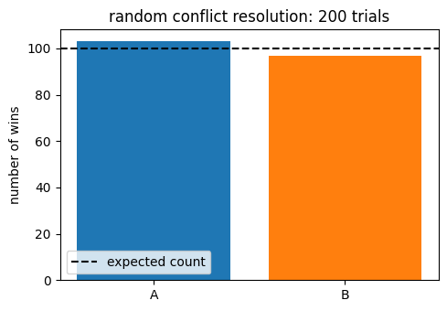

# 乗降研究の準備：離散状態・更新規則・乱数

:::{note} この資料の位置づけ
電車乗降の{abbr}`マルチエージェントモデル(複数の個体と個体間の相互作用を規則で表すモデル)`を学ぶ前の準備章である．微分方程式とは異なり，離散的な状態を規則によって更新する考え方を，少人数の手計算から身につける．更新規則と乱数の影響を検証した後，実際の乗降行動の比較へ進む．
:::

:::{tip} 対応 Notebook
[30_agent_foundations.ipynb](../notebooks/30_agent_foundations.ipynb)
:::

## この章の目的

{abbr}`セルオートマトン(格子上の離散状態を局所規則で更新するモデル)`やエージェントモデルを，単なるアニメーションではなく，状態・近傍・更新規則・終了条件を備えた数理モデルとして読めるようにする．また，更新順序と乱数が結果へ与える影響を区別し，後続章でシミュレーションを検証するための基礎を作る．

## 学習ガイド

| 学習内容 | 到達確認 |
| --- | --- |
| {abbr}`離散時間(時刻を連続量ではなく整数ステップとして扱う時間表現)`の力学系 | 状態と更新写像を分けて書く |
| 格子・セル状態・近傍 | 4近傍と8近傍を図示する |
| {abbr}`逐次更新(個体を1つずつ順番に更新し直前の変更を次の更新へ反映する方式)`と{abbr}`一斉更新(全個体の移動先を旧状態から決めて同時に反映する方式)` | 2人の競合を両方式で追う |
| {abbr}`排他則(1つのセルを同時に複数個体が占有できない規則)`・保存則・終了条件 | 人数保存と未完了を点検する |
| {abbr}`決定論(同じ状態と条件から常に同じ次状態が決まる考え方)`と確率的規則 | パラメータと{abbr}`seed(疑似乱数列を再現するための初期値)`を区別する |
| 評価量と反復実験 | 平均だけでは不十分な理由を述べる |
| Notebookの簡単な演習 | 更新方式と乱数の役割をコードで確認する |
| 確認問題 | 後続章へ進めるか自己判定する |

## 微分方程式から更新写像へ

ODEでは，現在の状態から変化率を計算した．一方，離散時間モデルでは，時刻を整数ステップ $t=0,1,2,\ldots$ とし，

~~~{math}
:label: eq-prep-agent-update
S_{t+1}=F(S_t)
~~~

と書く．$S_t$ は全エージェントの位置，種類，移動済みかどうかなどをまとめた状態，$F$ は1ステップ分の更新規則である．

確率的な選択を含む場合は

~~~{math}
:label: eq-prep-agent-stochastic
S_{t+1}=F(S_t,\xi_t)
~~~

と考える．$\xi_t$ は時刻 $t$ に使う乱数である．同じ状態 $S_t$ からでも異なる次状態へ進み得る点が，決定論的なODEと異なる．

式 $F(S_t,\xi_t)$ を実装するときは，決定論的な部分と確率的な部分を分けて書く．移動可能な候補セルを列挙する処理は状態 $S_t$ だけで決まり，候補が複数あるときに1つを選ぶ処理で乱数 $\xi_t$ を使う．この分離により，ルールの誤りと乱数による試行差を区別しやすくなる．

1ステップの中で状態を読む時点も明記する．全員が $S_t$ を見て候補を出すのか，直前の人を動かした後の状態を見るのかによって，同じ移動規則でも $F$ は異なる写像になる．

## 空間・状態・近傍を別々に決める

2次元正方格子を使うとき，最初に次の3項目を分けて定義する．

- **空間**：車内，ドア，ホームをどのセルで表すか．
- **セル状態**：空，乗車客，降車客，壁などをどう符号化するか．
- **近傍**：次の移動候補としてどのセルを参照するか．

中央セルから上下左右を見るものを4近傍（von Neumann近傍），斜めも含めるものを8近傍（Moore近傍）という．8近傍を採用すると斜め移動が可能になるが，縦横移動と同じ時間でよいかという新しい仮定が生じる．

セル幅を $0.5\,\mathrm{m}$，1ステップを $0.5\,\mathrm{s}$ とすれば，縦横に1セル進む速さは $1\,\mathrm{m/s}$ である．斜めに1セル進む距離は $0.5\sqrt{2}\,\mathrm{m}$ なので，同じ1ステップで許すと速さは $\sqrt{2}\,\mathrm{m/s}$ になる．8近傍を使う場合は，斜め移動の時間を調整するか，この差をモデルの仮定として記録する．

:::{important}
格子は単なる描画用の背景ではない．セル幅，近傍，壁の置き方が，移動可能性と所要ステップを決めるモデルの一部である．
:::

## 更新順序はモデルの一部である

空いている1セルをAとBが同時に目指す場合を考える．

### 逐次更新

Aを先に移動し，その結果を見てBを更新する．実装は簡単だが，常にAから処理するとAに有利な偏りが生じる．毎ステップ順序を無作為化しても，先に処理されたエージェントが移動先を確保する規則は残る．

### 一斉更新

全員が更新前の状態を見て希望先を出し，競合を解決してから同時に移動する．この場合は，次の3段階を区別する．

1. 各エージェントの移動候補を計算する．
2. 同じセルを狙う競合を解決する．
3. 確定した移動を一斉に反映する．

競合時には，無作為に1人を選ぶ，全員を停止させる，特定の種類を優先するといった方法がある．採用する方法によって流れは変わる．更新方式はコード上の都合ではなく，明記すべき仮定である．



図の左は同じ初期状態である．中央と右で次状態が違うのは，乱数の誤差ではなく，更新方式と競合規則の違いによる．

手計算では，まずAとBの希望先を別々に書き，次に競合セルへ印を付け，最後に競合解決規則を適用する．希望先の決定と競合解決を同時に考えると，誰がどの情報を使ったかが曖昧になる．コードでも候補計算，競合解決，一斉反映を別の処理へ分けると確認しやすい．

## {abbr}`不変量(更新を繰り返しても値が変わらない量)`と終了条件

実行中に必ず保たれるべき量を**不変量**という．人の生成・消滅を扱わない最小モデルなら，

~~~{math}
N_{\mathrm{inside}}(t)+N_{\mathrm{platform}}(t)+N_{\mathrm{finished}}(t)
=N_{\mathrm{total}}
~~~

が全ステップで成り立つはずである．また，排他則を置くなら，どのセルにも2人以上が入ってはならない．

終了状態も明確にする．

- **正常終了**：全員が目的領域へ到達した．
- **{abbr}`打ち切り(完了前に設定した計算上限へ達して観測を終了すること)`**：最大ステップ数に達したが，未完了者がいる．
- **{abbr}`デッドロック(複数の個体が互いを妨げて誰も進めない状態)`**：未完了者がいるのに，状態が変わらなくなった．

最大ステップ数をそのまま完了時間として記録すると，正常終了と失敗を混同する．打ち切り率やデッドロック率も結果として残す．

## 乱数seedは実験条件ではない

移動候補の選択や競合解決に乱数を使うと，同じ人数・同じ行動規則でも完了時間が変わる．seedは乱数列を再現するための番号であり，行動規則の強さを表すパラメータではない．

1回だけの結果 $T_1$ で規則を評価せず，同じ条件でseedを変えて $T_1,\ldots,T_n$ を得る．少なくとも

~~~{math}
\bar T=\frac{1}{n}\sum_{r=1}^{n}T_r
~~~

と，ばらつき，打ち切り数を報告する．分布が歪んでいる場合は中央値や四分位範囲も役立つ．

## 何を測るか

| 評価量 | 答える問い | 注意点 |
| --- | --- | --- |
| 完了ステップ数 | 全員の移動にどれだけかかるか | 1ステップの実時間換算が必要 |
| 通過人数の時系列 | いつ流れが滞ったか | 累積値と瞬間値を区別する |
| 密度 | どこに混雑が集中したか | 観測領域の定義が必要 |
| 待ち時間 | 個人差がどの程度あるか | 平均だけで長い裾を隠さない |
| 打ち切り・デッドロック率 | 規則が完了可能か | 完了時間と別に集計する |

研究では，見た目が滑らかに流れたかではなく，問いに対応する評価量を事前に決める．

## 最小例を紙で追う

大人数を動かす前に，3×3程度の格子と2人のエージェントで次を試す．

~~~text
状態を描く
  → 各人の候補セルを書く
  → 競合を印で示す
  → 規則に従って1人を選ぶ
  → 全員を同時に移す
  → 人数と重複を確認する
~~~

同じ初期配置を逐次更新と一斉更新で1ステップ進め，結果が異なる例を自分で作る．この差を説明できれば，コードを読む準備ができている．

## Notebookの簡単な演習

[対応Notebook](../notebooks/30_agent_foundations.ipynb)では，3行5列の格子にAとBを置き，右へ1セル進む更新を1回だけ実行する．大人数の乗降モデルへ進む前に，更新前の状態，移動候補，更新後の状態を手で追える大きさに限定している．



左が初期配置であり，Aの右隣にBがいる．中央の逐次更新では，先にBが右へ移動し，空いた場所へAが続くため，2人とも移動する．右の一斉更新では，全員が初期配置だけを見る．Aの希望先は初期時点でBが占有しているため，Bだけが進み，Aは待つ．結果の違いは乱数ではなく，更新方式の違いである．

Notebookでは，各状態について2人の位置が重複していないことを `assert` で検査する．図が自然に見えるかだけでなく，人数保存と排他則をコードで確認する練習である．



棒は，同じ空きセルを希望したAとBのうち，無作為に選ばれた回数である．破線は同確率なら期待される100回を示す．有限回の実験では2本の棒が完全には一致しない．seedを変えると個々の回数は変わるが，試行数を増やすと勝率は0.5付近へ近づく．このばらつきと，Aを優先する確率そのものを変えることを区別する．

## 確認問題

1. 状態 $S_t$ に最低限含めるべき情報を3つ挙げよ．
2. 4近傍から8近傍へ変えると，移動時間の解釈にどんな問題が生じるか．
3. AとBが同じ空きセルを狙うとき，逐次更新と一斉更新の違いを説明せよ．
4. 最大500ステップで停止した試行を，完了時間500として平均してはいけない理由を述べよ．
5. seedを変える実験と，行動パラメータを変える実験の目的の違いを述べよ．

<!-- 
````{dropdown} 解答例
1. たとえば，各エージェントの位置，種類または目的，完了したかどうかを含める．乗降モデルなら，車内・ホーム・ドア・壁などのセル状態も必要である．さらに，1ステップ内で移動済みかどうかを区別する実装では，その情報も状態に含める．

2. 4近傍では1ステップで縦横に1セル進む．8近傍にすると斜め移動も許されるが，斜め1セルの距離は縦横の $\sqrt{2}$ 倍である．同じ1ステップで斜め移動を許すと，斜め方向だけ速く歩いたことになる．したがって，移動時間や速度の解釈を別途決める必要がある．

3. 逐次更新では，先に処理されたエージェントが移動先を確保し，後のエージェントはその結果を見て動く．処理順序による有利不利が生じる可能性がある．一斉更新では，全員が更新前の状態だけを見て希望先を出し，同じセルを狙う場合は競合解決規則で誰が動くかを決める．希望先の決定と競合解決を分ける点が重要である．

4. 最大500ステップで停止した試行は，500ステップで完了した試行ではない．未完了のまま観測を打ち切った試行を完了時間500として平均に入れると，正常終了と失敗を混同する．打ち切り数や打ち切り率を別に報告し，完了した試行の分布と分けて扱う．

5. seedを変える実験は，同じ人数・同じ行動規則・同じパラメータのもとで，乱数によるばらつきを調べるために行う．行動パラメータを変える実験は，優先度，移動確率，譲りやすさなど，モデルの規則そのものを変えたときの影響を調べるために行う．seedは再現用の番号であり，行動の強さを表す条件ではない．
````
 -->

## チェックポイント

- [ ] 状態，近傍，更新規則を別々に定義できる．
- [ ] 逐次更新と一斉更新の違いを小配置で示せる．
- [ ] 人数保存と1セル1人を検査項目にできる．
- [ ] 正常終了，打ち切り，デッドロックを区別できる．
- [ ] 確率的モデルでは反復実験が必要だと説明できる．

## 次に読む

[最小セルオートマトン](./31_agent_boarding_basic.md)で車内・ドア・ホームを持つ基準モデルを実装し，その後[確率的シミュレーションの基礎](./32_agent_boarding_behavior.md)で反復，分布，打ち切りを検証する．

## 参考文献・キーワード

- Helbing & Molnár, *Phys. Rev. E* (1995) {cite}`helbing1995social`
- キーワード：離散時間，セルオートマトン，近傍，排他則，一斉更新，競合解決，乱数seed，不変量，デッドロック
