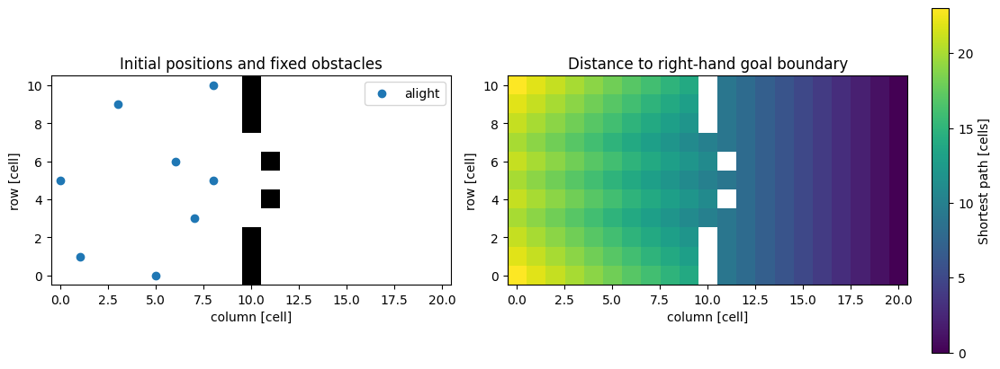

# 乗降モデルの基礎：最小セルオートマトン

:::{tip} 対応 Notebook
[31_train_boarding_ca.ipynb](../notebooks/31_train_boarding_ca.ipynb)
:::

## この章の目的

[乗降研究の準備](./30_agent_foundations.md)で学んだ状態，近傍，競合解決を，車内とホームを持つ格子へ具体化する．本章は格子上の**{abbr}`マルチエージェントモデル(複数の個体の状態と相互作用を規則で記述するモデル)`**を扱う．セルごとの状態を更新するセルオートマトンに関連するが，実装では個体の識別子と位置も保持する．

まず一方向流で人数保存，排他則，完了時間を検証する．次に対向流を加え，基準規則だけでは解決できない停止を調べる．完成した行動モデルの結論を得るのではなく，研究で規則を追加するための検証済みの基準を作ることが到達点である．反復の扱いは[32章](./32_agent_boarding_behavior.md)，独自ルールの比較は[33章](./33_boarding_research_roadmap.md)で扱う．

## 学習ガイド

| 学習内容 | 到達確認 |
| --- | --- |
| 状態と空間 | 個体の位置，種類，完了状態を区別する |
| 最短距離場 | 壁を避ける距離と直線的な距離を区別する |
| 一斉更新 | 候補計算，競合解決，反映を手で追う |
| 不変量と終了 | 正常完了，打切り，永久停止を判定する |
| 時間と占有 | 何を何ステップ測った量か説明する |
| 基準計算 | 一方向流と対向流の違いを検証する |

:::{warning} 適用範囲
本モデルはドア付近の移動を理想化した教育用模型であり，実際の停車時間や鉄道の安全性を直接評価するものではない．格子上で重複が起きないことも，現実の安全が保証されることとは異なる．
:::

## 空間と状態を定義する

配列の行を $r$，列を $c$ とし，$H\times W$ の格子を用いる．中央の列 $c=d$ に壁を置き，一部の行だけをドアとして通行可能にする．$c<d$ が車内側，$c>d$ がホーム側である．上下端も領域の外へ出ない閉じた境界とする．

- 降車客は車内側から右端の通行可能セルへ向かう．
- 乗車客はホーム側から左端の通行可能セルへ向かう．
- 目的の端へ到達した人は完了とし，計算領域の占有から取り除く．
- 固定障害物は通行不能セルであり，移動する人の人数には含めない．

右端・左端は計算対象から出る**{abbr}`吸収境界(到達した個体を領域内の更新対象から除く境界)`**である．車内端へ到達した人を除くことは，実際の乗車客が消えるという主張ではなく，車内奥の混雑を計算しない近似である．ドアを越えた時刻と，領域端まで到達した完了時刻は同じではない．


この模式図では車内とホームを上下に分けているが，Notebookの格子では左右に配置する．矢印は目的方向を表す．実際に動けるかは，壁と更新前の占有状態で決まる．Notebookの一斉更新では，そのステップで前の人が空けるセルにも入れない．

時刻は整数 $t=0,1,2,\ldots$ とする．個体 $i$ の状態に識別子，種類 $s_i$，位置 $\mathbf{x}_i(t)$，完了フラグを含め，全体状態を $S_t$ と書けば

```{math}
S_{t+1}=\mathcal U(S_t,\xi_t)
```

となる．$\xi_t$ は候補の同順位や競合を解決する乱数である．本モデルはこの更新写像を直接定義しており，連続運動方程式を単にオイラー法で離散化したものではない．

## 壁を避ける最短距離場

壁のない4近傍格子で1つの目標 $(r_g,c_g)$ まで移動する最小歩数は，マンハッタン距離 $|r-r_g|+|c-c_g|$ である．しかし壁があると，この値は実際に通れる経路の長さにならない．ドアへ回り込む距離を含める必要がある．

種類 $s$ の目標セル集合を $G_s$ とし，壁・固定障害物を通らない最短経路の歩数を $D_s(\mathbf c)$ と定義する．人の位置はこの距離場には含めない．目標では $D_s=0$，到達不能なら $D_s=\infty$ とする．到達可能な非目標セルでは

```{math}
D_s(\mathbf c)=1+\min_{\mathbf z\in\mathcal N(\mathbf c)\cap\Omega}D_s(\mathbf z)
```

が成り立つ．$\Omega$ は通行可能セル，$\mathcal N$ は上下左右の4近傍である．目標から外へ1歩ずつ調べる**{abbr}`幅優先探索(距離の近い頂点から順に調べ，等しい長さの辺を持つグラフで最短歩数を求める方法)`**で計算できる．ここでは通行可能セルを頂点，隣接関係を辺とみなしている．

```python
distance[goal] = 0
# queue にはすべての目標セルを入れておく．
while queue:
    pos = queue.popleft()
    for target in neighbors(pos, passable.shape):
        if passable[target] and np.isinf(distance[target]):
            distance[target] = distance[pos] + 1
            queue.append(target)
```



左図は通行可能な床，壁・固定障害物，初期の個体位置を示す．右図の色は降車側の右端までの最小歩数である．ドアから離れた行では回り込む分だけ距離が増える．この距離場は空間情報をあらかじめ与える仮定であり，人が毎回建物全体を探索していると主張するものではない．

## 一斉更新を実装する

### 更新前の空きセルから候補を選ぶ

時刻 $t$ の占有セル集合を $O_t$ とする．個体 $i$ の候補は

```{math}
\mathcal C_i(t)=\{\mathbf c\in\mathcal N(\mathbf x_i(t))\cap\Omega:
\mathbf c\notin O_t,\quad D_{s_i}(\mathbf c)<D_{s_i}(\mathbf x_i(t))\}
```

である．候補がなければその場に留まる．候補が複数なら距離が最小のものを選び，同順位は無作為に選ぶ．4近傍の最短歩数なので，採用される移動は距離をちょうど1減らす．

```python
occupied = occupied_cells(agents)  # ここで更新前の状態を固定する．
options = [pos for pos in neighbors(agent['pos'], passable.shape)
           if passable[pos] and pos not in occupied
           and distance[pos] < distance[agent['pos']]]
```

この規則は，混雑を避けるために一時的に距離を増やす移動や，同じ距離の横移動を許していない．対向者が正面にいる場合の弱点になり，後の研究で変更する候補となる．

### 競合を解決してから反映する

全員の希望先を記録し，同じセルを希望する個体をまとめる．希望者が $k$ 人なら，各人を確率 $1/k$ で1人だけ採用し，残りは待つ．その後に採用者を一斉に動かす．

```python
proposals = propose_moves(agents, passable, fields, rng)
winners, conflict_cells = resolve_proposals(proposals, rng)
# winners を確定してから，個体の位置を反映する．
```

反映をPythonのループで書いても，希望先を固定してから全員に適用すれば一斉更新である．反映途中の空きを次の人の候補計算に使う逐次更新とは区別する．本規則では目標セルは更新前に空きであり，採用者同士の目標も異なるため，1セル1人が保たれる．位置交換と，前の人が同時に空けるセルへの追従も起きない．

競合は重複占有が実際に起きたことではない．`conflict_cells` は複数の希望者がいたセルの個数であり，衝突事故の回数ではない．競合時に全員を停止させる別の規則も研究されているが {cite}`kirchner2003friction`，本Notebookには含めない．

## 保存則と停止状態を検証する

初期の乗降客数を $N$，更新対象の人数を $N_{\rm active}(t)$，完了済み人数を $N_{\rm finished}(t)$ とすると

```{math}
N_{\rm active}(t)+N_{\rm finished}(t)=N
```

が全時刻で成り立つ．完了者を配列の占有から取り除いても，個体記録は保存する．人数保存，位置の非重複，通行不能セルへ入っていないことを，毎ステップ `assert` で検査する．要求人数が配置可能セル数を超える場合も，黙って人数を減らさずエラーにする．

終了理由は次のように区別する．

| 終了状態 | 判定 | 記録する完了時刻 |
| --- | --- | --- |
| `completed` | 全員が目標へ到達 | 実際の時刻 $T$ |
| `cutoff` | 上限 $C$ でも未完了者がいる | 未観測として `NaN` |
| `deadlock` | 現在の規則では以後も動けない | 有限の完了時刻なしとして `NaN` |

上限と同じ時刻に全員が到達した場合は正常完了である．`t >= C` だけで打切りを判定してはいけない．初めから人数0なら完了時刻は0である．

本規則では，候補を持つ人が1人でもいれば，少なくとも1人は競合に勝って移動する．全員の候補が空なら，乱数を変えても候補は生まれず，状態は永久に変化しない．これを**{abbr}`吸収状態(到達すると以後の更新でも抜け出せない状態)`**としてデッドロックと判定できる．自発的な横移動や確率的な休止を追加したモデルでは，1ステップ動かなかっただけで吸収状態とはいえない．

```{dropdown} 一方向流が完了することを示す
全員が同じ距離場 $D$ に従い，各初期位置から目標へ到達可能とする．未完了者の距離の総和

$$\Phi(t)=\sum_{i\text{：未完了}}D(\mathbf x_i(t))$$

は非負整数である．移動するたびに少なくとも1減り，目標へ到達した個体の距離は0なので取り除いても増えない．

未完了者のうち距離が最小の人を選ぶ．最短経路の次のセルは距離が1小さいので，未完了者には占有されていない．完了者も除かれているため，この人には候補がある．したがって一方向流では未完了の吸収状態にならず，遅くとも $\Phi(0)$ ステップで完了する．

対向流では種類ごとに距離場が違うので，距離が小さいセルを別の種類の人が占有できる．距離の総和は移動中には減るが，途中の永久停止を排除できない．また，横移動や後退を加えれば距離が必ず減るという仮定自体を再検討する必要がある．
```

## 何の時間を測っているか

全員が領域端へ到達する時刻を

```{math}
:label: eq-boarding-completion
T=\inf\{t\ge0:N_{\rm active}(t)=0\}
```

とする．永久に到達しない場合は数学的には $T=\infty$ と定める．降車客・乗車客の最終完了時刻を，同じ原点から測った $T_a,T_b$ とすると，同時進行の本モデルでは $T=\max(T_a,T_b)$ である．どちらかが0人なら，その種類の完了時刻は0とする．

一方，降車が完了するまで乗車を開始しない別モデルでは，各段階の所要時間 $\tau_a,\tau_b$ を足して $T=\tau_a+\tau_b$ と書ける．共通原点からの完了時刻と，各段階の所要時間を混同しない．本Notebookは対向流を許すため，この和の式は使わない．

実際の停車時間には扉の開閉や乗降以外の待ち時間も含まれる．また，本モデルの $T$ にはドアを越えた後の領域端までの移動も含まれる．本章ではこれを停車時間ではなく，モデルの移動完了時間と呼ぶ．実動画へ接続するときは観測範囲と開始・終了の定義をそろえる．

セル幅を $a$，1ステップの時間を $\Delta t$ とすれば，停止なしで毎回1セル進む速さは $a/\Delta t$ である．これは自由移動時の速さであって，競合による停止を含む実効速度ではない．格子を細かくしても1人1セルを保つと，人の占有面積と最大密度 $1/a^2$ まで変わる．PDEの格子収束と同じ意味で解像度を上げたとはいえない {cite}`kirchner2004discretisation`．

## 占有率と人数密度

セル $\mathbf c$ に未完了者がいれば $n_{\mathbf c}(t)=1$，いなければ0とする．共通の観測上限 $C$ について

```{math}
V_{\mathbf c}=\sum_{t=0}^{C-1}n_{\mathbf c}(t),\qquad
\bar o_{\mathbf c}=V_{\mathbf c}/C
```

を定義する．$V$ は累積占有回数，$\bar o$ は無次元の時間平均占有率で $0\le\bar o\le1$ である．Notebookでは完了後は空の状態，証明されたデッドロック後は最後の配置が続くとして，同じ $C$ までの占有を計算する．固定障害物はこの人数に含めず，図では別色にする．

面積 $a^2$ のセルからなる観測領域 $R$ の瞬間人数密度は

```{math}
\rho_R(t)=\frac{\sum_{\mathbf c\in R}n_{\mathbf c}(t)}{|R|a^2}
```

であり，単位は人毎面積である．どのセルを分母に含めるかを指定する．障害物を除く有効面積を使う場合，障害物条件と基準条件で分母まで変わることに注意する．


図は一方向流の基準確認であり，共通の初期配置と色範囲を使う．この配置ではどちらも21ステップで完了するが，通過するセルの分布は異なる．完了時間が同じでも，空間的な経過まで同じとは限らない．明るいセルは多くの人が通過したか，誰かが長く待った場所である．これだけで原因は区別できないので，個体ごとの移動回数・停止回数や時系列も見る．1つの初期配置での差を，固定障害物の一般的な効果とみなさない．

## 未完了を含む比較

上限 $C$ までに完了したかを $\delta=\mathbf1(T\le C)$，**{abbr}`上限制限時間(完了時刻と共通の観測上限のうち小さい方を取った量)`**を $Y=\min(T,C)$ とする．未完了なら $Y=C$ だが，これは完了時間を $C$ と認定したことではない．$\bar Y$ と完了率を併記すれば，全試行を捨てずに同じ上限で比較できる．詳しい統計的な扱いは32章で学ぶ．


横軸は乗車人数だけを変えており，降車人数は8人で固定している．左は各条件20反復のうち完了した割合，右は $\min(T,C)$ の平均である．対向者が増えると，本規則では避けられない配置が生じる．右図が上限へ近づく場合，移動が遅くなったのか，永久停止が増えたのかを左図と終了状態の表で確認する．この段階の図は基準規則の限界の検証であり，推定値の不確かさの表示は次章で学ぶ．現実の人数と停車時間の関係を確定する図ではない．

## 演習問題

1. 壁のない格子と，ドアを通る必要がある格子で，マンハッタン距離と最短経路の歩数が一致する場合・しない場合を作れ．
2. 同じ空きセルを2人が希望する例と，向かい合った2人が互いを避けられない例を作り，1ステップずつ追え．
3. 1人が3セル進んで完了する配置を作り，上限2と3の終了状態を検証せよ．
4. ドア幅と乗車人数を別々に変える関数を実装し，終了状態，残人数，完了率，上限制限時間を記録せよ．

```{dropdown} 解答例：距離と競合
たとえばドアが行2だけにある5×5格子で，列2を壁とし，降車客を行0・列1へ置く．右端までの横方向の差は3だが，ドア行へ2歩移る必要があり，右端のどの行でもよい目標への最短歩数は5である．

同じ空セルを2人が希望した場合，各人を確率1/2で採用して他方を停止させる．一方，細いドア内で向かい合う場合，距離を減らす次のセルが互いに占有されれば希望先自体がなくなる．これは競合の抽選に負けた状態ではない．
```

```{dropdown} 解答例：時間と比較
上限2では未完了なので `completion_time=NaN, status='cutoff'`，上限3ではちょうど完了して `completion_time=3, status='completed'` となる．

比較表には，少なくとも人数，ドア幅，配置ID，seed，上限，終了状態，完了時刻，残人数を残す．完了者だけの平均は条件付きの量なので，未完了を含む条件全体の平均とは呼ばない．人数間隔が不均等なら，平均値の差を人数差で割って変化の速さを比較する．対応Notebookの課題と解答例に実装例がある．
```

## チェックポイント

- [ ] 壁を考慮した距離と移動可能な候補を区別できる．
- [ ] 本文とコードが同じ一斉更新を実装していることを確認した．
- [ ] 人数保存，排他則，入力人数，終了時刻を小配置で検証した．
- [ ] 一方向流の完了と対向流の停止を説明できる．
- [ ] 完了時刻，観測上限，永久停止の検出時刻を混同しない．
- [ ] 占有率，累積占有，実面積当たりの密度を区別できる．

## 参考文献と発展

競合規則の効果はKirchnerら {cite}`kirchner2003friction`，格子幅と歩行速度の関係は {cite}`kirchner2004discretisation` を参照できる．本Notebookはこれらのモデルそのものの再現ではない．社会力モデル {cite}`helbing1995social` のような連続モデルにも別の仮定と較正が必要であり，連続化すれば自動的に現実的になるわけではない．

次章で反復の不確かさを学んだ後，横移動，待機，一時退出などを自分の問いに応じて定義する．規則を変えた場合は，排他則に加え，距離が減る証明やデッドロック判定の仮定が残るかも検証する．
