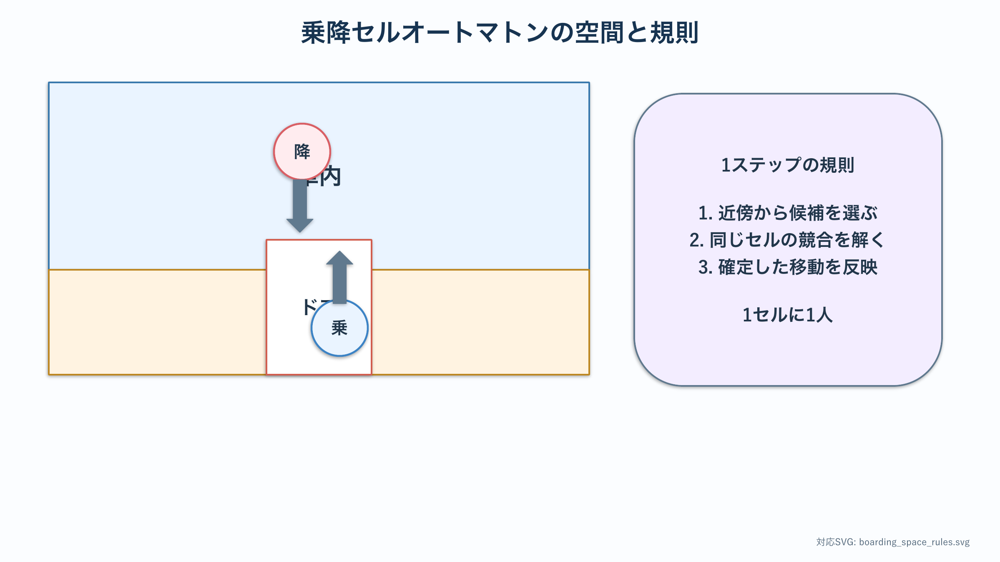
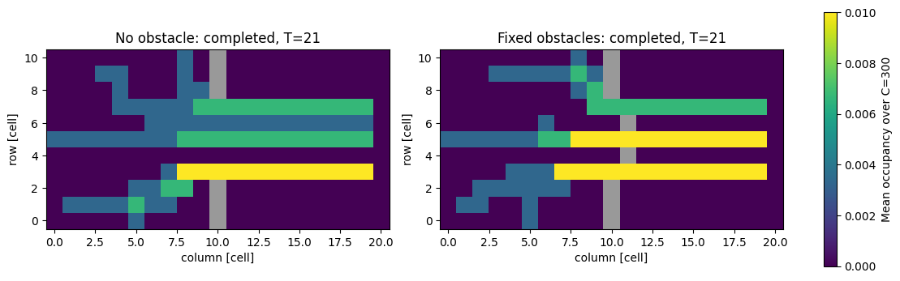
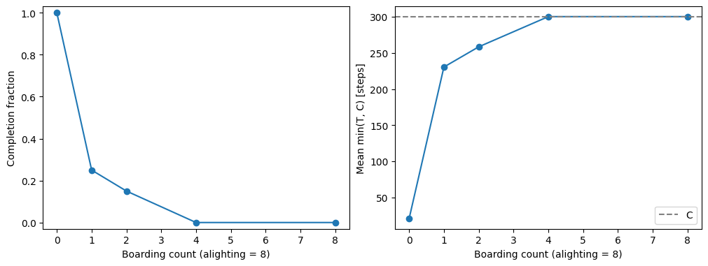

# 乗降モデルの基礎：最小セルオートマトン

:::{tip} 対応 Notebook
[31_train_boarding_ca.ipynb](../notebooks/31_train_boarding_ca.ipynb)
:::

:::{note} 学習経路での位置づけ
本章は乗降テーマの基礎モデルを扱う．[乗降研究の準備](./30_agent_foundations.md)で学んだ状態・近傍・競合解決を，車内とホームを持つ格子へ具体化する．次の[確率的シミュレーションの基礎](./32_agent_boarding_behavior.md)で反復とばらつきを検証してから，代替行動を比較する．
:::

## この章の目的

電車の乗降を，格子上の **{abbr}`マルチエージェントモデル(複数の個体と個体間の相互作用を規則で表すモデル)`（{abbr}`セルオートマトン（CA）(格子上の離散状態を局所規則で更新するモデル)`）** として表現する．連続モデルと離散モデルの違いを理解し，降車客・乗車客の移動ルール，衝突回避，更新順序の重要性を学ぶ．評価指標として **{abbr}`停車時間(乗降開始から全員の乗降が完了するまでの時間)`** に相当する量を測れるようになることを目指す．

## 学習ガイド

| 学習内容 | 到達確認 |
| --- | --- |
| 乗降を状態・空間・規則へ分解 | 3要素を別々に書く |
| CAと連続モデルの違い | 格子を細かくする意味の違いを説明する |
| 移動候補，{abbr}`排他制御(同じ資源を複数の個体が同時に使用しないようにする制御)`，更新順序 | 2人が同じセルを狙う例を手で追う |
| 完了時間と累積密度 | 指標の計算方法と単位を確認する |
| Notebookの2図を批判的に読む | 最大ステップ到達を完了と区別する |
| 小配置でルールを点検 | 人数保存と終了条件を確認する |
| チェックポイント | 反復実験へ進めるか判断する |

エージェント数を増やす前に，2～3人の配置を紙に描き，1ステップずつ更新する．コードの規則を人間が追えない状態で大規模計算へ進まない．

## 現象の説明

駅で電車が停まると，まず客が降り，次に客が乗る．ドア付近が混むと流れが滞り，停車時間が伸びる．これは多数の人（エージェント）が相互作用する **群集流動** の問題である．

:::{warning} 科学的な注意
本章では，ドア付近の局所的な行動が全体の流れに与える影響を調べるため，単純化した最小モデルを使う．このモデルから実際の鉄道事業者の運用・安全基準を評価しない．
:::

## 最小モデル

人を連続的に動かす代わりに，空間を格子（セル）に区切り，各エージェントが1ステップに1セル動く **セルオートマトン** を使う．

- 空間：2次元格子．車内・ドア・ホームを領域として区別する．
- エージェント：降車客（車内→ホーム），乗車客（ホーム→車内）．
- ルール：各エージェントは目的地に近づくセルへ動く．空きセルがなければ留まる．
- 1セルに1人（排他制御）．これが衝突回避になる．



青と赤の矢印は移動の目的方向を表すが，実際の移動は近傍セルの空きと競合解決で決まる．領域の色分けと更新規則を混同しない．

連続モデル（後述の社会力モデル等）に比べ，CA は実装が軽く，ルールの効果が見やすい．最小モデルとして最適である．

### PDEの差分法との共通点と違い

[PDE入門](./10_pde_foundations.md)の差分法も，本章のセルオートマトンも，格子上で近傍の状態を参照して次時刻を決める．共通点は**局所更新**と**境界条件**である．

ただし，PDEの格子値は温度や濃度という連続量の近似であり，格子を細かくした極限の方程式を考える．一方，本章のセルは人がいる／いないという離散状態そのもので，個体差や排他則が中心になる．どちらを選ぶかは，個人の行動を残す必要があるかで判断する．

## 数式・記法による定式化

### エージェントの位置と更新

エージェント $i$ の位置を $x_i(t)$ とする．連続時間風には

```{math}
:label: eq-cont
x_i(t+\Delta t) = x_i(t) + v_i(t)\,\Delta t
```

と書けるが，CA ではこれを離散化し，各ステップでエージェントが移動先の候補セルを選ぶ．降車客 $i$ は出口セル $g_i$ への距離

```{math}
:label: eq-dist
d_i(\mathbf{c}) = \|\mathbf{c} - g_i\|_1
```

を最小化する隣接セル $\mathbf{c}$ へ動こうとする（$\|\cdot\|_1$ は{abbr}`マンハッタン距離(各座標方向の距離の絶対値を足した距離)`）．乗車客は逆に車内の空き座席・空間へ向かう．

たとえば現在位置が $(2,3)$，出口が $(2,0)$ なら距離は3である．候補 $(2,2)$ へ進めば距離は2になるが，候補 $(3,3)$ では4になるため，最短距離規則では $(2,2)$ を優先する．ただし，最短セルが占有されている場合に待つのか，距離が同じ別セルへ迂回するのかを追加規則として決める必要がある．

距離だけで移動先を決めると，複数人が同じ最短セルへ集中しやすい．そこで候補セルの占有，周辺密度，移動方向の変更回数などを選択規則へ加えることが考えられるが，最初は距離と排他則だけの基準モデルを検証する．

### 更新順序

複数エージェントが同じセルを狙うと衝突する．これを避けるため，各ステップで

1. 全員の移動先候補を計算する．
2. 競合（同じ空きセルを複数が狙う）を解決する（例：ランダムに1人だけ通す）．
3. 確定した移動を一斉に適用する．

**更新順序を変えると結果が変わる**．{abbr}`逐次更新(個体を1人ずつ順番に更新する方式)`と{abbr}`並列更新(全個体の移動を旧状態から決めて同時に反映する方式)`では渋滞の出方が違う．これは CA を扱う上での重要な注意点である．

競合解決を確認するには，2人が中央の空きセルを同時に希望する配置を作る．候補計算後には希望者が2人，競合解決後には採用者が1人，状態反映後にもセル占有者が1人でなければならない．この3時点の情報をログへ出すと，排他則を破る場所を特定しやすい．

### 評価指標

停車時間に相当する量を，全降車客が降り終え全乗車客が乗り終えるまでのステップ数で測る．

```{math}
:label: eq-dwell
T_\mathrm{dwell} = T_\mathrm{alight} + T_\mathrm{board}
```

$T_\mathrm{alight}$ は降車完了までのステップ数，$T_\mathrm{board}$ は乗車完了までのステップ数である．

式 {eq}`eq-dwell` を使う場合は，乗車開始を降車完了後に限定する規則を仮定している．乗車と降車を同時に許すモデルでは，2つの時間を単純に足すと重複時間を二重に数える．その場合は，最初の移動開始から全員完了までの時刻を直接 $T_\mathrm{dwell}$ と定義する．評価指標の式は更新規則と整合させる．

1ステップを実時間へ換算するには，セル幅と代表歩行速度が必要である．セル幅 $0.5\,\mathrm{m}$ を1ステップで進み，歩行速度を $1\,\mathrm{m/s}$ とするなら1ステップは約0.5秒に対応する．ただし停止や競合解決を含むため，実測データと比較して換算の妥当性を確認する．

## パラメータの意味

| 記号 | 意味 |
| --- | --- |
| 格子サイズ | 車内・ホームの広さ |
| ドア幅 | 同時に通れる人数 |
| 降車客数・乗車客数 | 混雑の度合い |
| 更新方式 | 逐次／並列 |

## 数値シミュレーション

Notebook では次を行う（seed 固定）．

1. 2次元格子を定義し，車内・ドア・ホームを設定する．
2. 降車客を車内に，乗車客をホームにランダム配置する．
3. 降車ルール → 乗車ルールの順で各ステップを更新し，衝突を回避する．
4. ドア付近に固定障害物（立っている人）を置く条件も用意する．
5. シミュレーションを実行し，完了までのステップ数 {eq}`eq-dwell` と密度分布（ヒートマップ）を可視化する．

### 図1：累積滞在回数



横軸・縦軸は格子セルの位置で，白破線は車内とホームを分けるドア列である．色は瞬間の人数密度ではなく，各ステップの占有状態を足し合わせた**累積滞在回数**である．明るいセルほど，誰かが長時間そこにいたことを意味する．

両図のタイトルに $T=600$ とある．このNotebookでは `MAX_STEPS=600` で計算を打ち切るため，600ステップで乗降が完了したとは限らない．むしろ両条件とも終了条件を満たさず，上限へ到達した可能性を最初に疑うべきである．

累積値は計算時間が長いほど自動的に大きくなる．異なる完了時間の条件を比べる場合は，`density / steps` として1ステップあたりの占有率へ正規化するか，同じ観測時間で比較する．カラーバーの上限もそろえなければ，色の明るさだけで条件差を判断できない．

この図は，可視化が美しくてもモデルが正しく完了しているとは限らない好例である．図を作る前に，未完了人数，終了理由，最大ステップ到達フラグを記録するようコードを改善する余地がある．

累積滞在回数を解釈するときは，高い値が多数の人の短時間通過によるのか，少数の人の長時間停止によるのかを区別する．個体ごとの滞在時間または時刻別密度も併記すると，混雑と停止の原因を分けて読める．

### 図2：人数と完了ステップ



横軸は乗車者数と降車者数を同じ値にしたときの片方の人数，縦軸は返されたステップ数である．人数6では約20ステップだが，10以上ではすべて600になっている．

この水平部分から，人数10以上では停車時間が一定であると判断してはいけない．600は物理的な結果ではなく，`MAX_STEPS` という計算上の上限である．統計ではこのように真の完了時間が観測範囲を越えたデータを**{abbr}`打切り（censoring）(対象の完了前に観測上限へ達し，真の完了時間が得られないこと)`**として扱う．

次に行うべきことは上限をむやみに増やすことだけではない．どの配置で動けなくなったか，移動規則が{abbr}`デッドロック(複数の個体が互いを妨げて誰も進めない状態)`を作っていないか，乗車者と降車者が互いに進路を塞いでいないかを調べる．卒研では完了時間と未完了率を別の指標として記録する必要がある．

:::{note} 評価指標
この章の評価指標は **停車時間 $T_\mathrm{dwell}$**，ドア付近の **密度**，および **制限時間内に完了したか**である．アニメーションの見た目で終わらせず，終了理由と未完了人数も数値で出すこと．
:::

## 卒業研究への接続

- ドア幅・乗降人数を変えた基準計算は，研究用の代替行動を加える前にモデルの性質を把握する予備実験になる．
- 次の技能章では，行動ルールを加える前に，複数seedによる反復とばらつきの扱いを学ぶ．
- 連続モデル（社会力モデル {cite}`helbing2010pedestrian`）に置き換えると，より現実的な流れが得られる．CA との比較も研究になる．
- 基準モデルを検証した後，[卒研ロードマップ](./33_boarding_research_roadmap.md)を使って具体的な行動分類と比較へ進む．

## チェックポイント

- [ ] 空間，エージェント，状態，更新規則を区別できる．
- [ ] 並列更新で競合を解決する手順を説明できる．
- [ ] 初期人数が保存されることを確認した．
- [ ] 終了条件と完了時間の定義を説明できる．
- [ ] 同じseedで基準計算を再現した．
- [ ] 行動ルールを比較する前に基準分布が必要だと説明できる．

## 演習問題

1. **実装理解**：並列更新で2人が同じ空きセルを狙ったとき，どう競合解決すべきか．乱数を使う方法と優先度を使う方法の長所・短所を述べよ．
2. **数値実験**：Notebook で乗車客数を変え，$T_\mathrm{dwell}$ がどう増えるか図にせよ．線形に増えるか，ある人数を超えると急増するか．
3. **考察**：降車完了後に乗車を始める規則と，降車中にも乗車を許す規則では，$T_\mathrm{dwell}$ がどのように変化すると予想するか．モデルで確かめる方法を述べよ．

## 発展課題

- 逐次更新と並列更新を切り替えられるようにし，$T_\mathrm{dwell}$ の差を比較せよ．
- ドアを2つにして，客が近い方のドアを選ぶルールを加え，混雑の偏りを観察せよ．

## 参考文献・キーワード

- Helbing & Johansson, *Pedestrian, Crowd and Evacuation Dynamics* {cite}`helbing2010pedestrian`
- キーワード：マルチエージェント，セルオートマトン，排他制御，更新順序，停車時間 $T_\mathrm{dwell}$，密度分布
