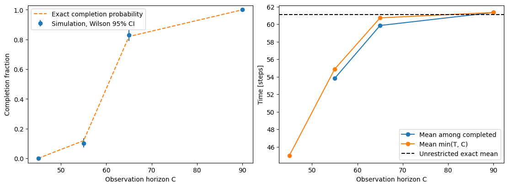

# 確率的シミュレーションの基礎：反復とばらつき

:::{tip} 対応 Notebook
[32_stochastic_simulation_repeats.ipynb](../notebooks/32_stochastic_simulation_repeats.ipynb)
:::

## この章の目的

確率的なモデルでは，同じパラメータでも試行によって結果が異なる．本章では，理論的な平均・分散が分かる練習模型を使って，乱数の再現，反復の集計，平均の不確かさ，未完了の扱いを検証する．その後，[31章のCA](./31_agent_boarding_basic.md)や[独自行動の比較](./33_boarding_research_roadmap.md)へ同じ考え方を適用する．

## 学習ガイド

| 学習内容 | 到達確認 |
| --- | --- |
| Bernoulli試行と待ち時間 | 1ステップの通過規則から平均を求める |
| 理論分布 | 完了時間と失敗回数の違いを説明する |
| 乱数と反復 | 再現性と独立な試行を区別する |
| 標準偏差と標準誤差 | 何のばらつきかを説明する |
| 打切り | 完了者だけの集計が選別を含むと説明する |
| 対応比較 | 試行ごとの差とその不確かさを計算する |

## 解析できるボトルネック模型

空間を省略し，合計 $m=N_a+N_b$ 人が狭い出口を順に通る模型を考える．先に $N_a$ 人が降車し，その後に $N_b$ 人が乗車する．未通過者がいる間，各ステップで独立に確率 $p$ の通過判定を1回だけ行い，成功なら1人が通る．失敗なら誰も通らない．

この通過判定は，成功1・失敗0を取る**{abbr}`Bernoulli試行(一定の確率で成功か失敗のいずれかになる試行)`**である．一定の $p$，時刻間の独立性，1ステップ1人までという仮定を置く．前の人の通過で $p$ が変わる混雑模型ではない．31章の空間CAから導出した式でもなく，統計処理の練習用の別模型である．

```python
success = uniforms[time] < p
time += 1
if success:
    if remaining_alight > 0:
        remaining_alight -= 1
    else:
        remaining_board -= 1
```

最後の降車者が通った同じステップに乗車者も通すと，1ステップ1人という仮定に反する．条件分岐を別々の `if` にせず，1回の成功でどちらか1人だけを減らす．

### 1人が通過するまでの時間

通過したステップ自身も含めた待ち時間を $G=1,2,\ldots$ とする．$0<p\le1$ のとき

```{math}
\Pr(G=k)=(1-p)^{k-1}p
```

であり，**{abbr}`幾何分布(独立な成功判定で最初の成功までに必要な試行数の分布)`**と呼ぶ．最初の1ステップの後，確率 $1-p$ で最初と同じ待ち方に戻るので，期待値 $\mu=E[G]$ は $\mu=1+(1-p)\mu$ を満たす．したがって

```{math}
E[G]=\frac1p,\qquad \operatorname{Var}(G)=\frac{1-p}{p^2}
```

となる．成功前の失敗回数だけを数える規約では平均が $(1-p)/p$ になり，1だけ異なるので注意する．

```{dropdown} 分散の導出
最初の判定が失敗したことを表す変数を $B$，その後の独立な待ち時間を $G'$ とすると，分布として $G=1+BG'$ と書ける．$E[B]=1-p$，$E[G']=1/p$ より

$$E[G^2]=1+2(1-p)/p+(1-p)E[G^2]$$

となる．これを解くと $E[G^2]=(2-p)/p^2$ なので，$E[G^2]-E[G]^2=(1-p)/p^2$ を得る．
```

### 全員の完了時間

各成功の間の待ち時間は独立で同じ分布を持つため，$T=G_1+\cdots+G_m$ である．$m\ge1$ について

```{math}
:label: eq-bottleneck-moments
E[T]=\frac{m}{p},\qquad \operatorname{Var}(T)=\frac{m(1-p)}{p^2}
```

が厳密に成り立つ．この模型の仮定の下では近似式ではない．また，$t\ge m$ に対して

```{math}
\Pr(T=t)=\binom{t-1}{m-1}p^m(1-p)^{t-m}
```

である．最後のステップを成功とし，それ以前の $t-1$ ステップへ $m-1$ 回の成功を配置すると導ける．これが負の二項分布に対応する．SciPyの `nbinom(m,p)` は成功までの失敗回数 $T-m$ を返す規約なので，完了時間には $m$ を加える．[SciPyの定義](https://docs.scipy.org/doc/scipy/reference/generated/scipy.stats.nbinom.html)で規約を確認できる．

$m=44,p=0.72$ なら $E[T]\simeq61.11$，分散は約23.77，標準偏差は約4.88ステップとなる．$p=1$ では $T=m$，人数0では $T=0$ である．$p=0$ かつ人数が正なら完了しないので，コードには必ず上限を設ける．

## seedと独立な反復

**{abbr}`seed(疑似乱数列の初期状態を再現するための指定値)`**はモデルの行動パラメータではない．同じ計算条件，乱数生成器，実装，実行環境で同じseedを使えば，同じ結果を再現できる．ライブラリの版や処理順が変われば同じ数値列・結果になる保証はないので，環境も保存する．

同じseedで毎回生成器を初期化すると，同じ実験の複製になる．一方，生成器を一度だけ初期化して乱数列を順に使う方法や，反復ごとに別の乱数列を割り当てる方法で，独立な反復を近似する．本Notebookは次を使う．

```python
children = np.random.SeedSequence(2026).spawn(n_repeats)
for replicate, child in enumerate(children):
    rng = np.random.default_rng(child)
```

疑似乱数は決定論的な数列なので，異なるseedという事実だけで数学的独立性を証明したことにはならない．`SeedSequence` は実用上独立とみなせる乱数列を構成するための仕組みである．[NumPyの説明](https://numpy.org/doc/stable/reference/random/parallel.html)を参照できる．

31章では初期配置用と更新用の乱数を分けた．同じ初期配置で更新乱数だけを変えると，配置を固定した条件付きのばらつきを測る．配置も変えると両方のばらつきを含む．何を無作為化した反復かを記録する．1本の時系列の各時刻や，1試行の各人を独立な反復回数として数えてはいけない．

## 1回の経過と反復分布を読む


青線が0になるまでは橙線が減らず，降車後に乗車する順序を確認できる．各ステップで減る人数は0人か1人なので階段状になる．水平部分はその時刻の通過判定が失敗した区間であり，永久停止を意味しない．$p>0$ なら，現在何ステップ停滞していても次のステップで成功する可能性が残る．


左図の棒は反復から得た分布，点と線は負の二項分布に基づく理論値である．整数幅1の区間を使っているので，理論の各時刻の確率と比べられる．右図は最初の $n$ 試行の累積平均であり，水平線が $m/p$ を示す．後半で変化が小さくなっても，その図だけで必要反復数が決まるわけではない．

## 平均，標準偏差，標準誤差

打切りのない独立反復 $T_1,\ldots,T_n$ から

```{math}
\bar T=\frac1n\sum_{r=1}^nT_r,\qquad
s^2=\frac1{n-1}\sum_{r=1}^n(T_r-\bar T)^2
```

を求める．$s^2$ は不偏標本分散で，`sample.std(ddof=1)` がその平方根である．**{abbr}`標準偏差(個々の試行結果のばらつきの大きさ)`** $s$ と，平均の**{abbr}`標準誤差(平均などの推定値が反復標本ごとに変動する大きさ)`**は異なる．独立で共通の有限分散 $\sigma^2$ があれば

```{math}
:label: eq-standard-error
\operatorname{Var}(\bar T)=\frac{\sigma^2}{n},\qquad
\widehat{\operatorname{SE}}(\bar T)=\frac{s}{\sqrt n}
```

である．反復を4倍にすると標準誤差はおよそ半分になるが，個々の完了時間のばらつきが消えるわけではない．標本数1では $s$ とその推定標準誤差は求められない．

長い裾がある分布では中央値，四分位範囲，遅い側の分位点も併記する．たとえば $40,42,43,45,80$ の平均は50，中央値は43である．80が実装エラーか，正しく生成された稀な事象かを確認し，単に外れたという理由で削除しない．

### 平均の信頼区間と反復数

平均の95%信頼区間の一例は

```{math}
\bar T\pm t_{0.975,n-1}\frac{s}{\sqrt n}
```

である．$t_{0.975,n-1}$ は自由度 $n-1$ のStudentのt分布の分位点である．正規母集団の独立標本なら厳密な式だが，本章の離散的な完了時間では十分な反復数の下での近似として使う．強い歪みや少数の完了例しかない場合に無条件で適用しない．信頼区間は個々の試行の95%が入る範囲ではなく，標本を取り直して作る区間の被覆率を表す．[NISTの説明](https://www.itl.nist.gov/div898/handbook/eda/section3/eda352.htm)でもこの違いを確認できる．

大標本で区間の半幅を $\varepsilon$ 程度にしたいなら，予備計算の標準偏差 $s_{\rm pilot}$ を使い，$n\simeq(1.96s_{\rm pilot}/\varepsilon)^2$ を目安にできる．差を比較する研究では，個別条件の標準偏差ではなく差の標準偏差を使う．この目安はモデルの誤りを小さくするものではない．

累積平均は同じ標本を繰り返し含むので，隣り合う点は独立ではない．期待した差が出るまで反復を追加して止めると，通常の信頼区間の解釈が損なわれる．予備計算と本計算を分け，精度目標と反復数を先に記録する．

## 打切りを含むデータを扱う

共通の観測上限 $C$ に対して，完了指標 $\delta_r=\mathbf1(T_r\le C)$ と上限制限時間 $Y_r=\min(T_r,C)$ を記録する．上限と同じ時刻の完了も $\delta=1$ である．$T>C$ で正確な完了時刻が分からない観測は**{abbr}`右打切り(観測上限より後に完了することだけが分かり，完了時刻自体は観測されないこと)`**である．

| 集計量 | 推定する対象 | 注意 |
| --- | --- | --- |
| 完了率 $\hat q=\sum\delta_r/n$ | $\Pr(T\le C)$ | 上限と反復数を明示する |
| 完了者だけの平均 | $E[T\mid T\le C]$ | 未完了を含む全体の平均ではない |
| 上限制限平均 $\bar Y$ | $E[\min(T,C)]$ | 共通の $C$ で比較する |
| 無制限の平均 $E[T]$ | 完了時刻全体の平均 | 打切りを上限に置き換えただけでは求まらない |

永久停止に正の確率があれば，数学的には $E[T]=\infty$ になりうる．その場合も完了率と上限制限平均は定義できる．31章のように吸収状態を証明して早期停止した場合は，その後も未完了なので $Y=C$ とする．検出した時刻を $Y$ にしてはいけない．吸収性を証明できない早期停止では，共通上限までの状態は分からず，同じ処理はできない．

```{math}
E[\min(T,C)]=\sum_{t=0}^{C-1}\Pr(T>t)
```

は整数時間の $T\ge0$ に対する恒等式である．各試行について，完了していない時間区間の数を足すと $\min(T,C)$ になることから分かる．異なる理由・時刻で観測が途切れる場合には，生存時間解析などを別途検討する．本章は全試行に共通の上限がある場合に限定する．



左図は完了率とその区間，右図は完了者だけの平均と上限制限平均である．短い上限では速く終わった試行が選ばれるため，完了者だけの平均を全員の性能とみなすと過小評価する．完了例が0なら完了者だけの標本平均も得られず，0ではなく `NaN` として表示から除く．その場合も完了率と上限制限平均は記録する．練習模型では $\Pr(T\le C)=\Pr(\operatorname{Binomial}(C,p)\ge m)$ が成り立つので，完了率も理論値と比べられる．

完了率0や1のとき，単純な標準誤差 $\sqrt{\hat q(1-\hat q)/n}$ は0になるが，有限回の観測で確率を完全に特定したわけではない．Notebookでは二項比率のWilson区間を使う．たとえば全試行が成功しても区間の下端は1未満となる．式と端点の扱いは[NISTの二項比率の解説](https://www.itl.nist.gov/div898/handbook/prc/section2/prc241.htm)も参照できる．

```{dropdown} Wilson区間の式
$z$ を標準正規分布の0.975分位点とすると，95%Wilson区間の中心と半幅は

$$c=\frac{\hat q+z^2/(2n)}{1+z^2/n},\qquad
h=\frac{z}{1+z^2/n}\sqrt{\frac{\hat q(1-\hat q)}n+\frac{z^2}{4n^2}}$$

であり，区間は $[c-h,c+h]$ となる．これは独立な二項試行に対する近似区間であり，同じ初期配置を繰り返した相関の強い試行を独立として数えてよいことにはならない．
```

## 対応のある条件比較

基準条件と代替条件に同じ初期配置を与え，反復 $r$ ごとに

```{math}
\Delta_r=Y_{r,\rm alt}-Y_{r,\rm base},\qquad
\bar\Delta=\frac1n\sum_r\Delta_r,\qquad
\widehat{\operatorname{SE}}(\bar\Delta)=\frac{s_\Delta}{\sqrt n}
```

を計算する．負の差は代替条件の上限制限時間が短いことを意味する．完了例だけの差を使うと，両条件で完了した配置だけを選ぶので，全体の比較とは異なる．全試行で $Y$ の差を求め，完了率の差も併記する．

```{math}
\operatorname{Var}(Y_{\rm alt}-Y_{\rm base})=
\operatorname{Var}(Y_{\rm alt})+\operatorname{Var}(Y_{\rm base})
-2\operatorname{Cov}(Y_{\rm alt},Y_{\rm base})
```

である．正の共分散が得られる対応付けなら差のばらつきを減らせるが，必ず改善するわけではない．**{abbr}`効果量(条件間の違いの大きさを表す量)`**には，このようなステップ単位の平均差も含まれ，無次元の標準化量だけを指すわけではない．

同じseedを与えただけでは，同じ初期配置や同じ出来事の乱数が共有されるとは限らない．分岐によって乱数の消費数が変わるためである．配置を保存して複製し，必要なら時刻・個体・競合などに対応する乱数を別々に管理する．独立な乱数で条件を比較する方法も妥当だが，対応がなければ独立標本用の誤差評価を使う．

Notebookの練習では各反復の時刻別乱数 $U_t$ を共通にし，$p=0.65$ と $p=0.8$ を比べる．$U_t<0.65$ なら必ず $U_t<0.8$ なので，この特定の模型と対応付けでは後者の完了時刻は前者以下になる．複雑なCAの行動変更でも同じ単調性があるとは限らない．

## 演習問題

1. $m=44,p=0.72$ の平均，分散，標準誤差を理論式と反復結果で比べよ．
2. 毎回同じseedで初期化する反復を作り，分散0の解釈を説明せよ．
3. 上限を変え，完了率，完了者だけの平均，上限制限平均を比較せよ．
4. 共通の時刻別乱数で2つの通過確率を比較し，対応差の平均と標準誤差を計算せよ．

```{dropdown} 解答例：反復と精度
平均は約61.11，分散は約23.77，標準偏差は約4.88である．独立な400反復の平均の理論的な標準誤差は約0.244となる．反復数を1600へ増やすと約0.122になるが，個々の試行の標準偏差は約4.88のままである．

同じseedで毎回初期化すると，同じ結果を複製しているだけなので標本分散は0になる．これは独立な400回の情報ではない．固定seedは再現テストには適切だが，その複製から平均の精度を評価してはいけない．
```

```{dropdown} 解答例：打切りと差
打切りがある場合，完了例だけを集めた平均は $E[T\mid T\le C]$ に対応する．未完了の $T$ は不明だが $Y=C$ は既知なので，$Y$ を全試行で平均し，完了率も報告できる．ただし $\bar Y$ を無制限の平均と呼んではいけない．

比較では反復ごとの `alt-base` を作り，その標本標準偏差を $\sqrt n$ で割る．別々の平均の標準誤差を単純に足したり，対応を無視して共分散を0と置いたりしない．実装例は対応する解答Notebookにある．
```

## チェックポイント

- [ ] 練習模型の平均と分散を仮定から導いた．
- [ ] 人数0，$p=0$，$p=1$，上限ちょうどの完了を検証した．
- [ ] 再現テストと独立な反復を区別した．
- [ ] 標準偏差，標準誤差，信頼区間の意味を説明できる．
- [ ] 打切りを含む表から，対象の異なる平均を分けて計算した．
- [ ] 対応差と反復数の根拠を示せる．

## 卒業研究へ進む

理論値との一致は集計と乱数処理の検証であり，実際の乗降を再現した証拠ではない．[33章](./33_boarding_research_roadmap.md)で，基準モデルと独自ルールの比較対象，観測上限，反復単位，主評価量を定め，結果の不確かさとモデルの限界を分けて考察する．
