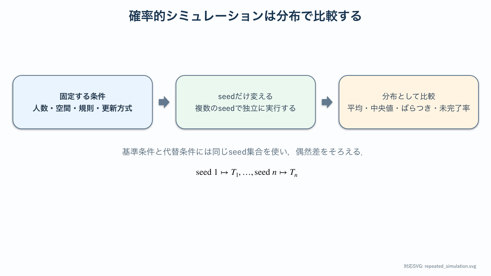
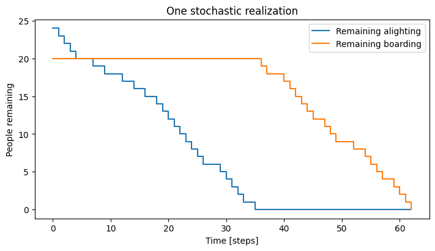
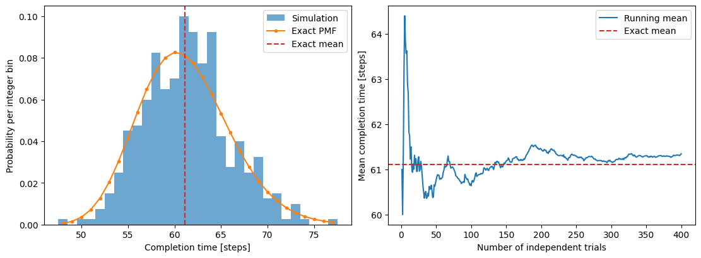

# 確率的シミュレーションの基礎：反復とばらつき

:::{tip} 対応 Notebook
[32_stochastic_simulation_repeats.ipynb](../notebooks/32_stochastic_simulation_repeats.ipynb)
:::

:::{note} 学習経路での位置づけ
本章では，単純なボトルネック模型を使い，乱数{abbr}`seed(疑似乱数列を再現するための初期値)`，{abbr}`反復実験(同じ条件で乱数だけを変えて複数回実行する実験)`，分布，推定誤差を学ぶ．基準モデルのばらつきを確認した後，固定型・横移動型・一時降車型などの行動ルールの比較へ進む．
:::

## この章の目的

確率的なエージェントモデルでは，同じパラメータでも実行ごとに完了時間が変わる．1回の動画や1個の数値だけを比較すると，偶然を行動ルールの効果と誤認する．本章では次を身につける．

1. 乱数seedを固定して計算を再現する．
2. seedを変えて独立な反復を行う．
3. 平均，{abbr}`中央値(値を小さい順に並べたとき中央に位置する値)`，{abbr}`標準偏差(個々の値が平均の周囲にどの程度散らばるかを表す量)`，{abbr}`分位点(並べたデータを指定した割合で区切る位置の値)`を使い分ける．
4. 反復回数を増やしたとき推定値が安定するか確認する．
5. 研究用の代替ルールを比較する前に，基準モデルのばらつきを測る．

## 学習ガイド

| 学習内容 | 到達確認 |
| --- | --- |
| 確率的計算で1回の結果が違う理由 | パラメータとseedを区別する |
| 練習用ボトルネック模型 | 1ステップの確率更新を説明する |
| 同じseedでの再現 | 同一結果を確認する |
| 1回の階段状時系列 | 停滞区間の意味を読む |
| 200 seedの分布と累積平均 | 平均・中央値・分散を比較する |
| {abbr}`標準誤差(標本から求めた平均値の推定精度を表す量)`と反復回数 | $1/\sqrt n$ の関係を確認する |
| チェックポイント | 行動比較へ進めるか判断する |

図を見る前に，完了時間の試行間差，分布の対称性，累積平均が安定するまでに必要な反復回数を予想して記録する．

## 練習用の最小ボトルネック模型

Notebookでは空間配置を単純化し，1つの狭い出口を通過する人数だけを追う．

- 先に降車者 $N_a$ が通過する．
- その後に乗車者 $N_b$ が通過する．
- 各時刻に1人が通過できる確率を $p$ とする．
- 通過できなかった時刻は待ち時間になる．

これは[乗降モデルの基礎](./31_agent_boarding_basic.md)のCAそのものではなく，確率的実験の扱いを学ぶための練習模型である．研究上の行動ルールを表すものではない．

各人の通過が独立で，1ステップの成功確率が $p$ なら，1人が通過するまでの待ち時間の期待値は $1/p$ ステップである．合計 $N_a+N_b$ 人なら，完了時間の期待値はおよそ $(N_a+N_b)/p$ になる．Notebookの反復平均がこの目安から大きく外れる場合は，更新規則や人数カウントを確認する．

この解析的な目安があるため，練習模型は乱数処理の検証に向いている．複雑なCAへ進むと厳密な期待値を求めにくくなるが，単純モデルで再現性と集計方法を確認した経験をそのまま使える．

## seedと再現性

{abbr}`疑似乱数生成器(決定論的な計算で乱数のような数列を作る仕組み)`はseedが同じなら同じ列を返す．

```python
rng = np.random.default_rng(seed)
```

同じseedで同じ結果になることを確認した後，seedを変えて分布を調べる．都合のよいseedだけを選ばない．

比較する2条件には同じseed集合を使う．seed 17で生成した初期配置を基準条件と代替条件の両方へ使えば，初期配置の偶然をそろえた差を計算できる．条件ごとに別のseed集合を使うと，ルール差と初期配置差が混ざる．

## 1回の結果と分布

完了時間を{abbr}`確率変数(偶然によって値が決まり，確率分布で記述される変数)` $T$ とする．反復結果 $T_1,\ldots,T_n$ から



左の条件は反復中に変えない．中央でseedだけを変えて複数の完了時間を得て，右の分布として基準条件と代替条件を比べる．

```{math}
\bar T=\frac{1}{n}\sum_{i=1}^n T_i
```

を求める．分布が歪んでいる場合は中央値や{abbr}`四分位範囲(第3四分位点から第1四分位点を引いた分布の幅)`も併記する．{abbr}`箱ひげ図(中央値，四分位範囲，外れ側の広がりを示す図)`や{abbr}`ヒストグラム(値を区間に分けて度数を棒で表す図)`は，平均値だけでは見えない失敗ケースを示す．

例として完了時間が $40,42,43,45,80$ なら，中央値は43だが平均は50である．80という長い試行が平均を押し上げている．この試行が正しい低確率事象なのか，デッドロックに近い実装上の問題なのかを個別に確認する．外れ値を理由なく削除せず，発生条件と終了理由を記録する．

### 図1：1回の確率的実行



横軸は時刻ステップ，縦軸はまだ通過していない人数である．青線は降車者，橙線は乗車者を表す．青線が0になるまで橙線は20人のままなので，この練習模型では降車完了後に乗車を開始する順序が実装されていると確認できる．

曲線が滑らかでなく階段状なのは，1ステップに通過する人数が0人または1人だからである．水平区間は計算停止ではなく，そのステップで通過が成功しなかったことを表す．傾きの平均は通過確率に関係する．

この図は1つのseedの例にすぎない．青線が0になる時刻や最終完了時刻を一般的な性能として報告してはいけない．実行規則の確認には使えるが，条件比較には分布が必要である．

## 平均値の不確かさ

独立反復とみなせる場合，平均値の標準誤差は

```{math}
:label: eq-standard-error
\mathrm{SE}(\bar T)=\frac{s}{\sqrt{n}}
```

で近似できる．反復回数を4倍にしても，標準誤差は半分にしかならない．必要な精度から反復回数を決める．

標準偏差 $s$ は個々の試行の散らばり，標準誤差は平均値の推定精度を表す．反復を増やしても個々の完了時間のばらつきが消えるわけではない．報告では平均と標準誤差だけでなく，標準偏差または分位点も示し，実行ごとの不確かさと平均推定の不確かさを分ける．

## 反復回数を決める

Notebookでは反復を増やしながら累積平均を描く．次を確認する．

- 少数反復で平均が大きく動いていないか．
- 外れ値がどの程度あるか．
- seedの範囲を変えて結論が変わらないか．
- 計算時間と推定精度の釣り合いはどうか．

### 図2：分布と累積平均



左のヒストグラムは同じパラメータでseedだけを変えた完了時間の分布である．赤線が平均，緑線が中央値である．両者が近くても完全には一致しないため，代表値を1つだけ報告せず，分布の幅と外れ側も見る．

右図は最初の $n$ 回までの累積平均である．反復数が少ない左側では値が大きく上下し，100回を越える頃から約61.5付近で変化が小さくなる．この結果だけを根拠に，すべての条件で100回の反復が十分であるとは一般化できない．パラメータやモデルを変えると分散も変わるため，各主要条件で安定性を確認する．

累積平均が安定して見えても，同じseedを繰り返していないか，seed間が独立か，稀な未完了ケースを見落としていないかを確認する．標準誤差は平均の推定精度であり，個々の実行のばらつきそのものではない．

## 卒業研究で発展させる内容

- ドア付近滞留者の行動分類
- 固定，横移動，一時降車のルール実装
- 行動別の停車時間ランキング
- 協調者割合の最適化
- 実測動画への適合

上の項目は，[卒研ロードマップ](./33_boarding_research_roadmap.md)に沿って行動の定義，ルール実装，反復比較の順に進める．

## チェックポイント

- [ ] 同じseedで結果が再現した．
- [ ] 50個以上の異なるseedで分布を描いた．
- [ ] 平均と中央値の違いを説明できる．
- [ ] 反復回数と標準誤差の関係を確認した．
- [ ] 1回の実行結果だけでは比較できない理由を説明できる．
- [ ] 基準モデルの計算時間を測定した．

## 演習問題

1. $p$ を固定し，反復回数 $n=10,30,100,300$ で平均値と標準誤差を比較せよ．
2. 同じseedを誤って繰り返した場合，分布と標準誤差にどんな問題が生じるか．
3. 平均値が同じで分散が異なる2条件を人工的に作り，平均だけでは区別できないことを示せ．
4. 乗降基礎章のCAについて，研究用ルールを追加する前に記録すべき基準統計量を列挙せよ．

## 次に進む

[卒研ロードマップ：行動ルールを比較する](./33_boarding_research_roadmap.md)へ進み，観察から行動を定義し，ルールを1つずつ追加して基準モデルと反復比較する．

## 参考文献・キーワード

- Helbing & Johansson {cite}`helbing2010pedestrian`
- キーワード：確率的シミュレーション，乱数seed，再現性，反復実験，標準誤差，分布，基準モデル
