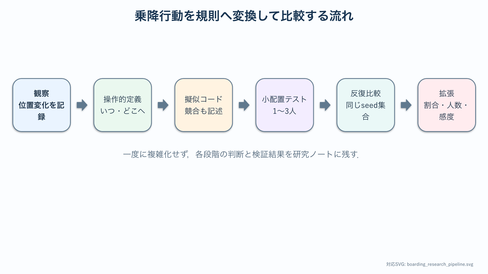

# 卒研ロードマップ：行動ルールを比較する

:::{important} この章の役割
観察した行動を判定可能な更新規則へ変換し，基準モデルと代替ルールを同じ条件で比較する．小配置による検証から反復実験までを順に進め，停車時間の変化を再現可能な形で評価する．
:::

## このロードマップの使い方

この章は，行動を観察可能な規則へ翻訳するとき，実装するとき，結果を比較するときに繰り返し参照する．まず基準モデルと代替ルール1つだけを扱い，手で追える小配置から検証する．

- 行動の発動条件と移動先
- 人数，空間，更新法，seedなどの固定条件
- 競合と未完了計算の扱い
- 同じseed集合による基準・代替ルールの比較
- 規則を追加する前に得られた失敗例



観察記録，行動ラベル，シミュレーション規則を別々に保存する．観察記録には位置と時刻など直接見える事実を書き，行動ラベルには分類基準を適用した結果を書き，シミュレーション規則にはそのラベルを格子更新へ変換する方法を書く．この3段階を分けると，解釈の違いと実装の違いを区別できる．

研究中は，正常終了した試行だけでなく，打切りやデッドロックも保存する．未完了試行を除いて平均完了時間を計算すると，失敗しやすいルールが良く見える．完了時間の分布と未完了率を並べて評価する．

## 段階1：観察可能な問いへ変える

行動の良し悪しに関する価値判断を避け，動画やシミュレーションで判定できる問いへ変える．

例の形式：

```text
ドア付近の人物が条件Aの移動を行う割合を変えたとき，
全員の乗降完了時間とドア前密度はどう変化するか．
```

この段階では条件Aの内容を，位置・移動距離・時刻で{abbr}`操作的に定義する(観察や測定の具体的な手順によって概念の意味を定める)`．

たとえば協力的に移動するという表現だけでは判定できない．ドアから2セル以内にいる人物が，降車者の接近後2ステップ以内に横方向へ1セル以上移動する，のように位置，方向，時間幅を定める．複数人が同じ動画を見て近い判定になるか確認する．

## 段階2：基準モデルを固定する

[乗降基礎のNotebook](../notebooks/31_train_boarding_ca.ipynb)を複製し，代替行動を入れない基準版を保存する．

- 車内・ホーム・ドアの大きさ
- 乗車者・降車者・滞留者の人数
- 初期配置
- 更新順序
- 衝突解決
- 乱数seed
- 終了条件

**通過条件**：複数seedで完了時間と密度の基準分布が得られる．

## 段階3：実際の行動を記述する

動画または観察記録から，解釈を入れずに位置変化を記述する．

- その場に留まる．
- 車内側へ移動する．
- 横へ移動する．
- 一時的に車外へ出る．

観察記録に基づいて分類基準を定める．曖昧な例をどう扱うか，複数人で一致するかも確認する．

## 段階4：ルールを1つだけ実装する

最初の代替ルールは1つにする．実装前に次を文章と{abbr}`擬似コード(プログラムの処理手順を特定の言語に依存せず記述したもの)`で書く．

1. いつ発動するか．
2. どのセルを候補にするか．
3. 移動できない場合どうするか．
4. 元の位置へ戻る条件は何か．
5. 他のエージェントと競合したときどうするか．

**単体確認**：人数1～3人の手で追える配置で，意図した更新になることを確認する．

## 段階5：1条件・複数seedで比較する

人数，初期配置の生成法，更新法を固定し，ルールだけを変える．各条件を同じseed集合で実行すると，初期配置の偶然をそろえた比較ができる．

記録する候補：

- 完了時間
- 降車完了時間と乗車完了時間
- ドア前最大密度
- 停止ステップ数
- 衝突回数
- 個人ごとの移動距離

平均値だけでなく，分布と{abbr}`効果量(条件間の差の大きさを尺度に依存しにくい形で表す量)`を示す．

同じseedごとに代替条件と基準条件の差 $\Delta T_r=T_{r,\mathrm{alt}}-T_{r,\mathrm{base}}$ を計算すると，初期配置をそろえた比較になる．$\Delta T_r<0$ は代替条件の方が短いことを表す．差の平均だけでなく，何割のseedで短縮したか，未完了率が増えていないかも確認する．

## 段階6：ルールの割合を変える

代替行動を取る人の割合 $p$ を研究変数にする．粗い値から始め，必要な範囲だけ細かくする．

```text
p = 0, 0.25, 0.5, 0.75, 1.0
```

単調な変化を仮定しない．中間割合で競合が増える可能性もある．

## 段階7：感度分析

主結果を得てから1要因ずつ変える．

- 総人数
- 乗車者と降車者の比
- ドア幅
- 滞留者の初期位置
- 更新順序
- 歩行速度の個人差

結論が特定の初期条件や更新アルゴリズムだけに依存していないか調べる．

## 段階8：実測との接続

実動画を使う場合は，撮影・利用許可，匿名化，個人識別を避ける処理を確認する．

- 人数と完了時間を測る．
- ドア前密度の時間変化を測る．
- 行動分類の観察者間一致を調べる．
- シミュレーションと同じ評価指標へ変換する．

実測との不一致は，モデルに不足する行動や空間要因を見つける材料になる．

実測値へ合わせるために複数パラメータを同時に調整すると，どの要因が改善へ寄与したか分からなくなる．まず人数，ドア幅，時間換算など直接測れる量を固定し，次に不確かな行動パラメータを少数だけ推定する．推定に使った動画と評価に使う動画を分ける．

## 最小限の卒論図候補

1. 空間・エージェント・更新則の模式図
2. 基準モデルのばらつき
3. 1つの代替ルールを入れた比較分布
4. 行動割合と評価指標の関係
5. 主要パラメータの感度分析

## 研究メモのテンプレート

```text
研究の問い：
基準条件：
行動Aの観測可能な定義：
発動条件：
移動候補と競合解決：
小配置テスト：
主評価指標：
未完了計算の扱い：
使用するseed集合：
実測が得られない場合の縮小案：
```

実動画を利用できない場合は，観察部分を仮想的な行動定義へ置き換え，基準規則と1つの代替規則の数値比較へ縮小する．この場合も，小配置テスト，同じseed集合，未完了率，感度分析をそろえれば，ルールが流れへ与える影響を系統的に検討できる．
