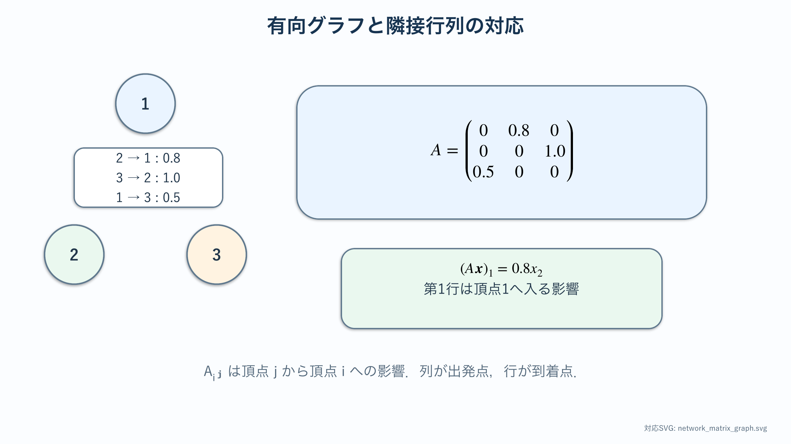
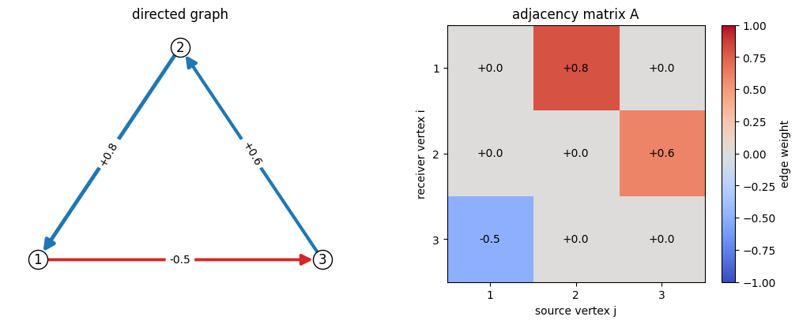
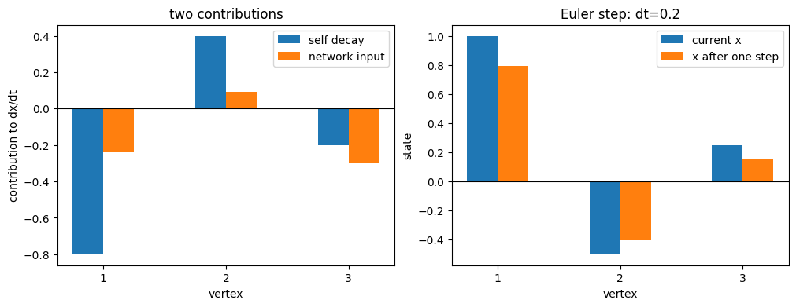

# 関係研究の準備：行列・有向グラフ・線形力学系

:::{note} この資料の位置づけ
関係モデルを学ぶ前の準備章である．Strogatzで学んだ{abbr}`線形ODE(状態変数とその変化率が線形関係で結ばれた常微分方程式)`と{abbr}`固有値(行列が特定の方向を何倍に伸縮させるかを表す値)`を復習し，それを{abbr}`有向グラフ(辺に出発点と到着点の向きがあるグラフ)`上の多変数系として読むための記法をそろえる．仮想的なネットワークで記法と安定性解析を確認してから，特定作品や実データへ接続する．
:::

:::{warning} 科学的な注意
以下の変数は数学的な仮想状態であり，実在人物の感情を測定・診断するものではない．状態変数に現実の名前を付けるときは，何を観測して値を定めるかを別途定義する必要がある．
:::

:::{tip} 対応 Notebook
[40_network_foundations.ipynb](../notebooks/40_network_foundations.ipynb)
:::

## この章の目的

{abbr}`ベクトル(複数の状態量を順序を保って並べたもの)`，行列，有向グラフを同じ相互作用の3つの表現として往復できるようにする．特に，{abbr}`隣接行列(頂点間の接続や影響の強さを成分として並べた行列)`の添字の向きを明示し，{abbr}`自己減衰(各状態が外部からの影響なしに基準値へ戻る働き)`と他者からの結合を分け，固有値から{abbr}`ネットワーク(頂点と頂点間の辺からなる接続構造)`全体の安定性を予想する．

## 学習ガイド

| 学習内容 | 到達確認 |
| --- | --- |
| 状態ベクトルと行列積の復習 | $(A\mathbf{x})_i$ を和で書く |
| 有向グラフと隣接行列 | 矢印3本を行列へ変換する |
| 行列の各行を変化率として読む | 入ってくる影響を1行ずつ説明する |
| 自己減衰＋ネットワーク結合 | $\alpha,\beta$ の役割を分ける |
| 固有値と安定性 | 結合強度の閾値を説明する |
| {abbr}`頂点状態(ネットワークの各頂点に置く時間変化する量)`と{abbr}`辺状態(ネットワークの各辺に置く時間変化する量)` | 2つのモデル化を区別する |
| Notebookの簡単な演習 | グラフ，行列積，1ステップ更新を対応させる |
| 確認問題 | 後続章へ進めるか自己判定する |

## 多人数の状態をベクトルへまとめる

$n$ 個の頂点に1つずつ状態があるとき，

~~~{math}
\mathbf{x}(t)
=
\begin{pmatrix}
x_1(t)\\
\vdots\\
x_n(t)
\end{pmatrix}
~~~

とまとめる．$\mathbf{x}(t)$ は時刻 $t$ におけるネットワーク全体の状態である．1つの頂点だけを見ず，全成分を同時に更新する．

行列 $A=(A_{ij})$ に対して，

~~~{math}
(A\mathbf{x})_i=\sum_{j=1}^{n}A_{ij}x_j
~~~

である．第 $i$ 成分は，すべての $j$ の状態を重み $A_{ij}$ で足したものになる．

たとえば $\mathbf{x}=(2,-1,3)^\top$ とし，第1行が $(0,0.8,0)$ なら，$(A\mathbf{x})_1=0\times2+0.8\times(-1)+0\times3=-0.8$ である．第1成分には頂点2の状態だけが寄与し，その符号も含めて伝わる．行列積を読むときは，各行について，どの列の状態が，どの重みで，どの成分の変化率へ入るかを文章にする．

ベクトルの成分順序を途中で変えると，行列の行と列の意味も変わる．$\mathbf{x}=(x_1,x_2,x_3)^\top$ と定めたら，図，表，コード，出力のすべてで同じ順序を使う．

## 有向グラフを隣接行列へ変換する

本教材では添字を

~~~{math}
A_{ij}
=
\text{頂点 }j\text{ から頂点 }i\text{ へ入る影響の強さ}
~~~

と定める．つまり，**列が影響の出発点，行が影響の到着点**である．文献やライブラリによって逆の約束もあるため，式と図の横に必ず定義を書く．

例として

~~~{math}
A=
\begin{pmatrix}
0&0.8&0\\
0&0&1.0\\
0.5&0&0
\end{pmatrix}
~~~

なら，矢印は $2\to1$，$3\to2$，$1\to3$ である．たとえば

~~~{math}
(A\mathbf{x})_1=0.8x_2
~~~

なので，頂点1が頂点2から影響を受けると読める．

矢印の出発点が列，到着点が行である．たとえば $A_{12}=0.8$ は，頂点2から頂点1へ向かう矢印に対応する．

図と行列を照合する最も確実な方法は，非零要素の一覧表を作ることである．各行に $(i,j,A_{ij})$ と矢印 $j\to i$ を書き，全要素を1本ずつ確認する．転置した行列 $A^\top$ を使うと全矢印が逆向きになるため，非対称な3頂点例で確認する．対称行列だけでは転置の誤りを発見できない．

:::{tip}
行列から図を描くときは，非零要素 $A_{ij}$ を1個ずつ探し，$j\to i$ と書く．頭の中だけで転置しない．
:::

## 線形ネットワーク力学系

各頂点が単独では原点へ戻り，他の頂点から影響を受ける最小モデルを

~~~{math}
:label: eq-prep-network-linear
\frac{d\mathbf{x}}{dt}
=
\left(-\alpha I+\beta A\right)\mathbf{x}
~~~

とする．

- $\alpha>0$：各状態が単独で減衰する強さ．
- $\beta$：ネットワークを通じた影響全体の強さ．
- $A$：誰から誰へ，どの符号・強さで影響するか．

第 $i$ 成分で書けば

~~~{math}
\frac{dx_i}{dt}
=-\alpha x_i+\beta\sum_{j=1}^{n}A_{ij}x_j
~~~

である．自己減衰と他頂点から入る影響を混ぜずに読む．

## 固有値から安定性を予想する

$A$ の固有値を $\mu$ とすると，系行列 $M=-\alpha I+\beta A$ の対応する固有値は

~~~{math}
\lambda=-\alpha+\beta\mu
~~~

となる．すべての $\lambda$ の実部が負なら原点へ収束し，正の実部を持つものがあれば，その方向の小さなずれが成長する．

$A$ の最大実部を持つ固有値を使うと，結合 $\beta$ を強くしたときに，どこで安定性が変わり得るか予想できる．ただし，複素固有値なら振動を伴う場合があり，負の重みを持つネットワークでは，結合の増加に伴って状態も単調に増加するとは限らない．

具体例として，$A$ の最大固有値が $\mu_{\max}=2$，自己減衰が $\alpha=1$ なら，対応する固有値は $\lambda_{\max}=-1+2\beta$ である．$\beta<0.5$ では負，$\beta=0.5$ で0，$\beta>0.5$ で正になる．したがって $0.5$ が安定性変化の候補である．この予想を数値積分前に書き，時系列の収束・発散と照合する．

数値積分の前に次を行う．

1. $A$ と $M$ の固有値を計算する．
2. 実部の符号から収束・発散を予想する．
3. 虚部があれば振動の可能性を予想する．
4. 時系列と相図で予想を照合する．

## Notebookの簡単な演習

[対応Notebook](../notebooks/40_network_foundations.ipynb)では，3頂点の仮想ネットワークを有向グラフと隣接行列で表示し，行列積 $A\mathbf{x}$ と{abbr}`陽的Euler法(現在の変化率を時間刻みだけ加えて次の状態を求める数値積分法)`による1ステップ更新を計算する．特定の人物や作品には対応させず，添字と矢印の向きを確認することに集中する．

左図の青い矢印は正の重み，赤い矢印は負の重みを示す．右図では，横軸が影響の出発点 $j$，縦軸が到着点 $i$ であり，色と数値が $A_{ij}$ を示す．たとえば左図の $2\to1$ の重み $+0.8$ は，右図の第1行第2列に置かれている．非零要素3個を矢印3本と照合する．

左図は，各頂点の変化率を自己減衰 $-\alpha\mathbf{x}$ とネットワーク入力 $\beta A\mathbf{x}$ に分けている．同じ頂点で2本の棒を足した値が $d\mathbf{x}/dt$ になる．右図は，その変化率を時間刻み $\Delta t$ だけ加えた更新前後の状態である．まず各寄与の符号を読み，次に更新後の棒が0へ近づいたか遠ざかったかを確認する．

時間刻み $\Delta t$ を変えると1ステップの移動量は変わるが，行列 $A$ の関係構造は変わらない．$\alpha$，$\beta$，$A$ はモデルの設定，$\Delta t$ は数値計算の設定である．Notebookの課題では，この違いを保ちながら1項目ずつ変更する．

## 頂点状態と辺状態を区別する

上のモデルでは，状態 $x_i$ は**頂点**に置かれている．一方，人物 $i$ から人物 $j$ への関係を直接状態にする場合，変数は $x_{ij}$ となり，**辺**に置かれる．

| モデル | 状態の場所 | 変数数の目安 | 問いの例 |
| --- | --- | ---: | --- |
| 頂点状態 | 各人物・各要素 | $n$ | 各人物の仮想状態はどう変わるか |
| 辺状態 | 各有向関係 | 最大 $n(n-1)$ | 関係ごとの強さはどう変わるか |

ネットワークモデルであっても，状態を置く場所によって式とデータ量が大きく変わる．後続章を読むときは，隣接行列が固定パラメータなのか，辺状態そのものなのかを確認する．

## 現実の物語へ接続する前の注意

数値モデルを作品や記録へ結び付けるには，少なくとも次を定義する必要がある．

- 状態変数は，発言数，同時登場，評価語など何から構成するか．
- 矢印の向きと符号を，どの観測規則で決めるか．
- 1話，1場面，1日など，時間単位をどう区切るか．
- 複数の評価者が同じデータへ近いラベルを付けられるか．

モデルの軌道がもっともらしく見えるだけでは，データとの対応を検証したことにはならない．

## 確認問題

1. $A_{31}=-0.4$ を，本章の添字規約に従って矢印と言葉で表せ．
2. 上の3×3行列について，$(A\mathbf{x})_2$ を書け．
3. $\alpha$ だけを大きくすると，各状態の振る舞いは一般にどう変わるか．
4. $A$ の固有値が $\mu=2$，$\alpha=1$，$\beta=0.4$ のとき，対応する $\lambda$ の符号を求めよ．
5. 人物ごとの状態と人物間の関係を状態にする場合で，変数の添字がどう違うか．

## チェックポイント

- [ ] 行列要素 $A_{ij}$ を矢印 $j\to i$ へ変換できる．
- [ ] 行列積の各成分を，各頂点へ入る影響の総和として説明できる．
- [ ] 自己減衰 $\alpha$ と結合強度 $\beta$ を区別できる．
- [ ] 固有値の実部から収束・発散を予想できる．
- [ ] 頂点状態モデルと辺状態モデルを区別できる．

## 次に読む

[2人の線形ODE](./41_love_dynamics_basic.md)で係数行列，固有値，相図の対応を復習し，その後[一般的な3頂点ネットワーク力学](./42_love_dynamics_network.md)で結合構造を変えた挙動を調べる．

## 参考文献・キーワード

- Strogatz, *Nonlinear Dynamics and Chaos* {cite}`strogatz2015nonlinear`
- Newman, *Networks: An Introduction* {cite}`newman2010networks`
- キーワード：状態ベクトル，隣接行列，有向グラフ，行列積，固有値，安定性，頂点状態，辺状態
