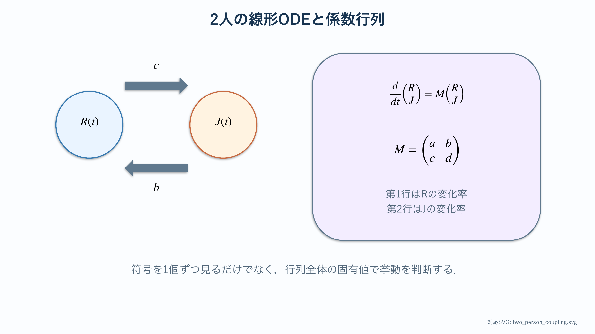
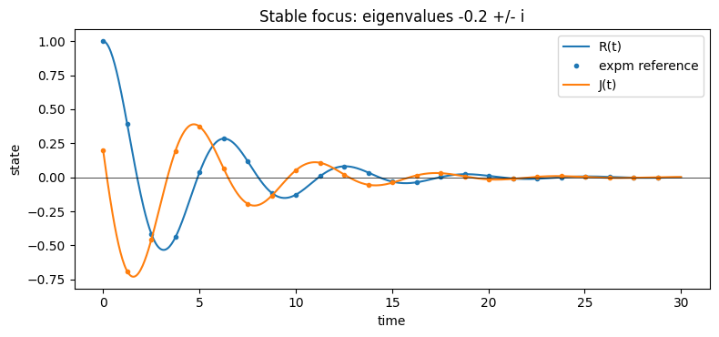
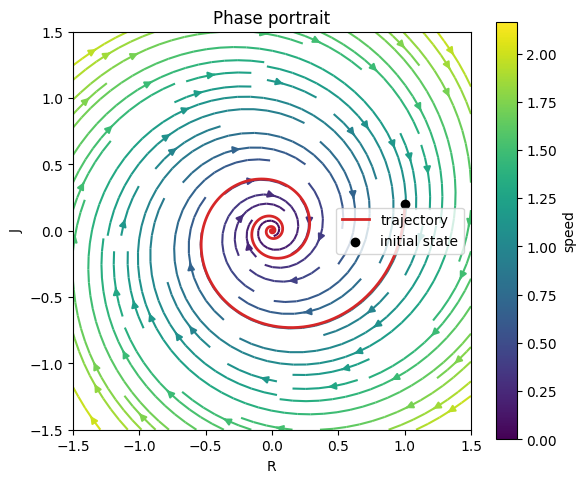

# 関係モデルの基礎：2人の線形ODE

:::{tip} 対応 Notebook
[41_love_dynamics_two_person.ipynb](../notebooks/41_love_dynamics_two_person.ipynb)
:::

:::{note} 学習経路での位置づけ
本章は関係モデルの基礎モデルを扱う．[関係研究の準備](./40_network_foundations.md)で整理した状態ベクトル・行列・固有値を，仮想的な2人の線形系で読み直す．外力，飽和，第三者効果，作品データへの適合はまだ行わない．
:::

:::{warning} 科学的な注意
本章は仮想的な状態変数を使う力学系教材である．実在人物の感情を測定・推定・評価するものではない．
:::

## この章の目的

1. 2人の状態を2変数線形ODEとして書く．
2. 係数行列の各成分を言葉で説明する．
3. 固有値から平衡点の安定性と相図の型を予想する．
4. 数値解，時系列，相図を相互に照合する．
5. 基準モデルが説明できることと，説明できないことを区別する．

## 学習ガイド

| 学習内容 | 到達確認 |
| --- | --- |
| 仮想状態変数と科学的注意 | 実在人物の感情と区別する |
| 2変数線形ODEと係数行列 | $a,b,c,d$ の向きを説明する |
| トレース・行列式・固有値 | 数値積分前に相図を予想する |
| 時系列図を読む | 減衰率と振動を識別する |
| 相図とベクトル場を読む | 初期値から原点への軌道を追う |
| 3種類の行列を分類 | 節点・鞍点・焦点を区別する |
| チェックポイント | ネットワークへ進めるか判断する |

固有値を表示するセルより先に，トレースと行列式から予想を紙に書く．計算結果を見てから分類名を付けるだけでは理解確認にならない．

## 最小モデル

$R(t)$ と $J(t)$ を，2人が互いに関して持つ仮想的な状態とする．値の正負に具体的な現実の意味を与えず，線形系の挙動を理解するために用いる．

```{math}
:label: eq-two-person-linear
\frac{dR}{dt}=aR+bJ,
\qquad
\frac{dJ}{dt}=cR+dJ
```

行列で書くと

```{math}
:label: eq-two-person-matrix
\frac{d\mathbf{x}}{dt}=M\mathbf{x},
\qquad
\mathbf{x}=\begin{pmatrix}R\\J\end{pmatrix},
\quad
M=\begin{pmatrix}a&b\\c&d\end{pmatrix}
```

となる．



上段の矢印 $c$ は $R$ から $J$ の変化率へ，下段の矢印 $b$ は $J$ から $R$ の変化率へ入る．矢印の向きと行列要素の位置を照合する．

## 係数を読む

- $a,d$：各状態が自分自身から受ける影響
- $b$：$J$ が $R$ の変化率へ与える影響
- $c$：$R$ が $J$ の変化率へ与える影響

係数の符号だけで挙動を断定せず，行列全体の固有値を見る．たとえば $b>0$ でも，他の係数との組合せで収束・発散・振動が変わる．

## 固有値と相図

$M$ の固有値は

```{math}
:label: eq-two-person-eigenvalues
\lambda
=\frac{\operatorname{tr}M
\pm\sqrt{(\operatorname{tr}M)^2-4\det M}}{2}
```

である．

| 固有値 | 原点近傍の挙動 |
| --- | --- |
| 実部がすべて負 | 原点へ収束 |
| 正負の実固有値 | 鞍点 |
| 正の実部を含む | 原点から発散 |
| 複素固有値 | 回転を伴う．実部で収束・発散が決まる |

Notebookでは係数を入れる前に，トレース，行列式，判別式から相図の型を予想する．

## 数値計算の確認順序

1. 係数行列 $M$ を表示する．
2. トレース，行列式，固有値を計算する．
3. 固有値から挙動を予想する．
4. `solve_ivp` で時系列を計算する．
5. ベクトル場と軌道を相平面に描く．
6. 複数の初期値でも同じ安定性分類になるか確認する．

## Notebookの図を読む

### 時系列



横軸は時間，縦軸は2つの状態 $R(t),J(t)$ である．両曲線は正負を繰り返しながら振幅が小さくなり，最終的に0へ近づく．これは固有値が負の実部と非ゼロの虚部を持つ**安定焦点**の挙動である．

実部は包絡線の減衰速度，虚部は振動周期に関係する．図中の山の間隔はほぼ一定だが高さは指数的に下がる．振動の有無だけでなく，振幅が一定か，増加するか，減少するかを確認する．

$R$ と $J$ の山が同時刻に現れないのは，2成分に位相差があるためである．この図を実在人物の好意の測定結果として読むのではなく，係数行列が生む2成分の応答として読む．

### 相平面



横軸が $R$，縦軸が $J$ である．黒点が初期値，赤線がその後の軌道，色付きの流線が各点でのベクトル場を表す．赤線は原点の周りを回転しながら内側へ巻き込まれる．

時系列に現れる減衰振動と，相図に現れる原点へ向かう螺旋軌道は，同じ解を異なる座標で表示したものである．時系列で1周期進むと，相平面では原点の周りをほぼ1周する．2図を別々の結果として扱わない．

流線の色は状態値ではなくベクトルの速さを表す．原点付近で暗くなるのは変化率が小さいためである．また，黒点を変えると赤い軌道は変わるが，原点へ螺旋状に近づくという安定性分類は変わらない．

## この章ではまだ行わないこと

- 出来事を表す時間依存外力
- 状態の上限を表す非線形飽和
- 3人以上の人物関係
- 作品の場面を数値へ変換するアノテーション
- 係数のデータ推定

必要な拡張は最初から全部入れず，基準モデルが説明できないデータを確認してから[卒研ロードマップ](./43_love_research_roadmap.md)で追加する．

## チェックポイント

- [ ] $a,b,c,d$ が行列のどの影響を表すか説明できる．
- [ ] 固有値を数値計算前に求めた．
- [ ] 時系列と相図が同じ挙動を示すことを確認した．
- [ ] 初期値と係数の役割を区別できる．
- [ ] 線形モデルが無限に発散しうる理由を説明できる．
- [ ] 基準モデルへ項を追加する前に，追加の根拠が必要だと説明できる．

## 演習問題

1. $M=\begin{pmatrix}0&1\\-1&0\end{pmatrix}$ の固有値を求め，相図を予想してからNotebookで確認せよ．
2. 安定節点，鞍点，安定焦点となる行列を1つずつ作れ．
3. 同じ行列で初期値だけを変え，相図の型が変わらないことを確認せよ．
4. 線形モデルが観測データを説明できない場合，どの残差を見て拡張を検討するか列挙せよ．

## 次に進む

[ネットワーク力学の基礎](./42_love_dynamics_network.md)では，意味を限定しない3頂点モデルに広げ，隣接行列と結合ODEを学ぶ．その後，卒研ロードマップで対象作品と観測可能な状態変数を決める．

## 参考文献・キーワード

- Strogatz, "Love Affairs and Differential Equations" {cite}`strogatz1988love`
- Strogatz, *Nonlinear Dynamics and Chaos* {cite}`strogatz2015nonlinear`
- キーワード：線形2変数ODE，係数行列，固有値，トレース，行列式，相図，安定性，基準モデル
