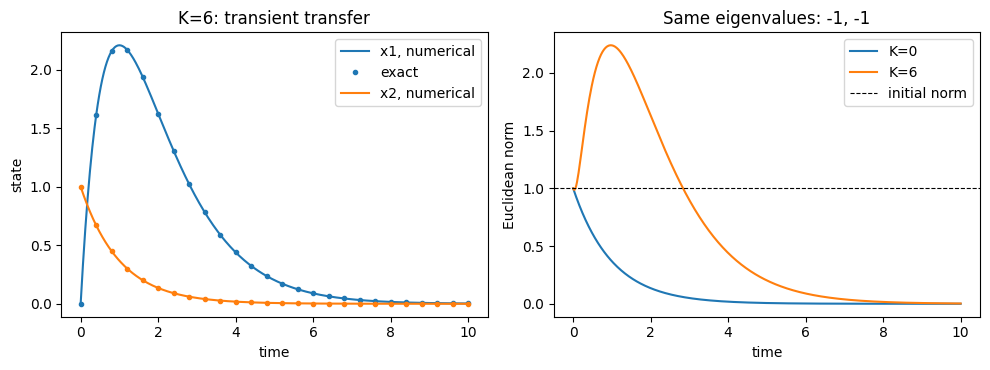

# 関係モデルの基礎：2人の線形ODE

:::{tip} 対応 Notebook
[41_love_dynamics_two_person.ipynb](../notebooks/41_love_dynamics_two_person.ipynb)
:::

:::{note} 学習経路での位置づけ
本章は関係モデルの基礎モデルを扱う．[関係研究の準備](./40_network_foundations.md)で整理した状態ベクトル・行列・{abbr}`固有値(行列が特定の方向を何倍に伸縮させるかを表す値)`を，仮想的な2人の線形系で読み直す．基準モデルを検証した後，残差を根拠として外力，飽和，第三者効果，作品データへの適合を検討する．
:::

:::{warning} 科学的な注意
本章では仮想的な状態変数を使う．実在人物の感情を測定・推定・評価するものではない．
:::

## この章の目的

1. 2人の状態を{abbr}`2変数線形ODE(2つの状態変数を線形な式で結んだ常微分方程式)`として書く．
2. {abbr}`係数行列(連立線形方程式の各変数に掛かる係数を並べた行列)`の各成分を言葉で説明する．
3. 固有値から平衡点の安定性と{abbr}`相図(状態空間上に軌道や流れを描いた図)`の型を予想する．
4. 数値解，時系列，相図を相互に照合する．
5. 厳密解との誤差を測り，モデルの不安定性と数値計算の誤差を区別する．
6. 基準モデルが説明できることと，説明できないことを区別する．

## 学習ガイド

| 学習内容 | 到達確認 |
| --- | --- |
| 仮想状態変数と科学的注意 | 実在人物の感情と区別する |
| 2変数線形ODEと係数行列 | $a,b,c,d$ の向きを説明する |
| {abbr}`トレース(正方行列の対角成分の和)`・{abbr}`行列式(正方行列が面積や体積を何倍に変えるかを符号付きで表す量)`・固有値 | 数値積分前に相図を予想する |
| 時系列図を読む | 減衰率と振動を識別する |
| 相図と{abbr}`ベクトル場(状態空間の各点に変化率の向きと大きさを割り当てたもの)`を読む | 初期値から原点への軌道を追う |
| 3種類の行列を分類 | {abbr}`節点(近傍の軌道が回転せず平衡点へ近づくか離れる型)`・{abbr}`鞍点(ある方向では近づき別の方向では離れる不安定な平衡点)`・{abbr}`焦点(軌道が回転しながら平衡点へ近づくか離れる型)`を区別する |
| チェックポイント | ネットワークへ進めるか判断する |

固有値を表示するセルより先に，トレースと行列式から予想を紙に書く．計算結果を見てから分類名を付けるだけでは理解確認にならない．

## 最小モデル

$R(t)$ と $J(t)$ を，2人が互いに関して持つ仮想的な状態とする．値の正負に具体的な現実の意味を与えず，線形系の挙動を理解するために用いる．

```{math}
:label: eq-two-person-linear
\frac{dR}{dt}=aR+bJ,
\qquad
\frac{dJ}{dt}=cR+dJ
```

行列で書くと

```{math}
:label: eq-two-person-matrix
\frac{d\mathbf{x}}{dt}=M\mathbf{x},
\qquad
\mathbf{x}=\begin{pmatrix}R\\J\end{pmatrix},
\quad
M=\begin{pmatrix}a&b\\c&d\end{pmatrix}
```

となる．ここでは $R,J$ を共通の無次元尺度で表し，時間の単位を固定する．このとき $a,b,c,d$ の単位は時間の逆数である．異なる尺度の状態を使う場合，たとえば $b$ の単位は $R$ の単位を $J$ の単位と時間で割ったものになる．係数値を比較するときは尺度と時間単位も記録する．

原点は常に平衡点である．ただし，唯一の平衡点とは限らない．平衡点は $M\mathbf{x}=0$ の解全体なので，$\det M\ne0$ なら原点だけ，$\det M=0$ なら原点以外の平衡点も存在する．


上段の矢印 $c$ は $R$ から $J$ の変化率へ，下段の矢印 $b$ は $J$ から $R$ の変化率へ入る．矢印の向きと行列要素の位置を照合する．

行列の第1行は $dR/dt$，第2行は $dJ/dt$ の式である．たとえば

```{math}
M=\begin{pmatrix}-1&2\\-3&-1\end{pmatrix},
\qquad
\mathbf{x}=\begin{pmatrix}1\\0.5\end{pmatrix}
```

なら，$dR/dt=-1\times1+2\times0.5=0$，$dJ/dt=-3\times1-1\times0.5=-3.5$ である．この瞬間には $R$ は変化せず，$J$ は減少する．係数の意味を読むときは，抽象的な性格付けより先に，代表状態を代入して変化率の符号を確認する．

## 係数を読む

- $a,d$：各状態が自分自身から受ける影響
- $b$：$J$ が $R$ の変化率へ与える影響
- $c$：$R$ が $J$ の変化率へ与える影響

係数の符号だけで挙動を断定せず，行列全体の固有値を見る．たとえば $b>0$ でも，他の係数との組合せで収束・発散・振動が変わる．

$a,d<0$ なら各状態は単独では0へ減衰する．この条件の下で $bc>ad$ となると $\det M=ad-bc<0$ なので，全体系は鞍点となる．一方，$bc<0$ だけでは振動するとは限らない．後で求める判別式は $(a-d)^2+4bc$ であり，これが負のときに限り非実の複素固有値を持つ．自己減衰率の差が大きければ，$bc<0$ でも実固有値になる．

## 固有値と相図

$M\mathbf{v}=\lambda\mathbf{v}$ を満たす実固有値と実固有ベクトルに対し，初期値を $\mathbf{v}$ とすると解は $e^{\lambda t}\mathbf{v}$ となる．非実の複素固有値の場合は，複素解 $e^{\lambda t}\mathbf{v}$ の実部と虚部を組み合わせて実数の解を作り，指数的な増減は $\operatorname{Re}\lambda$ で決まる．固有値を求める式は $\det(\lambda I-M)=\lambda^2-\tau\lambda+\delta=0$ である．ここで $\tau=\operatorname{tr}M=a+d$，$\delta=\det M=ad-bc$ とおくと，

```{math}
:label: eq-two-person-eigenvalues
\lambda
=\frac{\operatorname{tr}M
\pm\sqrt{(\operatorname{tr}M)^2-4\det M}}{2}
```

である．

| 条件 | 原点の分類と解の挙動 |
| --- | --- |
| $\delta<0$ | 鞍点．安定方向では収束するが，不安定方向の成分は増大する |
| $\delta>0,\ \tau<0$ | 漸近安定．すべての初期値から原点へ収束する |
| $\delta>0,\ \tau>0$ | 不安定．すべての非ゼロ初期値でノルムは最終的に無限大になる |
| $\delta>0,\ \tau=0$ | 中心．純虚数固有値を持ち，非ゼロ解は周期軌道になる |
| $\delta=0$ | ゼロ固有値を持つ．平衡点の集合と解を別に調べる |

Notebookでは係数を入れる前に，トレース，行列式，判別式から相図の型を予想する．

実部が負の固有値だけを持つ場合を{abbr}`漸近安定(十分近い初期値の解が近くにとどまり，時間とともに平衡点へ収束する性質)`という．2次元では $\tau<0$ かつ $\delta>0$ が必要十分条件であり，単なる候補ではない．さらに判別式 $D=\tau^2-4\delta$ が負なら焦点，正なら異なる実固有値を持つ節点である．$D=0$ は重根で，固有ベクトルの本数により軌道の形が異なるが，実部が負なら漸近安定という結論は変わらない．

中心は安定だが漸近安定ではない．また，正の実部を持つ固有値が1つでもあれば原点は不安定だが，特定の解が発散しないことはある．たとえば

```{math}
M=\begin{pmatrix}1&0\\0&-1\end{pmatrix},\qquad
\mathbf{x}(t)=\begin{pmatrix}R(0)e^t\\J(0)e^{-t}\end{pmatrix}
```

では $R(0)=0$ の解は収束する．しかし，どれほど小さくても $R(0)\ne0$ なら増大する．1本の収束軌道だけから系全体を安定と判断してはいけない．

:::{note} トレースが表すもの
初期状態の小さな領域が時刻 $t$ に占める面積は，元の面積の $e^{\tau t}$ 倍になる．これがトレースによる収縮・膨張の正確な意味である．各成分や原点からの距離が単調に減るという意味ではない．また，$\det M$ 自体が時刻 $t$ までの面積倍率なのではない．
:::

```{dropdown} ゼロ固有値と重根で何を確認するか
$M=\operatorname{diag}(0,-1)$ なら $R(t)=R(0)$，$J(t)=J(0)e^{-t}$ である．原点は安定だが，原点以外の初期値がすべて原点に収束するわけではなく，直線 $J=0$ 上の平衡点へ近づく．

一方，$M=\begin{pmatrix}0&1\\0&0\end{pmatrix}$ は固有値がどちらも0なのに，$J(t)=J(0)$，$R(t)=R(0)+tJ(0)$ となり，原点は不安定である．ゼロ実部だけを見て安定と分類できない理由がここにある．

$M=\begin{pmatrix}-1&K\\0&-1\end{pmatrix}$ では同じ計算から $J(t)=e^{-t}J(0)$，$R(t)=e^{-t}\{R(0)+KtJ(0)\}$ を得る．$te^{-t}\to0$ なので，独立な固有ベクトルが2本なくても漸近安定である．
```

実装では，固有値の実部が許容幅内で0に近い場合を境界付近として返し，数式で再確認する．浮動小数点数が厳密に0かどうかだけで中心や安定性を自動判定しない．

## 厳密解を基準に数値解を検証する

定数行列の線形系には，任意の次元で

```{math}
:label: eq-linear-matrix-exponential
\mathbf{x}(t)=e^{M(t-t_0)}\mathbf{x}(t_0),\qquad
e^{Ms}=I+sM+\frac{s^2}{2!}M^2+\cdots
```

という厳密な解の表示がある．{abbr}`行列指数関数(指数関数のべき級数で数の代わりに正方行列を使って定義した関数)`は成分ごとに指数を取るものではない．数値実装には `scipy.linalg.expm` を使う．これは厳密解の式を数値評価する参照解であり，丸め誤差までないという意味ではない．[SciPyのexpm文書](https://docs.scipy.org/doc/scipy/reference/generated/scipy.linalg.expm.html)

```python
from scipy.integrate import solve_ivp
from scipy.linalg import expm

t = np.linspace(0.0, 30.0, 600)
sol = solve_ivp(lambda time, x: M @ x, (t[0], t[-1]), x0,
                t_eval=t, rtol=1e-8, atol=1e-10)
if not sol.success:
    raise RuntimeError(sol.message)
reference = np.column_stack([expm(M * (s - t[0])) @ x0 for s in t])
error = np.max(np.abs(sol.y - reference))
print(error)
```

`t_eval` は保存する時刻の列であり，内部の積分刻みそのものではない．出力点を増やすだけでは精度検証にならない．`rtol` と `atol` は局所誤差の制御に使われる相対・絶対許容誤差である．両者を小さくした計算を参照解と比較し，結論が変わらないか確認する．局所誤差の許容値が，そのまま全時刻の誤差の上限を保証するわけではない．[SciPyのsolve_ivp文書](https://docs.scipy.org/doc/scipy/reference/generated/scipy.integrate.solve_ivp.html)

基準行列 $M=\begin{pmatrix}-0.2&1\\-1&-0.2\end{pmatrix}$ では，さらに手計算で

```{math}
R(t)=e^{-0.2t}\{R(0)\cos t+J(0)\sin t\},\qquad
J(t)=e^{-0.2t}\{-R(0)\sin t+J(0)\cos t\}
```

を得る．減衰の時定数は $1/0.2=5$，振動周期は $2\pi$ である．数値解，行列指数関数，この公式の3通りを照合すると，実装の取り違えを発見しやすい．

## 漸近安定と一時的増幅を区別する

原点へ収束する系でも，途中で原点から離れることがある．たとえば前述の重根の例で $K=6$，$\mathbf{x}(0)=(0,1)^\top$ とすると，$\mathbf{x}(t)=e^{-t}(6t,1)^\top$ であり，$t=1$ のノルムは $\sqrt{37}/e>1$ となる．初期ノルム1より大きいが，最終的には0に戻る．



左図は $K=6$ の2成分と厳密解，右図は $K=0$ と $K=6$ のノルムを示す．どちらも固有値は $-1,-1$ だが，$K=6$ では初期値が相互作用を通じて別の成分を増大させる．図のピークは数値的不安定性でも，長時間の発散でもない．

この違いを式で確認するには，$E=\|\mathbf{x}\|_2^2/2$ を微分する．

```{math}
\frac{dE}{dt}=\mathbf{x}^{\top}\frac{M+M^{\top}}{2}\mathbf{x}
```

対称部分 $(M+M^\top)/2$ が負定値なら，非ゼロ状態のノルムは単調に減る．しかし固有値の実部が負という条件だけでは，対称部分の負定値性は保証されない．状態の尺度を変えるとノルムの意味も変わるため，一時的増幅を比較するときは同じ尺度を使う．

## 数値計算の確認順序

1. 係数行列 $M$ を表示する．
2. トレース，行列式，固有値を計算する．
3. 固有値から挙動を予想する．
4. `solve_ivp` で時系列を計算する．
5. ベクトル場と軌道を相平面に描く．
6. 行列指数関数と照合し，許容誤差を変えた結果を記録する．
7. 複数の初期値を使い，系の安定性と個々の軌道の違いを確認する．

## Notebookの図を読む

### 時系列


横軸は時間，縦軸は2つの状態 $R(t),J(t)$ である．両曲線は正負を繰り返しながら振幅が小さくなり，最終的に0へ近づく．これは固有値が負の実部と非ゼロの虚部を持つ**安定焦点**の挙動である．

固有値 $-0.2\pm i$ の実部は包絡線の減衰速度，虚部は振動周期を決める．図中の山の間隔は $2\pi$ で，高さは指数的に下がる．参照解の点と数値解の実線が重なることも確認する．振動の有無だけでなく，振幅が一定か，増加するか，減少するかを確認する．

$R$ と $J$ の山が同時刻に現れないのは，2成分に位相差があるためである．この図を実在人物の好意の測定結果として読むのではなく，係数行列が生む2成分の応答として読む．

### 相平面


横軸が $R$，縦軸が $J$ である．黒点が初期値，赤線がその後の軌道，色付きの流線が各点でのベクトル場を表す．赤線は原点の周りを回転しながら内側へ巻き込まれる．

時系列に現れる減衰振動と，相図に現れる原点へ向かう螺旋軌道は，同じ解を異なる座標で表示したものである．時系列で1周期進むと，相平面では原点の周りをほぼ1周する．2図を別々の結果として扱わない．

流線の色は状態値ではなくベクトルの速さを表す．原点付近で暗くなるのは変化率が小さいためである．また，黒点を変えると赤い軌道は変わるが，原点へ螺旋状に近づくという安定性分類は変わらない．

相図を読むときは，まず平衡点，次に矢印の向き，最後に軌道の長時間挙動を見る．時刻は軌道上に直接表示されないため，線の形だけでは進行方向が分からない場合がある．ベクトル場の矢印または軌道上の時刻マーカーを確認する．初期値を複数置くと，局所的な1本の軌道ではなく，相平面全体の流れを判断できる．

## 卒業研究で発展させる内容

- 出来事を表す時間依存外力
- 状態の上限を表す非線形飽和
- 3人以上の人物関係
- 作品の場面を数値へ変換するアノテーション
- 係数のデータ推定

必要な拡張は最初から全部入れず，基準モデルが説明できないデータを確認してから[卒研ロードマップ](./43_love_research_roadmap.md)で追加する．

## チェックポイント

- [ ] $a,b,c,d$ が行列のどの影響を表すか説明できる．
- [ ] 固有値を数値計算前に求めた．
- [ ] 時系列と相図が同じ挙動を示すことを確認した．
- [ ] 初期値と係数の役割を区別できる．
- [ ] 正の固有値を持つ系にも収束する初期値がありうると説明できる．
- [ ] 境界上の系を，固有値の符号だけで安定と断定しない．
- [ ] 厳密解との誤差と，一時的増幅の有無を確認した．
- [ ] 線形モデルが無限に発散しうる理由を説明できる．
- [ ] 基準モデルへ項を追加する前に，追加の根拠が必要だと説明できる．

## 演習問題

1. $M=\begin{pmatrix}0&1\\-1&0\end{pmatrix}$ の固有値を求め，相図を予想してからNotebookで確認せよ．
2. 安定節点，鞍点，安定焦点となる行列を1つずつ作れ．
3. $M=\operatorname{diag}(1,-1)$ について，初期値 $(0,1)^\top$ と $(10^{-3},1)^\top$ の長時間挙動を比較せよ．
4. $M=\begin{pmatrix}-1&6\\0&-1\end{pmatrix}$ の固有値と，初期値 $(0,1)^\top$ に対する解を求め，一時的増幅を説明せよ．
5. 線形モデルが観測データを説明できない場合，どの残差を記録するか挙げ，残差だけでは断定できないことを説明せよ．

```{dropdown} 解答例
1. 固有値は $\pm i$ であり，$R^2+J^2$ の時間微分は0である．非ゼロ解は原点を中心とする円を時計回りに周期 $2\pi$ で回る．原点は中心であり，漸近安定ではない．
2. 安定節点は $\operatorname{diag}(-1,-2)$，鞍点は $\operatorname{diag}(1,-1)$，安定焦点は基準行列 $\begin{pmatrix}-0.2&1\\-1&-0.2\end{pmatrix}$ でよい．それぞれの固有値は $-1,-2$，$1,-1$，$-0.2\pm i$ である．
3. 前者は $(0,e^{-t})^\top$ なので収束する．後者は $(10^{-3}e^t,e^{-t})^\top$ なので，十分長時間では第1成分が増大する．系の分類はどちらも鞍点であり，初期値によって安定性分類が変わるのではない．
4. 固有値は重根 $-1$ で，解は $(6te^{-t},e^{-t})^\top$ となる．$t=1$ のノルムは約2.24で初期値のノルム1を上回るが，両成分とも0へ収束する．
5. 時刻，観測値，予測値，残差，欠測の有無，出来事，第三者の登場を別列に記録する．出来事の後に残差が続けば外力を検討する材料になるが，尺度の誤り，時間単位，観測誤差でも同様の残差が生じる．第三者の登場との対応だけから因果効果とは断定できない．
```

## 次に進む

[ネットワーク力学の基礎](./42_love_dynamics_network.md)では，意味を限定しない3頂点モデルに広げ，隣接行列と結合ODEを学ぶ．その後，卒研ロードマップで対象作品と観測可能な状態変数を決める．

## 参考文献・キーワード

- Strogatz, "Love Affairs and Differential Equations" {cite}`strogatz1988love`
- Strogatz, *Nonlinear Dynamics and Chaos* {cite}`strogatz2015nonlinear`
- キーワード：線形2変数ODE，係数行列，固有値，トレース，行列式，相図，安定性，基準モデル
