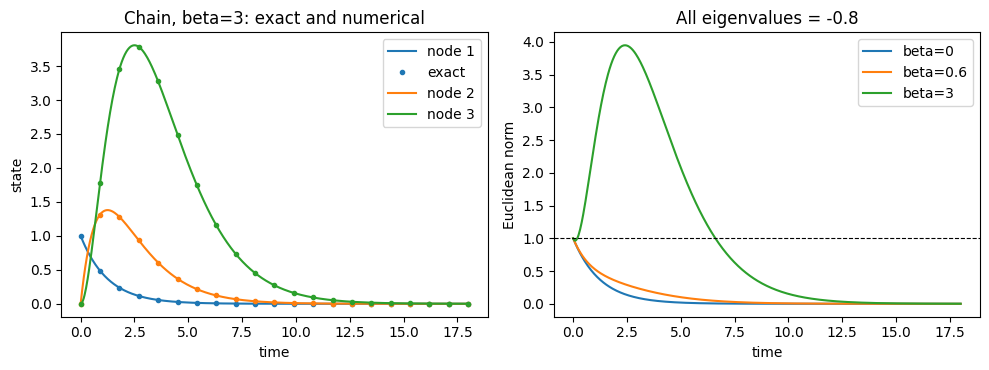

# ネットワーク力学の基礎：3頂点の線形モデル

:::{tip} 対応 Notebook
[42_love_dynamics_network.ipynb](../notebooks/42_love_dynamics_network.ipynb)
:::

:::{note} 学習経路での位置づけ
本章では，意味を限定しない3頂点{abbr}`ネットワーク(頂点と頂点間の辺からなる接続構造)`を使い，{abbr}`隣接行列(頂点間の接続や影響の強さを成分として並べた行列)`，{abbr}`結合ODE(複数の状態が互いに影響するよう接続した常微分方程式)`，固有値，グラフ表示を学ぶ．数理と実装を検証した後，恋愛感情，嫉妬，物語イベント，アノテーションの定義へ進む．
:::

## この章の目的

[関係モデルの基礎](./41_love_dynamics_basic.md)では2人の状態を2変数ODEで表した．3人以上になると，各頂点から他の頂点への影響方向を表す構造が必要になる．本章では，研究対象の意味づけを行う前にネットワーク力学の数理と実装を練習する．

1. {abbr}`有向グラフ(辺に出発点と到着点の向きがあるグラフ)`を隣接行列で表す．
2. {abbr}`頂点状態(ネットワークの各頂点に置く時間変化する量)`と{abbr}`辺の重み(頂点間の影響の強さを表す数値)`を区別する．
3. ネットワーク結合した線形ODEを作る．
4. 固有値と時系列の関係を確認する．
5. 行列とネットワーク図が一致しているか検証する．

## 学習ガイド

| 学習内容 | 到達確認 |
| --- | --- |
| 頂点・辺・状態を区別する | 3つを別々に説明する |
| 隣接行列の添字規約 | $A_{ij}$ の矢印方向を書く |
| 行列から有向グラフへ | 全3辺を照合する |
| 結合ODEと固有値 | $M=-\alpha I+\beta A$ を読む |
| 3頂点の時系列 | 初期微分と経路の長さを対応させる |
| 結合強度と安定性 | {abbr}`最大固有値実部(係数行列の固有値のうち実部が最も大きい値)`を求め，臨界値が存在する条件を説明する |
| 鎖と循環の比較 | 長時間安定性と一時的増幅を区別する |
| チェックポイント | 研究対象の意味づけ前の基礎を確認する |

最も間違えやすいのは行列の行・列と矢印方向である．図を信用する前に，非ゼロ要素を1個ずつ文章へ直す．

## 頂点，辺，状態

3頂点を $1,2,3$ とする．$A_{ij}$ を頂点 $j$ から頂点 $i$ への影響の強さと定義する．

```{math}
A=
\begin{pmatrix}
0&A_{12}&A_{13}\\
A_{21}&0&A_{23}\\
A_{31}&A_{32}&0
\end{pmatrix}
```

行と列の向きは分野やソフトウェアで異なる．自分の定義を明示し，簡単な行列をネットワーク図へ変換して矢印を確認する．

各頂点に1つの状態 $x_i(t)$ を置き，$\mathbf{x}=(x_1,x_2,x_3)^\top$ とする．ここでは状態を特定の感情とは解釈しない．また，$A$ は固定した係数であり，時間変化する状態ではない．3人が互いに向ける6種類の状態を扱いたい場合には，別の6次元モデルが必要になる．

頂点，辺，状態は異なる役割を持つ．頂点は人物や要素，辺は影響経路，頂点状態は時刻ごとに変わる量，辺重みは影響の強さである．図上で頂点が近く描かれていても，辺がなければモデル上の直接影響はない．レイアウトと数理構造を区別する．

## 最小ネットワークODE

各状態が単独では減衰し，接続された頂点から影響を受けるモデルを

```{math}
:label: eq-generic-network
\frac{d\mathbf{x}}{dt}
=(-\alpha I+\beta A)\mathbf{x}
```

とする．

- $\alpha>0$：各頂点の状態が元へ戻る速さ
- $\beta\ge0$：ネットワーク影響の強さ
- $A$：誰から誰へ影響するか

係数行列を $M=-\alpha I+\beta A$ とすれば，Strogatzで学んだ線形系 $\dot{\mathbf{x}}=M\mathbf{x}$ と同じである．状態と $A$ は無次元，$\alpha,\beta$ は時間の逆数を単位とする．本章の基準例では $A_{ij}\ge0$ とし，負の辺を使う場合はその意味と安定性条件を改めて確認する．

成分ごとに書けば

```{math}
\frac{dx_i}{dt}
=-\alpha x_i+\beta\sum_j A_{ij}x_j
```

である．第1項はその頂点自身の状態を減衰させ，第2項は他頂点から入る影響を合計する．コードで `M @ x` を計算する前に，各行をこの形へ展開し，図の入射辺と一致するか確認する．

## 固有値と安定性

$A\mathbf{v}=\mu\mathbf{v}$ なら

```{math}
M\mathbf{v}=(-\alpha+\beta\mu)\mathbf{v}
```

なので，$M$ の固有値は $\lambda_k=-\alpha+\beta\mu_k$ となる．この固有値の対応は，$A$ が対角化できない場合にも成り立つ．$s(A)=\max_k\operatorname{Re}\mu_k$ とおくと，$\beta\ge0$ について

```{math}
:label: eq-network-spectral-abscissa
s(M)=\max_k\operatorname{Re}\lambda_k=-\alpha+\beta s(A)
```

である．$s(M)<0$ ならすべての初期値から原点へ収束し，$s(M)>0$ なら原点は不安定になる．ただし不安定でも，初期値が安定方向だけに成分を持てば収束することはある．$s(M)=0$ は境界であり，ゼロ実部の固有値に対応する解を別に調べる．

$s(A)>0$ の場合，安定性境界は $\beta_c=\alpha/s(A)$ である．$s(A)\le0$ なら，$\alpha>0,\beta\ge0$ の範囲では境界を横切らない．結合を強めれば必ず不安定化するとは限らない．

:::{note} 最大実部とスペクトル半径は異なる
{abbr}`スペクトル半径(固有値の絶対値の最大値)`は $\rho(A)=\max_k|\mu_k|$ である．非負行列では，スペクトル半径自身が実固有値なので $s(A)=\rho(A)$ となる．負の辺を含む一般の行列では一致しない．たとえば $A=\begin{pmatrix}0&-1\\1&0\end{pmatrix}$ は固有値が $\pm i$ で，$s(A)=0$ だが $\rho(A)=1$ である．この場合は任意の $\beta\ge0$ で $s(M)=-\alpha<0$ となる．$\rho(A)$ を使った臨界値の式を無条件に適用してはいけない．また $\beta<0$ を認めると，最大実部は $-\alpha+\beta\min_k\operatorname{Re}\mu_k$ となる．
:::

### 基準の循環で臨界値を手計算する

Notebookでは次の非対称な行列を使う．

```{math}
A=\begin{pmatrix}0&0.8&0\\0&0&1\\0.5&0&0\end{pmatrix},
\qquad A^3=0.4I,\qquad \det(\mu I-A)=\mu^3-0.4
```

3本の辺を1周した重みの積が $0.8\times1\times0.5=0.4$ になる．$r=\sqrt[3]{0.4}$ とすると，固有値は $r$ と $-r/2\pm i\sqrt{3}r/2$ である．したがって $\alpha=0.8$ では

```{math}
\beta_c=\frac{0.8}{\sqrt[3]{0.4}}\simeq1.086,
\qquad s(M)=-0.8+\beta\sqrt[3]{0.4}
```

となる．基準値 $\beta=0.6$ では $s(M)\simeq-0.358<0$ なので漸近安定である．$\beta=\beta_c$ では固有値0が1つ，他の2つの実部は $-3\alpha/2$ となる．この例の解はゼロ固有値方向の平衡点へ近づき，一般には原点へ戻らない．境界に達したことを新しい有限振幅の安定パターンの発生と解釈しない．

### 鎖では結合を強めても固有値は変わらない

一方向の鎖 $1\to2\to3$ で両辺の重みを $w>0$ とすると，

```{math}
A_{\mathrm{chain}}=\begin{pmatrix}0&0&0\\w&0&0\\0&w&0\end{pmatrix},
\qquad A_{\mathrm{chain}}^3=0
```

であり，$A_{\mathrm{chain}}$ の固有値はすべて0である．したがって $M$ の固有値はすべて $-\alpha$ で，どれほど $\beta$ を増やしても漸近安定である．それでも，初期値 $\mathbf{x}(0)=(1,0,0)^\top$ に対する解

```{math}
:label: eq-chain-exact-response
\mathbf{x}(t)=e^{-\alpha t}
\begin{pmatrix}1\\\beta wt\\(\beta wt)^2/2\end{pmatrix}
```

には大きな一時的増幅が生じうる．循環のような閉じた経路の有無は，長時間安定性と過渡応答に異なる影響を持つ．一般には辺の向きが違っても固有値が同じ場合があるので，図の違いと固有値の違いを同一視しない．

## 影響方向を初期微分から確かめる

第 $j$ 成分だけが1の初期値を $\mathbf{e}_j$ と書く．このとき $\dot{\mathbf{x}}(0)=M\mathbf{e}_j$ は $M$ の第 $j$ 列である．基準の循環では

```{math}
\dot{\mathbf{x}}(0)=\begin{pmatrix}-\alpha\\0\\0.5\beta\end{pmatrix}
\quad\text{for }\mathbf{x}(0)=\mathbf{e}_1
```

となる．node 3は初期微分が正で，node 2は0である．ところが，node 2が一定時間後まで厳密に0という意味ではない．行列指数関数を展開すると

```{math}
\mathbf{x}(t)=e^{-\alpha t}
\left(I+\beta tA+\frac{(\beta t)^2}{2}A^2+\cdots\right)\mathbf{e}_1
```

であり，$x_3(t)=0.5\beta t+O(t^2)$，$x_2(t)=0.25\beta^2t^2+O(t^3)$ となる．ここで $O(t^k)$ は $t\to0$ で $t^k$ の定数倍以下になる残りの項を表す．$\beta>0$ なら両者は任意に小さな正の時刻でも非ゼロになる．このODEに有限の伝達遅延は入っていない．

$(A^k)_{ij}$ は $j$ から $i$ へ $k$ 本の辺をたどる経路の重みの積を合計したものである．ここでは同じ頂点や辺を繰り返し通ることも許す．上の展開は，経路の長さが短時間の応答の次数に対応することを示す．ピーク時刻は自己減衰や複数経路の重なりにも左右されるので，ピークの順だけで矢印を検証しない．

## 行列とグラフの変換を検証する

本章の規約は受け手が行，送り手が列である．NetworkXの `from_numpy_array` は行を送り手，列を受け手として読むため，直接変換する場合は転置が必要になる．[NetworkXの公式文書](https://networkx.org/documentation/stable/reference/generated/networkx.convert_matrix.from_numpy_array.html)

```python
G = nx.from_numpy_array(A.T, create_using=nx.DiGraph)
recovered = nx.to_numpy_array(G, nodelist=range(len(A))).T
np.testing.assert_allclose(recovered, A)
```

Notebookでは `G.add_edge(j, i, weight=A[i, j])` と明示する実装も照合する．Pythonの添字は0始まりなので，コードの頂点0が図のnode 1に対応する．全辺の向きと重みを表で確認し，初期微分 $M\mathbf{e}_j$ も調べる．$A$ と $A^\top$ は同じ固有値を持つため，固有値の一致だけでは全矢印の逆転を検出できない．

## 数値計算の確認順序

1. $A$ の非ゼロ要素を表にする．
2. ネットワーク図の矢印と照合する．
3. $M=-\alpha I+\beta A$ を表示する．
4. 固有値を計算する．
5. 初期状態を1成分だけ非ゼロにする．
6. 初期微分と短時間の展開から，各頂点の応答を確認する．
7. 行列指数関数による参照解と照合し，積分許容誤差を変える．
8. 循環の臨界値と鎖の厳密解を確かめ，長時間安定性と一時的増幅を分ける．

## Notebookの図を読む

### 隣接行列と有向グラフ


本章では $A_{ij}$ を頂点 $j$ から頂点 $i$ への影響の強さと定義する．したがって $A_{1,2}=0.8$ は node 2 から node 1 への矢印，$A_{3,1}=0.5$ は node 1 から node 3 への矢印，$A_{2,3}=1.0$ は node 3 から node 2 への矢印になる．

線の太さと数値は辺重みを表す．頂点の位置は円形レイアウトで見やすく置いただけで，人物間の物理的距離や関係の近さを意味しない．矢印を逆に描くと以後の時系列解釈もすべて逆になるため，非対称な行列で照合することが重要である．

### 影響が伝わる時系列


初期時刻では node 1 だけが1で，node 2と3は0である．node 3は $0.5\beta t$，node 2は $0.25\beta^2t^2$ を主要項として増え始める．左図は全時間の数値解と参照解，右図は短時間の2成分と，この主要項の比較である．短時間では主要項がよく一致するが，時間が進むと高次の項を無視できなくなる．これは有限時間の遅延を観測した図ではない．

初期値を1成分だけ非ゼロにするのは，入力した影響がどの経路を通るかを見やすくするためである．全成分を同時に非ゼロにすると，複数経路の応答が重なり，矢印方向の誤りを発見しにくい．node 1，2，3を1つずつ初期化した3実験を行うと，全辺を系統的に確認できる．

すべての状態が最終的に0へ戻るのは，自己減衰 $-\alpha I$ がネットワーク増幅より強く，この設定の最大固有値実部が負だからである．途中で値が増えることと，長時間で不安定になることは別である．一時的なピークだけを見て発散と判断しない．

### 結合強度と安定性


横軸は結合強度 $\beta$，縦軸は $M=-\alpha I+\beta A$ の固有値のうち実部が最大の値である．循環の数値固有値と理論直線 $-0.8+\beta\sqrt[3]{0.4}$ を重ね，鎖の水平線 $-0.8$ も比較する．0より下ならすべての解が最終的に減衰し，0より上なら少なくとも1つの不安定な方向がある．単調減少を保証する図ではない．

曲線が0を横切る値は，この固定した $A$ と $\alpha$ に対する安定性境界である．普遍的な臨界値ではない．ネットワーク構造や自己減衰を変えれば交点も変わる．0付近では長時間スケールが大きくなるため，短い数値計算だけでは収束・発散を判定しにくいことにも注意する．

最大固有値実部が $-0.01$ の場合，数学的には安定でも減衰は非常に遅い．短時間ではほぼ一定または一時的に増加して見えることがある．固有値から予想される時間スケール $1/|\operatorname{Re}\lambda|$ と計算終了時刻を比較し，十分長く計算したか確認する．

この図は固有値解析の結果であり，現実の集団が急に相転移する証拠ではない．モデル内の安定性境界と，観測現象の解釈を分ける．

### 安定な鎖の過渡応答



左図は $\alpha=0.8,w=1,\beta=3$ の鎖の各成分を，数値解と厳密解で重ねたものである．node 2と3の値は初期値の大きさ1を上回るが，最終的には0へ戻る．右図は複数の $\beta$ に対するノルムの比較である．固有値が同じでも，結合を強めると過渡的な応答は大きくなる．ピークの大きさや積分量を研究指標にする場合，固有値だけで結果を説明し切れない．

## 卒業研究につながる比較の設計

鎖と循環を比較するとき，同じ $\beta$ でも辺数や重みの総和が違えば，構造だけでなく入力総量も変わる．辺重みを固定して辺を追加する比較と，総重みを固定して配分を変える比較は異なる問いである．どちらを検証するか先に決める．

非負行列を各行の和で割る方法は，受け手ごとの入力総量をそろえる操作である．行和0の頂点は別扱いにする必要があり，正規化すると元の係数の意味も変わる．すべての行和を1にすると $A\mathbf{1}=\mathbf{1}$ かつ $\rho(A)=1$ なので，$\beta_c=\alpha$ となる．この比較では固有値境界の差よりも応答の形や一時的増幅が対象になる．正規化を単なる描画上の処理として行わない．

構造，入力総量，初期状態のノルム，時間窓を明示し，最大実部と過渡応答の双方を比較すれば，線形モデルだけでも卒業研究のための検証方法を組み立てられる．

## 卒業研究で発展させる内容

- 人物 $i$ から人物 $j$ への感情 $x_{ij}$ の定義
- 両思い，嫉妬，第三者効果のモデル化
- 物語イベントを外力として与えること
- 作品の各話を感情値へ変換すること
- パラメータ推定と予測誤差の最小化

上の項目は，[卒研ロードマップ](./43_love_research_roadmap.md)に沿って状態変数，追加項，推定方法を順に具体化する．

## チェックポイント

- [ ] $A_{ij}$ の矢印方向を自分の言葉で定義した．
- [ ] 行列とネットワーク図の全辺を照合した．
- [ ] 頂点状態と辺の重みの違いを説明できる．
- [ ] 固有値から時系列の収束・発散を予想した．
- [ ] 初期値を変えても安定性の分類が変わらないことを確認した．
- [ ] 辺を1本変えたとき係数行列のどこが変わるか説明できる．
- [ ] 循環の臨界値を手計算し，数値固有値と照合した．
- [ ] 鎖にはこの条件で有限の臨界値がない理由を説明できる．
- [ ] ピーク時刻や固有値だけでは矢印方向を保証できないと説明できる．
- [ ] ネットワーク間の比較で固定した量を記録した．

## 演習問題

1. 一方向の鎖 $1\to2\to3$ を表す隣接行列を作り，影響が伝わる順序を確認せよ．
2. 双方向の辺と一方向の辺で時系列がどう違うか調べよ．
3. $\alpha=0.8$ で基準の循環と一方向の鎖の最大固有値実部を比較し，臨界値が存在するかをそれぞれ答えよ．
4. networkxの矢印と自分の $A_{ij}$ 定義が一致していることを，非対称な行列で確認せよ．
5. $\mathbf{x}(0)=\mathbf{e}_1$ からの初期微分を用いて基準の循環の向きを確認せよ．ピーク時刻だけでは不十分な理由も述べよ．

```{dropdown} 解答例
1. $A_{21}=A_{32}=1$，それ以外を0にする．解は $e^{-\alpha t}(1,\beta t,\beta^2t^2/2)^\top$ となり，直接つながるnode 2は1次，2本の辺を介するnode 3は2次の項から応答する．
2. 2頂点で一方向なら $A=\begin{pmatrix}0&0\\w&0\end{pmatrix}$ で固有値は0の重根，双方向で等しい正の重みなら $A=\begin{pmatrix}0&w\\w&0\end{pmatrix}$ で固有値は $\pm w$ である．後者の最大実部は $-\alpha+\beta w$ なので，$\beta w>\alpha$ で不安定になる．同じ辺重みでも辺数が異なる比較であることも記す．
3. 循環は $\beta_c=0.8/\sqrt[3]{0.4}\simeq1.086$ で境界に達する．鎖は最大実部が常に $-0.8$ なので有限の臨界値はない．図の範囲を広げても鎖は0を横切らない．
4. $A_{12}=0.8$ はnode 2からnode 1への矢印である．コードでは `G.add_edge(1, 0, weight=0.8)` とする．`nx.to_numpy_array(G).T` と元の行列を照合する．全矢印を逆転しても固有値は同じなので，固有値だけの検証では不十分である．
5. $M\mathbf{e}_1=(-\alpha,0,0.5\beta)^\top$ を計算する．node 3への直接影響がこの列から読める．ピークは減衰率や別経路との重なりで変わり，有限の伝達遅延を表すものでもない．
```

## 次に進む

[卒研ロードマップ：物語の関係変化をモデル化する](./43_love_research_roadmap.md)へ進み，研究対象，感情変数，アノテーション，第三者効果，推定と検証を段階的に具体化する．

## 参考文献・キーワード

- Strogatz {cite}`strogatz2015nonlinear`
- キーワード：有向グラフ，隣接行列，頂点状態，辺重み，結合ODE，固有値，安定性
