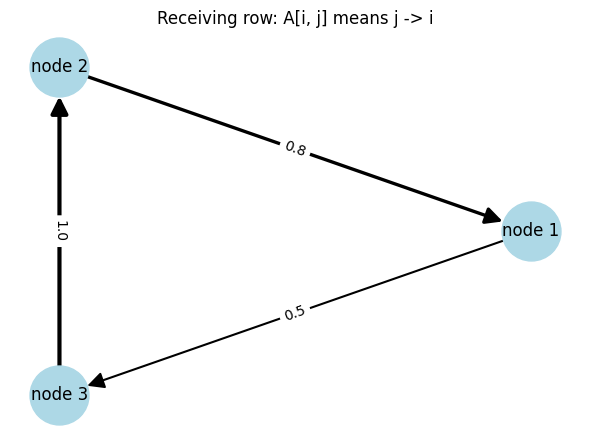
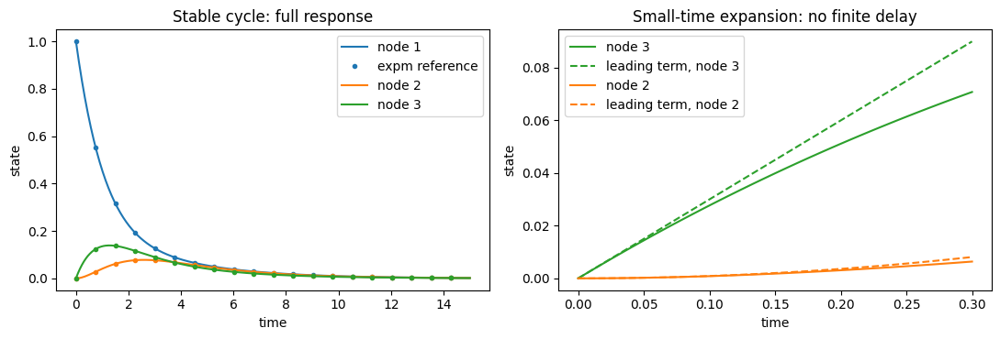
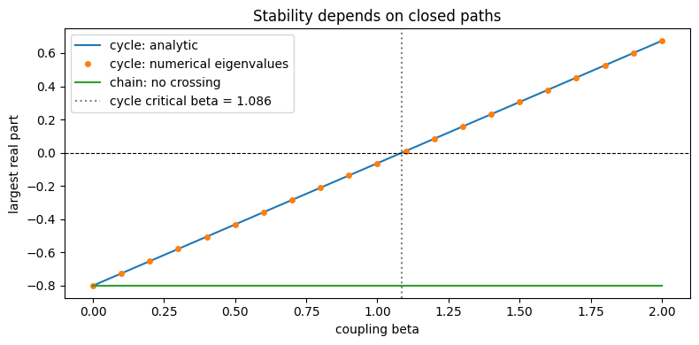

# ネットワーク力学の基礎：3頂点の線形モデル

:::{tip} 対応 Notebook
[42_love_dynamics_network.ipynb](../notebooks/42_love_dynamics_network.ipynb)
:::

:::{note} 学習経路での位置づけ
本章では研究技能を練習する．恋愛感情，嫉妬，物語イベント，アノテーションはまだ扱わない．意味を限定しない3頂点{abbr}`ネットワーク(頂点と頂点間の辺からなる接続構造)`を使い，{abbr}`隣接行列(頂点間の接続や影響の強さを成分として並べた行列)`，{abbr}`結合ODE(複数の状態が互いに影響するよう接続した常微分方程式)`，固有値，グラフ表示を学ぶ．
:::

## この章の目的

[関係モデルの基礎](./41_love_dynamics_basic.md)では2人の状態を2変数ODEで表した．3人以上になると，各頂点から他の頂点への影響方向を表す構造が必要になる．本章では，研究対象の意味づけを行う前にネットワーク力学の数理と実装を練習する．

1. {abbr}`有向グラフ(辺に出発点と到着点の向きがあるグラフ)`を隣接行列で表す．
2. {abbr}`頂点状態(ネットワークの各頂点に置く時間変化する量)`と{abbr}`辺の重み(頂点間の影響の強さを表す数値)`を区別する．
3. ネットワーク結合した線形ODEを作る．
4. 固有値と時系列の関係を確認する．
5. 行列とネットワーク図が一致しているか検証する．

## 学習ガイド

| 学習内容 | 到達確認 |
| --- | --- |
| 頂点・辺・状態を区別する | 3つを別々に説明する |
| 隣接行列の添字規約 | $A_{ij}$ の矢印方向を書く |
| 行列から有向グラフへ | 全3辺を照合する |
| 結合ODEと固有値 | $M=-\alpha I+\beta A$ を読む |
| 3頂点の時系列 | 影響が伝わる順序を説明する |
| 結合強度と安定性 | {abbr}`最大固有値実部(係数行列の固有値のうち実部が最も大きい値)`の0交差を読む |
| チェックポイント | 研究対象の意味づけ前の基礎を確認する |

最も間違えやすいのは行列の行・列と矢印方向である．図を信用する前に，非ゼロ要素を1個ずつ文章へ直す．

## 頂点，辺，状態

3頂点を $1,2,3$ とする．$A_{ij}$ を頂点 $j$ から頂点 $i$ への影響の強さと定義する．

```{math}
A=
\begin{pmatrix}
0&A_{12}&A_{13}\\
A_{21}&0&A_{23}\\
A_{31}&A_{32}&0
\end{pmatrix}
```

行と列の向きは分野やソフトウェアで異なる．自分の定義を明示し，簡単な行列をネットワーク図へ変換して矢印を確認する．

各頂点に1つの状態 $x_i(t)$ を置き，$\mathbf{x}=(x_1,x_2,x_3)^\top$ とする．ここでは状態を特定の感情とは解釈しない．

## 最小ネットワークODE

各状態が単独では減衰し，接続された頂点から影響を受けるモデルを

```{math}
:label: eq-generic-network
\frac{d\mathbf{x}}{dt}
=(-\alpha I+\beta A)\mathbf{x}
```

とする．

- $\alpha>0$：各頂点の状態が元へ戻る速さ
- $\beta$：ネットワーク影響の強さ
- $A$：誰から誰へ影響するか

係数行列を $M=-\alpha I+\beta A$ とすれば，Strogatzで学んだ線形系 $\dot{\mathbf{x}}=M\mathbf{x}$ と同じである．

## 固有値と安定性

$M$ のすべての固有値の実部が負なら，初期の変化は最終的に減衰する．正の実部を持つ固有値があれば，対応する方向の状態が増幅する．

ネットワーク図を描くだけで終わらず，接続構造が係数行列と固有値へどのように反映されるかを確認することが重要である．

## 数値計算の確認順序

1. $A$ の非ゼロ要素を表にする．
2. ネットワーク図の矢印と照合する．
3. $M=-\alpha I+\beta A$ を表示する．
4. 固有値を計算する．
5. 初期状態を1成分だけ非ゼロにする．
6. 時系列で影響の伝わる順序を確認する．
7. 固有値から予想した収束・発散と数値解を照合する．

## Notebookの図を読む

### 隣接行列と有向グラフ



本章では $A_{ij}$ を頂点 $j$ から頂点 $i$ への影響の強さと定義する．したがって $A_{1,2}=0.8$ は node 2 から node 1 への矢印，$A_{3,1}=0.5$ は node 1 から node 3 への矢印，$A_{2,3}=1.0$ は node 3 から node 2 への矢印になる．

線の太さと数値は辺重みを表す．頂点の位置は円形レイアウトで見やすく置いただけで，人物間の物理的距離や関係の近さを意味しない．矢印を逆に描くと以後の時系列解釈もすべて逆になるため，非対称な行列で照合することが重要である．

### 影響が伝わる時系列



初期時刻では node 1 だけが1で，node 2と3は0である．グラフには node 1→node 3→node 2→node 1 の向きがあるため，まず node 3 が増え，その後 node 2 が増える．ピーク時刻の順序から，行列とODEが意図した向きで実装されていることを確認できる．

すべての状態が最終的に0へ戻るのは，自己減衰 $-\alpha I$ がネットワーク増幅より強く，この設定の最大固有値実部が負だからである．途中で値が増えることと，長時間で不安定になることは別である．一時的なピークだけを見て発散と判断しない．

### 結合強度と安定性



横軸は結合強度 $\beta$，縦軸は $M=-\alpha I+\beta A$ の固有値のうち実部が最大の値である．破線の0より下ならすべてのモードが減衰し，0より上なら少なくとも1方向が指数的に増幅する．

曲線が0を横切る値は，この固定した $A$ と $\alpha$ に対する安定性境界である．普遍的な臨界値ではない．ネットワーク構造や自己減衰を変えれば交点も変わる．0付近では長時間スケールが大きくなるため，短い数値計算だけでは収束・発散を判定しにくいことにも注意する．

この図は固有値解析の結果であり，現実の集団が急に相転移する証拠ではない．モデル内の安定性境界と，観測現象の解釈を分ける．

## この章ではまだ行わないこと

- 人物 $i$ から人物 $j$ への感情 $x_{ij}$ の定義
- 両思い，嫉妬，第三者効果のモデル化
- 物語イベントを外力として与えること
- 作品の各話を感情値へ変換すること
- パラメータ推定と予測誤差の最小化

これらは[卒研ロードマップ](./43_love_research_roadmap.md)から学生自身が設計する．

## チェックポイント

- [ ] $A_{ij}$ の矢印方向を自分の言葉で定義した．
- [ ] 行列とネットワーク図の全辺を照合した．
- [ ] 頂点状態と辺の重みの違いを説明できる．
- [ ] 固有値から時系列の収束・発散を予想した．
- [ ] 初期値を変えても安定性の分類が変わらないことを確認した．
- [ ] 辺を1本変えたとき係数行列のどこが変わるか説明できる．

## 演習問題

1. 一方向の鎖 $1\to2\to3$ を表す隣接行列を作り，影響が伝わる順序を確認せよ．
2. 双方向の辺と一方向の辺で時系列がどう違うか調べよ．
3. $\alpha$ を固定して $\beta$ を増やし，最大固有値実部が0を越える位置を探せ．
4. networkxの矢印と自分の $A_{ij}$ 定義が一致していることを，非対称な行列で確認せよ．

## 次に進む

[卒研ロードマップ：物語の関係変化をモデル化する](./43_love_research_roadmap.md)では，研究対象，感情変数，アノテーション，第三者効果，推定と検証を段階的に設計する．完成した作品分析や推定結果は示さない．

## 参考文献・キーワード

- Strogatz {cite}`strogatz2015nonlinear`
- キーワード：有向グラフ，隣接行列，頂点状態，辺重み，結合ODE，固有値，安定性
