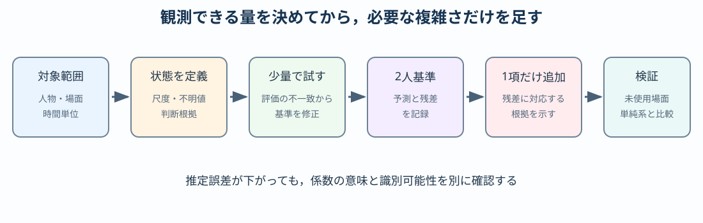

# 卒研ロードマップ：物語の関係変化をモデル化する

:::{important} この章の役割
対象作品，状態変数，感情の読み取り，第三者効果，係数推定は学生自身の研究判断である．本章は順序と検証点を示すが，完成モデル，推定係数，作品分析の結論は示さない．
:::

:::{warning} 対象の制限
実在人物の感情を推定・評価しない．公開された創作作品，教材用の仮想データ，または研究倫理上適切なデータを対象とする．
:::

## このロードマップの使い方

この章は，作品を選ぶ段階からモデル検証まで繰り返し参照する．式を複雑にする前に，観測できる状態変数を定義し，少量の場面で評価基準を試す．判断が変わった場合は，以前の基準を消さず修正履歴として残す．

- 対象作品・人物・場面と時間単位
- 状態変数の正負，尺度，不明値の規則
- 少量アノテーションで生じた不一致
- 2人基準モデルが説明できなかった観測
- 推定用データと検証用データの分け方



## 段階1：対象と時間単位を決める

- 作品名と選定理由
- 対象人物
- 1時刻を1話，1場面，一定時間のどれにするか
- 分析対象外とする場面
- 原作・映像版など資料の範囲

**通過条件**：別の人が同じ範囲のデータを再収集できる．

## 段階2：状態変数を操作的に定義する

「好意」だけでは観測できない．台詞，行動，表情，語りなど，値を判断する根拠を定義する．

検討事項：

- 正負の意味
- 値の尺度（例：順序尺度か連続値か）
- 不明・観測なしの扱い
- 恋愛感情と信頼・敵意を分けるか
- $x_{ij}$ と $x_{ji}$ を別々に持つか

モデルの式より先に，データとして何を測れるかを決める．

## 段階3：少量のアノテーションを試す

数場面だけを複数人で独立に評価する．

- 評価が一致する項目
- 判断が分かれる項目
- 根拠となる場面
- 尺度の刻みが細かすぎないか
- 評価基準の修正履歴

**通過条件**：評価基準を文章化し，同じ場面を再評価したとき大きく変わらない．

## 段階4：2人モデルを基準にする

最初は主要な2人だけを選び，[関係モデル基礎の線形モデル](./41_love_dynamics_basic.md)またはさらに単純な離散モデルで説明できる範囲を確認する．

```{math}
\dot{\mathbf{x}}=M\mathbf{x}
```

複雑な項を足す前に，基準モデルが説明できない場面を記録する．その残差が第三者効果や外部イベントを導入する根拠になる．

## 段階5：3人目を状態へ追加する

3人で何個の状態変数を持つか決める．

- 人物ごとに1変数：3変数
- 有向な人物間感情：最大6変数
- 複数種類の関係：さらに増加

状態数が増えると係数数は急増する．最初は対称性，共通係数，ゼロ固定などで自由度を制限する．

## 段階6：第三者効果を1項だけ追加する

すべての嫉妬・応援・競争を同時に入れない．基準モデルで説明できなかった具体的な場面に対応する項を1つ提案する．

確認すること：

1. どの状態がどの状態へ影響するか．
2. 係数の符号にどんな意味があるか．
3. その項がなくても説明できないか．
4. データから係数を識別できるか．

## 段階7：出来事を外力として分ける

登場人物間の恒常的な反応係数と，一度だけ起きる出来事を混同しない．告白，けんか，再会などを扱う場合は，時刻と対象人物を記録し，外力候補として別表にする．

外力の大きさを感情データと同じものから自由に調整すると過適合になる．与え方と推定方法を事前に決める．

## 段階8：推定と検証を分ける

- 前半エピソードで係数を推定する．
- 後半エピソードで予測を評価する．
- 単純モデルと複雑モデルを同じ指標で比較する．
- パラメータ数の増加に見合う改善か確認する．
- 初期値や尺度を変えた感度分析を行う．

誤差が小さいだけでなく，係数の解釈が安定しているかを見る．

## 段階9：識別可能性を確認する

異なる係数の組がほぼ同じ時系列を生む場合，データから一意に決められない．

- 係数間の相関
- 初期値への依存
- 推定区間を変えた係数の変動
- 一部係数を固定した場合の変化
- 正則化やモデル縮約の必要性

「推定値が出た」と「その値が信頼できる」を区別する．

## 最小限の卒論図候補

1. 人物・時間単位・アノテーション基準
2. 観測された関係時系列
3. 基準2人モデルの予測と残差
4. 追加した1項を含むモデルの比較
5. 未使用エピソードでの検証結果

## 研究メモのテンプレート

```text
対象作品・範囲：
対象人物：
時間単位：
状態変数の定義：
評価尺度と不明値：
根拠として記録する情報：
再評価または評価者間比較：
2人基準モデル：
推定・検証の分割：
実在人物を扱わないことの確認：
```
