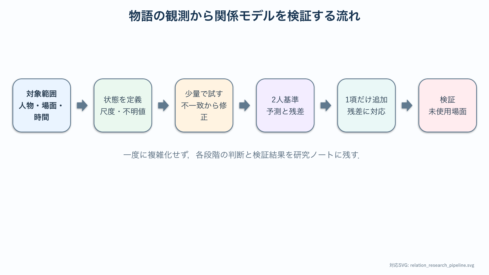

# 卒研ロードマップ：物語の関係変化をモデル化する

:::{important} この章の役割
対象作品と時間単位を定め，状態変数，感情の読み取り基準，第三者効果，係数推定を順に具体化する．基準モデルと拡張モデルを未使用データで比較し，判断根拠と修正履歴を研究ノートへ残す．
:::

:::{warning} 対象の制限
実在人物の感情を推定・評価しない．公開された創作作品，仮想データ，または研究倫理上適切なデータを対象とする．
:::

## このロードマップの使い方

この章は，作品を選ぶ段階からモデル検証まで繰り返し参照する．式を複雑にする前に，観測できる状態変数を定義し，少量の場面で評価基準を試す．判断が変わった場合は，以前の基準を消さず修正履歴として残す．

- 対象作品・人物・場面と時間単位
- 状態変数の正負，尺度，不明値の規則
- 少量{abbr}`アノテーション(資料中の場面や発言へ基準に沿って評価値やラベルを付ける作業)`で生じた不一致
- 2人基準モデルが説明できなかった観測
- 推定用データと検証用データの分け方



作品資料，アノテーション表，モデル入力，推定結果を別々に保存し，同じ場面識別子で結び付ける．評価基準を変更した場合は，古い基準と変更理由を残して再評価の範囲を明記する．結果だけでなく，データがどの規則で数値へ変換されたかを追跡できるようにする．

モデルの複雑さはデータ量に合わせる．場面数が少ないのに状態変数と係数を多くすると，多数の係数組が同じ時系列へ適合する．最初は2人，1種類の状態，少数の係数から始め，残差に繰返し構造がある場合だけ拡張する．

## 段階1：対象と時間単位を決める

- 作品名と選定理由
- 対象人物
- 1時刻を1話，1場面，一定時間のどれにするか
- 分析対象外とする場面
- 原作・映像版など資料の範囲

**通過条件**：別の人が同じ範囲のデータを再収集できる．

時間単位は，モデルの1ステップが何を意味するかを決める．1話単位はデータ数を確保しやすいが，話内の急な変化を平均化する．1場面単位は出来事との対応が明確だが，場面長が不均一になる．一定時間単位は比較しやすいが，物語上の区切りと一致しない可能性がある．候補を少量データで試し，状態変化を無理なく記述できる単位を選ぶ．

## 段階2：状態変数を{abbr}`操作的に定義する(観察や測定の具体的な手順によって概念の意味を定める)`

好意という抽象的な概念だけでは数値を観測できない．台詞，行動，表情，語りなど，値を判断する根拠を定義する．

検討事項：

- 正負の意味
- 値の尺度（例：順序尺度か連続値か）
- 不明・観測なしの扱い
- 恋愛感情と信頼・敵意を分けるか
- $x_{ij}$ と $x_{ji}$ を別々に持つか

モデルの式より先に，データとして何を測れるかを決める．

評価尺度には，各値へ対応する判断基準と具体例を付ける．たとえば $-2,-1,0,1,2$ の5段階なら，0は観測なしなのか中立なのかを区別し，正負の各段階に該当する台詞や行動の例を記録する．観測できない場合を0へ置くと，中立と欠測が混ざるため，欠測値は別の符号で管理する．

## 段階3：少量のアノテーションを試す

数場面だけを複数人で独立に評価する．

- 評価が一致する項目
- 判断が分かれる項目
- 根拠となる場面
- 尺度の刻みが細かすぎないか
- 評価基準の修正履歴

**通過条件**：評価基準を文章化し，同じ場面を再評価したとき大きく変わらない．

評価者間の不一致は単なる誤りではなく，定義が曖昧な場所を示す情報である．一致しなかった場面について，根拠となる台詞，行動，文脈のどこを異なって読んだかを比較し，基準を修正する．基準修正後は新しい場面で再度試し，修正に使った場面だけで一致した状態を避ける．

## 段階4：2人モデルを基準にする

最初は主要な2人だけを選び，[関係モデル基礎の線形モデル](./41_love_dynamics_basic.md)またはさらに単純な離散モデルで説明できる範囲を確認する．

```{math}
\dot{\mathbf{x}}=M\mathbf{x}
```

複雑な項を足す前に，基準モデルが説明できない場面を記録する．その{abbr}`残差(観測値からモデルの予測値を引いた差)`が第三者効果や外部イベントを導入する根拠になる．

残差を時系列として描き，特定人物の登場後だけ同じ符号の誤差が続く，出来事の直後に急な誤差が出る，長期的に振幅が過大になる，といった構造を探す．ランダムに散らばる小さな残差なら，項を増やす必要はない可能性がある．追加項は，説明したい残差パターンと1対1に対応させる．

## 段階5：3人目を状態へ追加する

3人で何個の状態変数を持つか決める．

- 人物ごとに1変数：3変数
- 有向な人物間感情：最大6変数
- 複数種類の関係：さらに増加

状態数が増えると係数数は急増する．最初は対称性，共通係数，ゼロ固定などで自由度を制限する．

## 段階6：第三者効果を1項だけ追加する

すべての嫉妬・応援・競争を同時に入れない．基準モデルで説明できなかった具体的な場面に対応する項を1つ提案する．

確認すること：

1. どの状態がどの状態へ影響するか．
2. 係数の符号にどんな意味があるか．
3. その項がなくても説明できないか．
4. データから係数を{abbr}`識別できる(異なる係数値が観測上異なる結果を生むため値を区別できる)`か．

## 段階7：出来事を{abbr}`外力(モデルの外部から状態変化へ加わる入力)`として分ける

登場人物間の恒常的な反応係数と，一度だけ起きる出来事を混同しない．告白，けんか，再会などを扱う場合は，時刻と対象人物を記録し，外力候補として別表にする．

外力の大きさを感情データと同じものから自由に調整すると過適合になる．与え方と推定方法を事前に決める．

## 段階8：推定と検証を分ける

- 前半エピソードで係数を推定する．
- 後半エピソードで予測を評価する．
- 単純モデルと複雑モデルを同じ指標で比較する．
- パラメータ数の増加に見合う改善か確認する．
- 初期値や尺度を変えた感度分析を行う．

誤差が小さいだけでなく，係数の解釈が安定しているかを見る．

## 段階9：識別可能性を確認する

異なる係数の組がほぼ同じ時系列を生む場合，データから一意に決められない．

- 係数間の相関
- 初期値への依存
- 推定区間を変えた係数の変動
- 一部係数を固定した場合の変化
- {abbr}`正則化(係数が過度に複雑または大きくなることを抑える推定方法)`や{abbr}`モデル縮約(重要な挙動を保ちながら変数や係数を減らすこと)`の必要性

推定アルゴリズムが数値を出力したことと，その推定値がデータによって十分に制約され信頼できることを区別する．

係数の初期値を変えて複数回推定し，ほぼ同じ誤差で異なる係数へ到達するか確認する．異なる係数が同程度に適合するなら，単一の推定値を強く解釈しない．係数範囲，予測のばらつき，固定した係数を併記する．

## 最小限の卒論図候補

1. 人物・時間単位・アノテーション基準
2. 観測された関係時系列
3. 基準2人モデルの予測と残差
4. 追加した1項を含むモデルの比較
5. 未使用エピソードでの検証結果

## 研究メモのテンプレート

```text
対象作品・範囲：
対象人物：
時間単位：
状態変数の定義：
評価尺度と不明値：
根拠として記録する情報：
再評価または評価者間比較：
2人基準モデル：
推定・検証の分割：
実在人物を扱わないことの確認：
```

十分な場面数や評価一致が得られない場合は，仮想データまたは少数人物の離散状態モデルへ縮小する．その場合は，作品全体の感情を説明するのではなく，定義した観測規則とモデルがどの範囲の変化を再現できるかを結論にする．
