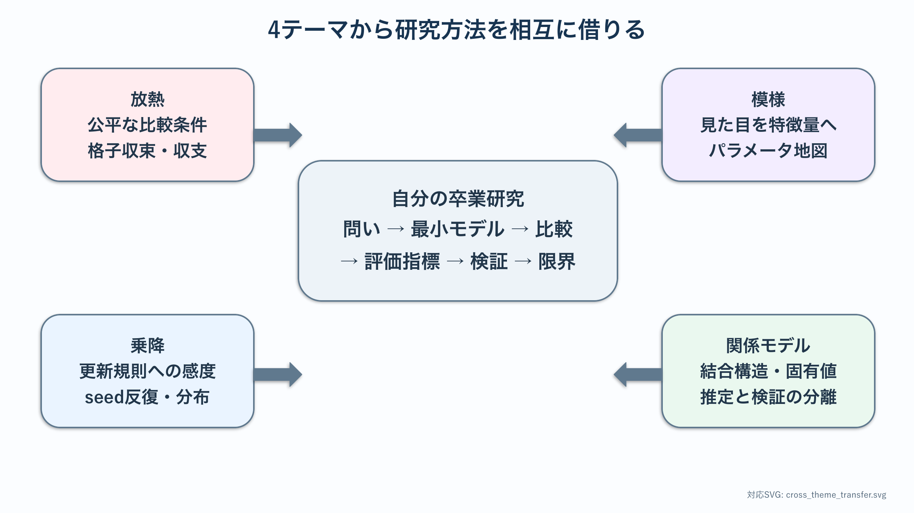

# 振り返り：4つのモデルを卒業研究へ移す

## このページの目的

各テーマの基礎章と研究技能章を他の学生だけに関係する題材として終わらせず，自分の卒業研究で再利用できる{abbr}`設計原理(異なる研究対象にも再利用できるモデル化や検証の基本方針)`へ変換する．自分のテーマのロードマップを具体化するとき，必要に応じて下の比較表と研究計画シートへ戻る．

## このページの使い方

研究の問い，比較条件，評価指標，検証方法のどこかで迷ったときに該当する行を参照する．他テーマから借りられる考え方を1つ選び，自分の研究計画シートへ追記する．すべての欄を一度に埋める必要はなく，研究の進行に応じて更新する．



## モデルを横に並べる

| 観点 | 放熱 | 反応拡散 | 電車乗降 | 恋愛ネットワーク |
| --- | --- | --- | --- | --- |
| 状態変数 | 温度場 | 2つの濃度場 | 個体の位置・行動 | 感情ベクトル・行列 |
| 基本単位 | 空間の各点 | 空間の各点 | 1人のエージェント | 人物間の関係 |
| 時間発展 | 拡散・定常化 | 局所反応＋拡散 | 局所移動・選択規則 | ODEと結合 |
| 境界・構造 | 根元，表面，先端 | 周期・反射境界 | 車内，ホーム，ドア | ネットワークの辺 |
| 比較するもの | 形状，熱物性 | 反応・拡散パラメータ | 行動ルール，人数 | 結合，外力，構造 |
| 評価指標 | 放熱量，効率 | 面積比，波長，斑点数 | 完了時間，密度 | 安定性，予測誤差 |
| 主な限界 | 形状・血流の単純化 | 生物過程の単純化 | 人間行動の単純化 | 感情の観測可能性 |

表現は違っても，全テーマに次の流れがある．

```text
問い → 状態変数 → 局所的な変化の規則 → 初期・境界・構造
     → 数値実験 → 評価指標 → 妥当性と限界
```

## 他テーマから借りられる4つの知見

1. **放熱から借りる：公平な比較条件．** 同じ体積，同じ高さ，同じ初期値など，何をそろえるかで結論が変わる．
2. **反応拡散から借りる：{abbr}`相図(パラメータの組合せごとに結果の型を配置した図)`と{abbr}`特徴量(模様やデータの性質を比較可能な数値として要約した量)`．** パラメータを1点だけ試さず，結果の型を地図にし，見た目を数値へ落とす．
3. **乗降モデルから借りる：更新規則への感度．** {abbr}`同期更新(全要素の次状態を旧状態から決めて同時に反映する方式)`・{abbr}`非同期更新(要素を順に更新して変更を直後の計算へ反映する方式)`，優先順位，乱数seedが結果へ与える影響を確認する．
4. **ネットワークモデルから借りる：{abbr}`結合構造(どの要素がどの要素へ影響するかを表す接続関係)`．** 個々の性質だけでなく，誰と誰が影響し合うかを状態やパラメータに含める．

## 自分の卒業研究への転用シート

各自，次を1ページにまとめる．

| 項目 | 記入する内容 |
| --- | --- |
| 問い | 変数Aの変更に対する指標Bの変化として1文で記述 |
| 状態変数 | 時間・空間・個体・関係の何が変わるか |
| 最小モデル | 最初の1か月で動かせる式または更新規則 |
| 比較条件 | 変えるものを1つ，そろえるものを列挙 |
| 初期・境界・構造 | 計算開始に必要な条件 |
| 評価指標 | 主張を支える数値を1～3個 |
| 検証 | 解析解，刻み幅，実データ，先行研究のどれと比べるか |
| 借りる知見 | 他の3テーマから最低1つ |
| 最初の図 | 横軸，縦軸，比較する線・色を具体化 |
| 限界 | 無視した要因と，結論が有効な範囲 |

## 自分で立ち止まって確認する観点

- PDE，エージェント，ネットワークのうち，どの表現が自分の問いに必要か．複雑そうだからではなく，観測したい量から説明できるか．
- シミュレーションの模様や動画を，どの評価指標へ変換するか．
- パラメータを変えた効果と，数値刻み・乱数・初期条件の影響を区別できるか．
- 他の学生の発表から，自分の研究計画を実際に1か所変更したか．

卒業研究の出発点は，大きなモデルではなく，比較可能な最初の図である．4つのテーマから借りた道具を使い，その図を作るための最小モデルを決める．
