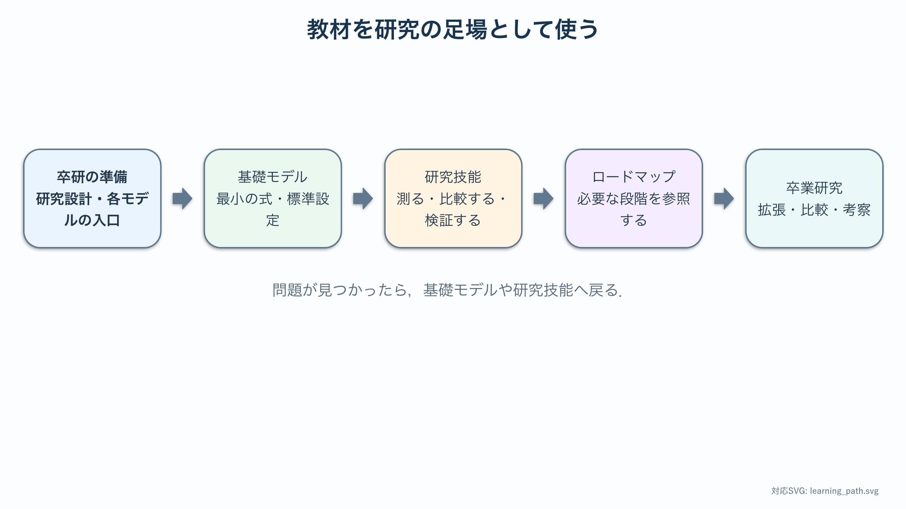

# 卒業研究準備セミナー：数理モデリングとシミュレーション

本教材は，Strogatz『Nonlinear Dynamics and Chaos』を輪講し，常微分方程式・線形安定性・固有値・相図の基礎を学んだ情報数理学科4年生を対象とする．偏微分方程式は未履修であることを前提とし，偏微分，初期条件・境界条件，拡散方程式，有限差分法から始める．

## 卒業研究の流れ

```text
卒研の準備
  ↓
教科書的な最小モデルを再現する
  ↓
単純・汎用的な例で研究技能を練習する
  ↓
卒研ロードマップを自分の言葉で具体化する
  ↓
研究者自身がモデルを拡張し，比較・検証・考察する
```



矢印は一方通行ではない．ロードマップ以降で問題が見つかったら，基礎モデルや研究技能へ戻って条件を確認する．

基礎・研究技能の各章は，説明の読解，Notebook図の読み取り，演習，チェックポイントを学ぶ構成である．卒研ロードマップと最後の振り返りには時間制限を設けない．学生が研究中に必要な段階を参照し，自分のペースで記録を更新する．

図は単に結果を眺めるためのものではない．各章では，軸・色・線の意味，最初に確認する場所，数理モデルとの対応，誤読しやすい点を説明する．Notebookを実行した場合も，表示された図を本文の順序で読み，自分の言葉で説明する．

## 卒研の準備

1. [研究設計と数理モデリングの作法](./00_research_design.md)
2. [放熱研究の準備：拡散方程式入門](./10_pde_foundations.md)
3. [模様研究の準備：反応・拡散・空間パターン](./20_pattern_foundations.md)
4. [乗降研究の準備：離散状態・更新規則・乱数](./30_agent_foundations.md)
5. [関係研究の準備：行列・有向グラフ・線形力学系](./40_network_foundations.md)

最初の章で研究の作法を共有し，続く4章で各テーマの入口を学ぶ．拡散方程式入門は主に放熱へ，反応・拡散は模様へ，離散更新は乗降へ，行列と有向グラフは関係モデルへ接続する．他テーマの準備章も読み，共通して使える検証方法と語彙を持ってから各自のテーマへ進む．

## 学習経路

| テーマ | 基礎モデル | 研究技能の練習 | 学生が進める卒研ロードマップ |
| --- | --- | --- | --- |
| 放熱 | [熱方程式と1次元フィン](./11_stegosaurus_heat_basic.md) | [単一薄板の2次元温度場](./12_stegosaurus_heat_shape.md) | [形状比較を研究にする](./13_stegosaurus_research_roadmap.md) |
| 模様 | [反応拡散とパターン生成](./21_reaction_diffusion_basic.md) | [模様を数値で測る](./22_reaction_diffusion_snake.md) | [生成模様と実画像を比較する](./23_snake_research_roadmap.md) |
| 乗降 | [最小セルオートマトン](./31_agent_boarding_basic.md) | [確率的計算を検証する](./32_agent_boarding_behavior.md) | [行動ルールを比較する](./33_boarding_research_roadmap.md) |
| 関係 | [2人の線形ODE](./41_love_dynamics_basic.md) | [一般的なネットワーク力学](./42_love_dynamics_network.md) | [物語の関係変化を研究する](./43_love_research_roadmap.md) |

## 基礎モデルと卒研の違い

基礎モデルを動かせたことは，卒研が終わったことを意味しない．卒業研究には少なくとも次が必要である．

- 自分の問いに合わせて状態変数と仮定を選ぶ．
- 比較条件を公平に定義する．
- 数値計算が正しいことを刻み幅・反復・解析解などで検証する．
- 評価指標を選び，その選択理由を説明する．
- 実データまたは先行研究との関係を示す．
- 予想と異なる結果も含め，モデルの限界を考察する．

各テーマのロードマップでは，これらを小さなチェックポイントへ分ける．ロードマップに最終的な順位，最適パラメータ，推定結果は書かれていない．それらを得る過程が研究である．

## 最後の振り返り

各自の研究計画ができたら，[4つのモデルを卒業研究へ移す](./50_synthesis.md)を使い，他テーマの比較条件・特徴量・反復実験・結合構造から借りられる考え方を確認する．

:::{important} 科学的な扱いについて
本教材のモデルはいずれも教育用の簡略モデルである．ステゴサウルス背板の機能，動物模様の成因，鉄道運用，実在人物の関係などを断定するものではない．仮定と適用範囲を必ず確認すること．
:::
